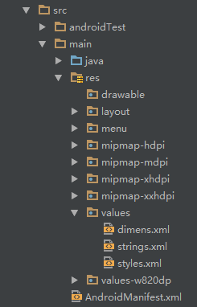
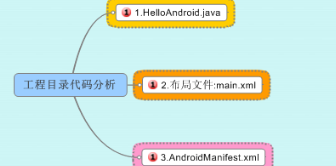
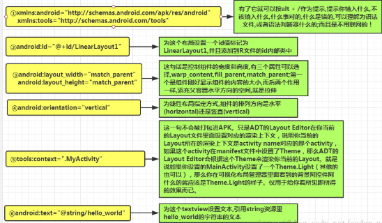
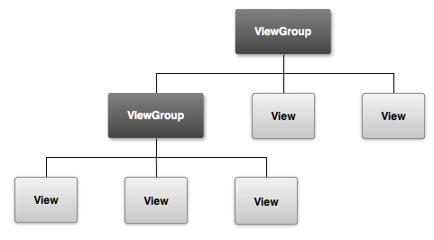
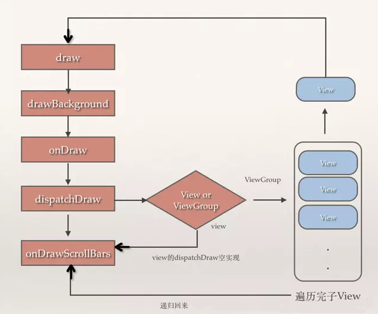
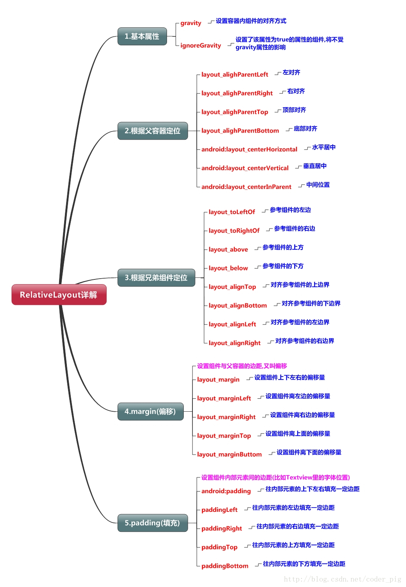
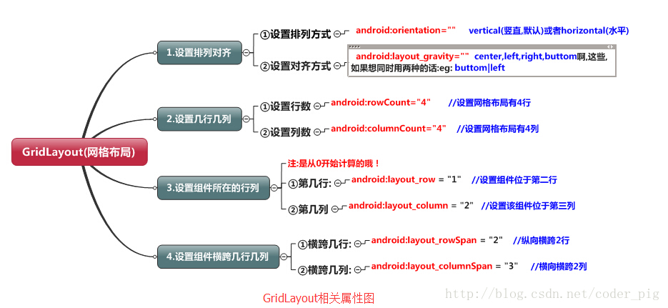

# 框架

## 工程目录



+ **java：**Java 代码的地方，业务功能都在这里实现
+ **res：**存放各种资源文件的地方，有图片，字符串，动画，音频等，还有各种形式的 XML 文件
+ **drawable：**存放的是各种位图文件，还有一些其他的 drawable 类型的 xml 文件
+ **layout：**存放 APP 的布局文件
+ **mipmap：**存放位图文件，同时图片缩放提供一定优化
+ **value**：包括了 colors.xml，strings.xml，styles.xml 这三个主要文件，其中 colors.xml 中定义的颜色资源；strings.xml 中定义的字符串资源；styles.xml 中定义的是样式资源

### res

> 说到这个 **res 目录**，另外还有提下这个 **assets 目录**，虽然这里没有，但是我们可以自己创建，两者的区别在于是否前者下所有的资源文件都会在 R.java 文件下生成对应的资源id，而后者并不会；前者我们可以直接通过资源id访问到对应的资源；而后者则需要我们通过 AssetManager 以二进制流的形式来读取！这个R文件可以理解为字典，res 下每个资源都都会在这里生成一个唯一的 id！

下述 mipmap 的目录，在 Eclipse 并不存在这个，Eclipse 中都是 drawable 开头的，其实区别不大，只是使用 mipmap 会在图片缩放在提供一定的性能优化，分辨率不同系统会根据屏幕分辨率来选择 hdpi，mdpi，xmdpi，xxhdpi 下的对应图片，所以你解压别人的 apk 可以看到上述目录同一名称的图片，在四个文件夹下都有，只是大小和像素不一样而已！

当然，这也不是绝对的，比如我们把所有的图片都丢在了 drawable-hdpi 下的话，即使手机 本该加载 ldpi 文件夹下的图片资源，但是 ldpi 下没有，那么加载的还会是 hdpi 下的图片！

另外，还有一种情况：比如是 hdpi，mdpi 目录下有，ldpi 下没有，那么会加载 mdpi 中的资源！ 原则是使用最接近的密度级别！另外如果你想禁止 Android 不跟随屏幕密度加载不同文件夹的资源，只需在 `AndroidManifest.xml` 文件中添加`android:anyDensity="false"` 字段即可！

### 图片资源

+ **drawable：**存放各种位图文件，（.png，.jpg，.9png，.gif 等）除此之外可能是一些其他的 drawable 类型的 XML 文件
+ **mipmap-hdpi：**高分辨率，一般我们把图片丢这里
+ **mipmap-mdpi：**中等分辨率，很少，除非兼容的的手机很旧
+ **mipmap-xhdpi：**超高分辨率，手机屏幕材质越来越好，以后估计会慢慢往这里过渡
+ **mipmap-xxhdpi：**超超高分辨率，这个在高端机上有所体现

### 布局资源

+ **layout**：该目录下存放的就是我们的布局文件，另外在一些特定的机型上，我们做屏幕适配，比如 480*320 这样的手机，我们会另外创建一套布局：layout-480x320 这样的文件夹！

### 菜单资源

+ **menu：**在以前有物理菜单按钮，即 menu 键的手机上，用的较多，现在用的并不多，菜单项相关的资源 xml 可在这里编写，不知道谷歌会不会出新的东西来替代菜单

### 变量资源

+ **demens.xml**：定义尺寸资源
+ **string.xml**：定义字符串资源
+ **styles.xml**：定义样式资源
+ **colors.xml**：定义颜色资源
+ **arrays.xml**：定义数组资源
+ **attrs.xml**：自定义控件时用的较多，自定义控件的属性！
+ **theme**：主题文件，和 styles 很相似，但是会对整个应用中的 Actvitiy 或指定 Activity 起作用，一般是改变窗口外观的！可在 Java 代码中通过 setTheme 使用，或者在 Androidmanifest.xml 中为添加 theme 的属性！ 

> 你可能看到过这样的 values 目录：values-w820dp，values-v11 等，前者 w 代表平板设备，820dp 代表屏幕宽度；而 v11这样代表在 API(11)，即 android 3.0 后才会用到的！

### raw

用于存放各种原生资源（音频，视频，一些 XML 文件等），我们可以通过 openRawResource(int id) 来获得资源的二进制流！其实和 Assets 差不多，不过这里面的资源会在 R 文件那里生成一个资源 id 而已。

### 动画资源

+ **animator**：存放属性动画的 XML 文件
+ **anim**：存放补间动画的 XML 文件

## 资源使用

所有的资源文件都会在 R.java 文件下生成一个资源 id，我们可以通过这个资源 id 来完成资源的访问，使用情况有两种：Java 代码中使用和 XML 代码中使用。

 **Java代码中使用**

+ **文字**：`txtName.setText(getResources().getText(R.string.name));` 
+ **图片**：`imgIcon.setBackgroundDrawableResource(R.drawable.icon); `
+ **颜色**：`txtName.setTextColor(getResouces().getColor(R.color.red)); `
+ **布局**：`setContentView(R.layout.main);`
+ **控件**：`txtName = (TextView)findViewById(R.id.txt_name);`

**XML代码中使用**

通过` @xxx` 即可得到，比如这里获取文本和图片:

```xml
<TextView 
	android:text="@string/hello_world" 
	android:layout_width="wrap_content" 
	android:layout_height="wrap_content"
	android:background = "@drawable/img_back"
/>
```

## 工程文件



### 布局文件

`activity_main.xml`

```xml
<RelativeLayout 
    xmlns:android="http://schemas.android.com/apk/res/android"
    xmlns:tools="http://schemas.android.com/tools"
    android:layout_width="match_parent"
    android:layout_height="match_parent"
    tools:context=".MainActivity"
>
    <TextView
        android:layout_width="wrap_content"
        android:layout_height="wrap_content"
        android:text="@string/hello_world"
     />
</RelativeLayout>
```



## 签名打包

Android APP 都需要我们用一个证书对应用进行数字签名，不然的话是无法安装到 Android 手机上的，平时我们调试运行时到手机上时，是 AS 会自动用默认的密钥和证书来进行签名；但是我们实际发布编译时，则不会自动签名，这个时候我们就需要进行手动签名了！

为我们的 APK 签名有以下好处：

+ **1.应用程序升级：**如果你希望用户无缝升级到新的版本，那么你必须用同一个证书进行签名。这是由于只有以同一个证书签名，系统才会允许安装升级的应用程序。如果你采用了不同的证书，那么系统会要求你的应用程序采用不同的包名称，在这种情况下相当于安装了一个全新的应用程序。如果想升级应用程序，签名证书要相同，包名称要相同！
+ **2.应用程序模块化：** Android 系统可以允许同一个证书签名的多个应用程序在一个进程里运行，系统实际把他们作为一个单个的应用程序，此时就可以把我们的应用程序以模块的方式进行部署，而用户可以独立的升级其中的一个模块。
+ **3.代码或者数据共享：** Android 提供了基于签名的权限机制，那么一个应用程序就可以为另一个以相同证书签名的应用程序公开自己的功能。以同一个证书对多个应用程序进行签名，利用基于签名的权限检查，你就可以在应用程序间以安全的方式共享代码和数据了。 不同的应用程序之间，想共享数据，或者共享代码，那么要让他们运行在同一个进程中，而且要让他们用相同的证书签名。

# UI

Android 的 UI 界面都是由 View 和 ViewGroup 及其派生类组合而成的。其中，View 是所有 UI 组件的基类，而 ViewGroup 是容纳 View 及其派生类的容器，ViewGroup 也是从 View 派生出来的。

一般来说，开发 UI 界面都不会直接使用 View 和 ViewGroup（自定义控件的时候使用），而是使用其派生类。



> **dp(dip):** device independent pixels（设备独立像素）。不同设备有不同的显示效果，这个和设备硬件有关，一般我们为了支持 WVGA、HVGA 和 QVGA 推荐使用这个，不依赖像素
>
> **px: pixels（像素）**。不同设备显示效果相同，一般我们 HVGA 代表 320x480 像素，这个用的比较多
>
> **pt: point**，是一个标准的长度单位，1pt＝1/72英寸，用于印刷业，非常简单易用
>
> **sp: scaled pixels（放大像素）**。主要用于字体显示 best for textsize

## 概念

### 事件分发

事件分发机制主要有三个方法：dispatchTouchEvent()、onInterceptTouchEvent()、onTouchEvent()

+ ViewGroup 包含这三个方法，而 View 则只包含 dispatchTouchEvent()、onTouchEvent() 两个方法，不包含 onInterceptTouchEvent()

触摸事件由 Action_Down、Action_Move、Action_Up 组成，形成一次完整的触摸过程，包括一个 Down 和一个 Up，中间可能有若干个 Move（可以为0）。

**事件传递流程**：

+ 当发生 Action_Down 事件时，事件首先传递到最顶层的 ViewGroup，调用该 ViewGroup 的 dispatchTouchEvent()。
  + 如果 ViewGroup 的 onInterceptTouchEvent() 返回 false，不拦截该事件，则事件会传递给子 View，调用子 View 的 dispatchTouchEvent()。如果子 View 的 dispatchTouchEvent() 返回 true，则事件被子 View 的 onTouchEvent() 消费。
  + 如果 ViewGroup 的 onInterceptTouchEvent() 返回 true，表示拦截该事件，则该 ViewGroup 的 onTouchEvent() 将消费该事件，之后的 Move 和 Up 事件也将由该 ViewGroup 直接处理。

**事件中止和事件处理**：

+ 当某个子 View 的 dispatchTouchEvent() 返回 true 时，中止 Down 事件的传递，并在 ViewGroup 中记录该子 View。之后的 Move 和 Up 事件将由该子 View 直接处理。
+ 如果 ViewGroup 中的所有子 View 都不处理 Down 事件，则最终会触发 ViewGroup 自身的 onTouchEvent()。在所有子 View 都未处理事件的情况下，事件最终将触发到 Activity 的 onTouchEvent() 方法。

**多层 ViewGroup 中的事件传递**：

+ 子 View 处理事件后，会被保存在它所在的 ViewGroup 中。在多层 ViewGroup 的结构中，上层 ViewGroup 会保存真正处理事件的子 View 所在的 ViewGroup 对象。
+ 当 Move 和 Up 事件发生时，事件会先从顶层 ViewGroup 传递到下层 ViewGroup，最终到达真正消费事件的子 View。

**请求父 ViewGroup 不拦截事件**：

+ 子 View 可以调用 getParent().requestDisallowInterceptTouchEvent() 来请求父 ViewGroup 不要拦截事件，以便子 View 自行处理事件。

### UI 绘制

UI绘制涉及五个主要方法：onDraw(), onLayout(), onMeasure(), dispatchDraw(), drawChild()。

+ ViewGroup 包含了这五个方法：onDraw(), onLayout(), onMeasure(), dispatchDraw(), drawChild()。
+ View 只包含 onDraw(), onLayout(), onMeasure() 三个方法，不包含 dispatchDraw(), drawChild()。

1. **绘制流程**：
   + 绘制按照视图树的顺序执行：先进行测量（onMeasure()），然后布局（onLayout()），最后绘制（onDraw()）。
   + 如果视图的背景可见，绘制时会先绘制背景（drawBackground()），然后调用 onDraw() 绘制内容。
   + 强制重绘可以使用 invalidate() 方法。
2. **尺寸变化和重绘**：
   + 如果视图的尺寸发生变化，该视图会调用 requestLayout()，请求父控件重新布局。
   + 如果视图的外观发生变化，该视图会调用 invalidate()，请求重新绘制。
   + 当调用 requestLayout() 或 invalidate() 时，系统会重新对视图树进行测量、布局和绘制。
3. **单线程操作和跨线程操作**：
   + 视图树的操作是单线程的，直接调用其他视图的方法需要在 UI 线程中进行。
   + 跨线程操作需要使用 Handler。
4. **onLayout() 方法**：
   + 对于 View，onLayout() 是一个空实现；对于 ViewGroup，onLayout() 使用了关键字 abstract，要求其子类必须重载该方法，用于安排子视图的具体位置。
5. **draw 过程**：
   + drawBackground() 绘制背景 → onDraw() 绘制视图内容 → dispatchDraw() 绘制子视图 → onDrawScrollBars() 绘制滚动条。

#### 方法详解

1. **onDraw(Canvas canvas)**：
   + UI 绘制的核心方法，用于自定义绘制视图的内容，重载该方法可以实现自定义的图形和效果。
2. **onLayout(boolean changed, int left, int top, int right, int bottom)**：
   + 布局发生变化时调用此方法，用于安排视图的位置和大小，可以在布局改变时实现特定的处理逻辑。
3. **onMeasure(int widthMeasureSpec, int heightMeasureSpec)**：
   + 用于计算视图及其子视图的大小，重载该方法可以重新计算视图的大小，MeasureSpec 包含了测量的模式和大小，通过 MeasureSpec.getMode() 和 MeasureSpec.getSize() 获取测量模式和大小。
4. **dispatchDraw(Canvas canvas)**：
   + ViewGroup 中的方法，用于控制子视图的绘制分发，重载该方法可以改变子视图的绘制行为，实现复杂的视觉效果。
5. **drawChild(Canvas canvas, View child, long drawingTime)**：
   + ViewGroup 中的方法，用于直接绘制具体的子视图，重载该方法可以直接控制子视图的绘制过程。


​     UI绘制主要有五个方法：onDraw(),onLayout(),onMeasure()，dispatchDraw(),drawChild()

​     1.ViewGroup 包含这五个方法，而 View 只包含 onDraw(),onLayout(),onMeasure() 三个方法，不包含 dispatchDraw(),drawChild()。

​     2.绘制流程：onMeasure（测量）——> onLayout（布局）——> onDraw（绘制）。

​     3.绘制按照视图树的顺序执行，视图绘制时会先绘制子控件。如果视图的背景可见，视图会在调用 onDraw() 之前调用 drawBackGround() 绘制背景。强制重绘，可以使用 invalidate();

​     4.如果发生视图的尺寸变化，则该视图会调用 requestLayou()，向父控件请求再次布局。如果发生视图的外观变化，则该视图会调用 invalidate()，强制重绘。如果 requestLayout() 或 invalidate() 有一个被调用，框架会对视图树进行相关的测量、布局和绘制。

​     注意：视图树是单线程操作，直接调用其它视图的方法必须要在UI线程里。跨线程的操作必须使用Handler。

​     5.onLayout()：对于 View 来说，onLayout() 只是一个空实现；而对于 ViewGroup 来说，onLayout() 使用了关键字 abstract 的修饰，要求其子类必须重载该方法，目的就是安排其 children 在父视图的具体位置。

​     6.draw 过程：drawBackground() 绘制背景 ——> onDraw() 对 View 的内容进行绘制 ——> dispatchDraw() 对当前 View 的所有子 View 进行绘制 ——> onDrawScrollBars() 对 View 的滚动条进行绘制。



 

方法说明：

​     1.onDraw(Canvas canvas)：UI 绘制最重要的方法，用于 UI 重绘。这个方法是所有 View、ViewGroup 及其派生类都具有的方法。自定义控件时，可以重载该方法，并在内容基于 canvas 绘制自定义的图形、图像效果。

​     2.onLayout(boolean changed, int left, int top, int right, int bottom)：布局发生变化时调用此方法。这个方法是所有 View、ViewGroup 及其派生类都具有的方法。自定义控件时，可以重载该方法，在布局发生改变时实现特效等定制处理。

​     3.onMeasure(int widthMeasureSpec, int heightMeasureSpec)：用于计算自己及所有子对象的大小。这个方法是所有 View、ViewGroup 及其派生类都具有的方法。自定义控件时，可以重载该方法，重新计算所有对象的大小。 MeasureSpec 包含了测量的模式和测量的大小，通过 MeasureSpec.getMode() 获取测量模式，通过 MeasureSpec.getSize() 获取测量大小。mode 共有三种情况： 分别为MeasureSpec.UNSPECIFIED（ View想多大就多大）, MeasureSpec.EXACTLY（默认模式，精确值模式：将 layout_width 或 layout_height 属性指定为具体数值或者 match_parent。）, MeasureSpec.AT_MOST（ 最大值模式：将 layout_width 或 layout_height 指定为 wrap_content。）。

​     4.dispatchDraw(Canvas canvas)：ViewGroup 及其派生类具有的方法，主要用于控制子 View 的绘制分发。自定义控件时，重载该方法可以改变子 View 的绘制，进而实现一些复杂的视效。

​     5.drawChild(Canvas canvas, View child, long drawingTime)：ViewGroup 及其派生类具有的方法，用于直接绘制具体的子 View。自定义控件时，重载该方法可以直接绘制具体的子 View。    

## 布局

### 线性布局


线性布局（LinearLayout）是一种常用的布局方式，它可以让子视图在水平或垂直方向上按照一定的顺序线性排列。以下是关于线性布局的相关知识点以及示例代码的详细讲解。

**属性**

1. **android:orientation**：用于指定线性布局的方向，可以是水平（horizontal）或垂直（vertical）。
2. **android:layout_width** 和 **android:layout_height**：用于设置布局的宽度和高度。
3. **android:layout_weight**：用于指定子视图在布局中的权重比例，当布局方向为水平时，设置子视图的宽度比例；当布局方向为垂直时，设置子视图的高度比例。
4. **android:gravity**：用于指定子视图在布局中的对齐方式。
5. **android:layout_gravity**：用于指定布局本身在父容器中的对齐方式。

```xml
<!-- activity_main.xml -->
<LinearLayout
    xmlns:android="http://schemas.android.com/apk/res/android"
    android:layout_width="match_parent"
    android:layout_height="match_parent"
    android:orientation="vertical"
    android:gravity="center">

    <Button
        android:id="@+id/button1"
        android:layout_width="wrap_content"
        android:layout_height="wrap_content"
        android:text="Button 1"/>

    <Button
        android:id="@+id/button2"
        android:layout_width="wrap_content"
        android:layout_height="wrap_content"
        android:text="Button 2"/>

</LinearLayout>
```

+ `<LinearLayout>`：线性布局容器，设置了垂直方向排列（`android:orientation="vertical"`）。
+ `android:layout_width="match_parent"` 和 `android:layout_height="match_parent"`：设置布局容器的宽度和高度与父容器相同，填充整个屏幕。
+ `android:gravity="center"`：设置子视图在布局中的对齐方式为居中。

##### 第一个按钮（Button 1）：

+ `android:layout_width="wrap_content"` 和 `android:layout_height="wrap_content"`：设置按钮的宽度和高度根据内容自适应。
+ `android:text="Button 1"`：设置按钮显示的文本内容。

##### 第二个按钮（Button 2）：

+ 同样设置了按钮的宽度、高度和文本内容，与第一个按钮类似。

#### 在 Activity 中使用布局

在 Activity 中加载并使用布局文件，可以通过 `setContentView()` 方法将布局文件与 Activity 关联起来。

```java
// MainActivity.java
public class MainActivity extends AppCompatActivity {

    @Override
    protected void onCreate(Bundle savedInstanceState) {
        super.onCreate(savedInstanceState);
        setContentView(R.layout.activity_main);

        // 可以在这里通过 findViewById() 方法获取布局中的按钮，并设置相应的事件监听器等
        Button button1 = findViewById(R.id.button1);
        Button button2 = findViewById(R.id.button2);

        // 添加点击事件监听
        button1.setOnClickListener(new View.OnClickListener() {
            @Override
            public void onClick(View v) {
                // 处理按钮1的点击事件
                Toast.makeText(MainActivity.this, "Button 1 clicked", Toast.LENGTH_SHORT).show();
            }
        });

        button2.setOnClickListener(new View.OnClickListener() {
            @Override
            public void onClick(View v) {
                // 处理按钮2的点击事件
                Toast.makeText(MainActivity.this, "Button 2 clicked", Toast.LENGTH_SHORT).show();
            }
        });
    }
}
```

+ `setContentView(R.layout.activity_main);`：在 `onCreate()` 方法中加载名为 `activity_main` 的布局文件。
+ `findViewById(R.id.button1);` 和 `findViewById(R.id.button2);`：通过 ID 找到布局中的按钮。
+ `setOnClickListener()`：为按钮设置点击事件监听器，当按钮被点击时触发相应的逻辑。

### 相对布局



### 表格布局

### 帧布局

帧布局（FrameLayout）是 Android 中常用的一种布局容器，用于在界面上放置单个子视图（或组件）。它是一种轻量级的布局，适合用于简单的界面元素排列，例如显示单个视图或覆盖多个视图的场景。在本文中，我将详细介绍帧布局的特性、用法和示例。

#### 特性和用途

1. **单一子视图**：
   + 帧布局只允许包含一个直接子视图。这使得帧布局非常适合用于显示单个视图，例如一个图片、一个按钮或一个文本框等。
2. **覆盖布局**：
   + 帧布局可以用于实现覆盖式布局，即后添加的子视图会覆盖在先添加的子视图上方。这种特性常用于实现浮动按钮、提示框等效果。
3. **位置控制**：
   + 帧布局中的子视图可以通过设置布局属性来控制其在布局中的位置和大小，例如使用 `android:layout_gravity` 属性来控制子视图的对齐方式。

#### 布局属性

+ `android:layout_width`：设置布局的宽度，可以为 `match_parent`（填充父容器宽度）或 `wrap_content`（根据内容自适应宽度）等。
+ `android:layout_height`：设置布局的高度，同样可以为 `match_parent` 或 `wrap_content` 等。
+ `android:layout_gravity`：设置子视图在布局中的对齐方式，例如 `center`, `top`, `bottom`, `left`, `right` 等。
+ 其他常用的布局属性，如 `android:padding`、`android:layout_margin` 等，用于设置内边距和外边距等。

### 网格布局



### 绝对布局

# 表单

## 文本框

```xml
<TextView
        android:id="@+id/txtOne"
        android:layout_width="200dp"
        android:layout_height="200dp"
        android:gravity="center"
        android:text="TextView(显示框)"
        android:textColor="#EA5246"
        android:textStyle="bold|italic"
        android:background="#000000"
        android:textSize="18sp" 
/>
```

+ **id：**为TextView设置一个组件id，根据id，我们可以在Java代码中通过findViewById()的方法获取到该对象，然后进行相关属性的设置，又或者使用RelativeLayout时，参考组件用的也是id！
+ **layout_width：**组件的宽度，一般写：**wrap_content**或者**match_parent(fill_parent)**，前者是控件显示的内容多大，控件就多大，而后者会填满该控件所在的父容器；当然也可以设置成特定的大小，比如我这里为了显示效果，设置成了200dp。
+ **layout_height：**组件的高度，内容同上。
+ **gravity：**设置控件中内容的对齐方向，TextView中是文字，ImageView中是图片等等。
+ **text：**设置显示的文本内容，一般我们是把字符串写到string.xml文件中，然后通过@String/xxx取得对应的字符串内容的，这里为了方便我直接就写到""里，不建议这样写！！！
+ **textColor：**设置字体颜色，同上，通过colors.xml资源来引用，别直接这样写！
+ **textStyle：**设置字体风格，三个可选值：**normal**(无效果)，**bold**(加粗)，**italic**(斜体)
+ **textSize：**字体大小，单位一般是用sp！
+ **background：**控件的背景颜色，可以理解为填充整个控件的颜色，可以是图片！

**阴影**

+ **android:shadowColor:**设置阴影颜色,需要与shadowRadius一起使用哦!
+ **android:shadowRadius:**设置阴影的模糊程度,设为0.1就变成字体颜色了,建议使用3.0
+ **android:shadowDx:**设置阴影在水平方向的偏移,就是水平方向阴影开始的横坐标位置
+ **android:shadowDy:**设置阴影在竖直方向的偏移,就是竖直方向阴影开始的纵坐标位置

## 输入框

## 按钮

## 图像视图

## 选择框

## 开关

## 进度条

## 拖动条

## 星级评分

