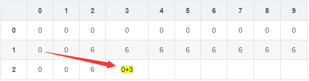
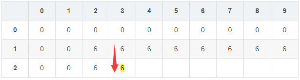
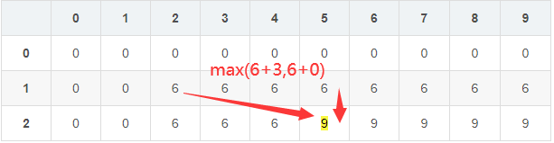

# 搜索

## 广度优先算法

广度优先搜索 (Breadth-First Search, BFS)是一种用于图形数据结构的基本算法，用于逐层地扩展和探索图中的节点。

它从根节点开始，沿着树或图的宽度遍历所有相邻节点，然后逐层向外扩展，直到找到目标节点或遍历完整个图。该算法类似于树的层序遍历，通常借助队列实现，确保按照层级顺序逐个访问节点。

### 基本原理

BFS 使用队列来实现节点的遍历和探索。具体步骤如下：

1. **初始化**：将起始节点放入队列中，并标记为已访问。
2. **循环**：从队列中取出一个节点，探索其所有相邻节点。
3. **标记和入队**：对于每个未访问过的相邻节点，标记为已访问并放入队列。
4. **重复**：重复步骤2和步骤3，直到队列为空。

BFS 保证在访问所有当前层级节点后才会进入下一层级，因此可以用来求解最短路径或最短步数等问题。

### 代码实现

**伪代码**

```c
// 访问标记数组
int visited[Maxsize];

// 对图 G 进行广度优先遍历
void BFSTraverse(Graph G) {
    // 初始化访问标记数组
    for(int i = 0; i < G.vexnum; i ++) 
        visited[i]=0;
    // 初始化辅助队列
    InitQueue(Q);
    for(int i = 0; i < G.vexnum; i ++)
        // 对每个连通分量调用一次 BFS
        if(!visited[i])
            BFS(G,i);
}

void BFS(Graph G, int v) {
    // 从顶点 v 出发，广度优先遍历图 G
    // 访问初始顶点 v
    visit(v);
    // 对 v 做已访问标记
    visited[v] = 1;
    // 顶点 v 入队
    EnQueue(Q,v);
    while(!isempty(Q)) {
        // 队头顶点出队
        DeQueue(Q,v);
        // 将 v 的所有未访问的邻接顶点访问并入队
        for(w = FirstNeighbor; w >= 0; w = NextNeighbor) {
            // 此时 w 为 v 的未访问的邻接顶点
            if(!visited[w]) {
                // 访问顶点 w
                visit(w);
                // 对 w 做已访问标记
                visited[w] = 1;
                // 将顶点 w 入队
                EnQueue(Q,w);
            }
        }
    }
}
```

**Java 实现**

```java
import java.util.*;

class Graph {
    private int V; // 节点数
    private LinkedList<Integer> adj[]; // 邻接表

    // 构造函数
    Graph(int v) {
        V = v;
        adj = new LinkedList[v];
        for (int i = 0; i < v; ++i)
            adj[i] = new LinkedList();
    }

    // 添加边
    void addEdge(int v, int w) {
        adj[v].add(w);
    }

    // 广度优先搜索
    void BFS(int s) {
        boolean visited[] = new boolean[V]; // 标记节点是否访问过
        LinkedList<Integer> queue = new LinkedList<>();

        visited[s] = true;
        queue.add(s);

        while (queue.size() != 0) {
            s = queue.poll();
            System.out.print(s + " ");

            Iterator<Integer> i = adj[s].listIterator();
            while (i.hasNext()) {
                int n = i.next();
                if (!visited[n]) {
                    visited[n] = true;
                    queue.add(n);
                }
            }
        }
    }
}
```
**C++ 实现**

```C++
#include <iostream>
#include <list>
#include <queue>

using namespace std;

class Graph {
    int V; // 节点数
    list<int> *adj; // 邻接表

public:
    Graph(int V); // 构造函数
    void addEdge(int v, int w); // 添加边
    void BFS(int s); // 广度优先搜索
};

Graph::Graph(int V) {
    this->V = V;
    adj = new list<int>[V];
}

void Graph::addEdge(int v, int w) {
    adj[v].push_back(w);
}

void Graph::BFS(int s) {
    bool *visited = new bool[V];
    for (int i = 0; i < V; i++)
        visited[i] = false;

    queue<int> queue;
    visited[s] = true;
    queue.push(s);

    while (!queue.empty()) {
        s = queue.front();
        cout << s << " ";
        queue.pop();

        for (auto i = adj[s].begin(); i != adj[s].end(); ++i) {
            if (!visited[*i]) {
                visited[*i] = true;
                queue.push(*i);
            }
        }
    }
}
```

### 应用

1. 迷宫求解：BFS 可以帮助我们找到从起点到终点的最短路径，用于解决迷宫问题。

2. 社交网络分析：BFS 可以用于网络中的节点搜索和社交关系分析，发现网络中的关键人物或组织。

3. 游戏 AI：BFS 可以用于计算机游戏中的路径规划和敌人追踪，以及以智能方式移动角色。

4. 地图导航：BFS 可以帮助我们找到两个地点之间的最短路径，用于导航应用中的路线规划。

#### 最短路径

利用广度优先搜索（BFS）实现最短路径的查找是一种常见的应用场景，特别适用于无权图或权值相同的图。在广度优先搜索中，首次到达目标节点的路径长度即为最短路径长度。

##### 原理

最短路径查找算法基于广度优先搜索（BFS）。其核心思想是：

1. 使用 BFS 遍历图，从起始节点开始搜索。
2. 维护一个距离数组，记录每个节点到起始节点的最短距离。
3. 如果遍历到目标节点，即可得到从起始节点到目标节点的最短路径长度。

> 为了记录路径，我们需要维护一个 `parent` 数组，用于记录每个节点在 BFS 树中的父节点。这样我们可以从目标节点回溯到起始节点，重建出完整的路径。

##### 算法实现

**Java 实现**

```java
import java.util.*;

class Graph {
    private int V; // 节点数
    private List<List<Integer>> adj; // 邻接表

    // 构造函数
    public Graph(int V) {
        this.V = V;
        adj = new ArrayList<>(V);
        for (int i = 0; i < V; ++i)
            adj.add(new ArrayList<>());
    }

    // 添加边
    public void addEdge(int v, int w) {
        adj.get(v).add(w);
        adj.get(w).add(v); // 如果是无向图，需要添加反向边
    }

    // 使用 BFS 查找最短路径长度并获取完整路径
    public List<Integer> shortestPath(int src, int dest) {
        boolean[] visited = new boolean[V]; // 记录节点是否访问过
        int[] parent = new int[V]; // 记录节点的父节点
        Arrays.fill(parent, -1); // 初始化父节点为 -1 表示无父节点

        Queue<Integer> queue = new LinkedList<>();
        queue.add(src);
        visited[src] = true;

        while (!queue.isEmpty()) {
            int current = queue.poll();

            if (current == dest) {
                // 构建路径
                List<Integer> path = new ArrayList<>();
                int step = current;
                while (step != -1) {
                    path.add(step);
                    step = parent[step];
                }
                Collections.reverse(path);
                return path;
            }

            for (int neighbor : adj.get(current)) {
                if (!visited[neighbor]) {
                    visited[neighbor] = true;
                    parent[neighbor] = current;
                    queue.add(neighbor);
                }
            }
        }

        return new ArrayList<>(); // 如果未找到路径，返回空列表
    }

    public static void main(String[] args) {
        int V = 6; // 节点数
        Graph g = new Graph(V);

        // 添加边
        g.addEdge(0, 1);
        g.addEdge(0, 2);
        g.addEdge(1, 3);
        g.addEdge(2, 4);
        g.addEdge(3, 4);
        g.addEdge(3, 5);
        g.addEdge(4, 5);

        int src = 0; // 起始节点
        int dest = 5; // 目标节点

        List<Integer> shortestPath = g.shortestPath(src, dest);

        if (!shortestPath.isEmpty()) {
            System.out.println("最短路径: " + shortestPath);
          	// 路径长度为节点数减一
            System.out.println("最短路径长度: " + (shortestPath.size() - 1)); 
        } else {
            System.out.println("未找到路径");
        }
    }
}
```

# 动态规划

## 背包问题

有多个重量不同、价值不同的物品，以及一个容量有限的背包，选择一些物品装入背包，求最大总价值。  背包问题无法用贪心求最优解，是典型的动态规划问题。

背包问题还可以分成3种：

|          | 区别             |
| :------- | :--------------- |
| 0/1背包  | 每种物品是一件   |
| 完全背包 | 每种物品是无限件 |
| 多重背包 | 每种物品是有限件 |

### 0/1背包

0/1背包顾名思义就是0和1两种状态，即每个物品装入和不装入背包这两种状态，如果不懂dp的话，可能用dfs的做法深搜，但时间复杂度是2n，肯定是不能接受的，或者用贪心，但也并不能得到全局最优解。下面举例说明dp。

#### 原理

假设4个物品，重量分别是w={2,3,6,5}，价值分别是v={6,3,5,4}，背包容量为9。 引进二维表dp[][]，**dp[i][j]表示考虑前i个物品装入容量为j的背包中获得的最大价值**。可以把每个dp[i][j]都看成一个背包。

步骤一：只装第1个物品 因为物品1的重量是2，所以容量小于2的背包都放不进去（即dp[1][0]=dp[1][1]=0），在容量2时装入，其价值是物品1的价值（即dp[1][2]=6），容量大于2的背包，多余的容量也用不到（因为现在只考虑物品1），其价值也都是6，如下图

|      | 0    | 1    | 2    | 3    | 4    | 5    | 6    | 7    | 8    | 9    |
| :--- | :--- | :--- | :--- | :--- | :--- | :--- | :--- | :--- | :--- | :--- |
| 0    | 0    | 0    | 0    | 0    | 0    | 0    | 0    | 0    | 0    | 0    |
| 1    | 0    | 0    | 6    | 6    | 6    | 6    | 6    | 6    | 6    | 6    |

步骤二：只装前2个物品 首先，物品2重量是3，背包容量3的情况和只装物品1情况一样。下面从dp[2][3]开始填，此时我们可以选择装物品2，也可以不装。 如果装，那么相当于把dp[i-1][j-3]的最大价值加上物品2的价值3，即考虑只第一个物品的时候，腾出3容量放物品2，此时价值=3； 



如果不装，那么相当于只把物品1装入，此时价值=6； 



 我们取两者最大值，即dp[2][3]=max(3,6)=6。 后面的多余容量同理。 



重复上述步骤，得到dp数组

|      | 0    | 1    | 2    | 3    | 4    | 5    | 6    | 7    | 8    | 9    |
| :--- | :--- | :--- | :--- | :--- | :--- | :--- | :--- | :--- | :--- | :--- |
| 0    | 0    | 0    | 0    | 0    | 0    | 0    | 0    | 0    | 0    | 0    |
| 1    | 0    | 0    | 6    | 6    | 6    | 6    | 6    | 6    | 6    | 6    |
| 2    | 0    | 0    | 6    | 6    | 6    | 9    | 9    | 9    | 9    | 9    |
| 3    | 0    | 0    | 6    | 6    | 6    | 9    | 9    | 9    | 11   | 11   |
| 4    | 0    | 0    | 6    | 6    | 6    | 9    | 9    | 10   | 11   | 11   |

最后答案是dp[4][9]，即把4个物品装入容量为9的背包，最大价值是11。

#### 代码

```c++
#include<cstdio>
#include<algorithm>
#include<cstring>

using namespace std;

const int maxn = 1003;
int t, n, m;
int dp[maxn][maxn], v[maxn], w[maxn], path[maxn][maxn];

int main() {
    scanf("%d", &t);
    while (t--) {
        memset(dp, 0, sizeof(dp));
        //memset(path, 0, sizeof(path));
        scanf("%d%d", &n, &m);
        for (int i = 1; i <= n; i++)scanf("%d", &v[i]);
        for (int i = 1; i <= n; i++)scanf("%d", &w[i]);
        for (int i = 1; i <= n; i++)
            for (int j = 0; j <= m; j++)
                if (w[i] > j) //当前容量j小于物品i的重量，装不下
                    dp[i][j] = dp[i - 1][j];
                else {  //可以装，取不装和装的最大值
                    dp[i][j] = max(dp[i - 1][j], dp[i - 1][j - w[i]] + v[i]);
                    //if (dp[i - 1][j - w[i]] + v[i] > dp[i - 1][j])//记录路径
                    //    path[i][j] = 1;
                }
        printf("%d\n", dp[n][m]);
        /*for (int i = n, j = m; i >0 && j > 0;i--) {  //输出方案
            if (path[i][j]) {
                printf("%d ", i);
                j -= w[i];
            }
        }*/
    }
    return 0;
}
```

**滚动数组优化**

如果数据很大的时候，我们无法定义这么大的二维表，那么就要考虑对空间复杂度进行优化。我们观察上述二维表dp[][]，不难发现，每一行是从上一行算出来的，只与上一行有关系，与更前面的行没有关系。那么用新的一行覆盖原来的就好了(就是一行数组进行滚动)，空间复杂度从O(NV)减少为O(V)。

```c++
#include<cstdio>
#include<algorithm>
#include<cstring>

using namespace std;

const int maxn = 1003;
int t, n, m;
int dp[maxn], v[maxn], w[maxn];

int main() {
    scanf("%d", &t);
    while (t--) {
        memset(dp, 0, sizeof(dp));
        scanf("%d%d", &n, &m);
        for (int i = 1; i <= n; i++)scanf("%d", &v[i]);
        for (int i = 1; i <= n; i++)scanf("%d", &w[i]);
        for (int i = 1; i <= n; i++)
            for (int j = m; j >= w[i]; j--)
                dp[j] = max(dp[j], dp[j - w[i]] + v[i]);
        printf("%d\n", dp[m]);
    }
    return 0;
}
```

注意j应该逆序循环，即从后面往前面覆盖，不然会多次考虑每件物品（恰恰是完全背包的解），但我们不能重复选择已经选择的物品。不过，滚动数组覆盖掉了中间转移状态，无法倒推输出方案，如果用path[][]记录就没有优化的意义了。 如果实在不理解为什么逆序的话（~~刚开始的确费劲~~ ），不妨就定义pre[]表示上一行：

```c++
for (int i = 1; i <= n; i++) {
  for (int j = w[i]; j <= m; j++)
    dp[j] = max(pre[j], pre[j - w[i]] + v[i]);
  memcpy(pre, dp, sizeof(dp));
}
```

### 完全背包

完全背包与0/1背包不同就是每种物品可以多次/无限选择，而0/1背包的每种物品至多只能选择一次。

不难发现，完全背包其实可以转换成0/1背包，第i种物品的出现次数至多是背包容量m/物品i重量w[i]，那么以此构建新的v[]和w[]即可，也可以再加一层循环表示物品个数，然后套用0/1背包。

#### 代码

**二维**

0/1背包转移方程是dp[i][j] = max(dp [i - 1] [j]，dp[i - 1][j - w[i]] + v[i])，即决策dp[i][j]（前i个物品，j容量时）是从前一行只考虑前i-1个物品的情况下为基础，避免重复选择。而完全背包可以多次选择第i个物品，所以是考虑前i个物品的情况下为基础来决策，即同一行，推出转移方程：dp[i][j] = max(dp [i] [j]，dp[i - 1][j - w[i]] + v[i])

```c++
for (int i = 1; i <= n; i++)
  for (int j = w[i]; j <= m; j++)
    dp[i][j] = max(dp[i][j],dp[i - 1][j - w[i]] + v[i])
```

**一维**

完全背包是顺序，顺序会覆盖以前的状态，即存在选择多次的情况。

```c++
for (int i = 1; i <= n; i++)
  for (int j = w[i]; j <= m; j++)
    dp[j] = max(dp[j], dp[j - w[i]] + v[i]);
```

> 在动态规划的过程中，我们需要考虑每个物品放入背包的情况，并更新状态数组。对于背包问题，我们通常是按照物品的顺序和背包容量的顺序来考虑的。如果我们按照正序循环遍历背包容量j，在考虑放入第i个物品时，我们可能会用到前面已经放入的物品的状态。
>
> 让我们用一个示例来说明：
>
> 假设我们有一个物品数组 **items**，容量为 **cap**，**dp[i][j]** 表示在前i个物品中选择，背包容量为j时的最大价值。现在考虑放入第i个物品：
>
> + 如果我们按照正序循环遍历背包容量j，在考虑放入第i个物品时，它之前的物品可能已经被放入了背包，这意味着我们会在考虑第i个物品时用到第i-1个物品已经放入的状态。
> + 如果第i个物品的重量小于等于当前背包容量j，我们可能会利用第i-1个物品已经放入的背包的状态，然后再考虑放入第i个物品，这样就相当于在考虑放入第i-1个物品时的状态上再放入第i个物品。
>
> 这种情况下，我们相当于多次考虑了第i-1个物品，因为它的状态在考虑放入第i个物品时又被利用了一次。这就违背了01背包问题中每个物品只能选择一次的要求。
>
> 为了避免这种情况，我们需要逆序循环。这样，在考虑放入第i个物品时，它之后的背包容量不会被前面已经放入的相同物品再次覆盖。这种方式确保每件物品只考虑一次，符合01背包问题的要求。
>
> 这种是为了避免大容量背包放小容量物品时可能会多次放置的情况，例如背包容量为9，物品重量为1，如果我正序更新，就会导致每一次容量增加时都会放入一次当前物品。
>
> 因为数组取消了一维，即正序更新时无法确保是上一个物品的数据，还是本个物品的数据。
>
> 完全背包问题：dp[i][j] = max(dp[i][j], dp[i][j−w[i]]+v[i]) // j >= w[i]

# 最大公约数

**普通算法**

```c++
int gcd(int m,int n) {    
  int t,r;    
  if (m < n){        
    t=m;      
    m=n;       
    n=t;    
  }
  
  // 辗转相除
  while((m%n)!=0){        
    r=m%n;        
    m=n;      
    n=r;    
	}   
 
	return n;
}
```

**递归算法**

```c++
//求最大公因数递归算法
int gcd(int x, int y) {	
  if (y)			
    return gcd(y, x%y);		
  else			
    return x;
} 
```

**最美妙算法**

> 巧用位运算，尤其是异或，会带来意想不到的方法。

```c++
int gcd(int x, int y) {
  while(y^=x^=y^=x%=y);
  return x;
}
```

# 栈-四则运算

```java
Stack<Character> ops = new Stack<>();
Stack<Float> nums = new Stack<>();

StringBuilder sb = new StringBuilder();
boolean is = false;
for (int i = 0; i < chars.length; i++) {
  char temp = chars[i];
  if (Character.isDigit(temp) || temp == '.') {
    sb.append(temp);
  } else {
    if (sb.length() > 0) {
      nums.push(Float.valueOf(sb.toString()));
      sb = new StringBuilder();
      is = false;
    }

    // if (temp == '(') {
    //     ops.push(temp);
    // } else if (temp == ')') {
    //     while (!ops.isEmpty() && ops.peek() != '(') {
    //         nums.push(calculate(ops.pop(), nums.pop(), nums.pop()));
    //     }
    //     ops.pop(); // Remove '('
    // } else {
    //     while (!ops.isEmpty() && getOrder(temp) <= getOrder(ops.peek())) {
    //         nums.push(calculate(ops.pop(), nums.pop(), nums.pop()));
    //     }
    //     ops.push(temp);
    // }

    // 负数判断
    if (is && temp == '-') {
      sb.append("-");
      is = false;
      continue;
    }

    if (temp == ')') {
      while (ops.peek() != '(') {
        nums.push(calculate(ops.pop(), nums.pop(), nums.pop()));
      }
      ops.pop();
    } else if (temp == '(' || ops.empty() || getOrder(temp) - getOrder(ops.peek()) > 0) {
      ops.push(temp);
      is = true;
    } else {
      nums.push(calculate(ops.pop(), nums.pop(), nums.pop()));
      ops.push(temp);
      is = true;
    }
  }
}

if (sb.length() > 0) {
  nums.push(Float.valueOf(sb.toString()));
}

while (!ops.isEmpty()) {
  nums.push(calculate(ops.pop(), nums.pop(), nums.pop()));
}
```

