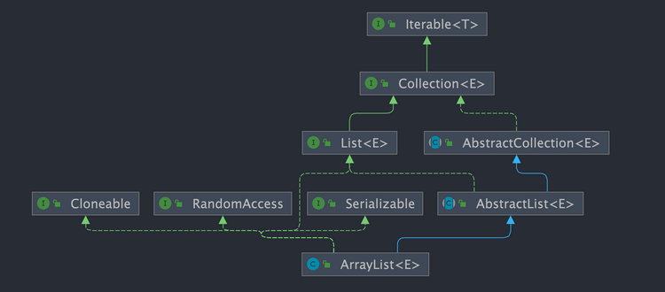
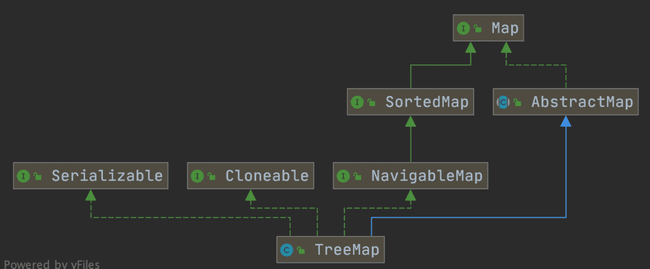
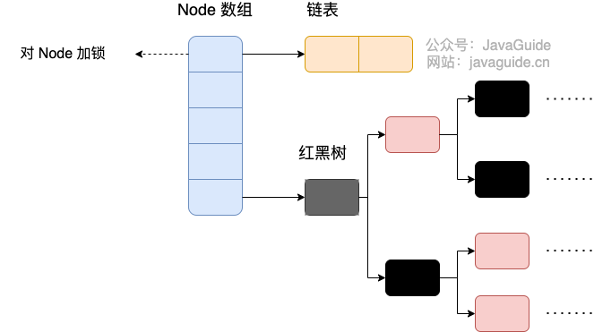

# 概述

早在 Java 2 中之前，Java 就提供了特设类。比如：Dictionary, Vector, Stack, 和 Properties 这些类用来存储和操作对象组。

虽然这些类都非常有用，但是它们缺少一个核心的，统一的主题。由于这个原因，使用 Vector 类的方式和使用 Properties 类的方式有着很大不同。

为此，整个集合框架就围绕一组标准接口而设计。你可以直接使用这些接口的标准实现，诸如： LinkedList, HashSet, 和 TreeSet 等,除此之外你也可以通过这些接口实现自己的集合。

Java 集合框架主要包括两种类型的容器，一种是集合（Collection），存储一个元素集合，另一种是图（Map），存储键/值对映射。

Collection 接口又有 3 种子类型，List、Set 和 Queue，再下面是一些抽象类，最后是具体实现类，常用的有 ArrayList、LinkedList、HashSet、LinkedHashSet、HashMap、LinkedHashMap 等等。

集合框架是一个用来代表和操纵集合的统一架构。所有的集合框架都包含如下内容：

+ **接口**
  + 代表集合的抽象数据类型；之所以定义多个接口，是为了以不同的方式操作集合对象
  + 例如：Collection、List、Set、Map
+ **实现（类）**
  + 是集合接口的具体实现；从本质上讲，它们是可重复使用的数据结构
  + 例如：ArrayList、LinkedList、HashSet、HashMap 
+ **算法**
  + 是实现集合接口的对象里的方法执行的一些有用的计算；这些算法实现了多态，那是因为相同的方法可以在相似的接口上有着不同的实现
  + 例如：搜索和排序

除了集合，该框架也定义了几个 Map 接口和类。Map 里存储的是键/值对。尽管 Map 不是集合，但是它们完全整合在集合中。

# 接口


## Collection

Collection 是最基本的集合接口，一个 Collection 代表一组 Object，即 Collection 的元素, Java不提供直接继承自Collection 的类，只提供继承于的子接口（如 List 和 set ）。

Collection 接口存储一组不唯一，无序的对象。

## List

List 接口是一个有序的 Collection，使用此接口能够精确的控制每个元素插入的位置，能够通过索引（元素在 List 中位置，类似于数组的下标）来访问List中的元素，第一个元素的索引为 0，而且允许有相同的元素。

List 接口存储一组不唯一，有序（插入顺序）的对象。

## Set

Set 具有与 Collection 完全一样的接口，只是行为上不同，Set 不保存重复的元素。

Set 接口存储一组唯一，无序的对象。

### SortedSet

继承于Set保存有序的集合。

## Map

Map 接口存储一组键值对象，提供 key（键）到 value（值）的映射。

### Map.Entry

描述在一个 Map 中的一个元素（键/值对）。是一个 Map 的内部接口。

### SortedMap

继承于 Map，使 Key 保持在升序排列。

## Queue

### Deque

#### 常见问题

> ArrayDeque 与 LinkedList 的区别
>
> `ArrayDeque` 和 `LinkedList` 都实现了 `Deque` 接口，两者都具有队列的功能，但两者有什么区别呢？
>
> + `ArrayDeque` 是基于可变长的数组和双指针来实现，而 `LinkedList` 则通过链表来实现。
> + `ArrayDeque` 不支持存储 `NULL` 数据，但 `LinkedList` 支持。
> + `ArrayDeque` 是在 JDK1.6 才被引入的，而`LinkedList` 早在 JDK1.2 时就已经存在。
> + `ArrayDeque` 插入时可能存在扩容过程, 不过均摊后的插入操作依然为 O(1)。虽然 `LinkedList` 不需要扩容，但是每次插入数据时均需要申请新的堆空间，均摊性能相比更慢。
>
> 从性能的角度上，选用 `ArrayDeque` 来实现队列要比 `LinkedList` 更好。此外，`ArrayDeque` 也可以用于实现栈。

### 常见问题

`Queue` 是单端队列，只能从一端插入元素，另一端删除元素，实现上一般遵循 **先进先出（FIFO）** 规则。

`Queue` 扩展了 `Collection` 的接口，根据 **因为容量问题而导致操作失败后处理方式的不同** 可以分为两类方法: 一种在操作失败后会抛出异常，另一种则会返回特殊值。

| `Queue` 接口 | 抛出异常  | 返回特殊值 |
| ------------ | --------- | ---------- |
| 插入队尾     | add(E e)  | offer(E e) |
| 删除队首     | remove()  | poll()     |
| 查询队首元素 | element() | peek()     |

`Deque` 是双端队列，在队列的两端均可以插入或删除元素。

`Deque` 扩展了 `Queue` 的接口, 增加了在队首和队尾进行插入和删除的方法，同样根据失败后处理方式的不同分为两类：

| `Deque` 接口 | 抛出异常      | 返回特殊值      |
| ------------ | ------------- | --------------- |
| 插入队首     | addFirst(E e) | offerFirst(E e) |
| 插入队尾     | addLast(E e)  | offerLast(E e)  |
| 删除队首     | removeFirst() | pollFirst()     |
| 删除队尾     | removeLast()  | pollLast()      |
| 查询队首元素 | getFirst()    | peekFirst()     |
| 查询队尾元素 | getLast()     | peekLast()      |

事实上，`Deque` 还提供有 `push()` 和 `pop()` 等其他方法，可用于模拟栈。

## Enumeration

这是一个传统的接口和定义的方法，通过它可以枚举（一次获得一个）对象集合中的元素。这个传统接口已被迭代器取代。

**Set 和 List 的区别**
> 1. Set 接口实例存储的是无序的，不重复的数据。List 接口实例存储的是有序的，可以重复的元素。
> 2. Set 检索效率低下，删除和插入效率高，插入和删除不会引起元素位置改变；实现类有 HashSet, TreeSet 。
> 3. List 和数组类似，可以动态增长，根据实际存储的数据的长度自动增长 List 的长度。查找元素效率高，插入删除效率低，因为会引起其他元素位置改变；实现类有 ArrayList, LinkedList, Vector 。

# 实现类

Java 提供了一套实现了 Collection 接口的标准集合类。其中一些是具体类，这些类可以直接拿来使用，而另外一些是抽象类，提供了接口的部分实现。


## AbstractCollection

实现了大部分的集合接口。

## AbstractList

继承于 AbstractCollection 并且实现了大部分 List 接口。

### Vector

该类和 ArrayList 非常相似，但是该类是同步的，可以用在多线程的情况，该类允许设置默认的增长长度，默认扩容方式为原来的 2 倍。

#### Stack

栈是 Vector 的一个子类，它实现了一个标准的后进先出的栈。

### AbstractSequentialList
继承于 AbstractList ，提供了对数据元素的链式访问而不是随机访问。

#### LinkedList

该类实现了 List 接口，允许有 null（空）元素。主要用于创建链表数据结构，该类没有同步方法，如果多个线程同时访问一个List，则必须自己实现访问同步，解决方法就是在创建 List 时候构造一个同步的List。

例如：

`List list=Collections.synchronizedList(newLinkedList(...));`

LinkedList 查找效率低。

### ArrayList

该类也是实现了 List 的接口，实现了可变大小的数组，随机访问和遍历元素时，提供更好的性能。该类也是非同步的，在多线程的情况下不要使用。ArrayList 增长当前长度的 50%，插入删除效率低。

## AbstractSet

继承于AbstractCollection 并且实现了大部分 Set 接口。

### HashSet

该类实现了 Set 接口，不允许出现重复元素，不保证集合中元素的顺序，允许包含值为 null 的元素，但最多只能一个。

#### LinkedHashSet

具有可预知迭代顺序的 Set 接口的哈希表和链接列表实现。

### TreeSet

该类实现了 Set 接口，可以实现排序等功能。

### 常见问题

> 比较 HashSet、LinkedHashSet 和 TreeSet 三者的异同
>
> + `HashSet`、`LinkedHashSet` 和 `TreeSet` 都是 `Set` 接口的实现类，都能保证元素唯一，并且都不是线程安全的。
> + `HashSet`、`LinkedHashSet` 和 `TreeSet` 的主要区别在于底层数据结构不同。`HashSet` 的底层数据结构是哈希表（基于 `HashMap` 实现）。`LinkedHashSet` 的底层数据结构是链表和哈希表，元素的插入和取出顺序满足 FIFO。`TreeSet` 底层数据结构是红黑树，元素是有序的，排序的方式有自然排序和定制排序。
> + 底层数据结构不同又导致这三者的应用场景不同。`HashSet` 用于不需要保证元素插入和取出顺序的场景，`LinkedHashSet` 用于保证元素的插入和取出顺序满足 FIFO 的场景，`TreeSet` 用于支持对元素自定义排序规则的场景。

## AbstractMap

实现了大部分的 Map 接口。

### HashMap

HashMap 是一个散列表，它存储的内容是键值对（key - value）映射。
该类实现了 Map 接口，根据键的 HashCode 值存储数据，具有很快的访问速度，最多允许一条记录的键为 null，不支持线程同步。

#### LinkedHashMap

继承于 HashMap，使用元素的自然顺序对元素进行排序.

### TreeMap

继承了 AbstractMap，并且使用一颗树。

### WeakHashMap

继承 AbstractMap 类，使用弱密钥的哈希表。

### IdentityHashMap

继承 AbstractMap 类，比较文档时使用引用相等。

## Dictionary

Dictionary 类是一个抽象类，用来存储键/值对，作用和 Map 类相似。

### Hashtable

Hashtable 是 Dictionary（字典）类的子类，位于 java.util 包中。

#### Properties
Properties 继承于 Hashtable，表示一个持久的属性集，属性列表中每个键及其对应值都是一个字符串。

### BitSet
一个Bitset类创建一种特殊类型的数组来保存位值。BitSet中数组大小会随需要增加。

# ArrayList

`ArrayList` 的底层是数组队列，相当于动态数组。与 Java 中的数组相比，它的容量能动态增长。在添加大量元素前，应用程序可以使用`ensureCapacity`操作来增加 `ArrayList` 实例的容量。这可以减少递增式再分配的数量。

ArrayList 位于 `java.util` 包中，使用前需要引入：

```java
import java.util.ArrayList; // 引入 ArrayList 类
```

ArrayList 不是线程安全的，所以效率比较高 ，但是只能用于单线程的环境中。

`ArrayList` 继承于 `AbstractList` ，实现了 `List`, `RandomAccess`, `Cloneable`, `java.io.Serializable` 这些接口。

```java
public class ArrayList<E> extends AbstractList<E>
        implements List<E>, RandomAccess, Cloneable, java.io.Serializable{

  }
```

+ `List` : 表明它是一个列表，支持添加、删除、查找等操作，并且可以通过下标进行访问。
+ `RandomAccess` ：这是一个标志接口，表明实现这个接口的 `List` 集合是支持 **快速随机访问** 的。在 `ArrayList` 中，我们即可以通过元素的序号快速获取元素对象，这就是快速随机访问。
+ `Cloneable` ：表明它具有拷贝能力，可以进行深拷贝或浅拷贝操作。
+ `Serializable` : 表明它可以进行序列化操作，也就是可以将对象转换为字节流进行持久化存储或网络传输，非常方便。



**接口继承**

ArrayList 主要继承了 AbstractList 类，实现了 List、RandomAccess、Cloneable、Serializable 接口。

```java
public class ArrayList<E> extends AbstractList<E>
        implements List<E>, RandomAccess, Cloneable, java.io.Serializable
```

RandomAccess 的意思是其拥有快速访问的能力，ArrayList 可以以 $O(1)$ 的时间复杂度去根据下标访问元素。由于 ArrayList 底层机构是数组，所以它占据了==一块连续的内存空间==，其长度就是数组的大小，因此它也有数组的缺点，在空间效率不高，但是也有它的有点，就是查询速度快，时间效率较快。

> 为什么 `ArrayList<E>` 需要显式实现 `List<E>` 接口，即使 `AbstractList<E>` 已经实现了 `List<E>` 接口？
>
> 1. **`ArrayList<E>` 的实现**：
>    + `ArrayList<E>` 继承自 `AbstractList<E>`，后者是一个抽象类，实现了 `List<E>` 接口的部分方法。
>    + 虽然 `AbstractList<E>` 已经提供了一些对 `List<E>` 接口方法的实现，但仍然留下了一些方法需要具体的子类（如 `ArrayList<E>`）去实现，例如 `get(int index)`、`set(int index, E element)` 等。
>    + 为了让 `ArrayList<E>` 完全符合 `List<E>` 接口的定义，它需要自己实现接口中未被 `AbstractList<E>` 实现的方法。
> 2. **多态和接口的使用**：
>    + 通过实现 `List<E>` 接口，`ArrayList<E>` 可以被视为 `List<E>` 类型的实例，从而实现多态。

**内部属性**

```java
// 序列ID
private static final long serialVersionUID = 8683452581122892189L;

// ArrayList默认的初始容量大小
private static final int DEFAULT_CAPACITY = 10;

// 空对象数组，用于空实例的共享空数组实例
private static final Object[] EMPTY_ELEMENTDATA = {};

// 空对象数组，如果使用默认的构造函数创建，则默认对象内容是该值
private static final Object[] DEFAULTCAPACITY_EMPTY_ELEMENTDATA = {};

// 存放当前数据，不参与序列化
transient Object[] elementData; // non-private to simplify nested class access

// list大小
private int size;
```

当集合中的元素超出数组规定的长度时，数组就会进行扩容操作，扩容操作就是 ArrayList 存储操作缓慢的原因，尤其是当数据量较大的时候，每次扩容消耗的时间会越来越多。

## 构造方法

### ArrayList(int initialCapacity)

当我们要使用 ArrayList 时，可以 `new ArrayList(size)` 构造方法来指定集合的大小，以减少扩容的次数，提高写入效率。

```java
// 自定义初始容量的构造方法
public ArrayList(int initialCapacity) {
    if (initialCapacity > 0) {
        this.elementData = new Object[initialCapacity];
    } else if (initialCapacity == 0) {
        this.elementData = EMPTY_ELEMENTDATA;
    } else {
        // 如果初始容量小于0，则会出现 IllegalArgumentException 异常
        throw new IllegalArgumentException("Illegal Capacity: "+
                                           initialCapacity);
    }
}
```

### ArrayList()

```java
// 默认的构造方法，构造一个初始容量为10的空列表
public ArrayList() {
    // elementData 初始化为 DEFAULTCAPACITY_EMPTY_ELEMENTDATA
    this.elementData = DEFAULTCAPACITY_EMPTY_ELEMENTDATA;
}
```

**以无参数构造方法创建 `ArrayList` 时，实际上初始化赋值的是一个空数组。当真正对数组进行添加元素操作时，才真正分配容量。即向数组中添加第一个元素时，数组容量扩为 10。** 

> JDK6 new 无参构造的 `ArrayList` 对象时，直接创建了长度是 10 的 `Object[]` 数组 `elementData`

### ArrayList(Collection c)

```java
// 构造一个包含指定元素的列表集合，按集合的返回顺序迭代器
// 传入参数为 Collection 对象
// c 要将其元素放入此列表的集合
public ArrayList(Collection<? extends E> c) {
    // 调用toArray()方法将Collection对象转换为Object[]
    elementData = c.toArray();
    
    // 判断 size 的大小，如果 size 值为 0，则会抛出 NullPointerException 异常
    // 如果 size > 0 ，则执行以下代码
    if ((size = elementData.length) != 0) {
        // c.toArray might (incorrectly) not return Object[] (see 6260652)
        if (elementData.getClass() != Object[].class)
            // 执行Arrays.copyOf，把Collection对象的内容copy到elementData中
            elementData = Arrays.copyOf(elementData, size, Object[].class);
    } else {
        // replace with empty array.
        this.elementData = EMPTY_ELEMENTDATA;
    }
}
```

## 基本方法

### 初始化

```java
ArrayList<E> list = new ArrayList<>(); // 初始化 ArrayList
```

+ **E**: 泛型数据类型，用于设置 ArrayList 中元素的数据类型，只能为引用数据类型。
+ **list**: 对象名，可以根据需要自定义。

### 添加元素

使用 `add()` 方法向 ArrayList 中添加元素：

```java
list.add(element); // 向 ArrayList 中添加元素
```

#### 单个add()

```java
// 添加单个元素,添加元素之前会先检查容量，如果容量不足则调用 grow 方法
public boolean add(E e) {
    // 判断添加后的长度是否需要扩容
    ensureCapacityInternal(size + 1);  // Increments modCount!!
    // 然后在数组末尾添加当前元素，并且修改size的大小
    elementData[size++] = e;
    // 返回布尔值true
    return true;
}
```

**ensureCapacityInternal()**

```java
// 判断是否需要扩容
private void ensureCapacityInternal(int minCapacity) {
    // 执行 calculateCapacity
    ensureExplicitCapacity(calculateCapacity(elementData, minCapacity));
}
```

**calculateCapacity()**

```java
// 判断是否是第一次初始化数组
private static int calculateCapacity(Object[] elementData, int minCapacity) {
    // 判断当前数组是否等于空的数组
    // 注意：这里的 DEFAULTCAPACITY_EMPTY_ELEMENTDATA 并不是 EMPTY_ELEMENTDATA，不过并无太大差别，只是为了区分何时需要扩容而已
    if (elementData == DEFAULTCAPACITY_EMPTY_ELEMENTDATA) {
        // 取其中最大的值作为判断本次是否需要扩容的依据，由于第一次数组是空的，所以默认要使数组扩容到 10 的长度
        return Math.max(DEFAULT_CAPACITY, minCapacity);
    }
    return minCapacity;
}
```

**ensureExplicitCapacity()**

```java
// 判断扩容的方法
private void ensureExplicitCapacity(int minCapacity) {
    // 如果需要扩容modCount自增，这个参数是指当前列表的结构被修改的次数
    modCount++;

    // overflow-conscious code
    // 判断当前数据量是否大于数组的长度，如果是，进行扩容
    if (minCapacity - elementData.length > 0)
        // 执行扩容操作
        grow(minCapacity);
}
```

**grow()**

```java
// grow扩容方法
private void grow(int minCapacity) {
    // overflow-conscious code
    // 记录扩容前的数组长度
    int oldCapacity = elementData.length;
    
    // 将原数组的长度扩大 0.5 倍作为扩容后数组的长度（如果扩容钱数组长度为 10，那么经过扩容后的数组长度应该为 15）
    int newCapacity = oldCapacity + (oldCapacity >> 1);
    
    // 如果扩容后的长度小于当前的数据量
    if (newCapacity - minCapacity < 0)
        //那么就将当前的数据量的长度作为本次扩容的长度
        newCapacity = minCapacity;
    
    // 判断新数组的长度是否大于可分配数组的最大值
    if (newCapacity - MAX_ARRAY_SIZE > 0)
        // 将扩容长度设置为最大可用长度
        newCapacity = hugeCapacity(minCapacity);
    // minCapacity is usually close to size, so this is a win:
    // 拷贝，扩容，构建一个新的数组
    elementData = Arrays.copyOf(elementData, newCapacity);
}
```

**hugeCapacity()**

```java
//如果新数组长度超过当前数组定义的最大长度时
private static int hugeCapacity(int minCapacity) {
    // 抛出 OOM 异常
    if (minCapacity < 0) // overflow
        throw new OutOfMemoryError();
    
    // 将扩容长度设置为 Integer.MAX_VALUE，也就是 int 的最大长度
    return (minCapacity > MAX_ARRAY_SIZE) ? 
            Integer.MAX_VALUE : 
            MAX_ARRAY_SIZE;
}
```

#### 指定add()

```java
public void add(int index, E element) {
    //判断下标是否越界，如果是则抛出IndexOutOfBoundsException异常
    rangeCheckForAdd(index);
    
	// 判断是否需要扩容，上面讲到过，这里不再解释
    ensureCapacityInternal(size + 1);  // Increments modCount!!
    
    // 拷贝数组，将下标后面的元素全部向后移动一位
    System.arraycopy(elementData, index, elementData, index + 1,
                     size - index);
    
    // 将元素插入到当前下标的位置
    elementData[index] = element;
    size++;
}
```

**rangeCheckForAdd()**

```java
// 判断下标是否越界，如果是则抛出 IndexOutOfBoundsException 异常
private void rangeCheckForAdd(int index) {
    if (index > size || index < 0)
        throw new IndexOutOfBoundsException(outOfBoundsMsg(index));
}
```

#### 添加多个元素addAll()

```java
// 添加多个元素
public boolean addAll(Collection<? extends E> c) {
    return addAll(this.size, c);
}

// 添加多个元素到指定下标
public boolean addAll(int index, Collection<? extends E> c) {
    // 判断下标是否越界，上面提到过
    rangeCheckForAdd(index);
    
    // 判断c的大小是否大于0
    int cSize = c.size();
    
    // 如果等于0 返回 false
    if (cSize == 0)
        return false;

    checkForComodification();
    
    // 将元素插入到数组中
    parent.addAll(parentOffset + index, c);
    
    // 将修改次数赋值给 modCount
    this.modCount = parent.modCount;
    
    // size 大小增加
    this.size += cSize;
    return true;
}
```

```java
private void checkForComodification() {
    // 如果修改的次数不相等
    if (ArrayList.this.modCount != this.modCount)
        // 则抛出ConcurrentModificationException（并发修改）异常
        throw new ConcurrentModificationException();
}
```

在进行 add 操作时先判断下标是否越界，是否需要扩容，如果需要扩容，就复制数组，然后设置对应的下标元素值。

==扩容==：默认扩容一半，如果扩容一半不够的话，就用目标的 size 作为扩容后的容量。

### 访问元素

使用 `get()` 方法访问 ArrayList 中的元素：

```java
E element = list.get(index); // 获取 ArrayList 中指定索引位置的元素
```

### 修改元素

使用 `set()` 方法修改 ArrayList 中的元素：

```java
list.set(index, newElement); // 修改 ArrayList 中指定索引位置的元素
```

### 删除

使用 `remove()` 方法删除 ArrayList 中的元素：

```java
list.remove(index); // 删除 ArrayList 中指定索引位置的元素
```

#### 删除元素

```java
// 删除元素
public E remove(int index) {
    // 调用rangeCheck方法判断是否超出范围，上面讲到过
    rangeCheck(index);
    
    modCount++;
    // 位置访问操作
    E oldValue = elementData(index);

    // 计算移除元素后需要移动的元素个数
    int numMoved = size - index - 1;
    if (numMoved > 0)
        // 通过 System.arraycopy 方法将后面的元素往前移动一位
        System.arraycopy(elementData, index+1, elementData, index,
                         numMoved);
    
    // 最后一位赋值为null
    elementData[--size] = null; // clear to let GC do its work

    // 返回移除后元素的值
    return oldValue;
}
```

### 删除对象

```java
// 删除对象
public boolean remove(Object o) {
    // 如果对象为null
    if (o == null) {
        // 遍历整个list去匹配移除的值
        for (int index = 0; index < size; index++)
            if (elementData[index] == null) {
                fastRemove(index);
                return true;
            }
    } else {
        for (int index = 0; index < size; index++)
            if (o.equals(elementData[index])) {
                fastRemove(index);
                return true;
            }
    }
    return false;
}
```

**fastRemove()**

```java
// 私有删除方法，跳过边界检查并且不返回删除的值。
private void fastRemove(int index) {
    modCount++;
    // 位置访问操作
    int numMoved = size - index - 1;
    if (numMoved > 0)
        // 通过 System.arraycopy 方法将后面的元素往前移动一位
        System.arraycopy(elementData, index + 1, elementData, index,
                         numMoved);
    elementData[--size] = null; // clear to let GC do its work
}
```

### 计算大小

使用 `size()` 方法计算 ArrayList 中的元素数量：

```java
int size = list.size(); // 获取 ArrayList 中的元素数量
```

### 迭代

使用 `for` 循环迭代 ArrayList 中的元素：

```java
for (int i = 0; i < list.size(); i++) {
    E element = list.get(i);
    // 对元素进行操作
}
```

或者使用增强型 `for-each` 循环：

```java
for (E element : list) {
    // 对元素进行操作
}
```

### 排序

使用 `Collections.sort()` 方法对 ArrayList 中的元素进行排序：

```java
import java.util.Collections;

Collections.sort(list); // 对 ArrayList 中的元素进行排序
```

## 常用方法

|        方法        |                       描述                        |
| :----------------: |:-----------------------------------------------:|
|      `add()`       |             将元素插入到指定位置的 ArrayList 中             |
|     `addAll()`     |             添加集合中的所有元素到 ArrayList 中             |
|     `clear()`      |               删除 ArrayList 中的所有元素               |
|     `clone()`      |                 复制一份 ArrayList                  |
|    `contains()`    |               判断元素是否在 ArrayList 中               |
|      `get()`       |             通过索引值获取 ArrayList 中的元素              |
|    `indexOf()`     |              返回 ArrayList 中元素的索引值               |
|   `removeAll()`    |          删除存在于指定集合中的 ArrayList 中的所有元素           |
|     `remove()`     |               删除 ArrayList 中的单个元素               |
|      `size()`      |               返回 ArrayList 中元素数量                |
|    `isEmpty()`     |                判断 ArrayList 是否为空                |
|    `subList()`     |               截取部分 ArrayList 的元素                |
|      `set()`       |              替换 ArrayList 中指定索引的元素              |
|      `sort()`      |               对 ArrayList 元素进行排序                |
|    `toArray()`     |                将 ArrayList 转换为数组                |
|    `toString()`    |               将 ArrayList 转换为字符串                |
| `ensureCapacity()` |               设置 ArrayList 的容量大小                |
|  `lastIndexOf()`   |          返回指定元素在 ArrayList 中最后一次出现的位置           |
|   `retainAll()`    |          保留 ArrayList 中在指定集合中也存在的那些元素           |
|  `containsAll()`   |           查看 ArrayList 是否包含指定集合中的所有元素           |
|   `trimToSize()`   |           将 ArrayList 中的容量调整为数组中的元素个数           |
|  `removeRange()`   |            删除 ArrayList 中指定索引范围内的元素             |
|   `replaceAll()`   |          将给定的操作内容替换掉 ArrayList 中每一个元素           |
|    `removeIf()`    |            删除所有满足特定条件的 ArrayList 元素             |
|    `forEach()`     |           遍历 ArrayList 中每一个元素并执行特定操作            |

## 线程安全

1. **不支持并发修改**：当多个线程同时对 ArrayList 进行添加、删除或修改操作时，可能会导致 `ConcurrentModificationException` 异常，这是因为 ArrayList 的迭代器（Iterator）在遍历过程中会检测集合是否被修改。
2. **不是线程安全容器**：ArrayList 并没有内置同步机制来保护多线程访问的安全性，因此需要在多线程环境下自行进行同步控制，否则可能会出现数据不一致或线程安全问题。

### 处理方法

1. **使用 Collections.synchronizedList() 方法**：

   ```java
   List<String> synchronizedList = Collections.synchronizedList(new ArrayList<>());
   ```

   通过 `Collections.synchronizedList()` 方法创建一个线程安全的 ArrayList，该方法返回一个包装后的线程安全的 List 对象，内部对所有操作都进行了同步处理。

2. **显式使用同步控制**：

   在需要保护共享的 ArrayList 的代码块中，使用 `synchronized` 关键字对操作进行同步控制：

   ```java
   List<String> list = new ArrayList<>();
   
   synchronized(list) {
       // 对 ArrayList 进行操作
   }
   ```

   使用 `synchronized` 关键字确保在同一时刻只有一个线程可以访问 ArrayList，从而避免多线程并发访问导致的问题。

3. **使用并发集合类代替 ArrayList**：

   如果在多线程环境下需要高效地进行添加、删除或遍历操作，可以考虑使用 Java 并发包提供的并发集合类，例如 `CopyOnWriteArrayList`。这些并发集合类在设计上考虑了多线程并发访问的安全性和性能。

   `CopyOnWriteArrayList` 是并发环境下的线程安全 List 实现，它通过在修改操作（添加、删除、设置）时创建一个新的数组来实现线程安全，读取操作不需要加锁，因此适合读多写少的场景。

##  常见问题

>  ArrayList 和 Vector 的区别?
>
> + `ArrayList` 是 `List` 的主要实现类，底层使用 `Object[]`存储，适用于频繁的查找工作，线程不安全 。
> + `Vector` 是 `List` 的古老实现类，底层使用`Object[]` 存储，线程安全

> Arraylist 与 LinkedList 区别?
>
> + **是否保证线程安全：** `ArrayList` 和 `LinkedList` 都是不同步的，也就是不保证线程安全；
> + **底层数据结构：** `ArrayList` 底层使用的是 **`Object` 数组**；`LinkedList` 底层使用的是 **双向链表** 数据结构（JDK1.6 之前为循环链表，JDK1.7 取消了循环）
> + **插入和删除是否受元素位置的影响**：
>   + `ArrayList` 采用数组存储，所以插入和删除元素的时间复杂度受元素位置的影响。 比如：执行`add(E e)`方法的时候， `ArrayList` 会默认在将指定的元素追加到此列表的末尾，这种情况时间复杂度就是 O(1)。但是如果要在指定位置 i 插入和删除元素的话（`add(int index, E element)`），时间复杂度就为 O(n)。因为在进行上述操作的时候集合中第 i 和第 i 个元素之后的(n-i)个元素都要执行向后位/向前移一位的操作。
>   + `LinkedList` 采用链表存储，所以在头尾插入或者删除元素不受元素位置的影响（`add(E e)`、`addFirst(E e)`、`addLast(E e)`、`removeFirst()`、 `removeLast()`），时间复杂度为 O(1)，如果是要在指定位置 `i` 插入和删除元素的话（`add(int index, E element)`，`remove(Object o)`,`remove(int index)`）， 时间复杂度为 O(n) ，因为需要先移动到指定位置再插入和删除。
> + **是否支持快速随机访问：** `LinkedList` 不支持高效的随机元素访问，而 `ArrayList`（实现了 `RandomAccess` 接口） 支持。快速随机访问就是通过元素的序号快速获取元素对象(对应于`get(int index)`方法)。
> + **内存空间占用：** `ArrayList` 的空间浪费主要体现在在 list 列表的结尾会预留一定的容量空间，而 LinkedList 的空间花费则体现在它的每一个元素都需要消耗比 ArrayList 更多的空间（因为要存放直接后继和直接前驱以及数据）。

# LinkedList

LinkedList 是 Java 中提供的双向链表实现，它实现了 List 接口，同时也实现了 Deque 接口（双端队列）。

LinkedList 位于 `java.util` 包中，使用前需要引入：

```java
import java.util.LinkedList; // 引入 LinkedList 类
```

## 基本方法

### 初始化

```java
LinkedList<E> list = new LinkedList<>(); // 初始化 LinkedList
```

+ **E**: 泛型数据类型，用于设置 LinkedList 中元素的数据类型，只能为引用数据类型。
+ **list**: 对象名，可以根据需要自定义。

### 添加元素

使用 `add()` 方法向 LinkedList 尾部添加元素：

```java
list.add(element); // 向 LinkedList 尾部添加元素
```

或者使用 `addFirst()` 或 `addLast()` 方法添加到链表的开头或结尾：

```java
list.addFirst(element); // 添加元素到链表开头
list.addLast(element); // 添加元素到链表结尾
```

> LinkedList 插入效率高是相对的，因为它省去了 ArrayList 插入数据可能的数组扩容和数据元素移动时所造成的开销，但数据扩容和数据元素移动却并不是时时刻刻都在发生的。

### 访问元素

使用 `get()` 方法访问 LinkedList 中的元素：

```java
E element = list.get(index); // 获取 LinkedList 中指定索引位置的元素
```

### 修改元素

使用 `set()` 方法修改 LinkedList 中的元素：

```java
list.set(index, newElement); // 修改 LinkedList 中指定索引位置的元素
```

### 删除元素

使用 `remove()` 方法删除 LinkedList 中的元素：

```java
list.remove(index); // 删除 LinkedList 中指定索引位置的元素
```

或者使用 `removeFirst()` 或 `removeLast()` 方法删除链表的开头或结尾元素：

```java
list.removeFirst(); // 删除链表开头的元素
list.removeLast(); // 删除链表结尾的元素
```

### 计算大小

使用 `size()` 方法计算 LinkedList 中的元素数量：

```java
int size = list.size(); // 获取 LinkedList 中的元素数量
```

### 迭代

使用 `for` 循环或者增强型 `for-each` 循环迭代 LinkedList 中的元素：

```java
for (int i = 0; i < list.size(); i++) {
    E element = list.get(i);
    // 对元素进行操作
}

for (E element : list) {
    // 对元素进行操作
}
```

### 排序

使用 `Collections.sort()` 方法对 LinkedList 中的元素进行排序：

```java
import java.util.Collections;

Collections.sort(list); // 对 LinkedList 中的元素进行排序
```

## 常用方法

以下是常用的 LinkedList 方法列表：

| 方法                   | 描述                                         |
| ---------------------- | -------------------------------------------- |
| `add()`                | 将元素插入到 LinkedList 的尾部               |
| `addFirst()`           | 将元素插入到 LinkedList 的开头               |
| `addLast()`            | 将元素插入到 LinkedList 的尾部               |
| `get()`                | 通过索引值获取 LinkedList 中的元素           |
| `set()`                | 替换 LinkedList 中指定索引的元素             |
| `remove()`             | 删除 LinkedList 中指定索引位置的元素         |
| `removeFirst()`        | 删除 LinkedList 中的第一个元素               |
| `removeLast()`         | 删除 LinkedList 中的最后一个元素             |
| `size()`               | 返回 LinkedList 中元素的数量                 |
| `isEmpty()`            | 判断 LinkedList 是否为空                     |
| `indexOf()`            | 返回 LinkedList 中首次出现指定元素的索引     |
| `lastIndexOf()`        | 返回 LinkedList 中最后一次出现指定元素的索引 |
| `clear()`              | 清空 LinkedList 中的所有元素                 |
| `contains()`           | 判断 LinkedList 是否包含指定元素             |
| `peek()`               | 获取但不移除 LinkedList 的第一个元素         |
| `poll()`               | 获取并移除 LinkedList 的第一个元素           |
| `offer()`              | 向 LinkedList 的尾部添加元素                 |
| `push()`               | 向 LinkedList 的开头添加元素                 |
| `pop()`                | 移除并返回 LinkedList 的第一个元素           |
| `iterator()`           | 返回在 LinkedList 上的迭代器                 |
| `descendingIterator()` | 返回在 LinkedList 上的逆序迭代器             |
| `spliterator()`        | 在 LinkedList 上创建可拆分迭代器             |
| `toArray()`            | 将 LinkedList 转换为数组                     |
| `toArray(T[])`         | 将 LinkedList 转换为指定类型的数组           |
| `subList()`            | 返回 LinkedList 的子列表                     |
| `sort()`               | 对 LinkedList 中的元素进行排序               |

## 常见问题

> LinkedList 为什么不能实现 RandomAccess 接口？
>
> `RandomAccess` 是一个标记接口，用来表明实现该接口的类支持随机访问（即可以通过索引快速访问元素）。由于 `LinkedList` 底层数据结构是链表，内存地址不连续，只能通过指针来定位，不支持随机快速访问，所以不能实现 `RandomAccess` 接口。
>
> `ArrayList` 实现了 `RandomAccess` 接口， 而 `LinkedList` 没有实现。`ArrayList` 底层是数组，而 `LinkedList` 底层是链表。数组天然支持随机访问，时间复杂度为 O(1)，所以称为快速随机访问。链表需要遍历到特定位置才能访问特定位置的元素，时间复杂度为 O(n)，所以不支持快速随机访问。`ArrayList` 实现了 `RandomAccess` 接口，就表明了他具有快速随机访问功能。 `RandomAccess` 接口只是标识，并不是说 `ArrayList` 实现 `RandomAccess` 接口才具有快速随机访问功能的！

# Vctor

Vector 是 Java 中提供的线程安全的动态数组（或称为向量），它实现了 List 接口并且是同步的。Vector 位于 `java.util` 包中，使用前需要引入：

```java
import java.util.Vector; // 引入 Vector 类
```

Vector 的内部实现类似于 ArrayList，Vector 也是基于一个容量能够动态增长的数组来实现的，该类是 JDK1.0 版本添加的类，它的很多实现方法都加入了同步语句，因此是线程安全的（但 Vector 其实也只是相对安全，有些时候还是要加入同步语句来保证线程的安全）。

```java
public class Vector<E> extends AbstractList<E> 
  implements List<E>, RandomAccess, Cloneable, java.io.Serializable
```

Vector 继承于 AbstractList，实现了 List、RandomAccess、Cloneable、 Serializable 等接口。实现了 List 接口，可以对它进行队列操作；实现了 RandmoAccess 接口，即提供了随机访问功能；实现了 Cloneable 接口，能被克隆；实现了 Serializable 接口，因此它支持序列化，能够通过序列化传输。

## 构造方法

```java
// 存储数据
protected Object[] elementData;
// 表示实际存储的元素个数
protected int elementCount;
```

Vector 有四个构造方法：

```java
// 创建一个空的 Vector，并且指定了 Vector 的初始容量和扩容时的增长系数
public Vector(int initialCapacity, int capacityIncrement) {
    super();
    if (initialCapacity < 0)
        throw new IllegalArgumentException("Illegal Capacity: " + initialCapacity);
    this.elementData = new Object[initialCapacity];
    this.capacityIncrement = capacityIncrement;
}
```

```java
// 创建一个空的 Vector，并且指定了 Vector 的初始容量
public Vector(int initialCapacity) {
    this(initialCapacity, 0);
}
```

```java
// 创建一个空的 Vector，并且指定了 Vector 的初始容量为 10
public Vector() {
    this(10);
}
```

```java
// 根据其他集合来创建一个非空的 Vector
public Vector(Collection<? extends E> c) {
    elementData = c.toArray();
    elementCount = elementData.length;
    // c.toArray might (incorrectly) not return Object[] (see 6260652)
    if (elementData.getClass() != Object[].class)
        elementData = Arrays.copyOf(elementData, elementCount, Object[].class);
}
```

## 基本方法

### 初始化

```java
Vector<E> vector = new Vector<>(); // 初始化 Vector
```

+ **E**: 泛型数据类型，用于设置 Vector 中元素的数据类型，只能为引用数据类型。
+ **vector**: 对象名，可以根据需要自定义。

### 添加元素

使用 `add()` 方法向 Vector 尾部添加元素：

```java
vector.add(element); // 向 Vector 尾部添加元素
```

或者使用 `addElement()` 方法添加元素：

```java
vector.addElement(element); // 向 Vector 尾部添加元素
```

### 访问元素

使用 `get()` 方法访问 Vector 中的元素：

```java
E element = vector.get(index); // 获取 Vector 中指定索引位置的元素
```

### 修改元素

使用 `set()` 方法修改 Vector 中的元素：

```java
vector.set(index, newElement); // 修改 Vector 中指定索引位置的元素
```

### 删除元素

使用 `remove()` 方法删除 Vector 中的元素：

```java
vector.remove(index); // 删除 Vector 中指定索引位置的元素
```

### 计算大小

使用 `size()` 方法计算 Vector 中的元素数量：

```java
int size = vector.size(); // 获取 Vector 中的元素数量
```

### 迭代

使用 `for` 循环或者增强型 `for-each` 循环迭代 Vector 中的元素：

```java
for (int i = 0; i < vector.size(); i++) {
    E element = vector.get(i);
    // 对元素进行操作
}

for (E element : vector) {
    // 对元素进行操作
}
```

## 常用方法

| 方法                  | 描述                                     |
| --------------------- | ---------------------------------------- |
| `add()`               | 将元素插入到 Vector 的尾部               |
| `addElement()`        | 将元素插入到 Vector 的尾部               |
| `get()`               | 通过索引值获取 Vector 中的元素           |
| `set()`               | 替换 Vector 中指定索引的元素             |
| `remove()`            | 删除 Vector 中指定索引位置的元素         |
| `size()`              | 返回 Vector 中元素的数量                 |
| `isEmpty()`           | 判断 Vector 是否为空                     |
| `indexOf()`           | 返回 Vector 中首次出现指定元素的索引     |
| `lastIndexOf()`       | 返回 Vector 中最后一次出现指定元素的索引 |
| `removeAllElements()` | 删除 Vector 中的所有元素                 |
| `clear()`             | 清空 Vector 中的所有元素                 |
| `contains()`          | 判断 Vector 是否包含指定元素             |
| `firstElement()`      | 返回 Vector 中的第一个元素               |
| `lastElement()`       | 返回 Vector 中的最后一个元素             |
| `copyInto()`          | 将 Vector 的元素复制到指定数组中         |
| `toArray()`           | 将 Vector 转换为数组                     |
| `subList()`           | 返回 Vector 的子列表                     |
| `iterator()`          | 返回在 Vector 上的迭代器                 |
| `listIterator()`      | 返回在 Vector 上的列表迭代器             |
| `elements()`          | 返回枚举，用于迭代 Vector 中的元素       |

## 线程安全

Vector 在实现线程安全的原理上主要依赖于同步机制来保证多线程环境下的安全性。

### 同步方法

Vector 中的所有方法都使用了 `synchronized` 关键字进行修饰，这意味着每个方法在执行时都会获得对象的锁（即 `this` 对象的锁），从而确保同一时刻只有一个线程可以访问或修改 Vector 的内部状态。具体来说：

+ **添加方法**（如 `add()`、`addElement()`）和 **删除方法**（如 `remove()`、`removeElement()`）在执行时会获取对象锁，这样可以防止其他线程同时修改 Vector 导致数据不一致。
+ **获取方法**（如 `get()`、`indexOf()`、`lastIndexOf()`）和 **修改方法**（如 `set()`）同样会获取对象锁，以保证读取和修改操作的原子性和可见性。

### 整体同步

Vector 的同步机制是对整个方法进行同步，这意味着在执行一个 Vector 方法期间，其他线程无法同时执行该 Vector 对象的其他同步方法。例如，当一个线程在执行 `add()` 方法时，其他线程无法同时执行 `remove()` 方法或其他同步方法，从而确保了数据的一致性和线程安全性。

### 性能影响

尽管 Vector 的同步机制确保了线程安全，但在性能上会带来一定的开销。由于每个方法都需要获取对象锁，因此多线程访问同一个 Vector 时可能会出现竞争和等待锁的情况，导致性能下降。特别是在高并发的情况下，使用 Vector 可能会成为性能瓶颈。

### 相对安全

Vector 中的每个方法都是通过 `synchronized` 关键字实现同步的，这确保了每个方法在执行时都能获得对象锁。然而，这种同步是针对单个方法的，而不是针对一系列方法的原子性操作。因此，即使每个方法都是同步的，但在多线程环境下仍然可能出现并发问题。

#### 复合操作不具备原子性

尽管单个方法的执行是同步的，但一些复合操作（如迭代、判断后操作等）并不具备原子性。例如，以下代码：

```javaif (!vector.isEmpty()) {
    vector.remove(0);
}
```

虽然 `isEmpty()` 和 `remove()` 方法各自是同步的，但在这两个方法之间，其他线程可能会修改 Vector 的状态，导致判断和操作之间的不一致性，从而产生线程安全问题。

#### 并发迭代问题

在迭代 Vector 的过程中，即使 `get()` 方法是同步的，但在多线程环境下仍然可能发生迭代器失效或并发修改异常。例如，以下代码：

```javafor (int i = 0; i < vector.size(); i++) {
    if (vector.get(i).equals(someValue)) {
        vector.remove(i); // 可能抛出 ConcurrentModificationException 异常
    }
}
```

即使 `get()` 和 `remove()` 方法都是同步的，但在多线程环境下，其他线程可能会修改 Vector 的大小或元素，导致迭代过程中出现并发修改异常。

#### 原子性保证问题

某些操作的原子性不能得到保证，即使方法本身是同步的。例如，`addIfAbsent()` 方法：

```javaif (!vector.contains(element)) {
    vector.add(element);
}
```

虽然 `contains()` 和 `add()` 方法各自是同步的，但在多线程环境下，其他线程可能会同时修改 Vector 的状态，导致判断和添加之间的不一致性。

### 替代方案

在 JDK 1.2 之后，Java 提供了更灵活的并发集合类，例如 `java.util.concurrent` 包中的 `CopyOnWriteArrayList`、`ConcurrentHashMap` 等，这些类在设计上更加高效地支持并发访问，并且性能优于 Vector。因此，除非必须要求线程安全且需要使用旧版集合类的特性，否则推荐使用并发集合类来代替 Vector。

## 常见问题

> Vector 和 Stack 的区别?
>
> + `Vector` 和 `Stack` 两者都是线程安全的，都是使用 `synchronized` 关键字进行同步处理。
> + `Stack` 继承自 `Vector`，是一个后进先出的栈，而 `Vector` 是一个列表。
>
> 随着 Java 并发编程的发展，`Vector` 和 `Stack` 已经被淘汰，推荐使用并发集合类（例如 `ConcurrentHashMap`、`CopyOnWriteArrayList` 等）或者手动实现线程安全的方法来提供安全的多线程操作支持。

# HashMap

HashMap 是 Java 中常用的哈希表实现的 Map 接口的类，它提供了基于键值对存储和访问的功能。HashMap 位于 `java.util` 包中，使用前需要引入：

```java
import java.util.HashMap; // 引入 HashMap 类
```

**内部属性**

+ `DEFAULT_INITIAL_CAPACITY` 
  + Table 数组的初始化长度： `1 << 4` `2^4=16`（为什么要是 2的n次方？）
+ `MAXIMUM_CAPACITY` 
  + Table 数组的最大长度： `1<<30` `2^30=1073741824`
+ `DEFAULT_LOAD_FACTOR` 
  + 负载因子：默认值为`0.75`。 当元素的总个数 > 当前数组的长度 * 负载因子。数组会进行扩容，扩容为原来的两倍（todo：为什么是两倍？）
+ `TREEIFY_THRESHOLD` 
  + 链表树化阙值： 默认值为 `8` 。表示在一个 node（Table）节点下的值的个数大于 8 时候，会将链表转换成为红黑树。
+ `UNTREEIFY_THRESHOLD` 
  + 红黑树链化阙值： 默认值为 `6` 。 表示在进行扩容期间，单个 Node 节点下的红黑树节点的个数小于 6 时候，会将红黑树转化成为链表。
+ `MIN_TREEIFY_CAPACITY = 64` 
  + 最小树化阈值，当 Table 所有元素超过该值，才会进行树化（为了防止前期阶段频繁扩容和树化过程冲突）。

## 实现原理

在 HashMap 中，采用数组 + 链表的方式来实现对数据的储存。


HashMap 采⽤ Entry 数组来存储 key-value 对，每⼀个键值对组成了⼀个 Entry 实体，Entry 类实际上是⼀个单向的链表结构，它具有 Next 指针，可以连接下⼀个 Entry 实体。 只是在 JDK1.8 中，链表⻓度⼤于 8 的时候，链表会转成红⿊树！

> **第一问：** 为什么使用链表+数组：要知道为什么使用链表首先需要知道Hash冲突是如何来的：
>
> 答： 由于我们的数组的值是限制死的，我们在对 key 值进行散列取到下标以后，放入到数组中时，难免出现两个 key 值不同，但是却放入到下标相同的**格子**中，此时我们就可以使用链表来对其进行链式的存放。
>

> **第二问**：我⽤ LinkedList 代替数组结构可以吗？
>
> 对于题目的意思是说，在源码中我们是这样的
>
> ```java
> Entry[] table=new Entry[capacity];
> // entry就是一个链表的节点
> ```
>
> 现在进行替换，进行如下的实现
>
> ```java
> List<Entry> table=new LinkedList<Entry>();
> ```
>
> 是否可以行得通？ 答案当然是肯定的。
>

> **第三问**：那既然可以使用进行替换处理，为什么有偏偏使用到数组呢？
>
> 因为⽤数组效率最⾼！ 在 HashMap 中，定位节点的位置是利⽤元素的 key 的哈希值对数组⻓度取模得到。此时，我们已得到节点的位置。显然数组的查 找效率⽐ `LinkedList` ⼤（底层是链表结构）。
>
> 那 `ArrayList`，底层也是数组，查找也快啊，为啥不⽤ ArrayList? 因为采⽤基本数组结构，扩容机制可以⾃⼰定义， HashMap 中数组扩容刚好是**2 的次幂**，在做取模运算的效率⾼。 ⽽ ArrayList 的扩容机制是 1.5 倍扩容。

> **第四问**：为什么不一开始就使用红黑树，不是效率很高吗?
>
> 因为红⿊树需要进⾏左旋，右旋，变⾊这些操作来保持平衡，⽽单链表不需要。
>
> 当元素⼩于 8 个当时候，此时做查询操作，链表结构已经能保证查询性能。当元素⼤于 8 个的时候，此时需要红⿊树来加快查询速度，但是新增节点的效率变慢了。
>
> 因此，如果⼀开始就⽤红⿊树结构，元素太少，新增效率⼜⽐较慢，⽆疑这是浪费性能的。

> **第五问**：什么时候退化为链表
>
> 为 6 的时候退转为链表。中间有个差值 7 可以防⽌链表和树之间频繁的转换。
>
> 假设⼀下，如果设计成链表个数超过 8 则链表转换成树结构，链表个数⼩于 8 则树结构转换成链表，如果⼀个 HashMap 不停的插⼊、删除元素，链表个数在 8 左右徘徊，就会 频繁的发⽣树转链表、链表转树，效率会很低。

> **第五问**：
>
> 1. key 可以是 null 吗，value 可以是 null 吗
>    + 当然都是可以的，但是对于 key 来说只能运行出现一个 key 值为 null，但是可以出现多个 value 值为 null
>
> 2. 一般用什么作为 key 值
>    + ⼀般⽤ Integer、String 这种不可变类当 HashMap 当 key，⽽且 String 最为常⽤。
>      + 因为字符串是不可变的，所以在它创建的时候 hashcode 就被缓存了，不需要重新计算。 这就使得字符串很适合作为 Map 中的键，字符串的处理速度要快过其它的键对象。 这就是HashMap中的键往往都使⽤字符串。
>      + 因为获取对象的时候要⽤到 equals() 和 hashCode() ⽅法，那么键对象正确的重写这两个⽅法是⾮常重要的，这些类已经很规范的覆写了 hashCode() 以及 equals() ⽅法。
>
> 3. 用可变类当 Hashmap 的 Key 会有什么问题
>    + hashcode 可能会发生变化，导致 put 进行的值，无法 get 出来
>
> 4. 让你实现一个自定义的 class 作为 HashMap 的 Key 该如何实现
>
>    + 重写 hashcode 和 equals 方法需要注意什么
>      + 两个对象相等，hashcode ⼀定相等
>      + 两个对象不等，hashcode 不⼀定不等
>      + hashcode 相等，两个对象不⼀定相等
>      + hashcode 不等，两个对象⼀定不等
>
>    + 如何设计一个不变的类
>      + 类添加 final 修饰符，保证类不被继承。 如果类可以被继承会破坏类的不可变性机制，只要继承类覆盖⽗类的⽅法并且继承类可以改变成员变量值，那么⼀旦⼦类 以⽗类的形式出现时，不能保证当前类是否可变。
>      + 保证所有成员变量必须私有，并且加上 final 修饰 通过这种⽅式保证成员变量不可改变。但只做到这⼀步还不够，因为如果是对象成员变量有可能再外部改变其值。
>      + 不提供改变成员变量的⽅法，包括 setter 避免通过其他接⼝改变成员变量的值，破坏不可变特性。
>      + 通过构造器初始化所有成员，进⾏深拷⻉（deep copy）
>      + 在 getter ⽅法中，不要直接返回对象本⾝，⽽是克隆对象，并返回对象的拷⻉这种做法也是防⽌对象外泄，防⽌通过 getter 获得内部可变成员对象后对成员变量直接操作，导致成员变量发⽣改变

### Hash冲突

我们都知道在 HashMap 中 使用数组加链表，这样问题就来了，数组使用起来是有下标的，但是我们平时使用 HashMap 都是这样使用的：

```java
HashMap<Integer,String> hashMap = new HashMap<>();
hashMap.put(2,"dd");
```

可以看到的是并没有特地为我们存放进来的值指定下标，那是因为我们的 hashMap 对存放进来的 key 值进行了 hashcode()，生成了一个值，但是这个值很大，我们不可以直接作为下标，此时我们想到了可以使用取余的方法，例如这样：

```java
key.hashcode() % Table.length;
```

即可以得到对于任意的一个key值，进行这样的操作以后，其值都落在 `0 - Table.length-1` 中，但是 HashMap 的源码却不是这样做？

**它**对其进行了与操作，对 Table 的表长度减一再与生产的 hash 值进行相与：

```java
if ((p = tab[i = (n - 1) & hash]) == null)
    tab[i] = newNode(hash, key, value, null);
```


这里我们也就得知为什么 Table 数组的长度要一直都为 `2 的 n 次方` ，只有这样，减一进行相与时候，才能够达到最大的 `n - 1` 值。

**举个栗子来反证一下：**

我们现在数组的长度为 15 减一为 14 ，二进制表示 `0000 1110` 进行相与时候，最后一位永远是 0，这样就可能导致，不能够完完全全的进行 Table 数组的使用。违背了我们最开始的想要对 Table 数组进行**最大限度的无序使用**的原则，因为 HashMap 为了能够存取高效，，要尽量较少碰撞，就是要尽量把数据分配均匀，每个链表⻓度⼤致相同。

**此时还有一点需要注意的是： 我们对 key 值进行 hashcode 以后，进行相与时候都是只用到了后四位，前面的很多位都没有能够得到使用,这样也可能会导致我们所生成的下标值不能够完全散列。**

解决方案：将生成的 hashcode 值的高 16 位于低 16 位进行异或运算，这样得到的值再进行相与，一得到最散列的下标值。

```java
static final int hash(Object key) {
    int h;
    return (key == null) ? 0 : (h = key.hashCode()) ^ (h >>> 16);
}
```

## 基本方法

### 初始化

```java
HashMap<K, V> map = new HashMap<>(); // 初始化 HashMap
```

+ **K**: 键的数据类型，通常为 `String`、`Integer` 等。
+ **V**: 值的数据类型，可以是任意类型，如 `String`、`Integer`、自定义对象等。

### 添加元素

使用 `put()` 方法向 HashMap 中添加键值对：

```java
map.put(key, value); // 向 HashMap 中添加键值对
```

#### 添加过程

1. **计算 Hash 值和索引位置**：
   + 首先，对要插入的键（key）调用 `hashCode()` 方法计算其哈希值（hash）。
   + 根据哈希值和当前数组长度（`n`），通过 `(n - 1) & hash` 计算出在数组中的索引位置 `i`，这个位运算等价于 `hash % n`，但是效率更高，因为在 HashMap 中 `n` 总是 2 的幂次方，所以用位运算可以替代取余操作。
2. **判断是否存在碰撞**：
   + 如果计算得到的索引位置 `i` 处的链表为空（`tab[i] == null`），直接将新的键值对作为节点放入 bucket。
   + 如果索引位置 `i` 处已经存在节点（`tab[i] != null`），说明发生了碰撞，以链表的形式存在 buckets 后。
3. **碰撞处理**：
   + 遍历索引位置 `i` 处的链表，依次检查每个节点的键值对：
     + 如果找到哈希值和键都相同的节点（`e.hash == hash && (e.key == key || (key != null && key.equals(e.key)))`），则表示已存在相同的键，更新对应的值。
     + 如果链表节点过长（达到阈值 `TREEIFY_THRESHOLD`），则将链表转换为红黑树。
4. **扩容检测**：
   + 每次插入元素后，都会检查当前 HashMap 的大小是否超过阈值（`threshold`，即 `load factor * current capacity`）。如果超过阈值，则进行扩容操作，即重新计算数组长度，将所有原有的键值对重新映射到新的更大的数组中，以减少碰撞和提高性能。

#### 扩容检测

```java
final V putVal(int hash, K key, V value, boolean onlyIfAbsent, boolean evict) {
   Node<K,V>[] tab; Node<K,V> p; int n, i;
   if ((tab = table) == null || (n = tab.length) == 0)
       // HashMap 的懒加载策略，当执行 put 操作时检测 Table 数组初始化
       n = (tab = resize()).length;
   if ((p = tab[i = (n - 1) & hash]) == null)
       //通过 Hash 函数获取到对应的 Table，如果当前 Table 为空，则直接初始化一个新的 Node 并放入该 Table 中
       tab[i] = newNode(hash, key, value, null);
   else {
       Node<K,V> e; 
       K k;
       //进行值的判断： 判断对于是不是对于相同的 key 值传进来不同的 value，若是如此，将原来的 value 进行返回
       if (p.hash == hash &&
           ((k = p.key) == key || (key != null && key.equals(k))))
           e = p;
       else if (p instanceof TreeNode)
           // 如果当前 Node 类型为 TreeNode，调用 PutTreeVal 方法
           e = ((TreeNode<K,V>)p).putTreeVal(this, tab, hash, key, value);
       else {
           // 如果不是 TreeNode，则就是链表，遍历并与输入 key 做命中碰撞
           for (int binCount = 0; ; ++binCount) {
               if ((e = p.next) == null) {
                   // 如果当前 Table 中不存在当前 key，则添加
                   p.next = newNode(hash, key, value, null);
                   if (binCount >= TREEIFY_THRESHOLD - 1) // -1 for 1st
                       // 超过了``TREEIFY_THRESHOLD``则转化为红黑树
                       treeifyBin(tab, hash);
                   break;
               }
               if (e.hash == hash &&
                   ((k = e.key) == key || (key != null && key.equals(k))))
                   // 做命中碰撞，使用 hash、内存和 equals 同时判断（不同的元素 hash 可能会一致）
                   break;
               p = e;
           }
       }
       if (e != null) { // existing mapping for key
           // 如果命中不为空，更新操作。
           V oldValue = e.value;
           if (!onlyIfAbsent || oldValue == null)
               e.value = value;
           afterNodeAccess(e);
           return oldValue;
       }
   }
   ++modCount;
   if (++size > threshold)
   //扩容检测！
       resize();
   afterNodeInsertion(evict);
   return null;
}
```

#### 扩容原理

HashMap 的扩容实现机制是将老 table 数组中所有的 Entry 取出来，重新对其 Hashcode 做 `Hash` 散列到新的 Table 中，可以看到注解 `Initializes or doubles table size.` resize 表示的是对数组进行初始化或进行Double处理。

```java
/**
     * Initializes or doubles table size.  If null, allocates in
     * accord with initial capacity target held in field threshold.
     * Otherwise, because we are using power-of-two expansion, the
     * elements from each bin must either stay at same index, or move
     * with a power of two offset in the new table.
     *
     * @return the table
     */
final Node<K,V>[] resize() {
  // 先将老的 Table 取别名，这样利于后面的操作
  Node<K,V>[] oldTab = table;
  int oldCap = (oldTab == null) ? 0 : oldTab.length;
  int oldThr = threshold;
  int newCap, newThr = 0;
  // 表示之前的数组容量不为空
  if (oldCap > 0) {
    // 如果 此时的数组容量大于最大值
    if (oldCap >= MAXIMUM_CAPACITY) {
      // 扩容 阙值为 Int类型的最大值，这种情况很少出现
      threshold = Integer.MAX_VALUE;
      return oldTab;
    }
    // 表示 old 数组的长度没有那么大，进行扩容两倍，对阙值也进行扩容
    else if ((newCap = oldCap << 1) < MAXIMUM_CAPACITY &&
             oldCap >= DEFAULT_INITIAL_CAPACITY)
      newThr = oldThr << 1; // double threshold
  }
  // 表示之前的容量是0 但是之前的阙值却大于零， 此时新的hash表长度等于此时的阙值
  else if (oldThr > 0) // initial capacity was placed in threshold
    newCap = oldThr;
  else {               // zero initial threshold signifies using defaults
    // 表示是初始化时候，采用默认的 数组长度 * 负载因子
    newCap = DEFAULT_INITIAL_CAPACITY;
    newThr = (int)(DEFAULT_LOAD_FACTOR * DEFAULT_INITIAL_CAPACITY);
  }
  //此时表示若新的阙值为 0 就得用 新容量 * 加载因子重新进行计算
  if (newThr == 0) {
    float ft = (float)newCap * loadFactor;
    newThr = (newCap < MAXIMUM_CAPACITY && ft < (float)MAXIMUM_CAPACITY ?
              (int)ft : Integer.MAX_VALUE);
  }
  
  // 开始对新的 hash 表进行相对应的操作
  threshold = newThr;
  @SuppressWarnings({"rawtypes","unchecked"})
  Node<K,V>[] newTab = (Node<K,V>[])new Node[newCap];
  table = newTab;
  if (oldTab != null) {
    // 遍历旧的 hash 表，将之内的元素移到新的 hash 表中
    for (int j = 0; j < oldCap/*此时旧的 hash 表的阙值*/; ++j) {
      Node<K,V> e;
      if ((e = oldTab[j]) != null) {
        // 表示这个格子不为空
        oldTab[j] = null;
        if (e.next == null)
          // 表示当前只有一个元素，重新做 hash 散列并赋值计算
          newTab[e.hash & (newCap - 1)] = e;
        else if (e instanceof TreeNode)
          // 如果在旧哈希表中，这个位置是树形的结果，就要把新 hash 表中也变成树形结构，
          ((TreeNode<K,V>)e).split(this, newTab, j, oldCap);
        else { // preserve order
          // 保留旧 hash 表中是链表的顺序
          // 低位桶及高位桶
          Node<K,V> loHead = null, loTail = null;
          Node<K,V> hiHead = null, hiTail = null;
          Node<K,V> next;
          do {
            // 遍历当前 Table 内的 Node 赋值给新的 Table
            next = e.next;
            // 原索引
            if ((e.hash & oldCap) == 0) {
              // 双指针单向链表
              if (loTail == null)
                loHead = e;
              else
                loTail.next = e;
              loTail = e;
            }
            // 原索引 + oldCap
            else {
              if (hiTail == null)
                hiHead = e;
              else
                hiTail.next = e;
              hiTail = e;
            }
          } while ((e = next) != null);
          // 原索引放到 bucket 里面
          if (loTail != null) {
            loTail.next = null;
            newTab[j] = loHead;
          }
          // 原索引 + oldCap 放到 bucket 里面
          if (hiTail != null) {
            hiTail.next = null;
            newTab[j + oldCap] = hiHead;
          }
        }
      }
    }
  }
  return newTab;
}
```

> 扩容两倍：确保容量仍为 2 的次方，便于 hashcode。

#### 触发条件

HashMap 中的扩容操作是在插入元素时触发的，触发条件通常是由当前 HashMap 中的元素数量（`size`）和容量（`capacity`）决定的。

具体触发条件如下：装载因子超过阈值。

+ 当元素数量 `size` 超过了 `capacity * loadFactor` 时，就会触发扩容操作。
+ 默认情况下，`loadFactor` 的默认值为 `0.75`，表示当 HashMap 中的元素数量达到容量的 `75%` 时触发扩容。

**JDK7中的扩容机制**

+ 空参数的构造函数：以默认容量、默认负载因子、默认阈值初始化数组。内部数组是**空数组**。
+ 有参构造函数：根据参数确定容量、负载因子、阈值等。
+ 第一次put时会初始化数组，其容量变为**不小于指定容量的2的幂数**。然后根据负载因子确定阈值。
+ 如果不是第一次扩容，则 新容量旧容量新容量=旧容量×2 ， 新阈值新容量负载因子新阈值=新容量×负载因子 。

**JDK8的扩容机制**

HashMap的容量变化通常存在以下几种情况：

1. 空参数的构造函数：实例化的 HashMap 默认内部数组是 null，即没有实例化。第一次调用 put 方法时，则会开始第一次初始化扩容，长度为16。
2. 有参构造函数：用于指定容量。会根据指定的正整数找到**不小于指定容量的2的幂数**，将这个数设置赋值给**阈值**（threshold）。第一次调用 put 方法时，会将阈值赋值给容量，然后让阈值容量负载因子阈值 = 容量×负载因子 。（因此并不是我们手动指定了容量就一定不会触发扩容，超过阈值后一样会扩容！！）
3. 如果不是第一次扩容，则容量变为原来的 2 倍，阈值也变为原来的 2 倍。*（容量和阈值都变为原来的2倍时，负载因子还是不变）*

> 首次put时，先会触发扩容（算是初始化），然后存入数据，然后判断是否需要扩容；
>
> 不是首次put，则不再初始化，直接存入数据，然后判断是否需要扩容；

#### 扩容过程

**JDK7 的元素迁移**

JDK7 中，HashMap 的内部数据保存的都是链表。因此逻辑相对简单：在准备好新的数组后，map 会遍历数组的每个“桶”，然后遍历桶中的每个 Entity，重新计算其 hash 值（也有可能不计算），找到新数组中的对应位置，以**头插法**插入新的链表。

这里有几个注意点：

+ 因为是头插法，因此新旧链表的元素位置会发生转置现象。
+ 元素迁移的过程中在多线程情境下有可能会触发死循环（无限进行链表反转）。

**JDK8的元素迁移**

JDK8 则因为巧妙的设计，性能有了大大的提升：由于数组的容量是以 2 的幂次方扩容的，那么一个 Entity 在扩容时，新的位置要么在**原位置**，要么在**原长度+原位置**的位置。JDK 8中采用**尾插法**。


数组长度变为原来的 2 倍，表现在二进制上就是**多了一个高位参与数组下标确定**。此时，一个元素通过 hash 转换坐标的方法计算后，恰好出现一个现象：最高位是 0 则坐标不变，最高位是 1 则坐标变为“10000+原坐标”，即“原长度+原坐标”。


因此，在扩容时，不需要重新计算元素的 hash 了，只需要判断最高位是 1 还是 0 就好了。

1. **计算新容量**：
   + 扩容时，HashMap 的容量会扩大为原来的两倍，即 `newCapacity = oldCapacity * 2`。
2. **创建新的数组**：
   + 创建一个新的数组 `newTable`，其长度为新的容量 `newCapacity`。
   + 将新数组 `newTable` 的引用赋给 HashMap 中的 `table`，这样 HashMap 将开始使用新的数组来存储元素。
3. **重新哈希和迁移元素**：
   + 遍历旧的数组 `oldTable` 中的每个元素（每个位置可能是一个链表或红黑树）。
   + 对于每个非空位置，将其中的元素重新计算哈希值，并根据新的数组长度 `newCapacity` 计算新的索引位置。
   + 将元素移动到新数组 `newTable` 的相应位置，保持元素之间的相对顺序不变。
   + 如果多个元素计算出的新索引位置相同（即发生了哈希碰撞），则按照链表或红黑树的形式存储在新数组中。
4. **更新容量和阈值**：
   + 将 HashMap 中的 `threshold` 更新为新容量 `newCapacity` 乘以 `loadFactor`。
   + `threshold = newCapacity * loadFactor`，用于判断下一次扩容的触发条件。

对于链表和树结构中的迁移，主要涉及两个方面：链表转红黑树（Treeify）和红黑树退化为链表（Untreeify）。

**链表转红黑树（Treeify）**

> 在 HashMap 中，当一个桶（bucket）中的链表长度达到一定阈值（默认为 `TREEIFY_THRESHOLD = 8`）时，HashMap 将该链表转换为红黑树，以提高查找效率。
>
> + 当遍历旧数组中的元素时，对于每个非空桶（bucket），如果桶中元素数量大于等于 `TREEIFY_THRESHOLD`，则将链表转换为红黑树。
> + 首先，根据新数组的长度计算新的哈希值，并根据新的哈希值计算在新数组中的索引位置。
> + 将链表中的节点逐个移动到红黑树中，并根据节点的哈希值重新计算节点在红黑树中的位置。
> + 如果新的哈希值仍然与已有节点的哈希值冲突（即发生碰撞），则按照红黑树的插入规则将节点插入到红黑树中的适当位置。

**红黑树退化为链表（Untreeify）**

> 在 HashMap 中，当删除元素或者进行扩容时，可能需要将红黑树退化为链表，以减少空间占用和维护成本。
>
> + 当链表中的元素数量少于一定阈值（通常为 `UNTREEIFY_THRESHOLD = 6`）时，HashMap 将红黑树退化为普通链表。
> + 遍历红黑树中的节点，按照遍历顺序逐个将节点移动回原来的链表中。
> + 将节点按照原来的顺序重新连接起来，形成一个新的链表。
>

#### 扩容时机调整

在特定情况下，可以通过调整 `loadFactor` 的值来改变扩容的时机和触发条件，从而优化 HashMap 的性能和空间利用率。较小的 `loadFactor` 值可以降低哈希表的装载因子，使得扩容更加频繁但内存消耗更小；较大的 `loadFactor` 值可以减少扩容次数但可能导致碰撞概率增加。

### 获取元素

使用 `get()` 方法根据键获取对应的值：

```java
V value = map.get(key); // 根据键获取 HashMap 中的值
```

#### 取值过程

1. 计算索引位置

   HashMap 内部使用哈希算法将 key 的 hashCode() 值转换为索引位置，计算方式为 `(n - 1) & hash`，其中 `n` 是数组的长度，`hash` 是 key 的哈希值。

2. 直接命中第一个节点

   如果在计算得到的索引位置的桶（bucket）中的第一个节点就是要查找的节点，则直接返回该节点。

   > 桶（bucket）：HashMap 内部用于存储键值对的数组元素，每个数组元素称为一个桶，可以存储多个节点（链表或树）。

3. 处理冲突

   如果桶中的第一个节点不是要查找的节点，即发生了哈希碰撞（hash 冲突），则需要进一步查找。

4. 根据节点类型查找

   根据桶中节点的类型（链表或树）采用不同的查找方式：

   + **链表**：在链表中顺序查找节点，时间复杂度为 O(n)。
   + **树**：在红黑树（或其他实现）中进行二分查找，时间复杂度为 O(log n)。

5. 使用 equals() 方法比较键值

   在查找过程中，对比节点的键值是否与目标键值相等，如果相等则找到了目标节点。

```java
final Node<K,V> getNode(int hash, Object key) {
    Node<K,V>[] tab; 
    Node<K,V> first, e; 
    int n; 
    K k;
    
    // 检查 table 是否已经初始化，并且计算对应的索引位置
    if ((tab = table) != null && (n = tab.length) > 0 &&
        (first = tab[(n - 1) & hash]) != null) {
        
        // 若第一个节点就是要找的节点，则直接返回
        if (first.hash == hash &&
            ((k = first.key) == key || (key != null && key.equals(k)))) {
            return first;
        }
        
        // 若第一个节点不是要找的节点，且存在后续节点
        if ((e = first.next) != null) {
            // 如果第一个节点是树节点（红黑树），则调用树节点的查找方法
            if (first instanceof TreeNode) {
                return ((TreeNode<K,V>)first).getTreeNode(hash, key);
            }
            
            // 遍历链表查找对应的节点
            do {
                if (e.hash == hash &&
                    ((k = e.key) == key || (key != null && key.equals(k)))) {
                    return e; // 找到了对应的节点，返回
                }
                e = e.next; // 继续遍历下一个节点
            } while (e != null);
        }
    }
    
    return null; // 没有找到对应的节点，返回 null
}
```

### 删除元素

使用 `remove()` 方法根据键删除键值对：

```java
map.remove(key); // 根据键删除 HashMap 中的键值对
```

### 判断键是否存在

使用 `containsKey()` 方法判断 HashMap 中是否包含指定的键：

```java
boolean containsKey = map.containsKey(key); // 判断 HashMap 中是否包含指定的键
```

### 判断值是否存在

使用 `containsValue()` 方法判断 HashMap 中是否包含指定的值：

```java
boolean containsValue = map.containsValue(value); // 判断 HashMap 中是否包含指定的值
```

### 计算大小

使用 `size()` 方法获取 HashMap 中键值对的数量：

```java
int size = map.size(); // 获取 HashMap 中键值对的数量
```

### 遍历

1. 遍历键集合

   使用 `keySet()` 方法获取所有键的集合，然后遍历键集合获取对应的值：
   
   ```java
    for (K key : map.keySet()) {
        V value = map.get(key);
        // 对键值对进行操作
    }
   ```

2. 遍历键值对

   使用 `entrySet()` 方法获取所有键值对的集合，然后遍历键值对获取键和值：
   ```java
    for (Map.Entry<K, V> entry : map.entrySet()) {
        K key = entry.getKey();
        V value = entry.getValue();
        // 对键值对进行操作
    }
   ```

## 常用方法

|         方法         |                    描述                    |
| :------------------: | :----------------------------------------: |
|       `put()`        |          向 HashMap 中添加键值对           |
|       `get()`        |         根据键获取 HashMap 中的值          |
|      `remove()`      |       根据键删除 HashMap 中的键值对        |
|   `containsKey()`    |      判断 HashMap 中是否包含指定的键       |
|  `containsValue()`   |      判断 HashMap 中是否包含指定的值       |
|       `size()`       |        获取 HashMap 中键值对的数量         |
|     `isEmpty()`      |           判断 HashMap 是否为空            |
|      `clear()`       |        清空 HashMap 中的所有键值对         |
|      `keySet()`      |        获取 HashMap 中所有键的集合         |
|      `values()`      |        获取 HashMap 中所有值的集合         |
|     `entrySet()`     |      获取 HashMap 中所有键值对的集合       |
|     `forEach()`      |   遍历 HashMap 中的键值对并执行指定操作    |
|    `replaceAll()`    | 使用指定函数对 HashMap 中的每个值进行替换  |
|     `compute()`      |      使用指定函数计算指定键的值并替换      |
| `computeIfAbsent()`  | 如果指定键不存在则使用指定函数计算值并添加 |
| `computeIfPresent()` |  如果指定键存在则使用指定函数计算值并替换  |
|      `merge()`       |               合并指定键的值               |
|   `putIfAbsent()`    |        如果指定键不存在则添加键值对        |
|     `replace()`      |               替换指定键的值               |
|    `replaceAll()`    |               替换所有键的值               |

## 数据遍历

HashMap **遍历从大的方向来说，可分为以下 4 类**：

1. 迭代器（Iterator）方式遍历；
2. For Each 方式遍历；
3. Lambda 表达式遍历（JDK 1.8+）;
4. Streams API 遍历（JDK 1.8+）。

但每种类型下又有不同的实现方式，因此具体的遍历方式又可以分为以下 7 种：

1. 使用迭代器（Iterator）EntrySet 的方式进行遍历；

   ```java
   Iterator<Map.Entry<Integer, String>> iterator = map.entrySet().iterator();
   while (iterator.hasNext()) {
     Map.Entry<Integer, String> entry = iterator.next();
     System.out.println(entry.getKey());
     System.out.println(entry.getValue());
   }
   ```

2. 使用迭代器（Iterator）KeySet 的方式进行遍历；

   ```java
   Iterator<Integer> iterator = map.keySet().iterator();
   while (iterator.hasNext()) {
     Integer key = iterator.next();
     System.out.println(key);
     System.out.println(map.get(key));
   }
   ```

3. 使用 For Each EntrySet 的方式进行遍历；

   ```java
   for (Map.Entry<Integer, String> entry : map.entrySet()) {
     System.out.println(entry.getKey());
     System.out.println(entry.getValue());
   }
   ```

4. 使用 For Each KeySet 的方式进行遍历；

   ```java
   for (Integer key : map.keySet()) {
     System.out.println(key);
     System.out.println(map.get(key));
   }
   ```

5. 使用 Lambda 表达式的方式进行遍历；

   ```java
    map.forEach((key, value) -> {
      System.out.println(key);
      System.out.println(value);
    });
   ```

6. 使用 Streams API 单线程的方式进行遍历；

   ```java
   map.entrySet().stream().forEach((entry) -> {
     System.out.println(entry.getKey());
     System.out.println(entry.getValue());
   });
   ```

7. 使用 Streams API 多线程的方式进行遍历。

   ```java
   map.entrySet().parallelStream().forEach((entry) -> {
     System.out.println(entry.getKey());
     System.out.println(entry.getValue());
   });
   ```

> **`entrySet` 的性能比 `keySet` 的性能高出了一倍之多，其次是 `steam`，因此我们应该尽量使用 `entrySet` 来实现 Map 集合的遍历**。
>
> `EntrySet` 之所以比 `KeySet` 的性能高是因为，`KeySet` 在循环时使用了 `map.get(key)`，而 `map.get(key)` 相当于又遍历了一遍 Map 集合去查询 `key` 所对应的值。为什么要用“又”这个词？那是因为**在使用迭代器或者 for 循环时，其实已经遍历了一遍 Map 集合了，因此再使用 `map.get(key)` 查询时，相当于遍历了两遍**。
>
> 而 `EntrySet` 只遍历了一遍 Map 集合，之后通过代码“Entry<Integer, String> entry = iterator.next()”把对象的 `key` 和 `value` 值都放入到了 `Entry` 对象中，因此再获取 `key` 和 `value` 值时就无需再遍历 Map 集合，只需要从 `Entry` 对象中取值就可以了。
>
> 所以，**`EntrySet` 的性能比 `KeySet` 的性能高出了一倍，因为 `KeySet` 相当于循环了两遍 Map 集合，而 `EntrySet` 只循环了一遍**。

### 遍历删除

不能在遍历中使用集合 `map.remove()` 来删除数据，这是非安全的操作方式。

+ 在使用 `map.remove()` 删除元素时，会导致集合的结构发生变化，可能会导致遍历过程中的 `ConcurrentModificationException` 异常或数据不一致问题。
+ 遍历过程中直接修改集合可能破坏迭代器的内部状态，导致迭代器失效或抛出异常。

可以使用迭代器的 `iterator.remove()` 的方法来删除数据，这是安全的删除集合的方式。

+ 使用迭代器的 `remove()` 方法可以在遍历过程中安全地删除集合中的元素，因为迭代器内部维护了遍历状态和结构修改状态。
+ 迭代器的 `remove()` 方法会在删除元素后更新迭代器的状态，确保遍历的一致性和安全性。

同样的我们也可以使用 Lambda 中的 `removeIf` 来提前删除数据，或者是使用 Stream 中的 `filter` 过滤掉要删除的数据进行循环，这样都是安全的，当然我们也可以在 `for` 循环前删除数据在遍历也是线程安全的。

+ 使用 `removeIf` 方法可以在集合中提供一个条件，根据条件删除元素，这个操作是安全的，因为它在内部使用迭代器进行遍历和删除操作。
+ 使用 Stream 的 `filter` 方法进行过滤操作时，不会直接修改原始集合，而是返回一个新的 Stream，这种操作也是安全的。

在 `for` 循环前删除数据然后遍历也是线程安全的。

+ 在遍历之前先修改集合（如使用 `map.remove()` 删除元素），然后进行遍历操作是线程安全的，因为删除操作不会影响遍历过程中的迭代器状态。
+ 这种方式适用于需要先对集合进行一次性的修改，然后再对修改后的集合进行遍历的情况。

> **不要在 foreach 循环里进行元素的 `remove/add` 操作。remove 元素请使用 `Iterator` 方式，如果并发操作，需要对 `Iterator` 对象加锁。**

通过反编译你会发现 foreach 语法底层其实还是依赖 `Iterator` 。不过， `remove/add` 操作直接调用的是集合自己的方法，而不是 `Iterator` 的 `remove/add`方法

这就导致 `Iterator` 莫名其妙地发现自己有元素被 `remove/add` ，然后，它就会抛出一个 `ConcurrentModificationException` 来提示用户发生了并发修改异常。这就是单线程状态下产生的 **fail-fast 机制**。

> **fail-fast 机制**：多个线程对 fail-fast 集合进行修改的时候，可能会抛出`ConcurrentModificationException`。 即使是单线程下也有可能会出现这种情况，上面已经提到过。
>
> 相关阅读：[什么是 fail-fastopen in new window](https://www.cnblogs.com/54chensongxia/p/12470446.html) 。

Java8 开始，可以使用 `Collection#removeIf()`方法删除满足特定条件的元素,如

```java
List<Integer> list = new ArrayList<>();
for (int i = 1; i <= 10; ++i) {
    list.add(i);
}
list.removeIf(filter -> filter % 2 == 0); /* 删除list中的所有偶数 */
System.out.println(list); /* [1, 3, 5, 7, 9] */
```

除了上面介绍的直接使用 `Iterator` 进行遍历操作之外，你还可以：

+ 使用普通的 for 循环
+ 使用 fail-safe 的集合类。`java.util`包下面的所有的集合类都是 fail-fast 的，而`java.util.concurrent`包下面的所有的类都是 fail-safe 的。

## 线程安全

扩容后，元素要么是在原位置，要么是在原位置再移动2次幂的位置，且链表顺序不变。
**注意**： 最后⼀条是重点，因为最后⼀条的变动，hashmap在1.8中，不会在出现死循环问题。

HashMap 在 `jdk1.7` 中使用数组加链表的方式，并且在进行链表插入时候使用的是头结点插入的方法。

> 使用头插法的原因是我们若是在散列以后，判断得到值是一样的，使用头插法，不用每次进行遍历链表的长度。但是这样会有一个缺点，在进行扩容时候，会导致进入新数组时候出现倒序的情况，也会在多线程时候出现线程的不安全性。

但是对与 `jdk1.8` 而言，还是要进行阙值的判断，判断在什么时候进行红黑树和链表的转换。所以无论什么时候都要进行遍历，于是插入到尾部，防止出现扩容时候还会出现倒序情况。

**所以当在多线程的使用场景中，尽量使用线程安全的 ConcurrentHashMap。至于`Hashtable`而言，使用效率太低。**

### 多线程扩容

```java
// 扩容 
void transfer(Entry[] newTable, boolean rehash) {
    int newCapacity = newTable.length;
    for (Entry<K,V> e : table) {
      while(null != e) { 
        Entry<K,V> next = e.next; 
        if (rehash) {
          e.hash = null == e.key ? 0 : hash(e.key); 
        }
        int i = indexFor(e.hash, newCapacity); 
        e.next = newTable[i];
        newTable[i] = e;
        e = next; } 
    }
  }
}
```

1. **初始状态**：
   + 初始时，HashMap 的数组长度为 `6`，包含两个元素分别位于索引 `1` 和 `2` 处。在扩容之前，每个索引位置上可能形成链表结构，如索引 `1` 上的元素 `e1`，索引 `2` 上的元素 `e2`。
2. **并发扩容操作**：
   + 当两个线程同时对 HashMap 进行扩容操作时，每个线程都会创建自己的新数组，并开始将元素从旧数组迁移到新数组。
   + 每个线程在迁移元素时，会遍历旧数组的每个索引位置，并将元素移动到新数组的对应索引位置。
3. **问题分析**：
   + 线程一先执行扩容操作，将旧数组中的元素移动到新数组，可能会导致元素的顺序逆序或链表结构的断裂。
   + 线程二后执行扩容操作，同样将元素从旧数组移动到新数组，但此时链表结构可能已经发生变化，导致元素的连接关系错乱。
4. **链表循环问题**：
   + 当线程二迁移元素时，如果链表结构发生变化，比如原来在索引 `2` 处的元素 `e2` 的 `next` 指向了索引 `1` 处的元素 `e1`，那么此时移动元素可能会导致链表出现循环，形成环形链表结构。
   + 这种循环链表会导致后续对元素的访问或操作进入死循环，严重影响程序的正确性和性能。

在 `jdk1.7` 若是产生了多线程，例如 thread1，和 thread2，同时想要进入到 transfer中，此时会出现如下图所示的情况：


此时对于我们的`1`会拥有两个临时变量，我们称为e1与e2。这个时候，线程一会先执行上述的函数，进行数组的翻倍，并且，会进入逆序的状态， 此时的 临时变量e1和next1都已经消失，但是对于每个节点上面所拥有的连接不会更改，这个时候，1上还有一个e2临时变量，2上有一个next2临时变量。如下图所示：


完成了线程一的扩容以后，线程二也会创建一个属于自己的数组，长度也是6。这个时候开始又执行一遍以上的程序。

```java
// 第一遍过来
e.next = newTable[i]; 
newTable[i] = e;
e = next;
```


此时完成了第一次的循环以后，进入到以上的情况，这个时候 执行`e.next = newTable[i];` 寓意为： 2所表示的下一个指向 `newTable[i]`,此时我们就发现了问题的所在，在执行完第一遍循环以后，2所表示的下一下就已经指向了 `newTable[i]`,就是我们的1 ，当然这样我们就不用动，那我们就不动就好了，然后完成以后就如下图所示。

```java
// 第二遍来
e.next = newTable[i]; 
newTable[i] = e;
e = next;
```


这个时候开始第三次的循环，首先执行 `Entry<K,V> next = e.next;` ，这个时候我们就发现了问题，e2和e2的next2都执行了1，这个时候我们再度，执行以上的语句就会指向一个空的节点，当然空就空了，暂时也还不会出现差错，但是执行到 `e.next = newTable[i];`时候，会发现，执行到如下图所示的情况。这个时候出现了循环链表，若是不加以控制，就会耗尽我们的cpu。


## 常见问题

> HashMap 和 Hashtable 的区别
>
> + **线程是否安全：** `HashMap` 是非线程安全的，`Hashtable` 是线程安全的,因为 `Hashtable` 内部的方法基本都经过`synchronized` 修饰。（如果你要保证线程安全的话就使用 `ConcurrentHashMap` 吧！）；
> + **效率：** 因为线程安全的问题，`HashMap` 要比 `Hashtable` 效率高一点。另外，`Hashtable` 基本被淘汰，不要在代码中使用它；
> + **对 Null key 和 Null value 的支持：** `HashMap` 可以存储 null 的 key 和 value，但 null 作为键只能有一个，null 作为值可以有多个；Hashtable 不允许有 null 键和 null 值，否则会抛出 `NullPointerException`。
> + **初始容量大小和每次扩充容量大小的不同：** 
>   + 创建时如果不指定容量初始值，`Hashtable` 默认的初始大小为 11，之后每次扩充，容量变为原来的 2n+1。`HashMap` 默认的初始化大小为 16。之后每次扩充，容量变为原来的 2 倍。
>   +  创建时如果给定了容量初始值，那么 `Hashtable` 会直接使用你给定的大小，而 `HashMap` 会将其扩充为 2 的幂次方大小（`HashMap` 中的`tableSizeFor()`方法保证，下面给出了源代码）。也就是说 `HashMap` 总是使用 2 的幂作为哈希表的大小,后面会介绍到为什么是 2 的幂次方。
> + **底层数据结构：** JDK1.8 以后的 `HashMap` 在解决哈希冲突时有了较大的变化，当链表长度大于阈值（默认为 8）时，将链表转化为红黑树（将链表转换成红黑树前会判断，如果当前数组的长度小于 64，那么会选择先进行数组扩容，而不是转换为红黑树），以减少搜索时间（后文中我会结合源码对这一过程进行分析）。`Hashtable` 没有这样的机制。

> HashMap 和 TreeMap 区别
>
> `TreeMap` 和`HashMap` 都继承自`AbstractMap` ，但是需要注意的是`TreeMap`它还实现了`NavigableMap`接口和`SortedMap` 接口。
>
> 
>
> 实现 `NavigableMap` 接口让 `TreeMap` 有了对集合内元素的搜索的能力。
>
> `NavigableMap` 接口提供了丰富的方法来探索和操作键值对:
>
> 1. **定向搜索**: `ceilingEntry()`, `floorEntry()`, `higherEntry()`和 `lowerEntry()` 等方法可以用于定位大于、小于、大于等于、小于等于给定键的最接近的键值对。
> 2. **子集操作**: `subMap()`, `headMap()`和 `tailMap()` 方法可以高效地创建原集合的子集视图，而无需复制整个集合。
> 3. **逆序视图**:`descendingMap()` 方法返回一个逆序的 `NavigableMap` 视图，使得可以反向迭代整个 `TreeMap`。
> 4. **边界操作**: `firstEntry()`, `lastEntry()`, `pollFirstEntry()`和 `pollLastEntry()` 等方法可以方便地访问和移除元素。
>
> 这些方法都是基于红黑树数据结构的属性实现的，红黑树保持平衡状态，从而保证了搜索操作的时间复杂度为 O(log n)，这让 `TreeMap` 成为了处理有序集合搜索问题的强大工具。
>
> 实现`SortedMap`接口让 `TreeMap` 有了对集合中的元素根据键排序的能力。默认是按 key 的升序排序，不过我们也可以指定排序的比较器。

# CurrentHashMap

`ConcurrentHashMap` 和 `Hashtable` 的区别主要体现在实现线程安全的方式上不同。

+ **底层数据结构：** JDK1.7 的 `ConcurrentHashMap` 底层采用 **分段的数组+链表** 实现，JDK1.8 采用的数据结构跟 `HashMap1.8` 的结构一样，数组+链表/红黑二叉树。`Hashtable` 和 JDK1.8 之前的 `HashMap` 的底层数据结构类似都是采用 **数组+链表** 的形式，数组是 HashMap 的主体，链表则是主要为了解决哈希冲突而存在的；
+ 实现线程安全的方式（重要）：
  + 在 JDK1.7 的时候，`ConcurrentHashMap` 对整个桶数组进行了分割分段(`Segment`，分段锁)，每一把锁只锁容器其中一部分数据（下面有示意图），多线程访问容器里不同数据段的数据，就不会存在锁竞争，提高并发访问率。
  + 到了 JDK1.8 的时候，`ConcurrentHashMap` 已经摒弃了 `Segment` 的概念，而是直接用 `Node` 数组+链表+红黑树的数据结构来实现，并发控制使用 `synchronized` 和 CAS 来操作。（JDK1.6 以后 `synchronized` 锁做了很多优化） 整个看起来就像是优化过且线程安全的 `HashMap`，虽然在 JDK1.8 中还能看到 `Segment` 的数据结构，但是已经简化了属性，只是为了兼容旧版本；
  + **`Hashtable`(同一把锁)** :使用 `synchronized` 来保证线程安全，效率非常低下。当一个线程访问同步方法时，其他线程也访问同步方法，可能会进入阻塞或轮询状态，如使用 put 添加元素，另一个线程不能使用 put 添加元素，也不能使用 get，竞争会越来越激烈效率越低。

下面，我们再来看看两者底层数据结构的对比图。

**Hashtable** :


**JDK1.7 的 ConcurrentHashMap**：

Java7 

`ConcurrentHashMap` 是由 `Segment` 数组结构和 `HashEntry` 数组结构组成。

`Segment` 数组中的每个元素包含一个 `HashEntry` 数组，每个 `HashEntry` 数组属于链表结构。

**JDK1.8 的 ConcurrentHashMap**：

Java8 ConcurrentHashMap 存储结构

JDK1.8 的 `ConcurrentHashMap` 不再是 **Segment 数组 + HashEntry 数组 + 链表**，而是 **Node 数组 + 链表 / 红黑树**。不过，Node 只能用于链表的情况，红黑树的情况需要使用 **`TreeNode`**。当冲突链表达到一定长度时，链表会转换成红黑树。

`TreeNode`是存储红黑树节点，被`TreeBin`包装。`TreeBin`通过`root`属性维护红黑树的根结点，因为红黑树在旋转的时候，根结点可能会被它原来的子节点替换掉，在这个时间点，如果有其他线程要写这棵红黑树就会发生线程不安全问题，所以在 `ConcurrentHashMap` 中`TreeBin`通过`waiter`属性维护当前使用这棵红黑树的线程，来防止其他线程的进入。

```java
static final class TreeBin<K,V> extends Node<K,V> {
        TreeNode<K,V> root;
        volatile TreeNode<K,V> first;
        volatile Thread waiter;
        volatile int lockState;
        // values for lockState
        static final int WRITER = 1; // set while holding write lock
        static final int WAITER = 2; // set when waiting for write lock
        static final int READER = 4; // increment value for setting read lock
...
}
```

## 底层具体实现

**JDK1.8 之前**

Java7 Co

首先将数据分为一段一段（这个“段”就是 `Segment`）的存储，然后给每一段数据配一把锁，当一个线程占用锁访问其中一个段数据时，其他段的数据也能被其他线程访问。

**`ConcurrentHashMap` 是由 `Segment` 数组结构和 `HashEntry` 数组结构组成**。

`Segment` 继承了 `ReentrantLock`,所以 `Segment` 是一种可重入锁，扮演锁的角色。`HashEntry` 用于存储键值对数据。

```java
static class Segment<K,V> extends ReentrantLock implements Serializable {
}
```

一个 `ConcurrentHashMap` 里包含一个 `Segment` 数组，`Segment` 的个数一旦**初始化就不能改变**。 `Segment` 数组的大小默认是 16，也就是说默认可以同时支持 16 个线程并发写。

`Segment` 的结构和 `HashMap` 类似，是一种数组和链表结构，一个 `Segment` 包含一个 `HashEntry` 数组，每个 `HashEntry` 是一个链表结构的元素，每个 `Segment` 守护着一个 `HashEntry` 数组里的元素，当对 `HashEntry` 数组的数据进行修改时，必须首先获得对应的 `Segment` 的锁。也就是说，对同一 `Segment` 的并发写入会被阻塞，不同 `Segment` 的写入是可以并发执行的。

**JDK1.8 之后**

Java8 

Java 8 几乎完全重写了 `ConcurrentHashMap`，代码量从原来 Java 7 中的 1000 多行，变成了现在的 6000 多行。

`ConcurrentHashMap` 取消了 `Segment` 分段锁，采用 `Node + CAS + synchronized` 来保证并发安全。数据结构跟 `HashMap` 1.8 的结构类似，数组+链表/红黑二叉树。Java 8 在链表长度超过一定阈值（8）时将链表（寻址时间复杂度为 O(N)）转换为红黑树（寻址时间复杂度为 O(log(N))）。

Java 8 中，锁粒度更细，`synchronized` 只锁定当前链表或红黑二叉树的首节点，这样只要 hash 不冲突，就不会产生并发，就不会影响其他 Node 的读写，效率大幅提升。

## 常见问题

> JDK 1.7 和 JDK 1.8 的 ConcurrentHashMap 实现有什么不同？
>
> + **线程安全实现方式**：JDK 1.7 采用 `Segment` 分段锁来保证安全， `Segment` 是继承自 `ReentrantLock`。JDK1.8 放弃了 `Segment` 分段锁的设计，采用 `Node + CAS + synchronized` 保证线程安全，锁粒度更细，`synchronized` 只锁定当前链表或红黑二叉树的首节点。
> + **Hash 碰撞解决方法** : JDK 1.7 采用拉链法，JDK1.8 采用拉链法结合红黑树（链表长度超过一定阈值时，将链表转换为红黑树）。
> + **并发度**：JDK 1.7 最大并发度是 Segment 的个数，默认是 16。JDK 1.8 最大并发度是 Node 数组的大小，并发度更大。

> ConcurrentHashMap 能保证复合操作的原子性吗？
>
> `ConcurrentHashMap` 是线程安全的，意味着它可以保证多个线程同时对它进行读写操作时，不会出现数据不一致的情况，也不会导致 JDK1.7 及之前版本的 `HashMap` 多线程操作导致死循环问题。但是，这并不意味着它可以保证所有的复合操作都是原子性的，一定不要搞混了！
>
> 复合操作是指由多个基本操作(如`put`、`get`、`remove`、`containsKey`等)组成的操作，例如先判断某个键是否存在`containsKey(key)`，然后根据结果进行插入或更新`put(key, value)`。这种操作在执行过程中可能会被其他线程打断，导致结果不符合预期。
>
> 例如，有两个线程 A 和 B 同时对 `ConcurrentHashMap` 进行复合操作，如下：
>
> ```java
> // 线程 A
> if (!map.containsKey(key)) {
> map.put(key, value);
> }
> // 线程 B
> if (!map.containsKey(key)) {
> map.put(key, anotherValue);
> }
> ```
>
> 如果线程 A 和 B 的执行顺序是这样：
>
> 1. 线程 A 判断 map 中不存在 key
> 2. 线程 B 判断 map 中不存在 key
> 3. 线程 B 将 (key, anotherValue) 插入 map
> 4. 线程 A 将 (key, value) 插入 map
>
> 那么最终的结果是 (key, value)，而不是预期的 (key, anotherValue)。这就是复合操作的非原子性导致的问题。
>
> **那如何保证 `ConcurrentHashMap` 复合操作的原子性呢？**
>
> `ConcurrentHashMap` 提供了一些原子性的复合操作，如 `putIfAbsent`、`compute`、`computeIfAbsent` 、`computeIfPresent`、`merge`等。这些方法都可以接受一个函数作为参数，根据给定的 key 和 value 来计算一个新的 value，并且将其更新到 map 中。
>
> 上面的代码可以改写为：
>
> ```java
> // 线程 A
> map.putIfAbsent(key, value);
> // 线程 B
> map.putIfAbsent(key, anotherValue);
> ```
>
> 或者：
>
> ```java
> // 线程 A
> map.computeIfAbsent(key, k -> value);
> // 线程 B
> map.computeIfAbsent(key, k -> anotherValue);
> ```
>
> 很多同学可能会说了，这种情况也能加锁同步呀！确实可以，但不建议使用加锁的同步机制，违背了使用 `ConcurrentHashMap` 的初衷。在使用 `ConcurrentHashMap` 的时候，尽量使用这些原子性的复合操作方法来保证原子性。

> ConcurrentHashMap 为什么 key 和 value 不能为 null？
>
> `ConcurrentHashMap` 的 key 和 value 不能为 null 主要是为了避免二义性。null 是一个特殊的值，表示没有对象或没有引用。如果你用 null 作为键，那么你就无法区分这个键是否存在于 `ConcurrentHashMap` 中，还是根本没有这个键。同样，如果你用 null 作为值，那么你就无法区分这个值是否是真正存储在 `ConcurrentHashMap` 中的，还是因为找不到对应的键而返回的。
>
> 拿 get 方法取值来说，返回的结果为 null 存在两种情况：
>
> + 值没有在集合中 ；
> + 值本身就是 null。
>
> 这也就是二义性的由来。
>
> 具体可以参考 [ConcurrentHashMap 源码分析open in new window](https://javaguide.cn/java/collection/concurrent-hash-map-source-code.html) 。
>
> 多线程环境下，存在一个线程操作该 `ConcurrentHashMap` 时，其他的线程将该 `ConcurrentHashMap` 修改的情况，所以无法通过 `containsKey(key)` 来判断否存在这个键值对，也就没办法解决二义性问题了。
>
> 与此形成对比的是，`HashMap` 可以存储 null 的 key 和 value，但 null 作为键只能有一个，null 作为值可以有多个。如果传入 null 作为参数，就会返回 hash 值为 0 的位置的值。单线程环境下，不存在一个线程操作该 HashMap 时，其他的线程将该 `HashMap` 修改的情况，所以可以通过 `contains(key)`来做判断是否存在这个键值对，从而做相应的处理，也就不存在二义性问题。
>
> 也就是说，多线程下无法正确判定键值对是否存在（存在其他线程修改的情况），单线程是可以的（不存在其他线程修改的情况）。
>
> 如果你确实需要在 ConcurrentHashMap 中使用 null 的话，可以使用一个特殊的静态空对象来代替 null。
>
> ```java
> public static final Object NULL = new Object();
> ```
>
> 最后，再分享一下 `ConcurrentHashMap` 作者本人 (Doug Lea)对于这个问题的回答：
>
> > The main reason that nulls aren't allowed in ConcurrentMaps (ConcurrentHashMaps, ConcurrentSkipListMaps) is that ambiguities that may be just barely tolerable in non-concurrent maps can't be accommodated. The main one is that if `map.get(key)` returns `null`, you can't detect whether the key explicitly maps to `null` vs the key isn't mapped. In a non-concurrent map, you can check this via `map.contains(key)`, but in a concurrent one, the map might have changed between calls.
>
> 翻译过来之后的，大致意思还是单线程下可以容忍歧义，而多线程下无法容忍。

# HashSet

`HashSet` 是 Java 中基于哈希表实现的集合类，它实现了 `Set` 接口，不允许集合中出现重复元素。`HashSet` 内部使用哈希表（实际上是 `HashMap` 的实例）来存储元素，通过哈希值来快速定位和访问集合中的元素。

## 工作原理

1. **哈希表存储**: `HashSet` 内部通过一个 `HashMap` 来存储元素，其中集合中的元素作为 `HashMap` 的键，而值则使用一个固定的对象 `PRESENT`（通常是 `Object` 类型的静态常量 `PRESENT = new Object()`）来占用 `HashMap` 的值部分。这种方式利用了哈希表的键唯一性，确保 `HashSet` 中不会有重复元素。
2. **添加元素**: 当向 `HashSet` 中添加元素时，实际上是将该元素作为 `HashMap` 的键插入，对应的值是 `PRESENT` 对象。
3. **去重性能**: `HashSet` 利用哈希表的特性，对元素进行快速定位和去重。添加元素时，首先计算元素的哈希值，然后根据哈希值找到对应的存储位置，最后通过比较元素的 `equals()` 方法来确定是否存在重复元素。

```java
private transient HashMap map;

// Constructor - 1
// All the constructors are internally creating HashMap Object.
public HashSet()
{
    // Creating internally backing HashMap object
    map = new HashMap();
}

// Constructor - 2
public HashSet(int initialCapacity)
{
    // Creating internally backing HashMap object
    map = new HashMap(initialCapacity);
}

// Dummy value to associate with an Object in Map
private static final Object PRESENT = new Object();
```

而 HashSet 类的 add 的实现是这样子的，很明显可以看到是调用了 HashMap 里的 put() 方法。而里面的 present 则是常量，就是没用的。

> `HashSet` 中的元素实际上是存储在 `HashMap` 的 key 部分，而 `HashMap` 的 value 部分则统一使用一个常量对象（例如 `PRESENT`）来节省空间。

```java
public boolean add(E e) { 
   return map.put(e, PRESENT) == null; 
}
```

## 构造方法

### HashSet()

该构造函数用于构建一个空的 HashSet 对象，其中默认初始容量为16，默认加载因子为0.75。

```java
HashSet<E> hs = new HashSet<E>();
//其实也可以写成,以下类推
Set<E> hs = new HashSet<E>();
```

### HashSet(int initialCapacity)

该构造函数用于构建一个空的HashSet对象，在对象创建时指定initialCapacity。这里，默认的 loadFactor 保持为 0.75。

initialCapacity 就是初始容量，loadFactor 是负载因子。示例：如果初始容量为 16，负载因子为 0.75，则当表中有 12 个元素时，桶的数量将自动增加。

```java
HashSet<E> hs = new HashSet<E>(int initialCapacity);
```

### HashSet(int initialCapacity, float loadFactor)
该构造函数用于构建一个空的HashSet对象，其中在创建对象时指定了 initialCapacity 和 loadFactor。

```java
HashSet<E> hs = new HashSet<E>(int initialCapacity, float loadFactor);
```

### HashSet(Collection)
此构造函数用于构建包含给定集合中所有元素的 HashSet 对象。简而言之，当需要从任何 Collection 对象到 HashSet 对象的任何转换时，都会使用此构造函数。

```java
HashSet<E> hs = new HashSet<E>(Collection C);
```

## 线程安全

`HashSet` 不是线程安全的类，如果在多线程环境下对 `HashSet` 进行操作，可能会出现以下问题：

1. **ConcurrentModificationException**: 在迭代 `HashSet` 时，如果其他线程修改了集合的结构（比如添加或删除元素），就会抛出 `ConcurrentModificationException` 异常。
2. **不保证同步**: `HashSet` 的实现不是同步的，因此多个线程同时访问 `HashSet` 可能会导致不确定的行为。

为了在多线程环境下安全地使用 `HashSet`，可以考虑以下两种方法：

1. **使用 `Collections.synchronizedSet()`**: 可以通过 `Collections.synchronizedSet()` 方法将 `HashSet` 转换为线程安全的集合，如下所示：

   ```java
   Set<T> synchronizedSet = Collections.synchronizedSet(new HashSet<>());
   ```

   这样可以获得一个线程安全的 `HashSet`，但需要注意，对于迭代和批量操作仍然需要手动同步。

   > 当调用 `Collections.synchronizedSet(set)` 方法时，会返回一个名为 `SynchronizedSet` 的内部类实例，它实际上是一个包装器（Wrapper）。这个包装器会将所有对原始 `set` 的操作都委托给 `set` 对象，并在适当的时候对这些操作进行同步（加锁）处理，从而保证多线程环境下的线程安全性。
   >
   > 具体来说，`SynchronizedSet` 内部会维护一个互斥锁（通常是 `synchronized` 关键字），用于对所有对 `set` 的修改操作进行同步。这样，在多线程环境下，任何一个线程对 `SynchronizedSet` 执行修改操作时，都会先获得这个互斥锁，保证同一时间只有一个线程可以修改 `set`，从而避免了并发修改导致的数据不一致或其他异常情况。

2. **使用 `ConcurrentHashSet`**: 如果需要更高效的并发访问，可以考虑使用第三方库中提供的 `ConcurrentHashSet`，它是专门为多线程环境设计的并发集合，可以避免一些线程安全问题。

## 常见问题

> HashMap 和 HashSet 区别
>
> `HashSet` 底层就是基于 `HashMap` 实现的。（`HashSet` 的源码非常非常少，因为除了 `clone()`、`writeObject()`、`readObject()`是 `HashSet` 自己不得不实现之外，其他方法都是直接调用 `HashMap` 中的方法。
>
> |               `HashMap`                |                          `HashSet`                           |
> | :------------------------------------: | :----------------------------------------------------------: |
> |           实现了 `Map` 接口            |                       实现 `Set` 接口                        |
> |               存储键值对               |                          仅存储对象                          |
> |     调用 `put()`向 map 中添加元素      |             调用 `add()`方法向 `Set` 中添加元素              |
> | `HashMap` 使用键（Key）计算 `hashcode` | `HashSet` 使用成员对象来计算 `hashcode` 值，对于两个对象来说 `hashcode` 可能相同，所以`equals()`方法用来判断对象的相等性 |

> HashSet 如何检查重复?
>
> > 当你把对象加入`HashSet`时，`HashSet` 会先计算对象的`hashcode`值来判断对象加入的位置，同时也会与其他加入的对象的 `hashcode` 值作比较，如果没有相符的 `hashcode`，`HashSet` 会假设对象没有重复出现。但是如果发现有相同 `hashcode` 值的对象，这时会调用`equals()`方法来检查 `hashcode` 相等的对象是否真的相同。如果两者相同，`HashSet` 就不会让加入操作成功。
>
> 在 JDK1.8 中，`HashSet`的`add()`方法只是简单的调用了`HashMap`的`put()`方法，并且判断了一下返回值以确保是否有重复元素。直接看一下`HashSet`中的源码：
>
> ```java
> // Returns: true if this set did not already contain the specified element
> // 返回值：当 set 中没有包含 add 的元素时返回真
> public boolean add(E e) {
>         return map.put(e, PRESENT)==null;
> }
> ```
>
> 而在`HashMap`的`putVal()`方法中也能看到如下说明：
>
> ```java
> // Returns : previous value, or null if none
> // 返回值：如果插入位置没有元素返回null，否则返回上一个元素
> final V putVal(int hash, K key, V value, boolean onlyIfAbsent,
>                    boolean evict) {
> ...
> }
> ```
>
> 也就是说，在 JDK1.8 中，实际上无论`HashSet`中是否已经存在了某元素，`HashSet`都会直接插入，只是会在`add()`方法的返回值处告诉我们插入前是否存在相同元素。

# Queue


## Deque


# 比较

`Comparable` 接口和 `Comparator` 接口都是 Java 中用于排序的接口，它们在实现类对象之间比较大小、排序等方面发挥了重要作用：

+ `Comparable` 接口实际上是出自`java.lang`包 它有一个 `compareTo(Object obj)`方法用来排序
+ `Comparator`接口实际上是出自 `java.util` 包它有一个`compare(Object obj1, Object obj2)`方法用来排序

一般我们需要对一个集合使用自定义排序时，我们就要重写`compareTo()`方法或`compare()`方法。

> **Comparable**：
>
> + 适用于对象具有天然的比较顺序，例如整数、字符串等。
> + 对于同一类的对象，只有一种固定的比较方式。
>
> **Comparator**：
>
> + 适用于对象没有内在的比较顺序，或者需要多种不同的排序方式。
> + 可以根据需要定义多个不同的比较规则。

## Comparable 接口

`Comparable` 接口位于 `java.lang` 包中。

`Comparable` 接口有一个 `compareTo(Object obj)` 方法，用于对对象进行自然排序。

当一个类实现了 `Comparable` 接口时，意味着该类的对象具有内在的比较规则。

```java
compareTo(Object obj)
```

   方法返回一个整数值：

  + 如果当前对象小于参数对象 `obj`，返回负整数。
  + 如果当前对象等于参数对象 `obj`，返回零。
  + 如果当前对象大于参数对象 `obj`，返回正整数。

## Comparator 接口

`Comparator` 接口位于 `java.util` 包中。

`Comparator` 接口有一个 `compare(Object obj1, Object obj2)` 方法，用于对两个对象进行比较。

`Comparator` 接口允许在不修改对象本身的情况下定义多种排序规则。

```java
compare(Object obj1, Object obj2)
```

   方法返回一个整数值：

  + 如果 `obj1` 小于 `obj2`，返回负整数。
  + 如果 `obj1` 等于 `obj2`，返回零。
  + 如果 `obj1` 大于 `obj2`，返回正整数。

# 使用

## 集合判空

> **判断所有集合内部的元素是否为空，使用 `isEmpty()` 方法，而不是 `size()==0` 的方式。**

这是因为 `isEmpty()` 方法的可读性更好，并且时间复杂度为 O(1)。

绝大部分我们使用的集合的 `size()` 方法的时间复杂度也是 O(1)，不过，也有很多复杂度不是 O(1) 的，比如 `java.util.concurrent` 包下的某些集合（`ConcurrentLinkedQueue`、`ConcurrentHashMap`...）。

下面是 `ConcurrentHashMap` 的 `size()` 方法和 `isEmpty()` 方法的源码。

```java
public int size() {
    long n = sumCount();
    return ((n < 0L) ? 0 :
            (n > (long)Integer.MAX_VALUE) ? Integer.MAX_VALUE :
            (int)n);
}
final long sumCount() {
    CounterCell[] as = counterCells; CounterCell a;
    long sum = baseCount;
    if (as != null) {
        for (int i = 0; i < as.length; ++i) {
            if ((a = as[i]) != null)
                sum += a.value;
        }
    }
    return sum;
}
public boolean isEmpty() {
    return sumCount() <= 0L; // ignore transient negative values
}
```

## 集合转 Map

> **在使用 `java.util.stream.Collectors` 类的 `toMap()` 方法转为 `Map` 集合时，一定要注意当 value 为 null 时会抛 NPE 异常。**

```java
class Person {
    private String name;
    private String phoneNumber;
     // getters and setters
}

List<Person> bookList = new ArrayList<>();
bookList.add(new Person("jack","18163138123"));
bookList.add(new Person("martin",null));
// 空指针异常
bookList.stream().collect(Collectors.toMap(Person::getName, Person::getPhoneNumber));
```

下面我们来解释一下原因。

首先，我们来看 `java.util.stream.Collectors` 类的 `toMap()` 方法 ，可以看到其内部调用了 `Map` 接口的 `merge()` 方法。

```java
public static <T, K, U, M extends Map<K, U>>
Collector<T, ?, M> toMap(Function<? super T, ? extends K> keyMapper,
                            Function<? super T, ? extends U> valueMapper,
                            BinaryOperator<U> mergeFunction,
                            Supplier<M> mapSupplier) {
    BiConsumer<M, T> accumulator
            = (map, element) -> map.merge(keyMapper.apply(element),
                                          valueMapper.apply(element), mergeFunction);
    return new CollectorImpl<>(mapSupplier, accumulator, mapMerger(mergeFunction), CH_ID);
}
```

`Map` 接口的 `merge()` 方法如下，这个方法是接口中的默认实现。

> 如果你还不了解 Java 8 新特性的话，请看这篇文章：[《Java8 新特性总结》open in new window](https://mp.weixin.qq.com/s/ojyl7B6PiHaTWADqmUq2rw) 。

```java
default V merge(K key, V value,
        BiFunction<? super V, ? super V, ? extends V> remappingFunction) {
    Objects.requireNonNull(remappingFunction);
    Objects.requireNonNull(value);
    V oldValue = get(key);
    V newValue = (oldValue == null) ? value :
               remappingFunction.apply(oldValue, value);
    if(newValue == null) {
        remove(key);
    } else {
        put(key, newValue);
    }
    return newValue;
}
```

`merge()` 方法会先调用 `Objects.requireNonNull()` 方法判断 value 是否为空。

```java
public static <T> T requireNonNull(T obj) {
    if (obj == null)
        throw new NullPointerException();
    return obj;
}
```

## 集合去重

> **可以利用 `Set` 元素唯一的特性，可以快速对一个集合进行去重操作，避免使用 `List` 的 `contains()` 进行遍历去重或者判断包含操作。**

这里我们以 `HashSet` 和 `ArrayList` 为例说明。

```java
// Set 去重代码示例
public static <T> Set<T> removeDuplicateBySet(List<T> data) {

    if (CollectionUtils.isEmpty(data)) {
        return new HashSet<>();
    }
    return new HashSet<>(data);
}

// List 去重代码示例
public static <T> List<T> removeDuplicateByList(List<T> data) {

    if (CollectionUtils.isEmpty(data)) {
        return new ArrayList<>();

    }
    List<T> result = new ArrayList<>(data.size());
    for (T current : data) {
        if (!result.contains(current)) {
            result.add(current);
        }
    }
    return result;
}
```

两者的核心差别在于 `contains()` 方法的实现。

`HashSet` 的 `contains()` 方法底部依赖的 `HashMap` 的 `containsKey()` 方法，时间复杂度接近于 O（1）（没有出现哈希冲突的时候为 O（1））。

```java
private transient HashMap<E,Object> map;
public boolean contains(Object o) {
    return map.containsKey(o);
}
```

我们有 N 个元素插入进 Set 中，那时间复杂度就接近是 O (n)。

`ArrayList` 的 `contains()` 方法是通过遍历所有元素的方法来做的，时间复杂度接近是 O(n)。

```java
public boolean contains(Object o) {
    return indexOf(o) >= 0;
}
public int indexOf(Object o) {
    if (o == null) {
        for (int i = 0; i < size; i++)
            if (elementData[i]==null)
                return i;
    } else {
        for (int i = 0; i < size; i++)
            if (o.equals(elementData[i]))
                return i;
    }
    return -1;
}
```

## 集合转数组

> **使用集合转数组的方法，必须使用集合的 `toArray(T[] array)`，传入的是类型完全一致、长度为 0 的空数组。**

`toArray(T[] array)` 方法的参数是一个泛型数组，如果 `toArray` 方法中没有传递任何参数的话返回的是 `Object`类 型数组。

```java
String [] s= new String[]{
    "dog", "lazy", "a", "over", "jumps", "fox", "brown", "quick", "A"
};
List<String> list = Arrays.asList(s);
Collections.reverse(list);
//没有指定类型的话会报错
s=list.toArray(new String[0]);
```

由于 JVM 优化，`new String[0]`作为`Collection.toArray()`方法的参数现在使用更好，`new String[0]`就是起一个模板的作用，指定了返回数组的类型，0 是为了节省空间，因为它只是为了说明返回的类型。

`toArray(T[] array)` 方法的参数是一个泛型数组

+ `toArray(T[] array)` 方法是 `Collection` 接口中定义的方法，用于将集合转换为数组。
+ 方法的参数 `array` 是一个泛型数组，用于指定返回的数组类型。

如果 `toArray` 方法中没有传递任何参数的话返回的是 `Object` 类型数组

+ 如果调用 `toArray()` 方法而不传递任何参数，则返回的数组类型是 `Object[]` 类型数组，这是因为在运行时无法确定返回数组的确切类型。

`toArray(T[] array)` 方法的参数 `array` 主要用于指定返回的数组类型，以及在转换集合为数组时避免额外的数组分配。传递 `new String[0]` 或者其他指定了类型的数组作为参数，能够确保返回的数组类型是预期的类型，避免出现类型转换异常或不必要的类型检查问题。

## 数组转集合

> **使用工具类 `Arrays.asList()` 把数组转换成集合时，不能使用其修改集合相关的方法， 它的 `add/remove/clear` 方法会抛出 `UnsupportedOperationException` 异常。**

我在之前的一个项目中就遇到一个类似的坑。

`Arrays.asList()`在平时开发中还是比较常见的，我们可以使用它将一个数组转换为一个 `List` 集合。

```java
String[] myArray = {"Apple", "Banana", "Orange"};
List<String> myList = Arrays.asList(myArray);
//上面两个语句等价于下面一条语句
List<String> myList = Arrays.asList("Apple","Banana", "Orange");
```

JDK 源码对于这个方法的说明：

```java
/**
  *返回由指定数组支持的固定大小的列表。此方法作为基于数组和基于集合的API之间的桥梁，
  * 与 Collection.toArray()结合使用。返回的List是可序列化并实现RandomAccess接口。
  */
public static <T> List<T> asList(T... a) {
    return new ArrayList<>(a);
}
```

下面我们来总结一下使用注意事项。

**1、`Arrays.asList()`是泛型方法，传递的数组必须是对象数组，而不是基本类型。**

当传入一个原生数据类型数组时，`Arrays.asList()` 的真正得到的参数就不是数组中的元素，而是数组对象本身！此时 `List` 的唯一元素就是这个数组，这也就解释了上面的代码。

我们使用包装类型数组就可以解决这个问题。

```java
Integer[] myArray = {1, 2, 3};
```

**2、使用集合的修改方法: `add()`、`remove()`、`clear()`会抛出异常。**

```java
List myList = Arrays.asList(1, 2, 3);
myList.add(4);//运行时报错：UnsupportedOperationException
myList.remove(1);//运行时报错：UnsupportedOperationException
myList.clear();//运行时报错：UnsupportedOperationException
```

`Arrays.asList()` 方法返回的并不是 `java.util.ArrayList` ，而是 `java.util.Arrays` 的一个内部类,这个内部类并没有实现集合的修改方法或者说并没有重写这些方法。

```java
List myList = Arrays.asList(1, 2, 3);
System.out.println(myList.getClass());//class java.util.Arrays$ArrayList
```

**那我们如何正确的将数组转换为 `ArrayList` ?**

1、手动实现工具类

```java
//JDK1.5+
static <T> List<T> arrayToList(final T[] array) {
  final List<T> l = new ArrayList<T>(array.length);

  for (final T s : array) {
    l.add(s);
  }
  return l;
}


Integer [] myArray = { 1, 2, 3 };
System.out.println(arrayToList(myArray).getClass());//class java.util.ArrayList
```

2、最简便的方法

```java
List list = new ArrayList<>(Arrays.asList("a", "b", "c"))
```

3、使用 Java8 的 `Stream`(推荐)

```java
Integer [] myArray = { 1, 2, 3 };
List myList = Arrays.stream(myArray).collect(Collectors.toList());
//基本类型也可以实现转换（依赖boxed的装箱操作）
int [] myArray2 = { 1, 2, 3 };
List myList = Arrays.stream(myArray2).boxed().collect(Collectors.toList());
```

4、使用 Guava

对于不可变集合，你可以使用[`ImmutableList`open in new window](https://github.com/google/guava/blob/master/guava/src/com/google/common/collect/ImmutableList.java)类及其[`of()`open in new window](https://github.com/google/guava/blob/master/guava/src/com/google/common/collect/ImmutableList.java#L101)与[`copyOf()`open in new window](https://github.com/google/guava/blob/master/guava/src/com/google/common/collect/ImmutableList.java#L225)工厂方法：（参数不能为空）

```java
List<String> il = ImmutableList.of("string", "elements");  // from varargs
List<String> il = ImmutableList.copyOf(aStringArray);      // from array
```

对于可变集合，你可以使用[`Lists`open in new window](https://github.com/google/guava/blob/master/guava/src/com/google/common/collect/Lists.java)类及其[`newArrayList()`open in new window](https://github.com/google/guava/blob/master/guava/src/com/google/common/collect/Lists.java#L87)工厂方法：

```java
List<String> l1 = Lists.newArrayList(anotherListOrCollection);    // from collection
List<String> l2 = Lists.newArrayList(aStringArray);               // from array
List<String> l3 = Lists.newArrayList("or", "string", "elements"); // from varargs
```

5、使用 Apache Commons Collections

```java
List<String> list = new ArrayList<String>();
CollectionUtils.addAll(list, str);
```

6、 使用 Java9 的 `List.of()`方法

```java
Integer[] array = {1, 2, 3};
List<Integer> list = List.of(array);
```
