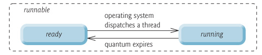
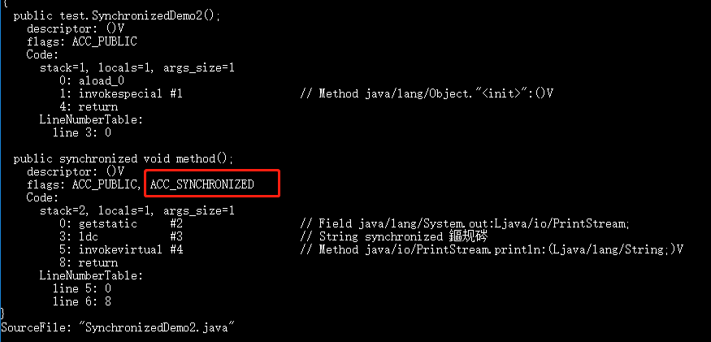

# 原理

## 系统线程区别

JDK 1.2 之前，Java 线程是基于绿色线程（Green Threads）实现的，这是一种用户级线程（用户线程），也就是说 JVM 自己模拟了多线程的运行，而不依赖于操作系统。

由于绿色线程和原生线程比起来在使用时有一些限制（比如绿色线程不能直接使用操作系统提供的功能如异步 I/O、只能在一个内核线程上运行无法利用多核），在 JDK 1.2 及以后，Java 线程改为基于原生线程（Native Threads）实现，也就是说 JVM 直接使用操作系统原生的内核级线程（内核线程）来实现 Java 线程，由操作系统内核进行线程的调度和管理。

+ 用户线程：由用户空间程序管理和调度的线程，运行在用户空间（专门给应用程序使用）。
+ 内核线程：由操作系统内核管理和调度的线程，运行在内核空间（只有内核程序可以访问）。

用户线程和内核线程的区别和特点：用户线程创建和切换成本低，但不可以利用多核。内核态线程，创建和切换成本高，可以利用多核。**现在的 Java 线程的本质其实就是操作系统的线程**。

线程模型是用户线程和内核线程之间的关联方式，常见的线程模型有这三种：

1. 一对一（一个用户线程对应一个内核线程）
2. 多对一（多个用户线程映射到一个内核线程）
3. 多对多（多个用户线程映射到多个内核线程）


在 Windows 和 Linux 等主流操作系统中，Java 线程采用的是一对一的线程模型，也就是一个 Java 线程对应一个系统内核线程。Solaris 系统是一个特例（Solaris 系统本身就支持多对多的线程模型），HotSpot VM 在 Solaris 上支持多对多和一对一。

> 具体可以参考 R 大的回答: [JVM 中的线程模型是用户级的么？open in new window](https://www.zhihu.com/question/23096638/answer/29617153)。

虚拟线程在 JDK 21 顺利转正，关于虚拟线程、平台线程（也就是我们上面提到的 Java 线程）和内核线程三者的关系可以阅读我写的这篇文章：[Java 20 新特性概览](https://javaguide.cn/java/new-features/java20.html)。

## 进程线程关系


从上图可以看出：一个进程中可以有多个线程，多个线程共享进程的**堆**和**方法区 (JDK1.8 之后的元空间)**资源，但是每个线程有自己的**程序计数器**、**虚拟机栈** 和 **本地方法栈**。

堆和方法区是所有线程共享的资源，其中堆是进程中最大的一块内存，主要用于存放新创建的对象 (几乎所有对象都在这里分配内存)，方法区主要用于存放已被加载的类信息、常量、静态变量、即时编译器编译后的代码等数据。

**总结：** **线程是进程划分成的更小的运行单位。线程和进程最大的不同在于基本上各进程是独立的，而各线程则不一定，因为同一进程中的线程极有可能会相互影响。线程执行开销小，但不利于资源的管理和保护；而进程正相反。**

> 程序计数器私有
>
> 程序计数器主要有下面两个作用：
>
> 1. 字节码解释器通过改变程序计数器来依次读取指令，从而实现代码的流程控制，如：顺序执行、选择、循环、异常处理。
> 2. 在多线程的情况下，程序计数器用于记录当前线程执行的位置，从而当线程被切换回来的时候能够知道该线程上次运行到哪儿了。
>
> 需要注意的是，如果执行的是 native 方法，那么程序计数器记录的是 undefined 地址，只有执行的是 Java 代码时程序计数器记录的才是下一条指令的地址。
>
> 所以，程序计数器私有主要是为了**线程切换后能恢复到正确的执行位置**。

> 虚拟机栈和本地方法栈为私有
>
> + **虚拟机栈：** 每个 Java 方法在执行之前会创建一个栈帧用于存储局部变量表、操作数栈、常量池引用等信息。从方法调用直至执行完成的过程，就对应着一个栈帧在 Java 虚拟机栈中入栈和出栈的过程。
> + **本地方法栈：** 和虚拟机栈所发挥的作用非常相似，区别是：**虚拟机栈为虚拟机执行 Java 方法 （也就是字节码）服务，而本地方法栈则为虚拟机使用到的 Native 方法服务。** 在 HotSpot 虚拟机中和 Java 虚拟机栈合二为一。
>
> 所以，为了**保证线程中的局部变量不被别的线程访问到**，虚拟机栈和本地方法栈是线程私有的。

# 线程

## 创建方式

一般来说，创建线程有很多种方式，例如继承 `Thread` 类、实现 `Runnable` 接口、实现 `Callable` 接口、使用线程池、使用 `CompletableFuture` 类等等。

### 继承Thread类

这是最普通的方式，继承 `Thread` 类，重写 `run` 方法。

```java
public class ExtendsThread extends Thread {
    @Override
    public void run() {
        System.out.println("1......");
    }

    public static void main(String[] args) {
        new ExtendsThread().start();
    }
}
```

### 实现 Runnable 接口

这也是一种常见的方式，实现 `Runnable` 接口并重写 `run` 方法。

```java
public class ImplementsRunnable implements Runnable {
    @Override
    public void run() {
        System.out.println("2......");
    }

    public static void main(String[] args) {
        ImplementsRunnable runnable = new ImplementsRunnable();
        new Thread(runnable).start();
    }
}
```

### 1实现Callable接口

和上一种方式类似，只不过这种方式可以拿到线程执行完的返回值。

```java
public class ImplementsCallable implements Callable<String> {
    @Override
    public String call() throws Exception {
        System.out.println("3......");
        return "zhuZi";
    }

    public static void main(String[] args) throws Exception {
        ImplementsCallable callable = new ImplementsCallable();
        FutureTask<String> futureTask = new FutureTask<>(callable);
        new Thread(futureTask).start();
        System.out.println(futureTask.get());
    }
}
```

### 使用 ExecutorService 线程池

这种属于进阶方式，可以通过 `Executors` 创建线程池，也可以自定义线程池。

```java
public class UseExecutorService {
    public static void main(String[] args) {
        ExecutorService poolA = Executors.newFixedThreadPool(2);
        poolA.execute(()->{
            System.out.println("4A......");
        });
        poolA.shutdown();

        // 又或者自定义线程池
        ThreadPoolExecutor poolB = new ThreadPoolExecutor(2, 3, 0,
                TimeUnit.SECONDS, new LinkedBlockingQueue<Runnable>(3),
                Executors.defaultThreadFactory(), new ThreadPoolExecutor.AbortPolicy());
        poolB.submit(()->{
            System.out.println("4B......");
        });
        poolB.shutdown();
    }
}
```

### 使用 CompletableFuture 类

`CompletableFuture` 是 `JDK1.8` 引入的新类，可以用来执行异步任务。

```java
public class UseCompletableFuture {
    public static void main(String[] args) throws InterruptedException {
        CompletableFuture<String> cf = CompletableFuture.supplyAsync(() -> {
            System.out.println("5......");
            return "zhuZi";
        });
        // 需要阻塞，否则看不到结果
        Thread.sleep(1000);
    }
}
```

### 基于 ThreadGroup 线程组

`Java` 线程可以分组，可以创建多条线程作为一个组。

```java
public class UseThreadGroup {
    public static void main(String[] args) {
        ThreadGroup group = new ThreadGroup("groupName");

        new Thread(group, ()->{
            System.out.println("6-T1......");
        }, "T1").start();

        new Thread(group, ()->{
            System.out.println("6-T2......");
        }, "T2").start();

        new Thread(group, ()->{
            System.out.println("6-T3......");
        }, "T3").start();
    }
}
```

### 使用 FutureTask 类

这个和之前实现 `Callable` 接口的方式差不多，只不过用匿名形式创建 `Callable` 。

```java
public class UseFutureTask {
    public static void main(String[] args) {
        FutureTask<String> futureTask = new FutureTask<>(() -> {
            System.out.println("7......");
            return "zhuZi";
        });
        new Thread(futureTask).start();
    }
}
```

### 使用匿名内部类或 Lambda

这种方式属于硬扯，就是直接 `new` 前面所说的 `Runnable` 接口，或者通过 `Lambda` 表达式书写，如下。

```java
public class UseAnonymousClass {
    public static void main(String[] args) {
        new Thread(new Runnable() {
            @Override
            public void run() {
                System.out.println("8A......");
            }
        }).start();

        new Thread(() -> 
                System.out.println("8B......")
        ).start();
    }
}
```

### 使用 Timer 定时器类

在 `JDK1.3` 时，曾引入了一个`Timer`类，用来执行定时任务。

```java
public class UseTimer {
    public static void main(String[] args) {
        Timer timer = new Timer();

        timer.schedule(new TimerTask() {
            @Override
            public void run() {
                System.out.println("9......");
            }
        }, 0, 1000);
    }
}
```

里面需要传入两个数字，第一个代表启动后多久开始执行，第二个代表每间隔多久执行一次，单位是`ms`毫秒。

### 使用 ForkJoin 或 Stream 并行流

`ForkJoin` 是 `JDK1.7` 引入的新线程池，基于分治思想实现。而后续 `JDK1.8` 的 `parallelStream` 并行流，默认就基于 `ForkJoin` 实现。

```java
public class UseForkJoinPool {
    public static void main(String[] args) {
        ForkJoinPool forkJoinPool = new ForkJoinPool();
        forkJoinPool.execute(()->{
            System.out.println("10A......");
        });

        List<String> list = Arrays.asList("10B......");
        list.parallelStream().forEach(System.out::println);
    }
}
```

不过，这些方式其实并没有真正创建出线程。准确点来说，这些都属于是在 Java 代码中使用多线程的方法。

严格来说，Java 就只有一种方式可以创建线程，那就是通过 `new Thread().start()` 创建。不管是哪种方式，最终还是依赖于 `new Thread().start()` 。

## 生命周期

5种状态的说法其实是早期进程的状态。

早期进程的状态：


这里所谓“**进程**状态”指早期的那种“**单线程**进程”的状态。


Java 线程在运行的生命周期中的指定时刻只可能处于下面 6 种不同状态的其中一个状态：

+ NEW: 初始状态，线程被创建出来但没有被调用 `start()` 。
+ RUNNABLE: 运行状态，线程被调用了 `start()`等待运行的状态。
+ BLOCKED：阻塞状态，需要等待锁释放。
+ WAITING：等待状态，表示该线程需要等待其他线程做出一些特定动作（通知或中断）。
+ TIME_WAITING：超时等待状态，可以在指定的时间后自行返回而不是像 WAITING 那样一直等待。
+ TERMINATED：终止状态，表示该线程已经运行完毕。

线程在生命周期中并不是固定处于某一个状态而是随着代码的执行在不同状态之间切换。


由上图可以看出：线程创建之后它将处于 **NEW（新建）** 状态，调用 `start()` 方法后开始运行，线程这时候处于 **READY（可运行）** 状态。可运行状态的线程获得了 CPU 时间片（timeslice）后就处于 **RUNNING（运行）** 状态。

> 在操作系统层面，线程有 READY 和 RUNNING 状态；而在 JVM 层面，只能看到 RUNNABLE 状态，所以 Java 系统一般将这两个状态统称为 **RUNNABLE（运行中）** 状态 。
>
> **为什么 JVM 没有区分这两种状态呢？** 
>
> 现在的时分（time-sharing）多任务（multi-task）操作系统架构通常都是用所谓的“时间分片（time quantum or time slice）”方式进行抢占式（preemptive）轮转调度（round-robin 式）。这个时间分片通常是很小的，一个线程一次最多只能在 CPU 上运行比如 10-20ms 的时间（此时处于 running 状态），也即大概只有 0.01 秒这一量级，时间片用后就要被切换下来放入调度队列的末尾等待再次调度。（也即回到 ready 状态）。线程切换的如此之快，区分这两种状态就没什么意义了。

RUNNABLE-VS-RUNNING

+ 当线程执行 `wait()`方法之后，线程进入 **WAITING（等待）** 状态。进入等待状态的线程需要依靠其他线程的通知才能够返回到运行状态。
+ **TIMED_WAITING(超时等待)** 状态相当于在等待状态的基础上增加了超时限制，比如通过 `sleep（long millis）`方法或 `wait（long millis）`方法可以将线程置于 TIMED_WAITING 状态。当超时时间结束后，线程将会返回到 RUNNABLE 状态。
+ 当线程进入 `synchronized` 方法/块或者调用 `wait` 后（被 `notify`）重新进入 `synchronized` 方法/块，但是锁被其它线程占有，这个时候线程就会进入 **BLOCKED（阻塞）** 状态。
+ 线程在执行完了 `run()`方法之后将会进入到 **TERMINATED（终止）** 状态。

> 相关阅读：[线程的几种状态你真的了解么？open in new window](https://mp.weixin.qq.com/s/R5MrTsWvk9McFSQ7bS0W2w) 。

## 上下文切换

线程在执行过程中会有自己的运行条件和状态（也称上下文），比如上文所说到过的程序计数器，栈信息等。当出现如下情况的时候，线程会从占用 CPU 状态中退出。

+ 主动让出 CPU，比如调用了 `sleep()`, `wait()` 等。
+ 时间片用完，因为操作系统要防止一个线程或者进程长时间占用 CPU 导致其他线程或者进程饿死。
+ 调用了阻塞类型的系统中断，比如请求 IO，线程被阻塞。
+ 被终止或结束运行

这其中前三种都会发生线程切换，线程切换意味着需要保存当前线程的上下文，留待线程下次占用 CPU 的时候恢复现场。并加载下一个将要占用 CPU 的线程上下文。这就是所谓的 **上下文切换**。

上下文切换是现代操作系统的基本功能，因其每次需要保存信息恢复信息，这将会占用 CPU，内存等系统资源进行处理，也就意味着效率会有一定损耗，如果频繁切换就会造成整体效率低下。

## 线程暂停

> sleep() 方法和 wait() 方法对比
>
> **共同点**：两者都可以暂停线程的执行。
>
> **区别**：
>
> + **`sleep()` 方法没有释放锁，而 `wait()` 方法释放了锁** 。
> + `wait()` 通常被用于线程间交互/通信，`sleep()`通常被用于暂停执行。
> + `wait()` 方法被调用后，线程不会自动苏醒，需要别的线程调用同一个对象上的 `notify()`或者 `notifyAll()` 方法。`sleep()`方法执行完成后，线程会自动苏醒，或者也可以使用 `wait(long timeout)` 超时后线程会自动苏醒。
> + `sleep()` 是 `Thread` 类的静态本地方法，`wait()` 则是 `Object` 类的本地方法。

> 为什么 wait() 方法不定义在 Thread 中？
>
> `wait()` 是让获得对象锁的线程实现等待，会自动释放当前线程占有的对象锁。每个对象（`Object`）都拥有对象锁，既然要释放当前线程占有的对象锁并让其进入 WAITING 状态，自然是要操作对应的对象（`Object`）而非当前的线程（`Thread`）。
>
> 类似的问题：**为什么 `sleep()` 方法定义在 `Thread` 中？**
>
> 因为 `sleep()` 是让当前线程暂停执行，不涉及到对象类，也不需要获得对象锁。

> 可以直接调用 Thread 类的 run 方法吗？
>
> new 一个 `Thread`，线程进入了新建状态。调用 `start()`方法，会启动一个线程并使线程进入了就绪状态，当分配到时间片后就可以开始运行了。 `start()` 会执行线程的相应准备工作，然后自动执行 `run()` 方法的内容，这是真正的多线程工作。 但是，直接执行 `run()` 方法，会把 `run()` 方法当成一个 main 线程下的普通方法去执行，并不会在某个线程中执行它，所以这并不是多线程工作。
>
> **总结：调用 `start()` 方法方可启动线程并使线程进入就绪状态，直接执行 `run()` 方法的话不会以多线程的方式执行。**

# 内存模型

## CPU 缓存模型

类比我们开发网站后台系统使用的缓存（比如 Redis）是为了解决程序处理速度和访问常规关系型数据库速度不对等的问题。 **CPU 缓存则是为了解决 CPU 处理速度和内存处理速度不对等的问题。**

我们甚至可以把 **内存看作外存的高速缓存**，程序运行的时候我们把外存的数据复制到内存，由于内存的处理速度远远高于外存，这样提高了处理速度。

总结：**CPU Cache 缓存的是内存数据用于解决 CPU 处理速度和内存不匹配的问题，内存缓存的是硬盘数据用于解决硬盘访问速度过慢的问题。**


现代的 CPU Cache 通常分为三层，分别叫 L1,L2,L3 Cache。有些 CPU 可能还有 L4 Cache，这里不做讨论，并不常见

**CPU Cache 的工作方式：** 先复制一份数据到 CPU Cache 中，当 CPU 需要用到的时候就可以直接从 CPU Cache 中读取数据，当运算完成后，再将运算得到的数据写回 Main Memory 中。但是，这样存在 **内存缓存不一致性的问题** ！比如我执行一个 i++ 操作的话，如果两个线程同时执行的话，假设两个线程从 CPU Cache 中读取的 i=1，两个线程做了 i++ 运算完之后再写回 Main Memory 之后 i=2，而正确结果应该是 i=3。

**CPU 为了解决内存缓存不一致性问题可以通过制定缓存一致协议（比如 [MESI 协议open in new window](https://zh.wikipedia.org/wiki/MESI协议)）或者其他手段来解决。** 这个缓存一致性协议指的是在 CPU 高速缓存与主内存交互的时候需要遵守的原则和规范。不同的 CPU 中，使用的缓存一致性协议通常也会有所不同。


我们的程序运行在操作系统之上，操作系统屏蔽了底层硬件的操作细节，将各种硬件资源虚拟化。于是，操作系统也就同样需要解决内存缓存不一致性问题。

操作系统通过 **内存模型（Memory Model）** 定义一系列规范来解决这个问题。无论是 Windows 系统，还是 Linux 系统，它们都有特定的内存模型。

## 指令重排序

为了提升执行速度/性能，计算机在执行程序代码的时候，会对指令进行重排序。

**什么是指令重排序？** 简单来说就是系统在执行代码的时候并不一定是按照你写的代码的顺序依次执行。

常见的指令重排序有下面 2 种情况：

+ **编译器优化重排**：编译器（包括 JVM、JIT 编译器等）在不改变单线程程序语义的前提下，重新安排语句的执行顺序。
+ **指令并行重排**：现代处理器采用了指令级并行技术(Instruction-Level Parallelism，ILP)来将多条指令重叠执行。如果不存在数据依赖性，处理器可以改变语句对应机器指令的执行顺序。

另外，内存系统也会有“重排序”，但又不是真正意义上的重排序。在 JMM 里表现为主存和本地内存的内容可能不一致，进而导致程序在多线程下执行可能出现问题。

Java 源代码会经历 **编译器优化重排 —> 指令并行重排 —> 内存系统重排** 的过程，最终才变成操作系统可执行的指令序列。

**指令重排序可以保证串行语义一致，但是没有义务保证多线程间的语义也一致** ，所以在多线程下，指令重排序可能会导致一些问题。

编译器和处理器的指令重排序的处理方式不一样。对于编译器，通过禁止特定类型的编译器重排序的方式来禁止重排序。对于处理器，通过插入内存屏障（Memory Barrier，或有时叫做内存栅栏，Memory Fence）的方式来禁止特定类型的处理器重排序。指令并行重排和内存系统重排都属于是处理器级别的指令重排序。

> 内存屏障（Memory Barrier，或有时叫做内存栅栏，Memory Fence）是一种 CPU 指令，用来禁止处理器指令发生重排序（像屏障一样），从而保障指令执行的有序性。另外，为了达到屏障的效果，它也会使处理器写入、读取值之前，将主内存的值写入高速缓存，清空无效队列，从而保障变量的可见性。

### 禁止重排序

**在 Java 中，`volatile` 关键字除了可以保证变量的可见性，还有一个重要的作用就是防止 JVM 的指令重排序。** 如果我们将变量声明为 **`volatile`** ，在对这个变量进行读写操作的时候，会通过插入特定的 **内存屏障** 的方式来禁止指令重排序。

在 Java 中，`Unsafe` 类提供了三个开箱即用的内存屏障相关的方法，屏蔽了操作系统底层的差异：

```java
public native void loadFence();
public native void storeFence();
public native void fullFence();
```

理论上来说，你通过这个三个方法也可以实现和`volatile`禁止重排序一样的效果，只是会麻烦一些。

下面我以一个常见的面试题为例讲解一下 `volatile` 关键字禁止指令重排序的效果。

面试中面试官经常会说：“单例模式了解吗？来给我手写一下！给我解释一下双重检验锁方式实现单例模式的原理呗！”

**双重校验锁实现对象单例（线程安全）**：

```java
public class Singleton {

    private volatile static Singleton uniqueInstance;

    private Singleton() {
    }

    public  static Singleton getUniqueInstance() {
       //先判断对象是否已经实例过，没有实例化过才进入加锁代码
        if (uniqueInstance == null) {
            //类对象加锁
            synchronized (Singleton.class) {
                if (uniqueInstance == null) {
                    uniqueInstance = new Singleton();
                }
            }
        }
        return uniqueInstance;
    }
}
```

`uniqueInstance` 采用 `volatile` 关键字修饰也是很有必要的， `uniqueInstance = new Singleton();` 这段代码其实是分为三步执行：

1. 为 `uniqueInstance` 分配内存空间
2. 初始化 `uniqueInstance`
3. 将 `uniqueInstance` 指向分配的内存地址

但是由于 JVM 具有指令重排的特性，执行顺序有可能变成 1->3->2。指令重排在单线程环境下不会出现问题，但是在多线程环境下会导致一个线程获得还没有初始化的实例。例如，线程 T1 执行了 1 和 3，此时 T2 调用 `getUniqueInstance`() 后发现 `uniqueInstance` 不为空，因此返回 `uniqueInstance`，但此时 `uniqueInstance` 还未被初始化。

## JMM

Java 是最早尝试提供内存模型的编程语言。由于早期内存模型存在一些缺陷（比如非常容易削弱编译器的优化能力），从 Java5 开始，Java 开始使用新的内存模型。

一般来说，编程语言也可以直接复用操作系统层面的内存模型。不过，不同的操作系统内存模型不同。如果直接复用操作系统层面的内存模型，就可能会导致同样一套代码换了一个操作系统就无法执行了。Java 语言是跨平台的，它需要自己提供一套内存模型以屏蔽系统差异。

这只是 JMM 存在的其中一个原因。实际上，对于 Java 来说，你可以把 JMM 看作是 Java 定义的并发编程相关的一组规范，除了抽象了线程和主内存之间的关系之外，其还规定了从 Java 源代码到 CPU 可执行指令的这个转化过程要遵守哪些和并发相关的原则和规范，其主要目的是为了简化多线程编程，增强程序可移植性的。

**为什么要遵守这些并发相关的原则和规范呢？** 这是因为并发编程下，像 CPU 多级缓存和指令重排这类设计可能会导致程序运行出现一些问题。就比如说我们上面提到的指令重排序就可能会让多线程程序的执行出现问题，为此，JMM 抽象了 happens-before 原则（后文会详细介绍到）来解决这个指令重排序问题。

JMM 说白了就是定义了一些规范来解决这些问题，开发者可以利用这些规范更方便地开发多线程程序。对于 Java 开发者说，你不需要了解底层原理，直接使用并发相关的一些关键字和类（比如 `volatile`、`synchronized`、各种 `Lock`）即可开发出并发安全的程序。

### 抽象线程及内存关系

**Java 内存模型（JMM）** 抽象了线程和主内存之间的关系，就比如说线程之间的共享变量必须存储在主内存中。

在 JDK1.2 之前，Java 的内存模型实现总是从 **主存** （即共享内存）读取变量，是不需要进行特别的注意的。而在当前的 Java 内存模型下，线程可以把变量保存 **本地内存** （比如机器的寄存器）中，而不是直接在主存中进行读写。这就可能造成一个线程在主存中修改了一个变量的值，而另外一个线程还继续使用它在寄存器中的变量值的拷贝，造成数据的不一致。

这和我们上面讲到的 CPU 缓存模型非常相似。

**什么是主内存？什么是本地内存？**

+ **主内存**：所有线程创建的实例对象都存放在主内存中，不管该实例对象是成员变量，还是局部变量，类信息、常量、静态变量都是放在主内存中。为了获取更好的运行速度，虚拟机及硬件系统可能会让工作内存优先存储于寄存器和高速缓存中。
+ **本地内存**：每个线程都有一个私有的本地内存，本地内存存储了该线程以读 / 写共享变量的副本。每个线程只能操作自己本地内存中的变量，无法直接访问其他线程的本地内存。如果线程间需要通信，必须通过主内存来进行。本地内存是 JMM 抽象出来的一个概念，并不真实存在，它涵盖了缓存、写缓冲区、寄存器以及其他的硬件和编译器优化。


从上图来看，线程 1 与线程 2 之间如果要进行通信的话，必须要经历下面 2 个步骤：

1. 线程 1 把本地内存中修改过的共享变量副本的值同步到主内存中去。
2. 线程 2 到主存中读取对应的共享变量的值。

也就是说，JMM 为共享变量提供了可见性的保障。

不过，多线程下，对主内存中的一个共享变量进行操作有可能诱发线程安全问题。举个例子：

1. 线程 1 和线程 2 分别对同一个共享变量进行操作，一个执行修改，一个执行读取。
2. 线程 2 读取到的是线程 1 修改之前的值还是修改后的值并不确定，都有可能，因为线程 1 和线程 2 都是先将共享变量从主内存拷贝到对应线程的工作内存中。

关于主内存与工作内存直接的具体交互协议，即一个变量如何从主内存拷贝到工作内存，如何从工作内存同步到主内存之间的实现细节，Java 内存模型定义来以下八种同步操作（了解即可，无需死记硬背）：

+ **锁定（lock）**: 作用于主内存中的变量，将他标记为一个线程独享变量。
+ **解锁（unlock）**: 作用于主内存中的变量，解除变量的锁定状态，被解除锁定状态的变量才能被其他线程锁定。
+ **read（读取）**：作用于主内存的变量，它把一个变量的值从主内存传输到线程的工作内存中，以便随后的 load 动作使用。
+ **load(载入)**：把 read 操作从主内存中得到的变量值放入工作内存的变量的副本中。
+ **use(使用)**：把工作内存中的一个变量的值传给执行引擎，每当虚拟机遇到一个使用到变量的指令时都会使用该指令。
+ **assign（赋值）**：作用于工作内存的变量，它把一个从执行引擎接收到的值赋给工作内存的变量，每当虚拟机遇到一个给变量赋值的字节码指令时执行这个操作。
+ **store（存储）**：作用于工作内存的变量，它把工作内存中一个变量的值传送到主内存中，以便随后的 write 操作使用。
+ **write（写入）**：作用于主内存的变量，它把 store 操作从工作内存中得到的变量的值放入主内存的变量中。

除了这 8 种同步操作之外，还规定了下面这些同步规则来保证这些同步操作的正确执行（了解即可，无需死记硬背）：

+ 不允许一个线程无原因地（没有发生过任何 assign 操作）把数据从线程的工作内存同步回主内存中。
+ 一个新的变量只能在主内存中 “诞生”，不允许在工作内存中直接使用一个未被初始化（load 或 assign）的变量，换句话说就是对一个变量实施 use 和 store 操作之前，必须先执行过了 assign 和 load 操作。
+ 一个变量在同一个时刻只允许一条线程对其进行 lock 操作，但 lock 操作可以被同一条线程重复执行多次，多次执行 lock 后，只有执行相同次数的 unlock 操作，变量才会被解锁。
+ 如果对一个变量执行 lock 操作，将会清空工作内存中此变量的值，在执行引擎使用这个变量前，需要重新执行 load 或 assign 操作初始化变量的值。
+ 如果一个变量事先没有被 lock 操作锁定，则不允许对它执行 unlock 操作，也不允许去 unlock 一个被其他线程锁定住的变量。

## happen-before

Leslie Lamport 提出了[逻辑时钟open in new window](https://writings.sh/post/logical-clocks)的概念，这也成了第一个逻辑时钟算法 。在分布式环境中，通过一系列规则来定义逻辑时钟的变化，从而能通过逻辑时钟来对分布式系统中的事件的先后顺序进行判断。**逻辑时钟并不度量时间本身，仅区分事件发生的前后顺序，其本质就是定义了一种 happens-before 关系。**

JSR 133 引入了 happens-before 这个概念来描述两个操作之间的内存可见性。

**为什么需要 happens-before 原则？** happens-before 原则的诞生是为了程序员和编译器、处理器之间的平衡。程序员追求的是易于理解和编程的强内存模型，遵守既定规则编码即可。编译器和处理器追求的是较少约束的弱内存模型，让它们尽己所能地去优化性能，让性能最大化。

happens-before 原则的设计思想其实非常简单：

+ 为了对编译器和处理器的约束尽可能少，只要不改变程序的执行结果（单线程程序和正确执行的多线程程序），编译器和处理器怎么进行重排序优化都行。
+ 对于会改变程序执行结果的重排序，JMM 要求编译器和处理器必须禁止这种重排序。

下面这张是 《Java 并发编程的艺术》这本书中的一张 JMM 设计思想的示意图，非常清晰。


了解了 happens-before 原则的设计思想，我们再来看看 JSR-133 对 happens-before 原则的定义：

+ 如果一个操作 happens-before 另一个操作，那么第一个操作的执行结果将对第二个操作可见，并且第一个操作的执行顺序排在第二个操作之前。
+ 两个操作之间存在 happens-before 关系，并不意味着 Java 平台的具体实现必须要按照 happens-before 关系指定的顺序来执行。如果重排序之后的执行结果，与按 happens-before 关系来执行的结果一致，那么 JMM 也允许这样的重排序。

### 常见规则

1. **程序顺序规则**：一个线程内，按照代码顺序，书写在前面的操作 happens-before 于书写在后面的操作；
2. **解锁规则**：解锁 happens-before 于加锁；
3. **volatile 变量规则**：对一个 volatile 变量的写操作 happens-before 于后面对这个 volatile 变量的读操作。说白了就是对 volatile 变量的写操作的结果对于发生于其后的任何操作都是可见的。
4. **传递规则**：如果 A happens-before B，且 B happens-before C，那么 A happens-before C；
5. **线程启动规则**：Thread 对象的 `start()`方法 happens-before 于此线程的每一个动作。

如果两个操作不满足上述任意一个 happens-before 规则，那么这两个操作就没有顺序的保障，JVM 可以对这两个操作进行重排序。

## 并发编程

### 特性

#### 原子性

一次操作或者多次操作，要么所有的操作全部都得到执行并且不会受到任何因素的干扰而中断，要么都不执行。

在 Java 中，可以借助`synchronized`、各种 `Lock` 以及各种原子类实现原子性。

`synchronized` 和各种 `Lock` 可以保证任一时刻只有一个线程访问该代码块，因此可以保障原子性。各种原子类是利用 CAS (compare and swap) 操作（可能也会用到 `volatile`或者`final`关键字）来保证原子操作。

#### 可见性

当一个线程对共享变量进行了修改，那么另外的线程都是立即可以看到修改后的最新值。

在 Java 中，可以借助`synchronized`、`volatile` 以及各种 `Lock` 实现可见性。

如果我们将变量声明为 `volatile` ，这就指示 JVM，这个变量是共享且不稳定的，每次使用它都到主存中进行读取。

#### 有序性

由于指令重排序问题，代码的执行顺序未必就是编写代码时候的顺序。

我们上面讲重排序的时候也提到过：

> **指令重排序可以保证串行语义一致，但是没有义务保证多线程间的语义也一致** ，所以在多线程下，指令重排序可能会导致一些问题。

在 Java 中，`volatile` 关键字可以禁止指令进行重排序优化。

## valatile

在 Java 中，`volatile` 关键字可以保证变量的可见性，如果我们将变量声明为 **`volatile`** ，这就指示 JVM，这个变量是共享且不稳定的，每次使用它都到主存中进行读取。


`volatile` 关键字其实并非是 Java 语言特有的，在 C 语言里也有，它最原始的意义就是禁用 CPU 缓存。如果我们将一个变量使用 `volatile` 修饰，这就指示 编译器，这个变量是共享且不稳定的，每次使用它都到主存中进行读取。

`volatile` 关键字能保证数据的可见性，但不能保证数据的原子性。`synchronized` 关键字两者都能保证。

**`volatile` 关键字能保证变量的可见性，但不能保证对变量的操作是原子性的。**

## synchronized

`synchronized` 是 Java 中的一个关键字，翻译成中文是同步的意思，主要解决的是多个线程之间访问资源的同步性，可以保证被它修饰的方法或者代码块在任意时刻只能有一个线程执行。

在 Java 早期版本中，`synchronized` 属于 **重量级锁**，效率低下。这是因为监视器锁（monitor）是依赖于底层的操作系统的 `Mutex Lock` 来实现的，Java 的线程是映射到操作系统的原生线程之上的。如果要挂起或者唤醒一个线程，都需要操作系统帮忙完成，而操作系统实现线程之间的切换时需要从用户态转换到内核态，这个状态之间的转换需要相对比较长的时间，时间成本相对较高。

不过，在 Java 6 之后， `synchronized` 引入了大量的优化如自旋锁、适应性自旋锁、锁消除、锁粗化、偏向锁、轻量级锁等技术来减少锁操作的开销，这些优化让 `synchronized` 锁的效率提升了很多。因此， `synchronized` 还是可以在实际项目中使用的，像 JDK 源码、很多开源框架都大量使用了 `synchronized` 。

关于偏向锁多补充一点：由于偏向锁增加了 JVM 的复杂性，同时也并没有为所有应用都带来性能提升。因此，在 JDK15 中，偏向锁被默认关闭（仍然可以使用 `-XX:+UseBiasedLocking` 启用偏向锁），在 JDK18 中，偏向锁已经被彻底废弃（无法通过命令行打开）。

### 使用方法

**1. 修饰实例方法** （锁当前对象实例）

给当前对象实例加锁，进入同步代码前要获得 **当前对象实例的锁** 。

```java
synchronized void method() {
    //业务代码
}
```

**2、修饰静态方法** （锁当前类）

给当前类加锁，会作用于类的所有对象实例 ，进入同步代码前要获得 **当前 class 的锁**。

这是因为静态成员不属于任何一个实例对象，归整个类所有，不依赖于类的特定实例，被类的所有实例共享。

```java
synchronized static void method() {
    //业务代码
}
```

静态 `synchronized` 方法和非静态 `synchronized` 方法之间的调用互斥么？不互斥！如果一个线程 A 调用一个实例对象的非静态 `synchronized` 方法，而线程 B 需要调用这个实例对象所属类的静态 `synchronized` 方法，是允许的，不会发生互斥现象，因为访问静态 `synchronized` 方法占用的锁是当前类的锁，而访问非静态 `synchronized` 方法占用的锁是当前实例对象锁。

**3、修饰代码块** （锁指定对象/类）

对括号里指定的对象/类加锁：

+ `synchronized(object)` 表示进入同步代码库前要获得 **给定对象的锁**。
+ `synchronized(类.class)` 表示进入同步代码前要获得 **给定 Class 的锁**

```java
synchronized(this) {
    //业务代码
}
```

**总结：**

+ `synchronized` 关键字加到 `static` 静态方法和 `synchronized(class)` 代码块上都是是给 Class 类上锁；
+ `synchronized` 关键字加到实例方法上是给对象实例上锁；
+ 尽量不要使用 `synchronized(String a)` 因为 JVM 中，字符串常量池具有缓存功能。

### 底层原理

**`synchronized` 同步语句块的实现使用的是 `monitorenter` 和 `monitorexit` 指令，其中 `monitorenter` 指令指向同步代码块的开始位置，`monitorexit` 指令则指明同步代码块的结束位置。**

上面的字节码中包含一个 `monitorenter` 指令以及两个 `monitorexit` 指令，这是为了保证锁在同步代码块代码正常执行以及出现异常的这两种情况下都能被正确释放。

当执行 `monitorenter` 指令时，线程试图获取锁也就是获取 **对象监视器 `monitor`** 的持有权。

> 在 Java 虚拟机(HotSpot)中，Monitor 是基于 C++实现的，由[ObjectMonitoropen in new window](https://github.com/openjdk-mirror/jdk7u-hotspot/blob/50bdefc3afe944ca74c3093e7448d6b889cd20d1/src/share/vm/runtime/objectMonitor.cpp)实现的。每个对象中都内置了一个 `ObjectMonitor`对象。
>
> 另外，`wait/notify`等方法也依赖于`monitor`对象，这就是为什么只有在同步的块或者方法中才能调用`wait/notify`等方法，否则会抛出`java.lang.IllegalMonitorStateException`的异常的原因。

在执行`monitorenter`时，会尝试获取对象的锁，如果锁的计数器为 0 则表示锁可以被获取，获取后将锁计数器设为 1 也就是加 1。


对象锁的的拥有者线程才可以执行 `monitorexit` 指令来释放锁。在执行 `monitorexit` 指令后，将锁计数器设为 0，表明锁被释放，其他线程可以尝试获取锁。


如果获取对象锁失败，那当前线程就要阻塞等待，直到锁被另外一个线程释放为止。

**synchronized 修饰方法的的情况**

```java
public class SynchronizedDemo2 {
    public synchronized void method() {
        System.out.println("synchronized 方法");
    }
}
```



`synchronized` 修饰的方法并没有 `monitorenter` 指令和 `monitorexit` 指令，取得代之的确实是 `ACC_SYNCHRONIZED` 标识，该标识指明了该方法是一个同步方法。JVM 通过该 `ACC_SYNCHRONIZED` 访问标志来辨别一个方法是否声明为同步方法，从而执行相应的同步调用。

如果是实例方法，JVM 会尝试获取实例对象的锁。如果是静态方法，JVM 会尝试获取当前 class 的锁。

**总结**

`synchronized` 同步语句块的实现使用的是 `monitorenter` 和 `monitorexit` 指令，其中 `monitorenter` 指令指向同步代码块的开始位置，`monitorexit` 指令则指明同步代码块的结束位置。

`synchronized` 修饰的方法并没有 `monitorenter` 指令和 `monitorexit` 指令，取得代之的确实是 `ACC_SYNCHRONIZED` 标识，该标识指明了该方法是一个同步方法。

**不过两者的本质都是对对象监视器 monitor 的获取。**

### 常见问题

**构造方法不能使用 synchronized 关键字修饰。**

构造方法本身就属于线程安全的，不存在同步的构造方法一说。

# 悲观锁

悲观锁总是假设最坏的情况，认为共享资源每次被访问的时候就会出现问题(比如共享数据被修改)，所以每次在获取资源操作的时候都会上锁，这样其他线程想拿到这个资源就会阻塞直到锁被上一个持有者释放。也就是说，**共享资源每次只给一个线程使用，其它线程阻塞，用完后再把资源转让给其它线程**。

像 Java 中`synchronized`和`ReentrantLock`等独占锁就是悲观锁思想的实现。

```java
public void performSynchronisedTask() {
    synchronized (this) {
        // 需要同步的操作
    }
}

private Lock lock = new ReentrantLock();
lock.lock();
try {
   // 需要同步的操作
} finally {
    lock.unlock();
}
```

高并发的场景下，激烈的锁竞争会造成线程阻塞，大量阻塞线程会导致系统的上下文切换，增加系统的性能开销。并且，悲观锁还可能会存在死锁问题，影响代码的正常运行。

# 乐观锁

乐观锁总是假设最好的情况，认为共享资源每次被访问的时候不会出现问题，线程可以不停地执行，无需加锁也无需等待，只是在提交修改的时候去验证对应的资源（也就是数据）是否被其它线程修改了（具体方法可以使用版本号机制或 CAS 算法）。

在 Java 中`java.util.concurrent.atomic`包下面的原子变量类（比如`AtomicInteger`、`LongAdder`）就是使用了乐观锁的一种实现方式 **CAS** 实现的。

```java
// LongAdder 在高并发场景下会比 AtomicInteger 和 AtomicLong 的性能更好
// 代价就是会消耗更多的内存空间（空间换时间）
LongAdder sum = new LongAdder();
sum.increment();
```

高并发的场景下，乐观锁相比悲观锁来说，不存在锁竞争造成线程阻塞，也不会有死锁的问题，在性能上往往会更胜一筹。但是，如果冲突频繁发生（写占比非常多的情况），会频繁失败和重试，这样同样会非常影响性能，导致 CPU 飙升。

不过，大量失败重试的问题也是可以解决的，像我们前面提到的 `LongAdder`以空间换时间的方式就解决了这个问题。

理论上来说：

+ 悲观锁通常多用于写比较多的情况（多写场景，竞争激烈），这样可以避免频繁失败和重试影响性能，悲观锁的开销是固定的。不过，如果乐观锁解决了频繁失败和重试这个问题的话（比如`LongAdder`），也是可以考虑使用乐观锁的，要视实际情况而定。
+ 乐观锁通常多用于写比较少的情况（多读场景，竞争较少），这样可以避免频繁加锁影响性能。不过，乐观锁主要针对的对象是单个共享变量（参考`java.util.concurrent.atomic`包下面的原子变量类）。

## 实现机制

### 版本号机制

一般是在数据表中加上一个数据版本号 `version` 字段，表示数据被修改的次数。当数据被修改时，`version` 值会加一。当线程 A 要更新数据值时，在读取数据的同时也会读取 `version` 值，在提交更新时，若刚才读取到的 version 值为当前数据库中的 `version` 值相等时才更新，否则重试更新操作，直到更新成功。

**举一个简单的例子**：假设数据库中帐户信息表中有一个 version 字段，当前值为 1 ；而当前帐户余额字段（ `balance` ）为 $100 。

1. 操作员 A 此时将其读出（ `version`=1 ），并从其帐户余额中扣除 $50（ $100-$50 ）。
2. 在操作员 A 操作的过程中，操作员 B 也读入此用户信息（ `version`=1 ），并从其帐户余额中扣除 $20 （ $100-$20 ）。
3. 操作员 A 完成了修改工作，将数据版本号（ `version`=1 ），连同帐户扣除后余额（ `balance`=$50 ），提交至数据库更新，此时由于提交数据版本等于数据库记录当前版本，数据被更新，数据库记录 `version` 更新为 2 。
4. 操作员 B 完成了操作，也将版本号（ `version`=1 ）试图向数据库提交数据（ `balance`=$80 ），但此时比对数据库记录版本时发现，操作员 B 提交的数据版本号为 1 ，数据库记录当前版本也为 2 ，不满足 “ 提交版本必须等于当前版本才能执行更新 “ 的乐观锁策略，因此，操作员 B 的提交被驳回。

这样就避免了操作员 B 用基于 `version`=1 的旧数据修改的结果覆盖操作员 A 的操作结果的可能。

### CAS 算法

CAS 的全称是 **Compare And Swap（比较与交换）** ，用于实现乐观锁，被广泛应用于各大框架中。CAS 的思想很简单，就是用一个预期值和要更新的变量值进行比较，两值相等才会进行更新。

CAS 是一个原子操作，底层依赖于一条 CPU 的原子指令。

> **原子操作** 即最小不可拆分的操作，也就是说操作一旦开始，就不能被打断，直到操作完成。

CAS 涉及到三个操作数：

+ **V**：要更新的变量值(Var)
+ **E**：预期值(Expected)
+ **N**：拟写入的新值(New)

当且仅当 V 的值等于 E 时，CAS 通过原子方式用新值 N 来更新 V 的值。如果不等，说明已经有其它线程更新了 V，则当前线程放弃更新。

**举一个简单的例子**：线程 A 要修改变量 i 的值为 6，i 原值为 1（V = 1，E=1，N=6，假设不存在 ABA 问题）。

1. i 与 1 进行比较，如果相等， 则说明没被其他线程修改，可以被设置为 6 。
2. i 与 1 进行比较，如果不相等，则说明被其他线程修改，当前线程放弃更新，CAS 操作失败。

当多个线程同时使用 CAS 操作一个变量时，只有一个会胜出，并成功更新，其余均会失败，但失败的线程并不会被挂起，仅是被告知失败，并且允许再次尝试，当然也允许失败的线程放弃操作。

Java 语言并没有直接实现 CAS，CAS 相关的实现是通过 C++ 内联汇编的形式实现的（JNI 调用）。因此， CAS 的具体实现和操作系统以及 CPU 都有关系。

`sun.misc`包下的`Unsafe`类提供了`compareAndSwapObject`、`compareAndSwapInt`、`compareAndSwapLong`方法来实现的对`Object`、`int`、`long`类型的 CAS 操作

```java
/**
  *  CAS
  * @param o         包含要修改field的对象
  * @param offset    对象中某field的偏移量
  * @param expected  期望值
  * @param update    更新值
  * @return          true | false
  */
public final native boolean compareAndSwapObject(Object o, long offset,  Object expected, Object update);

public final native boolean compareAndSwapInt(Object o, long offset, int expected,int update);

public final native boolean compareAndSwapLong(Object o, long offset, long expected, long update);
```

关于 `Unsafe` 类的详细介绍可以看这篇文章：[Java 魔法类 Unsafe 详解 - JavaGuide - 2022open in new window](https://javaguide.cn/java/basis/unsafe.html) 。

#### 存在问题

#### ABA 问题

如果一个变量 V 初次读取的时候是 A 值，并且在准备赋值的时候检查到它仍然是 A 值，那我们就能说明它的值没有被其他线程修改过了吗？很明显是不能的，因为在这段时间它的值可能被改为其他值，然后又改回 A，那 CAS 操作就会误认为它从来没有被修改过。这个问题被称为 CAS 操作的 **"ABA"问题。**

ABA 问题的解决思路是在变量前面追加上**版本号或者时间戳**。JDK 1.5 以后的 `AtomicStampedReference` 类就是用来解决 ABA 问题的，其中的 `compareAndSet()` 方法就是首先检查当前引用是否等于预期引用，并且当前标志是否等于预期标志，如果全部相等，则以原子方式将该引用和该标志的值设置为给定的更新值。

```java
public boolean compareAndSet(V   expectedReference,
                             V   newReference,
                             int expectedStamp,
                             int newStamp) {
    Pair<V> current = pair;
    return
        expectedReference == current.reference &&
        expectedStamp == current.stamp &&
        ((newReference == current.reference &&
          newStamp == current.stamp) ||
         casPair(current, Pair.of(newReference, newStamp)));
}
```

#### 循环时间长开销大

CAS 经常会用到自旋操作来进行重试，也就是不成功就一直循环执行直到成功。如果长时间不成功，会给 CPU 带来非常大的执行开销。

如果 JVM 能支持处理器提供的 pause 指令那么效率会有一定的提升，pause 指令有两个作用：

1. 可以延迟流水线执行指令，使 CPU 不会消耗过多的执行资源，延迟的时间取决于具体实现的版本，在一些处理器上延迟时间是零。
2. 可以避免在退出循环的时候因内存顺序冲突而引起 CPU 流水线被清空，从而提高 CPU 的执行效率。

#### 只能保证一个共享变量的原子操作

CAS 只对单个共享变量有效，当操作涉及跨多个共享变量时 CAS 无效。但是从 JDK 1.5 开始，提供了`AtomicReference`类来保证引用对象之间的原子性，你可以把多个变量放在一个对象里来进行 CAS 操作.所以我们可以使用锁或者利用`AtomicReference`类把多个共享变量合并成一个共享变量来操作。
