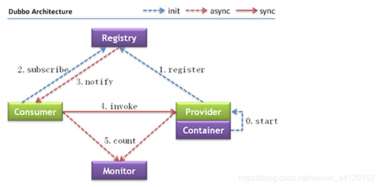

# 简介

Apache Dubbo是一款高性能的Java RPC框架。其前身是阿里巴巴公司开源的一个高性能、轻量级的开源 Java RPC 框架，可以和Spring框架无缝集成。

> RPC 全称为 remote procedure call，即远程过程调用。
>
> 比如两台服务器 A 和 B，A 服务器上部署一个应用，B 服务器上部署一个应用，A 服务器上的应用想调用 B 服务器上的应用提供的方法，由于两个应用不在一个内存空间，不能直接调用，所以需要通过网络来表达调用的语义和传达调用的数据。
>
> 需要注意的是 RPC 并不是一个具体的技术，而是指整个网络远程调用过程。 
>
> RPC 是一个泛化的概念，严格来说一切远程过程调用手段都属于 RPC 范畴。各种开发语言都有自己的 RPC 框架。Java 中的RPC 框架比较多，广泛使用的有 RMI、Hessian、Dubbo 等。

官网：https://cn.dubbo.apache.org/zh-cn/overview/mannual/java-sdk/

## 架构

Dubbo提供了三大核心能力：面向接口的远程方法调用，智能容错和负载均衡，以及服务自动注册和发现。

Dubbo架构图（Dubbo官方提供）如下：

**节点角色说明**

| 节点      | 角色名称                               |
| --------- | -------------------------------------- |
| Provider  | 暴露服务的服务提供方                   |
| Consumer  | 调用远程服务的服务消费方               |
| Registry  | 服务注册与发现的注册中心               |
| Monitor   | 统计服务的调用次数和调用时间的监控中心 |
| Container | 服务运行容器                           |

**调用关系说明**

0. 服务容器负责启动，加载，运行服务提供者。

1. 服务提供者在启动时，向注册中心注册自己提供的服务。

2. 服务消费者在启动时，向注册中心订阅自己所需的服务。

3. 注册中心返回服务提供者地址列表给消费者，如果有变更，注册中心将基于长连接推送变更数据给消费者。

4. 服务消费者，从提供者地址列表中，基于软负载均衡算法，选一台提供者进行调用，如果调用失败，再选另一台调用。

5. 服务消费者和提供者，在内存中累计调用次数和调用时间，定时每分钟发送一次统计数据到监控中心。

### 服务注册中心

通过前面的 Dubbo 架构图可以看到，Registry（服务注册中心）在其中起着至关重要的作用。Dubbo 官方推荐使用 ookeeper 作为服务注册中心。

Zookeeper 是 Apache Hadoop 的子项目，是一个树型的目录服务，支持变更推送，适合作为 Dubbo 服务的注册中心，工业强度较高，可用于生产环境，并推荐使用 。

**Zookeeper 树型目录服务**

**流程**

+ 服务提供者（Provider）启动时：向 `/dubbo/com.foo.BarService/providers` 目录下写入自己的 URL 地址
+ 服务消费者（Consumer）启动时：订阅 `/dubbo/com.foo.BarService/providers` 目录下的提供者 URL 地址。并向 `/dubbo/com.foo.BarService/consumers` 目录下写入自己的 URL 地址
+ 监控中心（Monitor）启动时：订阅 `/dubbo/com.foo.BarService` 目录下的所有提供者和消费者 URL 地址

