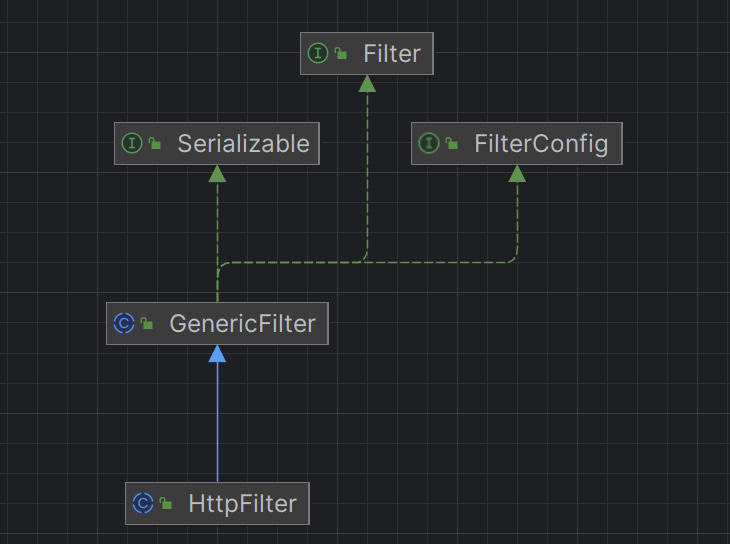

# FilterConfig

在 Servlet API 中，`FilterConfig` 是用于在 Filter 初始化时提供配置信息的接口。`GenericFilter` 类是 `Filter` 接口的抽象实现类，它提供了 Filter 的通用功能。

`GenericFilter` 中有一个 `filterConfig` 属性的声明，这个属性是 `FilterConfig` 类型的。这个属性的作用是为了在 `GenericFilter` 类的内部能够访问并利用配置信息，以便初始化 Filter。它允许在 `GenericFilter` 实现类中通过直接访问 `filterConfig` 属性来获取 Filter 的配置信息。

这种设计使得 `GenericFilter` 的子类能够轻松地访问配置信息，而无需再为每个具体的 Filter 实现重复地获取和处理这些配置信息。通过继承和复用 `GenericFilter`，开发者可以更加方便地编写和维护 Filter，因为一些通用的初始化和配置工作已经在 `GenericFilter` 中完成了。

`Filter` 和 `FilterConfig` 是 Servlet API 中的接口，它们定义了 Filter 和 Filter 配置的基本行为和方法。

`GenericFilter` 是一个抽象类，它实现了 `Filter` 接口，并提供了一些通用的 Filter 行为和方法。在这个抽象类中，包含了一个 `FilterConfig` 类型的属性，这样设计的目的是为了在 Filter 实现中能够使用配置信息。

`GenericFilter` 作为一个模板，定义了一些通用的方法或者默认的行为，具体的 Filter 实现类可以根据自己的需求选择性地覆盖这些方法或者使用这些通用的方法，以便于复用和定制。`FilterConfig` 是用于提供 Filter 配置信息的接口，在不同的环境中，可以有不同的实现类来提供不同的配置信息。

因此，`GenericFilter` 的设计目的是提供一个通用的模板，同时也是为了便于扩展和定制化，在具体的 Filter 实现中可以根据需要进行继承和定制。同时，`FilterConfig` 作为一个配置信息提供的接口，可以有多种不同的实现类，根据实际场景来提供配置信息。