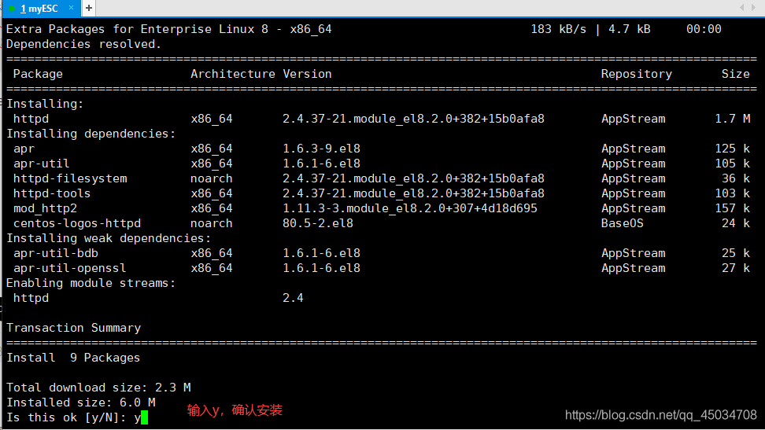
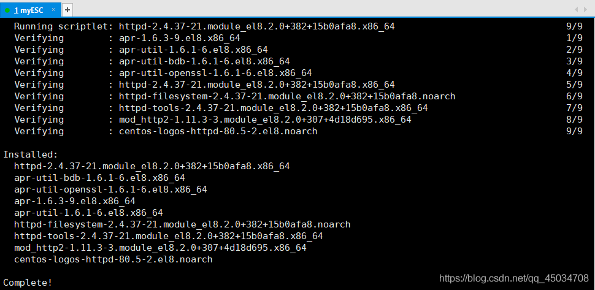
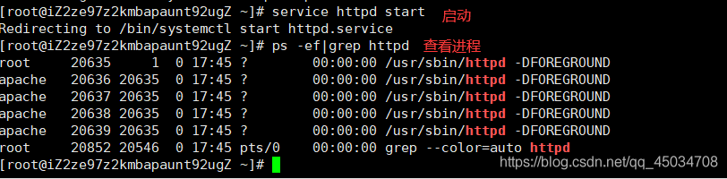

# 概述

Apache 是世界排名第一的网页服务器软件，它在各种计算机平台上运行，因其跨平台和安全性而广泛使用。

被广泛认可的 **Apache HTTP Server**（简称 **Apache** ）是 **Apache 软件基金会**的开源项目，其快速、可靠且可扩展的特性使得它成为最受欢迎的 Web 服务器软件之一。

Apache支持将 Perl、Python 等解释器编译到服务器中，同时也是一个模块化的服务器，起源于 NCSAhttpd 服务器，经过多次修改和完善。它的特点在于简单、速度快、性能稳定，并可作为代理服务器使用。

Apache 最初用于小型或试验 Internet 网络，逐步扩展到各种 Unix 系统，尤其对 Linux 的支持非常完善。其产品支持 SSL 技术和多个虚拟主机，以进程为基础的结构使其在扩容时更适合增加服务器或扩充群集节点而不是增加处理器。

**特性**：

1. 支持最新的 HTTP/1.1 通信协议
2. 简单而强大的基于文件的配置过程
3. 支持通用网关接口
4. 支持基于 IP 和域名的虚拟主机
5. 多种方式的 HTTP 认证支持
6. 集成 Perl 处理模块
7. 集成代理服务器模块
8. 支持实时监视服务器状态和定制服务器日志
9. 支持服务器端包含指令（SSI）
10. 支持安全 Socket 层（SSL）
11. 用户会话过程的跟踪
12. 支持 FastCGI
13. 解析静态文本，具有高并发性能，专注于HTTP服务
14. 支持静态页（HTML），不支持动态请求如 CGI、Servlet/JSP、PHP、ASP 等
15. 具备强大的可扩展性，可以通过插件支持 PHP，也可以与 Tomcat 单向连接以实现互通

Apache 是一个专注于提供 HTTP 服务的 Web 服务器，主要处理静态 HTML 页面和静态信息，用 C 语言实现。其特性包括简单、快速、稳定，并可通过配置实现代理功能。

Tomcat 服务器与 Apache 服务器通常搭配使用。相比 Apache，Tomcat 能处理静态 HTML 和动态内容，包括 JSP 和 Servlet。Apache 服务器负责处理静态页面和图片等信息，而 Tomcat 处理动态部分。

Apache 的核心功能是提供 HTTP 服务，适用于处理静态内容，而 Tomcat 在处理动态内容和支持多种服务器端技术方面更为灵活。

> Apache 是一辆卡车，上面可以装一些东西如 Html 等。但是不能直接装水，要装水必须要有容器（桶），而这个桶也可以不放在卡车上。

**官方文档**：https://httpd.apache.org/docs/2.4/zh-cn/

# 安装

1. **下载 Apache 软件包：**访问 Apache [官方网站](https://httpd.apache.org/)下载适用于你操作系统的最新版本的 Apache 软件包。选择与你操作系统版本和架构相匹配的安装包进行下载。
2. **解压安装包：**下载完成后，解压安装包到你想要安装 Apache 的目录。在解压后的文件夹中，你将会找到各种配置文件和程序文件。

3. **配置 Apache：**进入 Apache 的安装目录，在其中找到主要的配置文件（通常是 `httpd.conf`）。你可以使用文本编辑器打开该文件进行配置，包括指定服务器根目录、监听端口、虚拟主机配置、日志文件路径等。
4. **启动 Apache 服务器：**打开命令行界面，进入到 Apache 的安装目录，执行启动命令。在大多数情况下，启动 Apache 的命令为 `./apachectl start` 或者 `./httpd -k start`。在 Windows 上可能会是 `httpd.exe -k start`。
5. **验证 Apache 是否正常运行：**打开一个浏览器，输入 `http://localhost` 或 `http://服务器的IP地址`。如果能够看到默认的 Apache 欢迎页面，说明 Apache 已经成功安装并运行。
6. **配置防火墙和网络设置：**如果你使用的是防火墙，需要配置允许来自外部访问 Apache 的连接，通常是打开80端口。同时，在网络环境下，确保防火墙和路由器允许外部网络访问你的服务器。

## Linux

1. yum 源安装 输入指令

```shell
yum install httpd
```






2. 启动

```shell
service httpd start   #启动
service httpd stop    #停止
```



# 配置

## 主要配置

`httpd.conf` 是 Apache 主要的配置文件，用于设置全局配置信息，包括服务器端口、监听地址、日志文件位置、模块加载等。这个文件在 Apache 的安装目录下的 `conf` 文件夹中。

**1. 设置服务器端口和监听地址：**

在 `httpd.conf` 中可以指定 Apache 监听的端口号和监听的 IP 地址。默认情况下，Apache 监听端口 80。下面是一个示例：

```
Listen 80
```

如果要让 Apache 监听多个端口，可以添加多个 `Listen` 指令：

```
Listen 8080
```

要指定监听的 IP 地址，可以在 `Listen` 指令后面加上 IP 地址：

```
Listen 192.168.1.100:80
```

**2. 配置日志文件位置：**

Apache 使用日志文件记录访问和错误信息。可以使用以下指令配置日志文件的位置和格式：

```
ErrorLog "/var/log/apache2/error.log"
CustomLog "/var/log/apache2/access.log" combined
```

这个示例指定了错误日志和访问日志的文件路径。`combined` 表示使用常见的组合格式记录访问日志。

**3. 模块加载和配置：**

`httpd.conf` 中可以加载和配置各种模块。

例如，要加载 `mod_rewrite` 模块，可以使用以下指令：

```
LoadModule rewrite_module modules/mod_rewrite.so
```

**4. 使用 Include 指令：**

在大型环境下，配置文件可能非常庞大。为了更好地管理配置，可以将不同的配置信息放在单独的文件中，然后通过 `Include` 指令引入到 `httpd.conf` 中。

例如，假设有一个名为 `extra_config.conf` 的文件，里面包含了额外的配置信息，可以在 `httpd.conf` 中添加以下行：

```
Include conf/extra_config.conf
```

## 虚拟主机

虚拟主机配置是 Apache 中的一个关键部分，允许一台服务器承载多个域名或网站。它可以在 `httpd.conf` 中进行配置，也可以分别配置在不同的文件中，然后通过 `Include` 指令引入。

**属性字段**

1. **`ServerAdmin`：**指定服务器管理员的邮件地址。一般情况下，服务器错误会发送到这个地址，这有助于及时了解服务器的问题。
2. **`DocumentRoot`：**指定了虚拟主机的文档根目录，即服务器将在哪里查找网页文件。这个目录通常存放网站的文件和资源。
3. **`ServerName`：**指定虚拟主机的主机名或域名。这个值用于匹配请求的主机名，以确定应该将请求发送到哪个虚拟主机。
4. **日志文件配置：**`ErrorLog` 和 `CustomLog` 参数分别用于指定虚拟主机的错误日志和访问日志文件的位置。这些日志文件记录了服务器的错误和用户访问信息。

在 `httpd.conf` 中配置虚拟主机可以通过以下方式：

**1. 基于 IP 地址的虚拟主机配置：**

假设你有两个不同的 IP 地址（例如 `192.168.1.100` 和 `192.168.1.101`），你可以为每个 IP 地址配置不同的虚拟主机。

```
<VirtualHost 192.168.1.100:80>
    ServerAdmin webmaster@example1.com
    DocumentRoot "/var/www/example1"
    ServerName www.example1.com
    ErrorLog "/var/log/apache2/example1_error.log"
    CustomLog "/var/log/apache2/example1_access.log" combined
</VirtualHost>

<VirtualHost 192.168.1.101:80>
    ServerAdmin webmaster@example2.com
    DocumentRoot "/var/www/example2"
    ServerName www.example2.com
    ErrorLog "/var/log/apache2/example2_error.log"
    CustomLog "/var/log/apache2/example2_access.log" combined
</VirtualHost>
```

这个示例中配置了两个基于不同 IP 地址的虚拟主机，分别为 `www.example1.com` 和 `www.example2.com`。

**2. 基于域名的虚拟主机配置：**

如果服务器只有一个 IP 地址，可以通过域名来配置虚拟主机。

```
<VirtualHost *:80>
    ServerAdmin webmaster@example1.com
    DocumentRoot "/var/www/example1"
    ServerName www.example1.com
    ErrorLog "/var/log/apache2/example1_error.log"
    CustomLog "/var/log/apache2/example1_access.log" combined
</VirtualHost>

<VirtualHost *:80>
    ServerAdmin webmaster@example2.com
    DocumentRoot "/var/www/example2"
    ServerName www.example2.com
    ErrorLog "/var/log/apache2/example2_error.log"
    CustomLog "/var/log/apache2/example2_access.log" combined
</VirtualHost>
```

## 模块

模块加载和配置是 Apache 扩展功能的核心。适当地加载和配置模块可以让服务器具备更多功能，并根据需求实现定制化的配置，提高服务器的灵活性和安全性。

Apache 通过加载模块来扩展其功能。每个模块负责不同的任务，例如处理不同的协议、实现安全性、处理请求等。加载不同的模块可以为服务器提供各种功能，比如加密通信、URL 重写、动态内容处理等。

### 模块加载

要加载一个模块，可以使用 `LoadModule` 指令。

```
LoadModule module_name module_path
```

- `module_name` 是模块的名称，比如 `mod_rewrite`、`mod_ssl` 等。
- `module_path` 是模块文件的路径，通常是相对于 Apache 安装目录的路径。

例如，加载 `mod_rewrite` 模块：

```
LoadModule rewrite_module modules/mod_rewrite.so
```

### 模块添加

在旧版本的 Apache 中，使用 `AddModule` 指令来添加模块。但自 Apache 1.3 版本后，这个指令已经废弃。现在，模块的加载主要使用 `LoadModule` 指令。

```
LoadModule module_name module_path
```

- `module_name` 是模块的名称，比如 `mod_rewrite`、`mod_ssl` 等。
- `module_path` 是模块文件的路径，通常是相对于 Apache 安装目录的路径。

### 模块配置

有些模块在加载后需要特定的配置信息才能正常工作。这些配置信息通常在 `httpd.conf` 或其他配置文件中完成。例如，加载 `mod_ssl` 后，需要配置 SSL 证书、加密协议等。

对于不同模块的配置方式可能不同，一般会在模块加载后的位置添加相应的配置指令。

例如，配置 `mod_ssl`：

```
LoadModule ssl_module modules/mod_ssl.so

# SSL 配置
SSLEngine on
SSLProtocol all -SSLv2 -SSLv3
SSLCertificateFile /path/to/certificate.crt
SSLCertificateKeyFile /path/to/private.key
```

这些配置指令用于启用 SSL 引擎、指定 SSL 协议版本、设置 SSL 证书等。

## 访问控制

通过 `Require` 指令以及 `Allow`/`Deny` 指令，你可以限制特定目录或 URL 的访问权限。

### `Require` 指令

`Require` 指令是 Apache 2.4 版本后引入的，用于设置对特定资源的访问要求。

它可以单独使用，也可以与其他指令（例如 `RequireAll`、`RequireAny`）结合使用。可以基于多种条件进行控制，如 IP 地址、用户名、群组、认证状态等。

**示例 1 - 基于 IP 地址的访问控制：**

```
<Directory "/path/to/directory">
    Require ip 192.168.1.100
</Directory>
```

- `Require ip`：指定 IP 地址或 IP 地址段。
- `Require host`：指定特定的主机名。
- `Require all granted`：允许所有访问。
- `Require valid-user`：要求有效的用户认证。
- `Require group`：指定用户组。
- `Require expr`：使用表达式进行灵活控制。

这个示例指定了只允许 IP 地址为 `192.168.1.100` 的客户端访问特定目录。

**示例 2 - 需要认证的访问控制：**

```
<Directory "/path/to/protected/directory">
    AuthType Basic
    AuthName "Restricted Access"
    AuthUserFile /path/to/.htpasswd
    Require valid-user
</Directory>
```

- `AuthType`：指定认证类型，常见的有 Basic、Digest。
- `AuthName`：设置认证领域名称，用于提示用户输入用户名和密码。
- `AuthUserFile`：指定用户凭据文件的路径，存储用户名和密码。
- `Require valid-user`：要求用户输入有效的用户名和密码。

这个示例设置了基本身份验证，并要求用户通过用户名和密码验证才能访问特定目录。

### `Allow`/`Deny` 指令

`Allow` 和 `Deny` 指令用于控制对特定 IP 地址或主机的访问。`Allow` 允许特定的 IP 地址或主机访问，而 `Deny` 则阻止特定的 IP 地址或主机访问。

**示例 - 允许和拒绝访问：**

```
<Directory "/path/to/directory">
    Order deny,allow
    Deny from all
    Allow from 192.168.1.100
</Directory>
```

- `Order deny,allow`：指定先拒绝后允许的顺序。
- `Deny from all`：拒绝所有访问。
- `Allow from 192.168.1.100`：允许特定 IP 地址访问。

这个示例拒绝了所有 IP 地址的访问，但允许 IP 地址为 `192.168.1.100` 的客户端访问特定目录。

> Apache 2.4 版本后推荐使用 `Require` 指令替代旧版本中的 `Allow`/`Deny` 指令。因为 `Require` 提供了更灵活的控制和更强大的功能，更适应现代的访问控制需求。

## 权限配置

使用 `htpasswd` 工具来创建用户凭据文件，添加或管理用户和密码。

例如，在命令行中运行以下命令：

```bash
htpasswd -c /path/to/password/file username
```

- `-c` 参数用于创建一个新的用户凭据文件。
- `/path/to/password/file` 是用户凭据文件的路径。
- `username` 是要添加的用户名，此命令将提示您输入密码并加密存储。

Apache 还提供其他身份验证方式，如摘要式身份验证（Digest Authentication）、客户端证书身份验证等。

## 日志配置

Apache 提供了记录访问日志和错误日志的功能，可以通过配置文件指定日志文件的位置、格式、级别等信息。

1. **错误日志（Error Log）**：


### 访问日志

访问日志（Access Log）记录了服务器接收到的每个请求的信息，包括请求的资源、访问者的 IP 地址、访问时间、状态码等。它有助于分析网站流量和用户行为。

```
CustomLog /path/to/access.log combined
```

- `/path/to/access.log`：指定访问日志文件的路径和文件名。
- `combined`：是访问日志的格式，`combined` 是 Apache 预定义的常用格式，包含常见的访问信息，如 IP、时间、请求、状态码等。

### 错误日志

错误日志（Error Log）记录了服务器运行过程中出现的错误和警告信息。这些信息有助于诊断和解决服务器配置或运行时的问题。

```
ErrorLog /path/to/error.log
```

- `/path/to/error.log`：指定错误日志文件的路径和文件名。

### 记录级别

**LogLevel 指令**：用于设置日志的记录级别，有不同级别可供选择，如 `debug`、`info`、`warn`、`error` 等。

```
LogLevel warn
```

有些情况下可能希望记录特定信息，比如域名重写、重定向等。可以使用 `RewriteLog`、`RewriteLogLevel` 等指令来配置特定模块的详细记录信息。

```
RewriteLog /path/to/rewrite.log
RewriteLogLevel 3
```

## 加密配置

通过配置 SSL/TLS，可以在 Apache 中启用安全套接层，实现加密通信，确保数据在客户端和服务器之间的传输安全。在配置文件中设置 SSL/TLS 涉及证书位置、加密协议、加密套件等内容。

### 加载

要启用 SSL/TLS 功能，首先需要加载 `mod_ssl` 模块。

```
LoadModule ssl_module modules/mod_ssl.so
```

可以设置支持的加密协议和加密套件，以确保通信的安全性和兼容性。

```
SSLProtocol all -SSLv2 -SSLv3
SSLCipherSuite HIGH:!aNULL:!MD5:!RC4
```

- `SSLProtocol`：指定允许的加密协议版本。
- `SSLCipherSuite`：指定使用的加密套件，限制加密算法和密钥交换算法的组合。

### 配置

```
<VirtualHost *:443>
    ServerName www.example.com
    SSLEngine on
    SSLCertificateFile /path/to/certificate.crt
    SSLCertificateKeyFile /path/to/private.key
    # 其他 SSL/TLS 相关配置
</VirtualHost>
```

- `SSLEngine on`：启用 SSL 引擎，表示该虚拟主机使用 SSL/TLS 加密通信。
- `SSLCertificateFile`：指定服务器证书的位置。
- `SSLCertificateKeyFile`：指定私钥文件的位置，用于对传输的数据进行加密和解密。

**证书的获取和使用**：

- 证书通常通过证书颁发机构（CA）获得，用于证明服务器身份和加密通信。
- 自签名证书也是一种选择，但在生产环境中一般不建议使用，因为访问者的浏览器可能无法验证其真实性。

## 系统调优

Apache 允许通过配置参数来优化服务器的性能，包括提高响应速度、最大程度利用资源等方面。另外，缓存配置也是提高网站性能的关键之一，可以通过 `mod_cache` 等模块来实现。以下是对这两方面的详细讲解：

### 服务器性能

**调整并发连接数**：

```
StartServers 5
MinSpareServers 5
MaxSpareServers 10
MaxRequestWorkers 150
MaxConnectionsPerChild 0
```

- `StartServers`：启动服务器时创建的初始进程数量。
- `MinSpareServers`、`MaxSpareServers`：空闲状态下保持的最小和最大进程数量。
- `MaxRequestWorkers`：允许的最大并发连接数。
- `MaxConnectionsPerChild`：每个子进程服务的最大请求数，0 表示无限制。

**启用压缩**：

```
AddOutputFilterByType DEFLATE text/html text/plain text/xml
```

通过启用压缩，减少传输数据量，提高页面加载速度。

### 缓存

**启用缓存模块**：

```
LoadModule cache_module modules/mod_cache.so
LoadModule cache_disk_module modules/mod_cache_disk.so
```

**配置缓存位置和过期时间**：

```
CacheEnable disk /
CacheRoot /path/to/cache
CacheDefaultExpire 3600
```

- `CacheEnable disk /`：启用磁盘缓存，并指定对所有请求进行缓存。
- `CacheRoot`：指定缓存文件存放的位置。
- `CacheDefaultExpire`：设置缓存的默认过期时间，单位为秒。

# 调优

1. **尽量使用 IP 地址代替域名**
   - **原理：** 当 Apache 配置中使用了 `allow from example.com` 这样的域名设置时，Apache 需要进行 DNS 查询以获取对应的 IP 地址，这可能导致性能下降。
   - **建议：** 如果某个域名与特定 IP 一一对应，尽量使用 IP 地址替代域名，减少 DNS 查询次数，提升性能。

2. **启用 FollowSymLinks 选项**
   - **原理：** 当 Apache 处理请求时，若目录未启用 `FollowSymLinks` 选项，对符号链接的安全性将进行额外验证，增加系统调用次数。
   - **建议：** 在安全允许的情况下，在所有目录都启用 `FollowSymLinks` 选项，避免额外的系统调用，提高运行性能。启用 `FollowSymLinks` 选项，如果子目录没有额外的设置，将会继承该设置。

3. **禁用 AllowOverride**
   - **原理：** 若启用了 `AllowOverride`，Apache 会尝试对每个请求路径下的每个目录都打开对应的 `.htaccess` 文件，影响服务器性能。
   - **建议：** 如果有权限，将 `.htaccess` 中的配置直接写入 Apache 的主配置文件中（如 `httpd.conf`），并禁用 `AllowOverride`，提高性能。如果用户不具备 Apache 配置文件的编辑权限，又希望能够对站点进行相应的管理设置，就需要管理员允许 `AllowOverride`，以便于用户编写自己的 `.htaccess` 文件。

4. **尽量不使用通配符**
   - **原理：** 使用通配符（如 `DirectoryIndex index`）会使 Apache 在当前目录下寻找符合通配符条件的文件，带来一定性能损失。
   - **建议：** 如果在意性能损失，最好指定一个明确的文件列表作为欢迎页面，避免通配符形式的配置。

5. **选择适当的多路处理模块（MPM）**
   - **原理：** 多路处理模块直接影响 Apache 的性能表现，选择合适的 MPM 有助于优化并发连接和资源利用。
   - **建议：** 根据需求选择适合的 MPM，如 `prefork`、`worker` 或 `event`，并通过修改最大并发连接数等参数来优化性能。

# 并发

在实际应用中，我们常常需要针对自身需求对其进行配置，而修改 Apache 的最大并发连接数（MaxClients）是优化配置中的重要环节。

Apache 提供了多种不同的 MPM 模块，针对不同操作系统和需求，常见的 MPM 模块有：

- **mpm_prefork**：适用于 Unix/Linux 平台的模块。它会预先创建多个子进程（默认为 5 个），每个子进程独立处理单个请求。新请求超出预设子进程数量时，会创建新的子进程处理额外请求。每个请求对应一个子进程，占用较多系统资源，但出错不影响其他请求。
  - 适用于非线程安全的第三方模块，容易调试，但资源消耗多。
- **mpm_worker**：也适用于 Unix/Linux 平台。每个子进程创建一定数量的服务线程和一个监听线程。服务线程处理请求，监听线程接收和传递请求。相比 prefork，资源占用较少，更稳定，但对于不支持线程调试的平台较难调试。
- **mpm_winnt**：专为 Windows 优化设计，仅创建一个子进程，其中轮流产生多个线程来处理请求。

在编译 Apache 时，可以选择加载特定的 MPM 模块，也可以在运行中通过命令查看当前使用的 MPM 模块，如 `httpd -l`。

# 模块

1. **模块处理请求**：
   - 当 Apache 接收到请求时，经过模块处理管道，请求被传递给合适的模块进行处理。
   - 每个模块有自己特定的功能，根据请求类型和配置来进行处理。
2. **模块之间的通信和交互**：
   - 模块之间可以相互协作，传递数据或状态信息，以完成请求的处理。
3. **输出结果**：
   - 模块处理完请求后，将结果返回给服务器，最终返回给客户端。

## 常用模块

1. **`mod_ssl`：**
   - 功能：提供 SSL/TLS 功能，用于安全加密通信。
   - 原理：通过配置证书和密钥，启用加密传输。
   - 用途：网站加密通信，保护数据安全。
2. **`mod_rewrite`：**
   - 功能：实现 URL 重写和重定向。
   - 原理：通过配置规则将 URL 重写或重定向到指定的位置。
   - 用途：美化 URL、实现重定向、修改请求路径。
3. **`mod_proxy`：**
   - 功能：实现代理服务。
   - 原理：将客户端的请求转发给其他服务器，并将响应返回给客户端。
   - 用途：反向代理、负载均衡、内容缓存等。
4. **`mod_cache`：**
   - 功能：提供内容缓存功能。
   - 原理：将请求的内容缓存在服务器上，减少对后端资源的请求。
   - 用途：加快网站响应速度、减轻服务器负载。
5. **`mod_security`：**
   - 功能：提供 Web 应用程序防火墙功能。
   - 原理：检测和阻止恶意请求或攻击。
   - 用途：保护 Web 应用程序免受恶意攻击。
6. **`mod_auth`：**
   - 功能：提供用户认证和授权功能。
   - 原理：根据用户提供的凭据（用户名和密码）验证身份。
   - 用途：实现网站的登录和权限控制。
7. **`mod_expires`：**
   - 功能：设置文件的过期时间。
   - 原理：配置文件的过期时间，利用客户端缓存减少服务器负载。
   - 用途：优化网站性能，减少网络请求。


**8. 动态内容支持配置：**

- 如果需要支持动态内容，如 PHP、Perl、Python 等，需要配置相应的模块，并设置适当的处理程序。
- 配置文件中需要指定动态内容的文件类型以及对应的处理方式。