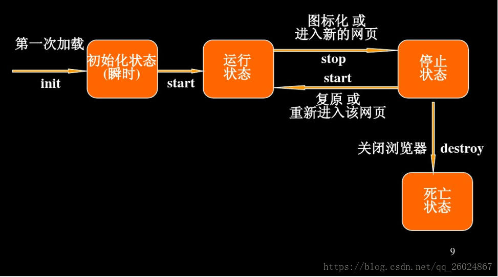

# 简介

Applets 是 Java 程序的一种形式，用于在 Web 浏览器内执行。它们嵌入在 HTML 页面中，并通过 `<applet>` 和 `</applet>` 标记定义。

与独立的 Java 应用程序不同，Applets 类继承自 `java.applet.Applet`，而不包含 `main()` 方法。这意味着 Web 浏览器会在用户访问包含 Applet 的页面时下载 Applet 的代码，并在用户机器上运行。

**特性**：

- **嵌入式执行**：Applet 被设计为嵌入在 HTML 页面中，并通过支持 Java 的浏览器执行。用户访问包含 Applet 的页面时，浏览器会下载 Applet 代码。
- **无main()方法**：与独立的 Java 应用程序不同，Applet 没有 main() 方法。它的生命周期由浏览器的Applet容器控制，如 `init()`、`start()`、`stop()`和`destroy()` 等方法。
- **沙箱安全**：Applet 有严格的安全规则，受到浏览器强制执行的安全机制限制，这被称为沙箱安全。它限制了 Applet 对本地系统资源的访问。
- **JVM和运行环境**：要查看 Applet，需要在用户机器上有 Java 虚拟机（JVM）。JVM 可以是浏览器的插件或者一个独立的运行环境。
- **使用限制**：Applets 不能单独运行，而是需要嵌入在 HTML 或者 JSP 页面中，可以使用 `<applet>` 标签来嵌入。也可以使用`appletviewer` 命令或者特定的 IDE 来运行 Applet。

## 差异

Applets 和 Servlets 是 Java 在 Web 应用中的两种不同形式，各自拥有不同的特性和运行环境。

**定义和运行环境**

- **Applet** 是一个嵌入到网页中的动态 Java 程序，在 Web 浏览器中执行并在客户端工作。它使用 `APPLET` 或 `OBJECT` 标记嵌入在HTML页面中，并在客户端执行，利用客户端计算机的资源。
- **Servlet** 是服务器端执行的小型 Java 程序，用于处理和响应客户端的请求。它实现了 Servlet 接口，主要在服务器上运行，利用服务器的资源来处理客户端的请求和响应。

**使用的Java包和导入**

- **Applet** 需要的包是 `import java.applet.*`，通常导入 `java.awt.*` 来创建用户界面。
- **Servlet** 需要的包是 `import javax.servlet.*`，并导入 `java.servlet.http.*` 来处理 HTTP 请求和响应。

**生命周期中使用的方法**

- **Applet **具有 `init()`、`start()`、`stop()`、`destroy()` 等生命周期方法，其中 `init()` 用于初始化，`start()` 和 `stop()` 用于开始和暂停程序，`destroy()` 用于销毁 Applet。
- **Servlet** 具有 `init()`、`service()` 和 `destroy()` 等方法，`init()` 用于初始化，`service()` 用于处理请求和响应，`destroy()` 用于销毁 Servlet。

**用户界面和带宽**

- **Applet** 需要使用 AWT 和 Swing 等用户界面类来创建交互式用户界面，因此在客户端计算机上执行时可能会使用更多的网络带宽。
- **Servlet** 不需要创建用户界面，它主要用于处理请求和响应，不涉及用户界面。它需要 Java 启用的 Web 服务器来处理客户端的请求和响应。

**执行环境**

- **Applet** 需要在 Java 兼容的 Web 浏览器中执行。
- **Servlet** 需要 Java 启用的 Web 服务器来处理客户端的请求和响应。通常与 HTTP 服务器（如 Apache Tomcat ）结合使用，可以在服务器端运行。

# 工作原理

Java Applet 是能够嵌入到 HTML 页面中，通过 Web 浏览器下载和执行的一种 Java 类。它通过在网页上的 `<applet>` 标签来嵌入，用户访问包含 Applet 的网页时，Applet 会被下载到用户计算机上执行。

1. **嵌入到HTML页面中：** Applet 需要通过 HTML 的 `<applet>` 标签嵌入到页面中，同时提供 Applet 的相关信息如字节码文件名、地址等。
2. **下载和执行：** 用户访问包含 Applet 的网页时，Web 浏览器会下载 Applet 类文件到用户计算机。这个类文件被 Java 虚拟机（JVM）解释执行。
3. **运行环境：** Applet 在沙箱环境中执行，受到严格的安全限制。它不需要 `main()` 方法，由浏览器内嵌的 Java 虚拟机调用执行。
4. **交互能力：** Applet 可以实现图形绘制、字体和颜色控制、动画、声音插入、人机交互和网络交流等功能。它利用 AWT 等用户界面类来创建标准的图形用户界面。
5. **生命周期方法：** Applet 有 `init()`、`start()`、`stop()` 和 `destroy()` 等生命周期方法。`init()` 用于初始化，`start()` 和 `stop()` 用于控制启动和暂停，`destroy()` 用于销毁 Applet。
6. **安全性和资源管理：** 由于是从远端服务器下载到本地执行，Applet需要严格的安全性控制，以及对资源的合理管理，不可随意导入所有的类，需要精确地导入需要的类，以保证程序的运行效率和安全性。
7. **与HTML文件交互：** Applet 的 HTML 文件中至少包含 Applet 相关的信息，如字节码文件名、地址等，这些信息使得网页更加生动有趣，但并不会改变 HTML 文件中与 Applet 无关的元素。
8. **生命周期与声明：** Applet 具有自己的生命周期方法（init、start、stop、destroy），并且声明必须是 `public`，以便浏览器正确执行。

由于 Applet 是在用户的计算机上执行的，所以它的执行速度不受网络带宽或者 Modem 存取速度的限制，用户可以更好地欣赏网页上 Applet 产生的多媒体效果。

# 生命周期



Applet 生命周期的几个关键方法决定了 Applet 在用户浏览器中的行为和状态管理：

1. **`init()`**
   - **功能：** 提供 Applet 的初始化，用于设置初始值和布局等。
   - **调用时机：** 在 Applet 标签内的 param 标签被处理后调用。
2. **`start()`**
   - **功能：** 当浏览器调用完 `init()` 方法后，会自动调用 `start()` 方法。用于启动 Applet。
   - **调用时机：** 用户从其他页面返回到包含 Applet 的页面时调用。
3. **`stop()`**
   - **功能：** 当用户从包含 Applet 的页面移除时，该方法被自动调用。用于暂停 Applet。
   - **调用时机：** 用户离开包含 Applet 的页面时调用，可以在同一个 Applet 中多次调用。
4. **`destroy()`**
   - **功能：** 仅当浏览器正常关闭时调用。用于销毁 Applet，释放资源。
   - **调用时机：** 浏览器关闭页面时调用。由于 Applet 只在 HTML 网页上有效，因此需要在用户离开包含 Applet 的页面后处理资源的释放。
5. **`paint()`**
   - **功能：** 用于绘制 Applet 的外观，实际上继承自 `java.awt`。
   - **调用时机：** 在 `start()` 方法之后立即被调用，或在需要重绘 Applet 在浏览器中的时候调用。

## Applet 类

每一个 Applet 都是 `java.applet.Applet` 类的子类，基础的 Applet 类提供了供衍生类调用的方法,以此来得到浏览器上下文的信息和服务。

- 得到 Applet 的参数
- 得到包含 Applet 的 HTML 文件的网络位置
- 得到 Applet 类目录的网络位置
- 打印浏览器的状态信息
- 获取一张图片
- 获取一个音频片段
- 播放一个音频片段
- 调整此 Applet 的大小

除此之外，Applet 类还提供了一个接口，该接口供 Viewer 或浏览器来获取 Applet 的信息，并且来控制 Applet 的执行。

Viewer 可能是：

- 请求 Applet 作者、版本和版权的信息
- 请求 Applet 识别的参数的描述
- 初始化 Applet
- 销毁 Applet
- 开始执行 Applet
- 结束执行 Applet

Applet 类提供了对这些方法的默认实现，这些方法可以在需要的时候重写。

## 两种类

Java 的 Applet 类是从 `java.awt.Panel` 继承的，而 JApplet 是从 `javax.swing.JApplet` 继承的。这些类都是基于不同的 GUI 工具包，分别有各自的布局方式和用法。

`Java.applet.Applet` 继承关系：

- `java.lang.Object`
- `java.awt.Component`
- `java.awt.Container`
- `java.awt.Paneljava.applet.Applet`

`Javax.swing.JApplet` 继承关系：

+ `java.lang.Object`
+ `java.awt.Component`
+ `java.awt.Container`
+ `javax.swing.JComponent`
+ `javax.swing.Container`
+ `javax.swing.WindowConstants`
+ `java.awt.Framejava.awt.Window`
+ `java.applet.Applet`
+ `javax.swing.JApplet`

**`Java.applet.Applet`：默认的布局方式是`FlowLayout`**

**`Javax.swing.JApplet`：默认的布局方式是`BorderLayout`**

### 组件

在 Applet 中添加组件时有一些不同。

对于 `java.applet.Applet`，可以直接向容器中添加组件。

```java
theApplet.add(awtComponent);
```

对于`javax.swing.JApplet`，添加组件的方式略有不同，

```java
theJApplet.getContentPane().add(swingComponent);
//其中 theApplet 是 Javax.swing.JApplet 类型的对象
```

> JApplet 是顶层的 Swing 容器，其内部用一个隐含的根面板（JRootPanel）作为惟一的直接后代，而根面板中的内容面板（Content Pane）才是 JApplet 除菜单条外所有构件的双亲。

在 JApplet 中，通常要区分内容面板（Content Pane）和根面板（Root Panel）。有两种常见的添加构件的方式：

1. 使用 `getContentPane()` 方法获取内容面板，然后向内容面板中添加组件。
2. 创建一个 `JPanel` 或类似的中间容器，向容器中添加组件，然后使用 `setContentPane()` 方法将该容器设置为 JApplet 的内容面板。

```java
// 第一种方式
Container contentPane = getContentPane();
contentPane.add(someComponent);

// 第二种方式
JPanel contentPane = new JPanel();
contentPane.add(someComponent);
setContentPane(contentPanel);
```

需要注意的是，在容器中不能直接添加另一个容器，否则会出现错误。特别要注意的是，Applet 中直接添加窗体会导致错误。

# 使用

## 定义

定义一个 Applet 需要以下步骤：

1. **创建一个Java类：** 编写一个类并继承 `java.applet.Applet` 类。
2. **重写 Applet 的方法：** 实现 Applet 的生命周期方法，如 `init()`、`start()`、`stop()`、`destroy()`、`paint()` 等。
3. **编写 Applet 的功能：** 在类中实现 Applet 的具体功能。

```java
import java.applet.Applet;
import java.awt.Graphics;

public class MyApplet extends Applet {
    public void init() {
        // 初始化操作
    }

    public void start() {
        // 启动操作
    }

    public void stop() {
        // 暂停操作
    }

    public void destroy() {
        // 销毁操作
    }

    public void paint(Graphics g) {
        // 绘制操作
    }
}
```

## 调用

Applet 可以通过 HTML 文件嵌入到网页中，并在Web浏览器中被调用。在不支持 Java 的浏览器中，不能执行 `<applet>` 和 `</applet>` 标签内的 Java Applet 代码，因此，在这些浏览器中，这些标签之间显示的内容是可见的。

```html
<applet code="MyApplet.class" width="300" height="200">

    <!-- 如果需要传递参数，可以使用param标签 -->
    <param name="paramName" value="paramValue">
</applet>
```

`code` 属性指定了要运行的 Applet 类，`width` 和 `height` 属性用来指定 Applet 运行面板的大小。

Applet 通过 `<param>` 标签传递参数给 Applet。在Applet初始化时，这些参数可以在`init()`方法中获取和使用。

```java
public void init() {
    String message = getParameter("message");
    // 使用参数 message 进行其他操作
}
```

> **注意:** 参数名字大小写不敏感。

Java 代码需要加载，浏览器或查看器需要知道 Java 代码存放的位置。这时候就需要使用 `codebase` 属性来指定 Java 代码所在的路径。

```html
<applet codebase="http://amrood.com/applets"
        code="HelloWorldApplet.class" width="320" height="120">
    <!-- Applet在默认包中 -->
</applet>

<applet code="mypackage.subpackage.TestApplet.class"
        width="320" height="120">
    <!-- Applet在指定包中 -->
</applet>
```

- 在第一个例子中，`codebase` 属性指定了 Java 代码的基础路径为 `http://amrood.com/applets`，并且指定了要运行的类是 `HelloWorldApplet.class`。这个 Applet 在默认包中。
- 在第二个例子中，没有指定 `codebase` 属性，因此 Applet 默认从当前路径加载。然后，`code` 属性指定了要加载的类为 `mypackage.subpackage.TestApplet.class`，这个 Applet 位于特定的包中。

# 功能

## 事件处理

Applets 作为交互式 Java 程序的一种形式，能够响应各种事件，比如鼠标点击、键盘输入等。

### 事件监听器

事件监听器是 Applet 中用来检测和响应事件的机制。Java 中的事件监听器主要用来侦听用户与界面组件的交互动作，如鼠标点击、按键等。

- `ActionListener`：用于处理按钮点击事件。
- `MouseListener`：用于处理鼠标事件（点击、释放、进入、退出等）。
- `KeyListener`：用于处理键盘事件（按下、释放、输入等）。

要在Applet中处理事件，你需要实现相应的监听器接口，并覆盖其定义的方法。

```java
import java.awt.*;
import java.awt.event.*;

public class MyEventApplet extends Applet implements ActionListener {
    Button button;

    public void init() {
        button = new Button("Click Me");
        button.addActionListener(this); // 注册按钮的事件监听器为当前Applet
        add(button);
    }

    public void actionPerformed(ActionEvent e) {
        if (e.getSource() == button) {
            // 处理按钮点击事件
            System.out.println("Button Clicked!");
        }
    }
}
```

在这个例子中，`MyEventApplet`类实现了`ActionListener`接口，然后覆盖了`actionPerformed`方法来处理按钮点击事件。通过`addActionListener(this)`，将按钮的事件监听器设置为当前Applet。

## 图片加载

在 Applet 中加载图片通常需要使用 `Image` 类。Applet 能显示 GIF、JPEG、BMP 等其他格式的图片。

```java
import java.awt.*;
import java.applet.*;

public class ImageApplet extends Applet {
    Image img;

    public void init() {
        img = getImage(getDocumentBase(), "image.jpg");
    }

    public void paint(Graphics g) {
        g.drawImage(img, 50, 50, this);
    }
}
```

+ 这里的 `getImage()` 方法通过传入文档的基础URL和图片的相对路径来加载图片。如果图片文件与 HTML 文件位于同一目录下，则只需提供图片的文件名。
+ `drawImage()` 方法用于在 Applet 中绘制图片。参数包括图片对象、绘制的 x 和 y 坐标，以及用于绘制的组件（一般为当前的 Applet，使用 `this`）。
  + `x` 和 `y` 是图片绘制的坐标位置。

## 音频播放

在 Applet 中播放音频可以使用 `AudioClip` 类。这个类允许你加载和播放音频文件。

AudioClip 接口定义了三个方法：

- **public void play():** 从一开始播放音频片段一次。
- **public void loop():** 循环播放音频片段
- **public void stop():** 停止播放音频片段

为了得到 AudioClip 对象，你必须调用 Applet 类的 getAudioClip() 方法。无论 URL 指向的是否是一个真实的音频文件，该方法都会立即返回结果。

直到要播放音频文件时，该文件才会下载下来。

```java
import java.awt.*;
import java.applet.*;
import java.net.URL;

public class AudioApplet extends Applet {
    AudioClip audioClip;
    Button playButton = new Button("Play");
    Button stopButton = new Button("Stop");

    public void init() {
        URL audioURL = getDocumentBase(); // 获取当前 Applet 的 URL
        audioClip = getAudioClip(audioURL, "audioFile.wav");

        playButton.addActionListener(e -> audioClip.play());
        stopButton.addActionListener(e -> audioClip.stop());

        add(playButton);
        add(stopButton);
    }
}
```

当用户点击 "Play" 按钮时，音频将开始播放；点击 "Stop" 按钮则会停止播放。

## 视频播放

在 Applet 中播放视频通常需要使用 `MediaTracker` 和 `Image` 类。Applet不直接支持视频播放，但你可以使用图片序列来模拟视频效果。

```java
import java.awt.*;
import java.applet.*;

public class VideoApplet extends Applet {
    Image[] frames;
    MediaTracker tracker;
    int frameCount;

    public void init() {
        frameCount = 10; // 假设有10帧图片
        frames = new Image[frameCount];
        tracker = new MediaTracker(this);

        for (int i = 0; i < frameCount; i++) {
            frames[i] = getImage(getDocumentBase(), "frame" + i + ".jpg");
            tracker.addImage(frames[i], 0);
        }

        try {
            tracker.waitForAll();
        } catch (InterruptedException e) {
            e.printStackTrace();
        }
    }

    public void paint(Graphics g) {
        if (frameCount > 0) {
            int currentFrame = (int) (System.currentTimeMillis() % frameCount);
            g.drawImage(frames[currentFrame], 50, 50, this);
            repaint();
        }
    }
}
```

这个例子中假设视频被分解成了 10 帧图片，使用当前时间来选择当前要绘制的帧，实现了简单的帧播放；并以 `frame0.jpg`、`frame1.jpg` 等命名，你需要根据实际情况修改图片名称和帧数。

# 淘汰原因

Applet 曾经是 Web 开发中常用的一种技术，但逐渐被淘汰的原因有几个方面：

1. **安全性问题：** Applet 在过去存在安全漏洞，因为它们可以在客户端执行代码。这些漏洞可能被恶意利用，因此浏览器和操作系统开始限制 Applet 的功能，并提高了对其运行环境的安全性要求。
2. **技术落后：** Applet 技术在某些方面已经落后。随着 HTML5 和现代浏览器的发展，新的 Web 技术和 API（比如 Canvas、WebGL、Web Audio API 等）提供了更多功能和更好的性能，能够满足复杂的交互和多媒体需求。
3. **性能问题：** 在过去，Applet 在加载速度和性能上可能存在问题。它们需要下载并在客户端运行，这可能导致加载时间较长，并且对于资源消耗较多的应用可能性能不佳。
4. **移动设备兼容性：** Applet 技术并不完全适用于移动设备。移动设备的浏览器对 Applet 的支持性有限，这使得在移动环境下使用 Applet 变得不切实际。

