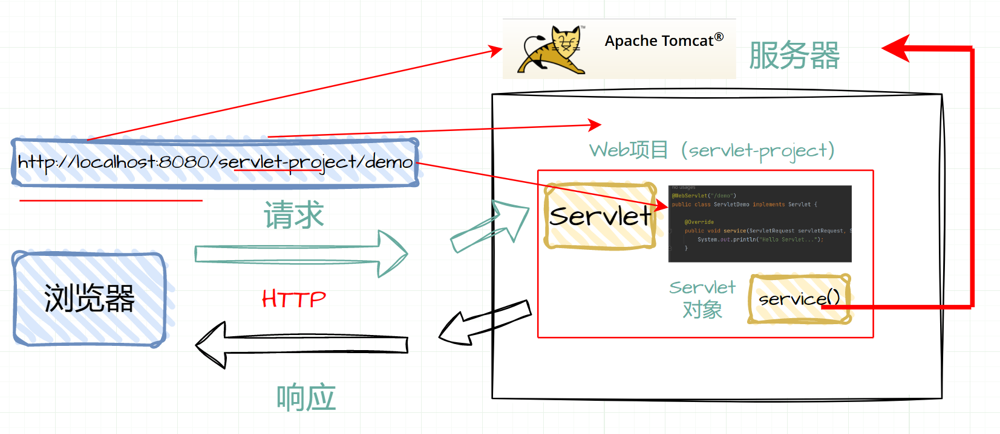

# 简介

*Servlet 为创建基于 web 的应用程序提供了基于组件、独立于平台的方法，可以不受 CGI 程序的性能限制。Servlet 有权限访问所有的 Java API，包括访问企业级数据库的 JDBC API。*

Java Servlet 是运行在 Web 服务器或应用服务器上的程序，它是作为来自 Web 浏览器或其他 HTTP 客户端的请求和 HTTP 服务器上的数据库或应用程序之间的中间层；使用 Servlet 可以收集来自网页表单的用户输入，呈现来自数据库或者其他源的记录，还可以动态创建网页。

Java Servlet 通常情况下与使用 CGI（Common Gateway Interface，公共网关接口）实现的程序可以达到异曲同工的效果，是运行在带有支持 Java Servlet 规范的解释器的 web 服务器上的 Java 类，可以使用 **javax.servlet** 和 **javax.servlet.http** 包创建，它是 Java 企业版的标准组成部分，Java 企业版是支持大型开发项目的 Java 类库的扩展版本。

相比于 CGI，Servlet 有以下几点优势：

- 在 Web 服务器的地址空间内执行。这样它就没有必要再创建一个单独的进程来处理每个客户端请求。
- 是独立于平台的，因为它们是用 Java 编写的。
- 服务器上的 Java 安全管理器执行了一系列限制，以保护服务器计算机上的资源。因此，Servlet 是可信的。
- Java 类库的全部功能对 Servlet 来说都是可用的。它可以通过 sockets 和 RMI 机制与 applets、数据库或其他软件进行交互。

Servlets 是 Java Web 应用程序的核心组件，是 Java 编写的服务器端程序，它们用于处理 HTTP 请求和生成 HTTP 响应。Servlets 通过实现 `javax.servlet.Servlet` 接口或扩展 `HttpServlet` 类来处理不同类型的 HTTP 请求（如 GET、POST 等）。

Servlet 本身不能独立运行，需要在一个 Web 应用中运行的，一个常见的 Web 应用是 Tomcat 。

## 执行流程



当浏览器发出 `http://localhost:8080/servlet-project/demo` 请求时，这个请求大致分为三个主要部分：

1. 定位服务器和项目：

- **根据 `http://localhost:8080` 找到 Tomcat 服务器。**
- **进一步在 Tomcat 中找到部署的名为 `servlet-project` 的 Web 项目。**

2. 寻找具体的 Servlet：

- **在项目中根据 `demo` 找到要访问的具体 Servlet。**
- **这里使用了注解配置了 Servlet 的访问路径。**

3. Servlet 的调用和响应生成：

- **Web 服务器 Tomcat 根据请求创建一个名为 ServletDemo 的 Servlet 对象。**
- **Servlet 对象的 `service()` 方法被自动调用。**
- **`service()` 方法执行后向客户端浏览器发送响应数据。**

 数据交互与 Servlet 类：

- **`ServletRequest` 封装了请求数据。**
- **`ServletResponse` 封装了响应数据。**
- **通过这两个类的对象，实现了前后端的数据交互。**

# 架构


Servlet 执行以下主要任务：

- **读取客户端（浏览器）发送的显式的数据**。这包括网页上的 HTML 表单，或者也可以是来自 applet 或自定义的 HTTP 客户端程序的表单。
- **读取客户端（浏览器）发送的隐式的 HTTP 请求数据**。这包括 cookies、媒体类型和浏览器能理解的压缩格式等等。
- **处理数据并生成结果**。这个过程可能需要访问数据库，执行 RMI 或 CORBA 调用，调用 Web 服务，或者直接计算得出对应的响应。
- **发送显式的数据（即文档）到客户端（浏览器）**。该文档的格式可以是多种多样的，包括文本文件（HTML 或 XML）、二进制文件（GIF 图像）、Excel 等。
- **发送隐式的 HTTP 响应到客户端（浏览器）**。这包括告诉浏览器或其他客户端被返回的文档类型（例如 HTML），设置 cookies 和缓存参数，以及其他类似的任务。

## 包结构

涉及到 WEB-INF 子目录的 Web 应用程序结构是所有的 Java web 应用程序的标准，并由 Servlet API 规范指定。

给定一个顶级目录名 myapp，目录结构如下所示：

+ `WEB-INF` 目录下通常包含一些特定的文件和子目录，用于存放配置文件、类文件和其他资源。
  + `classes` 目录中用于存放编译后的 Java 类文件，包含了所有的 Servlet 类和其他类文件。在这个目录下，包结构通常与源代码的包结构一致，例如 `com.example.controller`、`com.example.service` 等。这些类文件包含了 Servlet、业务逻辑、数据访问等代码。
  + `lib` 目录用于存放项目所依赖的第三方库（JAR 文件）。这些库文件包含了项目所需的外部依赖，例如数据库驱动、框架库等。
  + **`web.xml` 文件：** 配置文件，用于配置 Servlet、Filter、Listener 等。这个文件通常包含了应用的初始化参数、URL 映射、Servlet 定义等信息。

```
/myapp
    /images
    /WEB-INF
        /classes
        /lib
        web.xml
```

> WEB-INF 子目录中包含应用程序的部署描述符，名为 web.xml。所有的 HTML 文件都位于顶级目录 *myapp* 下。对于 admin 用户，您会发现 ROOT 目录是 myApp 的父目录。

# 配置

当一个基于 Servlet 的 Java Web 应用启动时，容器（比如 Tomcat）会读取并解析 web.xml （Web Application Deployment Descriptor）文件，根据文件中的配置信息来初始化和配置应用程序，如 `Listener`，`Filter`，``Servlet` 等。

> 注意：**web.xml 并不是必须的，一个 web 工程可以没有 web.xml 文件**。

对于一些简单的 Web 应用程序或者使用现代 Servlet 容器（如 Tomcat 8+）和 Servlet 3.0+ 规范的应用，可以不再需要 `web.xml`，而是使用基于注解的配置。

**实例**

Tomcat 启动 web 项目时，web 容器就会首先加载 web.xml 文件。

加载过程如下：

1. web 项目加载 web.xml，读取 `context-param` 和 `listener` 这两个结点
2. 创建一个 `ServletContext`（Servlet 上下文），整个项目会共享这个 ServletContext
3. 容器将 `<context-param>` 转换为键值对，并交给 ServletContext
4. 容器创建 `<listener>` 中的类实例，创建监听器
5. 容器会读取`<filter>`，根据指定的类路径来实例化过滤器

以上都是在 WEB 项目还没有完全启动起来的时候就已经完成了的工作。如果系统中有 Servlet，则 Servlet 是在第一次发起请求的时候被实例化的，而且一般不会被容器销毁，它可以服务于多个用户的请求。所以，Servlet 的初始化都要比上面提到的那几个要迟。

总的来说，web.xml 的加载顺序是：`<context-param>` -> `<listener>` -> `<filter>` -> `<servlet>`。其中，如果 `web.xml`  中出现了相同的元素，则按照在配置文件中出现的先后顺序来加载。

## 元素

### `<web-app>`

`<web-app>` 标签是 web.xml 文件的根元素，定义了整个Web应用程序的配置和基本信息。该模式文件是由 `Sun` 公司定义的，每个 `web.xml` 文件的根元素 `<web-app>` 中，都必须标明这个`web.xml` 使用的是哪个模式文件。

根元素用于指定 Web 应用程序的版本和一些基本信息，常见属性包括 `version`（指定 Servlet 版本）、`xmlns`（XML 命名空间）等。

- **version：** 指定了 Web 应用程序所使用的 Servlet 规范版本。
- **xmlns 和 xsi:schemaLocation：** 声明了 XML 命名空间和 XML Schema（XSD）的位置，用于指定 XML 文件的 XML Schema 定义。

```XML
<?xml version="1.0" encoding="UTF-8"?>
<web-app xmlns:xsi="http://www.w3.org/2001/XMLSchema-instance" 
         xmlns="http://xmlns.jcp.org/xml/ns/javaee" 
         xsi:schemaLocation="http://xmlns.jcp.org/xml/ns/javaee http://xmlns.jcp.org/xml/ns/javaee/web-app_4_0.xsd" 
         id="WebApp_ID" 
         version="4.0">

</web-app>
```

### `<display-name>`

`<display-name>` 标签是 web.xml 文件中的一个可选标签，用于指定 Web 应用程序的显示名称。

**作用**

- **可读性和管理：** `<display-name>` 标签提供了一个更加友好和可读的名称，方便开发者和管理员识别和管理 Web 应用程序。
- **部署工具展示：** 应用程序服务器或IDE等工具可能会使用这个名称来展示部署的 Web 应用程序列表。

```xml
<display-name>MyWebApp</display-name>
```

> 标签是可选的，可以选择不使用。如果未提供这个标签，应用程序可能会默认使用应用程序的名称或其他标识符。

### `<distributable>`

`<distributable>` 标签是 web.xml 文件中的一个可选标签，用于指示 Web 应用程序是否支持分布式部署。

**作用**

- **支持集群部署：** `<distributable>` 标签允许开发者标记他们的 Web 应用程序支持在多个服务器节点上进行部署和运行，即支持在分布式环境中运行，应用程序可以在集群环境中部署运行。
- **Session共享：** 当一个应用程序被标记为可分布式时，容器（如 Tomcat）可以自动支持会话（session）在多个服务器节点之间的共享。

```xml
<distributable />
```

> 使用 `<distributable>` 标签并不意味着应用程序会自动适应分布式环境，而是表明该应用程序具备支持在分布式环境中部署运行的潜力。

在标记应用程序为可分布式后，确保应用程序中的所有会话数据和状态都能正确地在集群中进行共享，需要适当地处理会话共享和同步。不是所有的Web应用程序都需要被标记为可分布式，只有在需要在多个服务器节点上运行并共享状态时才使用这个标签。

### `<context-param>`

`<context-param>` 标签是用于在 web.xml 文件中定义全局的上下文参数的元素。

**作用**

- **全局参数配置：** `<context-param>` 标签允许在整个 Web 应用程序中定义全局参数，这些参数在整个应用程序中可用，包括 Servlet、JSP、过滤器等。
- **灵活配置：** 这些参数可以包含各种类型的信息，如数据库连接信息、全局设置、第三方API密钥等。

**子标签**

+ `<param-name>` 标签用于指定参数的名称，参数名在整个 Web 应用中必须是唯一的
+ `<param-value>` 标签用于指定参数的值。
+ `<description>` 标签用于描述参数

```xml
<context-param>
    <param-name>databaseURL</param-name>
    <param-value>jdbc:mysql://localhost:3306/mydatabase</param-value>
</context-param>
```

这些参数可以在 Java 代码中通过 `ServletContext` 对象访问，以便在应用程序中读取全局参数值，可以在任何需要使用这些参数的地方通过`getServletContext().getInitParameter("parameterName")` 来获取参数值。

> `<context-param>` 标签中定义的参数对整个 Web 应用程序都是全局有效的，所以要注意保护和安全地处理敏感信息。

**相关参数**

+ `webAppRootKey` 参数用于指定在 Spring Web 应用中用于存储 Web 根目录位置的属性名称。这个参数在多个 Web 项目部署在同一个容器中时特别有用，因为可以为每个项目指定不同的 Web 根目录。
  + 如果在 Spring Web 应用中没有明确指定 `webAppRootKey`，默认情况下它将会使用缺省值 `"webapp.root"`。
  + 部署在同一容器中的多个 Web 项目，要配置不同的 `webAppRootKey`，web.xml 文件中最好定义 `webAppRootKey` 参数。这些项目希望共享某些容器级别的属性或配置，但又需要确保这些共享属性在各个项目中有不同的键名。
+ `contextConfigLocation` 参数指定 Spring 的配置文件路径，可以加载指定的配置文件，并进行交叉引用。在 Spring 中，通常一个大型项目可能需要多个配置文件来管理不同模块或功能的配置。
  + 当有指定的 `contextConfigLocation` 参数时，Spring 容器会根据这个参数指定的路径去加载对应的配置文件，而不会默认加载 `/WEB-INF/` 目录下的 `applicationContext.xml`。
  + 可以在 `contextConfigLocation` 参数中用空格或逗号分隔多个配置文件，这样可以加载多个配置文件，并实现配置文件之间的交叉引用。

###  `<servlet>`

`<servlet>` 标签是 web.xml 文件中用于配置 Servlet 的元素，它允许在 web.xml 中定义和配置 Servlet 。

**作用**

- **定义Servlet：** `<servlet>`标签用于定义Servlet，包括指定Servlet的名称和Servlet类的路径。
- **初始化参数配置：** 可以在`<servlet>`标签内部使用`<init-param>`标签来为Servlet配置初始化参数。

**子标签**

- `<servlet-name>` 标签用于指定 Servlet 的名称，该名称在配置映射时使用，这个名称在整个 web 应用程序中需要是唯一的。
- `<servlet-class>` 标签用于指定 Servlet 的 Java 类的完全限定名（包括包路径）。
- `<jsp-file>` 标签是用于在 `web.xml` 文件中指定一个 JSP 文件的路径，作为一个 Servlet 的加载路径，允许将 JSP 文件像 Servlet 一样进行配置和映射。
- `<init-param>` 标签是可选的，用于提供 Servlet 的初始化参数。这些参数可以在 Servlet 中通过 `getInitParameter("paramName")` 方法获取。
- `<load-on-startup>` 标签用于在 `web.xml` 文件中配置 Servlet 的启动顺序，指定 Servlet 在容器启动时就进行初始化，并指定初始化的顺序。
  - 标签中的值表示了 Servlet 的加载顺序，通常为一个整数。数值越小，启动顺序越靠前。如果 `<load-on-startup>` 设置为0或者没有设置，则表示在需要时（即第一次请求该 Servlet）才初始化，而不是在容器启动时就进行初始化。

```xml
<servlet>
    <servlet-name>HelloServlet</servlet-name>
    <servlet-class>com.example.HelloServlet</servlet-class>
    <load-on-startup>1</load-on-startup>
    <init-param>
        <param-name>greeting</param-name>
        <param-value>Hello, World!</param-value>
    </init-param>
</servlet>
```

使用 `<servlet>` 标签定义 Servlet 后，还需要使用 `<servlet-mapping>` 标签将 Servlet 映射到 URL 路径，以便请求能够到达并由这个 Servlet 进行处理。

> `<init-param>` 和 `<context-param>` 是用于传递参数给 Servlet 的两种不同方式，它们之间有一些关键区别：
>
> + `<init-param>` 是在 `<servlet>` 标签内部使用的，用于为特定的 Servlet 提供初始化参数， 这些参数是针对某个特定的 Servlet 实例，每个 Servlet 可以有不同的初始化参数配置。
>   + 使用 `getInitParameter("paramName")` 方法获取这些初始化参数的值。
> + `<context-param>` 是在 `<web-app>` 标签内部使用的，用于在整个应用程序范围内定义全局的上下文参数，这些参数对整个应用程序都是全局有效的，所有 Servlet 和其他组件都可以访问这些参数。
>   + 使用 `getServletContext().getInitParameter("paramName")` 方法来获取全局上下文参数的值。

### `<servlet-mapping>`

`<servlet-mapping>` 标签用于将特定的 URL 映射到对应的 Servlet，这样当接收到特定 URL 的请求时，以便容器可以正确地将请求分派给相应的 Servlet 进行处理。

**子标签**

+ `<servlet-name>`：标签指定了要映射的 Servlet 的名称，对应于 `<servlet>` 标签中定义的 Servlet 名称。
+ `<url-pattern>`：标签定义了将要映射到 Servlet 的 URL 路径。这个路径可以是具体的URL，也可以是一种模式匹配，比如`/hello/*`。

```xml
<servlet-mapping>
    <servlet-name>HelloServlet</servlet-name>
    <url-pattern>/hello</url-pattern>
</servlet-mapping>
```

URL 路径的匹配规则：

- `/*` ：匹配所有路径。
- `/xxx/*` ：匹配以 `/xxx/` 开头的所有路径。
- `*.do` ：匹配所有以 `.do` 结尾的路径。

### `<filter>`

`<filter>` 标签用于在 web.xml 文件中定义过滤器（Filter），过滤器可以在请求到达 Servlet 之前或响应返回客户端之前对请求进行预处理或后处理。

**子标签**

- `<filter-name>` 标签用于指定过滤器的名称，这个名称在整个 web 应用程序中需要是唯一的。
- `<filter-class>` 标签用于指定实现过滤器功能的 Java 类的完全限定名（包括包路径）。
- `<init-param>` 元素用于为过滤器指定初始化参数，它的子元素 `<param-name>` 指定参数的名字，`<param-value>` 指定参数的值。
- 在过滤器中，可以使用 `FilterConfig` 接口对象来访问初始化参数。

```xml
<filter>
    <filter-name>MyFilter</filter-name>
    <filter-class>com.example.MyFilter</filter-class>
</filter>
```

过滤器的主要逻辑在编写的 Java 类中的 `doFilter()` 方法中实现，在这个方法中可以对请求进行处理并通过 `FilterChain` 将请求传递给下一个过滤器或 Servlet。

过滤器可以在 web.xml 中使用 `<filter-mapping>` 标签将其映射到指定的 URL 路径，来指定过滤器对哪些请求进行拦截和处理。

### `<filter-mapping>`

`<filter-mapping>` 标签用于将过滤器（Filter）映射到特定的 URL 路径，将指定的过滤器与特定的 URL 路径或 URL 模式关联起来，以便在这些路径的请求到达时，能够被正确地拦截并经过过滤器处理。

**子标签**

- `<filter-name>` 标签指定了要映射的过滤器的名称，对应于 `<filter>` 标签中定义的过滤器名称。
- `<url-pattern>` 标签定义了需要经过该过滤器处理的 URL 路径。这个路径可以是具体的 URL，也可以是一种模式匹配，例如`/secured/*`。
- `<dispatcher>` 指定过滤器所拦截的资源被 Servlet 容器调用的方式，可以是 `REQUEST`，`INCLUDE`，`FORWARD` 和 `ERROR` 之一，默认`REQUEST`。用户可以设置多个`<dispatcher>`子元素用来指定 Filter 对资源的多种调用方式进行拦截。
  - `REQUEST`：当用户直接访问页面时，Web 容器将会调用过滤器。如果目标资源是通过RequestDispatcher 的 include() 或 forward() 方法访问时，那么该过滤器就不会被调用。
  - `INCLUDE`：如果目标资源是通过 RequestDispatcher 的 include() 方法访问时，那么该过滤器将被调用。除此之外，该过滤器不会被调用。
  - `FORWARD`：如果目标资源是通过 RequestDispatcher 的 forward() 方法访问时，那么该过滤器将被调用，除此之外，该过滤器不会被调用。
  - `ERROR`：如果目标资源是通过声明式异常处理机制调用时，那么该过滤器将被调用。除此之外，过滤器不会被调用。

```xml
<filter-mapping>
    <filter-name>MyFilter</filter-name>
    <url-pattern>/secured/*</url-pattern>
</filter-mapping>
```

URL 路径的匹配规则：

- `/*` ：匹配所有路径。
- `/xxx/*` ：匹配以 `/xxx/` 开头的所有路径。
- `*.do` ：匹配所有以 `.do` 结尾的路径。

### `<listener>`

`<listener>` 标签用于在 web.xml 文件中配置监听器（Listener），监听器能够监听 Web 应用程序中的事件，并在事件发生时执行特定的操作。

监听器用于监听 Web 应用程序中特定事件的发生，比如应用程序的启动、销毁，会话的创建、销毁等。

**子标签**

+ `<listener-class>` 标签指定了用于处理事件的监听器类的完全限定名（包括包路径）。

监听器类需要实现对应的监听器接口，例如 ServletContextListener、HttpSessionListener 等，以便监听特定事件并执行相应的逻辑。

```xml
<listener>
    <listener-class>com.example.MyServletContextListener</listener-class>
</listener>
```

监听器类可以在特定事件发生时执行一些初始化或清理操作，例如初始化一些资源、在应用启动时加载配置等。

### `<error-page>`

`<error-page>` 标签用于在 web.xml 文件中配置错误页面，允许开发者为不同类型的错误（如404 Not Found、500 Internal Server Error等）指定自定义的错误处理页面。

**子标签**

- `<error-code>` 标签指定了错误的 HTTP 状态码。可以指定具体的错误码（如404、500等）或者范围（如4xx、5xx）。
- `<location>` 标签指定了发生错误时要显示的错误页面的位置。可以是一个相对路径或绝对路径。

```xml
<error-page>
    <error-code>404</error-code>
    <location>/error404.jsp</location>
</error-page>
```

这种配置方式的好处在于，当用户访问您的Web应用程序时发生 404 或 500 错误时，他们将不再看到标准的浏览器错误页面。相反，他们将被重定向到您定义的自定义错误页面，以显示有关错误的友好信息。

### `<session-config>`

`<session-config>` 标签用于在 web.xml 文件中配置会话（Session）的相关参数，例如会话超时时间等。

**子标签**

- `<session-timeout>` 标签指定了会话的超时时间，以分钟为单位。在指定的时间内，如果会话处于空闲状态（没有活动），则会话将被服务器认为是过期的。
- 如果不设置 `<session-timeout>`，默认情况下会话的超时时间由服务器自身的配置决定。
- 该元素值必须为整数，如果值为零或负数，则表示会话将永远不会超时。

```xml
<session-config>
	<!-- 会话超时时间，单位为分钟 -->
    <session-timeout>30</session-timeout> 
</session-config>
```

### `<welcome-file-list>`

`welcome-file-list>` 标签用于在 web.xml 文件中配置默认的欢迎页面（Welcome Page），当用户访问根路径时，容器将会自动寻找并显示这些指定的欢迎页面。

**子标签**

+ `<welcome-file>` 标签用于指定欢迎页面的文件名，可以指定多个文件名。容器会按顺序查找这些文件，并显示找到的第一个文件作为默认的欢迎页面。
  + 如果用户访问了根路径（比如 `http://example.com/`），容器将会自动在配置的欢迎文件中查找，并显示第一个找到的文件。

```xml
<welcome-file-list>
    <welcome-file>index.html</welcome-file>
    <welcome-file>index.jsp</welcome-file>
</welcome-file-list>
```

> 欢迎文件不是Web应用程序的强制要求，即使没有配置欢迎文件列表，Web应用程序仍然可以正常工作。
>
> 然而，在用户友好性和导航性方面，配置欢迎文件列表是一个很有用的实践，特别是在复杂的Web应用程序中。这使得用户能够直接访问网站的主页或默认入口点，而不必手动输入特定的URL。

### 元素详解

1. 首先是表明 xml 的使用版本。

   ```xml
   <?xml version="1.0" encoding="UTF-8"?>
   ```

2. web-app 是 web.xml 的根元素，包含着 web.xml 所有子元素。

   xmlns 以及 xmlns:xsi 后面引进的连接是表明 web.xml 引进了**模式文件**，便能拥有该模式的相关功能。

   ```xml
   <web-app xmlns="http://xmlns.jcp.org/xml/ns/javaee" 
   		xmlns:xsi="http://www.w3.org/2001/XMLSchema-instance" 
   		xsi:schemaLocation="http://xmlns.jcp.org/xml/ns/javaee
   		http://xmlns.jcp.org/xml/ns/javaee/web-app_4_0.xsd" id="WebApp_ID" version="4.0">
   
   </web-app>
   ```

3. 指明项目名称

   ```xml
   <display-name>web-SSMTest</display-name>
   ```

4. web 项目加载 web.xml 首先读取这两个结点。

   加载 spring 容器及创建 spring 监听器，`ApplicationContext.xml`是 spring 全局配置文件，用来控制spring 特性的。

   ContextLoaderListener 的作用就是启动 Web 容器时，自动装配 ApplicationContext 的配置信息。

   ```xml
   <context-param>
       <param-name>contextConfigLocation</param-name>
       <param-value>classpath:spring/applicationContext.xml</param-value>
   </context-param>
   
   <listener>
       <listener-class>org.springframework.web.context.ContextLoaderListener</listener-class>
   </listener>
   ```

5. 这个过滤器就是针对于每次浏览器请求进行过滤的（编码过滤器）

   ```xml
   <filter>
       <filter-name>encodingFilter</filter-name>
       <filter-class>org.springframework.web.filter.CharacterEncodingFilter</filter-class>
       <init-param>
           <param-name>encoding</param-name>
           <param-value>UTF-8</param-value>
       </init-param>
   </filter>
   
   <filter-mapping>
       <filter-name>encodingFilter</filter-name>
       <url-pattern>/*</url-pattern>
   </filter-mapping>
   ```

6. 配置 DispatcherServlet 前端控制器，加载 springMVC 容器

   ```xml
   <servlet>
       <servlet-name>SpringMVC</servlet-name>
       <servlet-class>org.springframework.web.servlet.DispatcherServlet</servlet-class>
       <!-- 配置springMVC需要加载的配置文件-->
       <init-param>
           <param-name>contextConfigLocation</param-name>
           <param-value>classpath:spring/springMVC.xml</param-value>
       </init-param>
       <load-on-startup>1</load-on-startup>
       <async-supported>true</async-supported>
   </servlet>
   
   <servlet-mapping>
       <servlet-name>SpringMVC</servlet-name>
       <url-pattern>/</url-pattern>
   </servlet-mapping>
   ```

7. 展示首页页面

   ```xml
   <welcome-file-list>
       <welcome-file>index.html</welcome-file>
   </welcome-file-list>
   ```

8. session 配置

   ```xml
   <session-config>
       <session-timeout>15</session-timeout>
   </session-config>
   ```

## 实例模板

```xml
<?xml version="1.0" encoding="UTF-8"?>
<web-app xmlns="http://xmlns.jcp.org/xml/ns/javaee"
         xmlns:xsi="http://www.w3.org/2001/XMLSchema-instance"
         xsi:schemaLocation="http://xmlns.jcp.org/xml/ns/javaee
         http://xmlns.jcp.org/xml/ns/javaee/web-app_4_0.xsd"
         version="4.0">

    <!--配置欢迎界面-->
    <welcome-file-list>
        <welcome-file>index.html</welcome-file>
    </welcome-file-list>

    <!--log4j配置文件地址 -->
    <context-param>
        <param-name>log4jConfiguration</param-name>
        <param-value>classpath:log4j2.xml</param-value>
    </context-param>

    <!--Spring配置文件-->
    <context-param>
        <param-name>contextConfigLocation</param-name>
        <param-value>classpath:applicationContext.xml</param-value>
    </context-param>

    <!-- Log4j的监听器要放在spring监听器前面 -->
    <listener>
        <listener-class>org.apache.logging.log4j.web.Log4jServletContextListener</listener-class>
    </listener>
    <filter>
        <filter-name>log4jServletFilter</filter-name>
        <filter-class>org.apache.logging.log4j.web.Log4jServletFilter</filter-class>
    </filter>
    <filter-mapping>
        <filter-name>log4jServletFilter</filter-name>
        <url-pattern>/*</url-pattern>
        <dispatcher>REQUEST</dispatcher>
        <dispatcher>FORWARD</dispatcher>
        <dispatcher>INCLUDE</dispatcher>
        <dispatcher>ERROR</dispatcher>
    </filter-mapping>


    <!--配置Spring的监听器，加载applicationContext.xml配置文件-->
    <listener>
        <listener-class>org.springframework.web.context.ContextLoaderListener</listener-class>
    </listener>

    <!--设置静态资源不过滤-->
    <!-- 激活Tomcat的defaultServlet来处理静态文件 -->
    <servlet-mapping>
        <servlet-name>default</servlet-name>
        <url-pattern>*.js</url-pattern>
        <url-pattern>*.css</url-pattern>
        <url-pattern>/css/*"</url-pattern>
        <url-pattern>/scss/*"</url-pattern>
        <url-pattern>/font/*"</url-pattern>
        <url-pattern>/images/*</url-pattern>
        <url-pattern>/js/*</url-pattern>
        <url-pattern>/lay/*</url-pattern>
        <url-pattern>/static/*</url-pattern>
    </servlet-mapping>


    <!--配置前端控制器 SpringMVC-->
    <servlet>
        <servlet-name>dispatcher</servlet-name>
        <servlet-class>org.springframework.web.servlet.DispatcherServlet</servlet-class>
        <!--加载springmvc.xml配置文件-->
        <init-param>
            <param-name>contextConfigLocation</param-name>
            <param-value>classpath:spring-mvc.xml</param-value>
        </init-param>
        <!--启动服务器，创建该servlet-->
        <load-on-startup>1</load-on-startup>
    </servlet>

    <servlet-mapping>
        <servlet-name>dispatcher</servlet-name>
        <url-pattern>/</url-pattern>
    </servlet-mapping>


    <!--解决中文乱码的过滤器-->
    <filter>
        <filter-name>characterEncodingFilter</filter-name>
        <filter-class>org.springframework.web.filter.CharacterEncodingFilter</filter-class>
        <init-param>
            <param-name>encoding</param-name>
            <param-value>UTF-8</param-value>
        </init-param>
    </filter>
    <filter-mapping>
        <filter-name>characterEncodingFilter</filter-name>
        <url-pattern>/*</url-pattern>
    </filter-mapping>
    
     <!-- session 时间 -->
    <session-config>
        <session-timeout>30</session-timeout>
    </session-config>

</web-app>
```

## 注解

Servlet 3.0 引入了注解支持，使得 Servlet 的配置更加简洁和灵活。

在 Servlet 3.0 及以上版本中，Servlet 可以完全通过注解来进行配置，从而不再需要显式地在 `web.xml` 中配置 Servlet、Filter、Listener 等组件。

- **简化配置：** 替代了传统的在 web.xml 中配置 Servlet 的方式，减少了配置文件的复杂性。
- **提高可读性：** 注解直观地展示了 Servlet 的作用和映射路径，方便阅读和理解。

**常用的注解**：

- **`@WebServlet`：** 定义一个 Servlet。常用属性包括 `name`（Servlet 名称）、`urlPatterns`（Servlet 的 URL 映射路径）、`initParams`（初始化参数）等。

  ```java
  @WebServlet(name = "DemoServlet", urlPatterns = "/demo")
  public class DemoServlet extends HttpServlet {
      // Servlet 实现
  }
  ```

- **`@WebInitParam`：** 在 `@WebServlet` 中使用，用于定义初始化参数。

  ```java
  @WebServlet(name = "DemoServlet", urlPatterns = "/demo", initParams = {
      @WebInitParam(name = "paramName", value = "paramValue")
  })
  public class DemoServlet extends HttpServlet {
      // Servlet 实现
  }
  ```

- **`@WebFilter`：** 定义一个过滤器，可以用于对 Servlet 请求进行拦截和处理。

  ```java
  @WebFilter(filterName = "MyFilter", urlPatterns = "/somePath/*")
  public class MyFilter implements Filter {
      // 过滤器实现
  }
  ```

- **`@WebListener`：** 标记一个类为监听器，用于监听 Web 应用中的事件。

  ```java
  @WebListener
  public class MyListener implements ServletContextListener {
      // 监听器实现
  }
  ```

# 生命周期


1. 加载和初始化

- **加载：** Servlet 容器在启动时加载 Servlet 类，但并不实例化。
- **初始化：** 当有请求到达时，Servlet 容器实例化 Servlet，并调用其 `init()` 方法进行初始化。这个阶段执行一次，通常用于一些初始化操作，如连接数据库、加载配置等。

2. 请求处理

- **请求到达：** 客户端的请求到达后，Servlet 容器可以接收并处理由多个线程产生的多个请求。
- **service() 方法调用：** 每个线程执行一个单一的 Servlet 实例的的 `service()` 方法处理请求。`service()` 方法根据请求类型（GET、POST等），调用相应的 `doGet()`、`doPost()` 等方法来处理请求。

3. 销毁

- **销毁前处理：** 当容器关闭或者在 `web.xml` 中配置了 Servlet 的销毁时，容器会调用 Servlet 的 `destroy()` 方法。
- **清理资源：** 在 `destroy()` 方法中执行一些清理工作，如释放资源、关闭数据库连接等。这个阶段是对 Servlet 进行善后处理的时机。

4. 垃圾回收

- **垃圾回收：** 最后，由 JVM 的垃圾回收器对 Servlet 实例进行垃圾回收，释放内存空间。

## init

`init()` 方法是 Servlet 生命周期中的一个重要阶段，在 Servlet 实例创建时执行，用于初始化操作。

- **只调用一次：** `init()` 方法被设计为只在 Servlet 实例第一次创建时调用，后续用户请求不再触发此方法。因此，它通常用于执行一次性的初始化操作，类似于 Applet 的 `init()` 方法。
- **Servlet 实例的创建时机：** Servlet 实例在用户第一次请求对应的 URL 时被创建，也可以通过配置让 Servlet 在服务器启动时被加载。
- **线程安全：** 每个用户请求会创建一个新的线程，而每个线程都会有自己的 Servlet 实例。因此，`init()` 方法在多个线程并发访问时需考虑线程安全问题。
- **父类方法调用：** 如果在子类中重写了 `init()` 方法，最佳实践是在重写方法的第一行调用 `super.init(config)`，以确保 Servlet 容器正确执行 `HttpServlet` 类中的初始化操作。
  - 如果不调用 `super.init(config)`，可能导致父类中一些必要的初始化工作没有被执行，从而导致 Servlet 的异常行为或者状态不正确。

```java
public void init(ServletConfig config) throws ServletException {
    super.init(config);
    // 初始化代码...
}
```

- **ServletConfig 对象：** `init()` 方法接收一个 `ServletConfig` 对象作为参数，通过这个对象可以获取 Servlet 的配置信息，如初始化参数、Servlet 的名称等。

`init()` 方法通常用于执行一些初始化代码，简单地创建或加载一些数据，例如创建数据库连接、加载配置文件、初始化数据等。这些数据将在 Servlet 的整个生命周期内使用。

## service

`service()` 方法是 Servlet 生命周期中用于处理客户端请求并生成响应的主要方法。

- **执行实际任务：** `service()` 方法用于执行实际的任务，处理来自客户端的请求，并将格式化的响应返回给客户端。
- **Servlet 容器调用：** Servlet 容器（如 Web 服务器）负责调用 `service()` 方法来处理客户端的请求。每次服务器接收到一个 Servlet 请求时，都会创建一个新的线程，并调用该请求对应的 Servlet 的 `service()` 方法。
- **根据请求类型调用对应方法：** 在 `service()` 方法内部，根据请求类型（GET、POST、PUT、DELETE 等），会调用对应的 `doGet()`、`doPost()`、`doPut()`、`doDelete()` 等方法来处理请求。

```java
public void service(ServletRequest request, ServletResponse response) throws ServletException, IOException {
    // 处理请求并生成响应的代码...
}
```

通常情况下，开发者不需要直接操作或重写 `service()` 方法，而是根据来自客户端请求的类型重写 `doGet()` 或 `doPost()` 等具体的方法。

**重写 doGet() 和 doPost() 方法：** `doGet()` 和 `doPost()` 方法是 `service()` 方法内部最常用的方法。开发者根据实际需求，重写这些方法来处理 GET 和 POST 请求，并生成相应的响应内容。

```java
protected void doGet(HttpServletRequest request, HttpServletResponse response) 
    throws ServletException, IOException {
    // 处理 GET 请求的代码...
}

protected void doPost(HttpServletRequest request, HttpServletResponse response) 
    throws ServletException, IOException {
    // 处理 POST 请求的代码...
}
```

+  GET 请求通过 URL 直接请求资源，或者由 HTML 表单未指定 METHOD 时默认为 GET 请求。
+ POST 请求通常是通过 HTML 表单中指定 METHOD 为 POST 发起的请求。

## destroy

`destroy()` 方法在 Servlet 生命周期结束时调用，用于执行一次性的清理活动和资源释放操作，确保在 Servlet 被销毁之前进行必要的终止化操作。

- **调用时机：** `destroy()` 方法只会被调用一次，在 Servlet 生命周期结束时调用。通常在 Servlet 容器关闭时或者在 `web.xml` 中配置了 Servlet 的销毁时执行。
- **清理和终止化：** `destroy()` 方法通常用于执行清理操作，例如关闭数据库连接、停止后台线程、写入 Cookie 列表或点击计数器到磁盘等。这些操作可以确保资源被正确释放，避免资源泄露或不必要的占用。

```
javaCopy codepublic void destroy() {
    // 终止化代码...
}
```

调用 `destroy()` 方法后，Servlet 虽然被标记为销毁状态，但并不立即被 JVM 的垃圾回收器回收。而是在稍后的某个时间点由垃圾回收器负责回收。

> 在调用 `destroy()` 方法之后，Servlet 对象被销毁，不再处理任何请求。再次请求时，并不会重新初始化 Servlet。

# 监听器

监听器负责捕获和响应不同类型的事件。这些事件可以是应用程序、会话、请求等方面的变化，允许开发者在这些事件发生时执行特定的操作。

**作用**

- **事件类型：** 可以监听应用的启动和停止事件（`ServletContextListener`），也可以监听会话的创建和失效事件（`HttpSessionListener`）。
- **接口实现：** 监听器类需要实现相应的事件接口（`ServletContextListener` 或 `HttpSessionListener`），并重写接口中定义的方法来响应事件触发。
- **实现逻辑：** 根据需求实现监听器的逻辑，在特定事件触发时执行所需的操作，如初始化、资源释放、记录日志等。

## 接口

1. **ServletContextListener：**
   - 用于监听 Web 应用的启动和关闭事件。
   - 监听 `contextInitialized` 和 `contextDestroyed` 事件，分别在应用程序启动和关闭时触发。
2. **ServletContextAttributeListener：**
   - 监听 ServletContext 范围（application）内属性的改变。
   - 监听属性的添加、移除或替换事件。
3. **ServletRequestListener：**
   - 监听用户请求的生命周期。
   - 监听 `requestInitialized` 和 `requestDestroyed` 事件，分别在请求创建和销毁时触发。
4. **ServletRequestAttributeListener：**
   - 监听 ServletRequest 范围（request）内属性的改变。
   - 监听属性的添加、移除或替换事件。
5. **HttpSessionListener：**
   - 监听用户会话（session）的创建和销毁。
   - 监听 `sessionCreated` 和 `sessionDestroyed` 事件，分别在会话创建和销毁时触发。
6. **HttpSessionAttributeListener：**
   - 监听 HttpSession 范围（session）内属性的改变。
   - 监听属性的添加、移除或替换事件。

```java
import javax.servlet.ServletContextEvent;
import javax.servlet.ServletContextListener;

public class MyServletContextListener implements ServletContextListener {

    public void contextInitialized(ServletContextEvent event) {
        // 应用程序启动时执行的逻辑...
        System.out.println("应用程序启动");
    }

    public void contextDestroyed(ServletContextEvent event) {
        // 应用程序关闭时执行的逻辑...
        System.out.println("应用程序关闭");
    }
}
```

# 过滤器

Servlet 过滤器是用于拦截请求和响应的 Java 类，可以在客户端请求访问后端资源之前拦截请求，或者在服务器响应发送回客户端之前处理响应。

Servlet 过滤器也可以附加到 JavaServer Pages（JSP）文件和 HTML 页面，可以将一个或多个 Servlet 过滤器附加到一个 Servlet 或一组 Servlet；调用 Servlet 前会调用所有附加的 Servlet 过滤器。

**特点**

- **动态性：** 可以动态地拦截请求和响应，根据需要处理或变换请求和响应中的信息。
- **多样性：** 可以应用于 Servlet、JSP 文件和 HTML 页面。
- **执行顺序：** 过滤器的执行顺序与在 `web.xml` 配置文件中的配置顺序一致，一般放置在所有 Servlet 之前。

**使用场景**

- **身份验证过滤器（Authentication Filters）：**
  - 作用：用于验证用户的身份。常见场景是检查用户是否已登录，并且是否具有访问某些资源或操作的权限。
  - 示例：实现基于用户名和密码的登录验证，或基于令牌（Token）的身份验证。
- **数据压缩过滤器（Data compression Filters）：**
  - 作用：对传输的数据进行压缩，减少网络流量，提高网络传输效率。
  - 示例：压缩文本、图像或其他类型的数据，减少数据传输时所需的带宽和传输时间。
- **加密过滤器（Encryption Filters）：**
  - 作用：对传输的数据进行加密保护，确保数据在传输过程中不被窃取或篡改。
  - 示例：使用加密算法对敏感信息（如密码、个人信息）进行加密，确保安全传输。
- **触发资源访问事件过滤器：**
  - 作用：用于监听和响应资源访问的事件，允许开发者在资源被访问时执行特定操作。
  - 示例：记录每次资源被访问的信息，执行日志记录、权限检查或其他特定于资源访问的操作。
- **图像转换过滤器（Image Conversion Filters）：**
  - 作用：用于转换图像的格式、大小或质量。
  - 示例：将图像从一种格式转换为另一种（例如，JPEG 到 PNG），或者对图像进行缩放、裁剪等操作。
- **日志记录和审核过滤器（Logging and Auditing Filters）：**
  - 作用：用于记录和审计请求和响应信息，有助于追踪和分析应用程序的行为。
  - 示例：记录请求的来源、处理时间、响应状态码、异常信息等，以便后续的审计和故障排查。
- **MIME-TYPE 链过滤器（MIME-TYPE Chain Filters）：**
  - 作用：处理 MIME 类型相关的操作，可能包括修改或检查请求或响应的 MIME 类型。
  - 示例：根据请求的 MIME 类型选择不同的处理方式，或者修改响应的 MIME 类型以适应客户端需求。
- **标记化过滤器（Tokenizing Filters）：**
  - 作用：对输入数据进行标记化处理，将数据分割成特定的标记或令牌。
  - 示例：将文本分割成单词、句子或其他指定的标记，用于后续的分析或处理。
- **XSL/T 过滤器（XSL/T Filters），转换 XML 内容：**
  - 作用：对 XML 内容进行 XSL/T 转换，实现 XML 结构到另一种格式的转换。
  - 示例：将 XML 数据转换为 HTML、JSON 或其他格式，或者根据特定的 XSL/T 样式表修改 XML 结构。
- **字符集过滤器（CharacterEncodingFilter）：**
  - 作用：用于处理请求和响应的字符编码，确保正确的字符集被使用。
  - 示例：设置请求和响应的字符编码为特定的字符集，如 UTF-8，以确保正确地处理中文等特殊字符。
- **单点登出过滤器（CAS Single Sign Out Filter）：**
  - 作用：处理 CAS 单点登出功能，用于在用户注销或退出时终止用户在整个单点登录系统中的会话。
  - 示例：当用户在一个系统中注销登录后，通过该过滤器通知其他系统同时注销用户，确保单点登录下的安全退出。
- **认证过滤器（CAS Authentication Filter）：**
  - 作用：CAS（Central Authentication Service）认证过滤器，用于验证用户身份，并在认证成功时授予访问权限。
  - 示例：根据用户提供的凭据（如用户名和密码）进行身份验证，如果验证通过，则允许用户访问受保护的资源。
- **验证 ST/PT 过滤器（CAS Validation Filter）：**
  - 作用：CAS 票据验证过滤器，用于验证服务票据（Service Ticket）和代理票据（Proxy Ticket）的有效性。
  - 示例：验证由 CAS 服务器颁发的票据，确保票据合法且未被篡改，从而允许或拒绝访问资源。
- **解决中文问题 CAS HttpServletRequest Wrapper Filter：**
  - 作用：CAS 中解决 HTTP 请求中文乱码的问题，通常通过封装 HttpServletRequest 来处理请求参数的编码问题。
  - 示例：在 CAS 认证过程中，可能需要处理来自客户端的中文请求参数，这个过滤器帮助确保正确地解析和处理中文字符。
- **缓存控制 NoCache Filter：**
  - 作用：控制 HTTP 响应的缓存策略，通常用于禁止或控制客户端缓存。
  - 示例：配置响应头，控制浏览器是否缓存特定的页面内容或资源，避免旧内容的展示或敏感信息的缓存。

## 方法

过滤器是一个实现了 javax.servlet.Filter 接口的 Java 类。

### `init`

当 Web 应用程序启动时，Servlet 容器会根据 `web.xml` 配置文件中声明的过滤器，为每个过滤器创建一个实例。 在创建实例后，Servlet 容器会立即调用过滤器的 `init()` 方法，完成过滤器的初始化工作。

这个阶段是过滤器生命周期中的一部分，用于执行一次性的初始化任务，例如获取配置参数、初始化资源等；Filter 对象只会创建一次， `init()` 方法也只会执行一次。

```java
public void init(FilterConfig filterConfig) throws ServletException {
    // 初始化代码...
}
```

在 `init()` 方法中，通常可以从 `FilterConfig` 对象中获取初始化参数，进行一些必要的初始化工作，比如设置全局变量、初始化资源等操作。

### `doFilter`

这是过滤器的核心方法，用于实际处理请求和响应。当请求与过滤器的 URL 匹配时，Servlet 容器会调用 `doFilter()` 方法。

```java
public void doFilter(ServletRequest request, ServletResponse response, FilterChain chain) 
    throws IOException, ServletException {
    // 过滤器逻辑...
    chain.doFilter(request, response); // 执行过滤链
    // 过滤器逻辑...
}
```

`FilterChain` 接口代表一组过滤器链，用于在 Servlet 容器中按照顺序依次调用多个过滤器的 `doFilter()` 方法， 该方法来把请求转发到过滤器链中的下一个过滤器或目标 Servlet。

### `destroy`

该方法在过滤器销毁前被调用，用于释放过滤器占用的资源。通常在 Web 应用程序关闭时或者 Servlet 容器销毁过滤器实例时调用。

```java
public void destroy() {
    // 释放资源...
}
```

# 容器

 Servlet 容器是用于管理和执行 Servlet 生命周期的软件实体。它负责加载、实例化、初始化和销毁 Servlet，同时管理 Servlet 的请求和响应过程。

**主要功能**

- **Servlet 生命周期管理：** 负责控制 Servlet 的生命周期，包括初始化、请求处理和销毁。
- **请求处理：** 接收客户端的请求并将其路由到相应的 Servlet 进行处理。容器还负责将响应返回给客户端。
- **多线程支持：** Servlet 容器是多线程的，能够同时处理多个请求，并为每个请求分配一个线程，提高并发处理能力。

**常见容器**

- **Tomcat：** Apache 开发的开源 Servlet 容器，被广泛应用于 Java Web 开发中。
- **Jetty：** Eclipse 基金会维护的开源 Servlet 容器，具有轻量级和快速启动的特点。
- **Undertow：** 由 JBoss 开发的高性能 Servlet 容器，专注于性能和低资源消耗。
- **WebLogic、WebSphere：** 商业级 Servlet 容器，提供了更多企业级的功能和支持。

