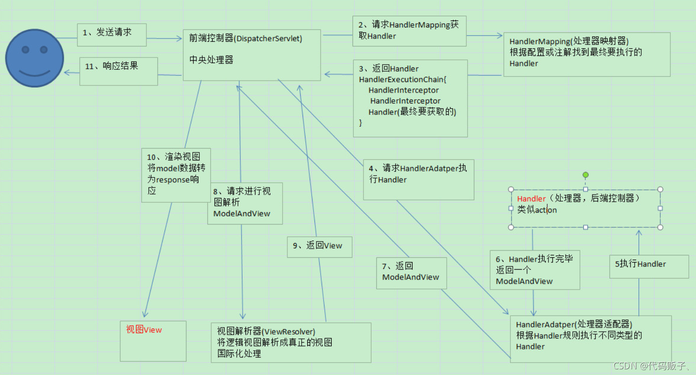
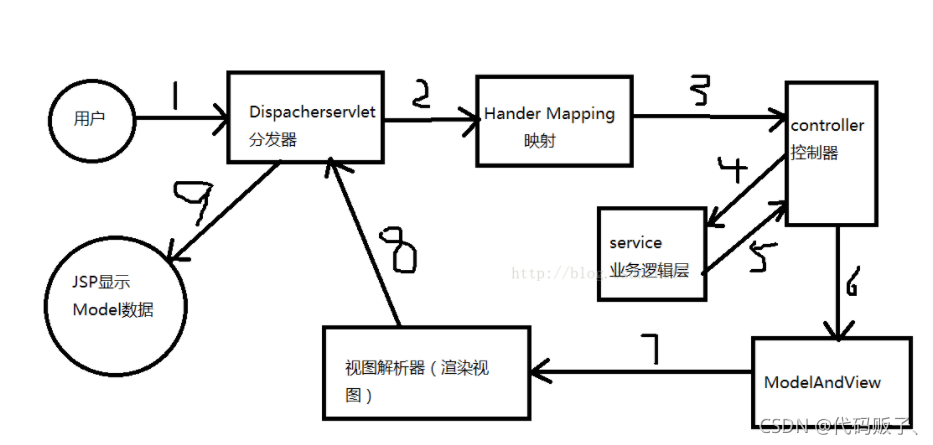
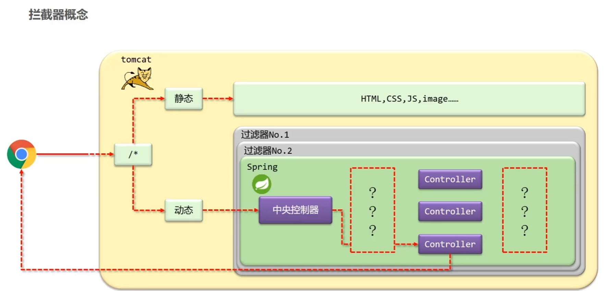
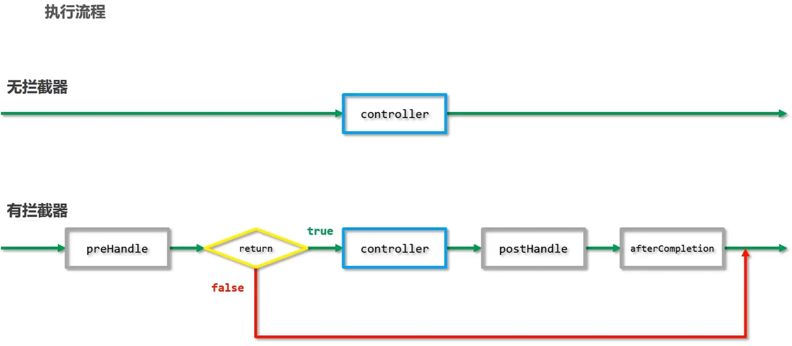
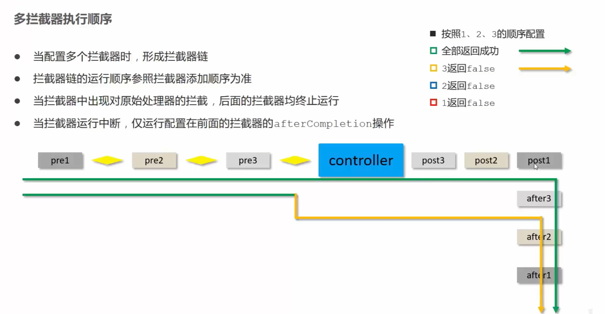

# 概述

Spring Web MVC 是基于 Servlet API 构建的原始 Web 框架，从一开始就包含在 Spring 框架中。正式名称“Spring Web MVC”来自其源模块的名称 ( [`spring-webmvc`](https://github.com/spring-projects/spring-framework/tree/main/spring-webmvc))，但更常见的名称是“Spring MVC”。

与 Spring Web MVC 并行，Spring Framework 5.0 引入了一个反应式堆栈 Web 框架，其名称“Spring WebFlux”也基于其源模块 ( [`spring-webflux`](https://github.com/spring-projects/spring-framework/tree/main/spring-webflux))。本章介绍 Spring Web MVC。

# 原理

## DispatcherServlet

Spring MVC和其他许多Web框架一样，是围绕前端控制器模式设计的，其中一个中央 `Servlet`，即 `DispatcherServlet`，为请求处理提供了一个共享算法，而实际工作则由可配置的委托组件执行。这种模式很灵活，支持多样化的工作流程。

`DispatcherServlet` 和其他Servlet一样，需要根据 `Servlet` 规范，使用Java配置或在 `web.xml` 中进行声明和映射。反过来，`DispatcherServlet` 使用Spring配置来发现它在请求映射、视图解析、异常处理 [等](https://springdoc.cn/spring/web.html#mvc-servlet-special-bean-types) 方面需要的委托组件。

下面这个Java配置的例子注册并初始化了 `DispatcherServlet`，它是由Servlet容器自动检测到的（见 [Servlet 配置](https://springdoc.cn/spring/web.html#mvc-container-config)）：

```java
public class MyWebApplicationInitializer implements WebApplicationInitializer {

    @Override
    public void onStartup(ServletContext servletContext) {

        // Load Spring web application configuration
        AnnotationConfigWebApplicationContext context = new AnnotationConfigWebApplicationContext();
        context.register(AppConfig.class);

        // Create and register the DispatcherServlet
        DispatcherServlet servlet = new DispatcherServlet(context);
        ServletRegistration.Dynamic registration = servletContext.addServlet("app", servlet);
        registration.setLoadOnStartup(1);
        registration.addMapping("/app/*");
    }
}
```

以下是 `web.xml` 配置的例子，它注册并初始化了 `DispatcherServlet`：

```xml
<web-app>

    <listener>
        <listener-class>org.springframework.web.context.ContextLoaderListener</listener-class>
    </listener>

    <context-param>
        <param-name>contextConfigLocation</param-name>
        <param-value>/WEB-INF/app-context.xml</param-value>
    </context-param>

    <servlet>
        <servlet-name>app</servlet-name>
        <servlet-class>org.springframework.web.servlet.DispatcherServlet</servlet-class>
        <init-param>
            <param-name>contextConfigLocation</param-name>
            <param-value></param-value>
        </init-param>
        <load-on-startup>1</load-on-startup>
    </servlet>

    <servlet-mapping>
        <servlet-name>app</servlet-name>
        <url-pattern>/app/*</url-pattern>
    </servlet-mapping>

</web-app>
```

> Spring Boot遵循不同的初始化顺序。**Spring Boot不是挂入Servlet容器的生命周期，而是使用Spring配置来启动自己和嵌入式Servlet容器**。`Filter` 和 `Servlet` 声明在Spring配置中被检测到，并在Servlet容器中注册。

# 上下文层次结构

`DispatcherServlet` 期望有一个 `WebApplicationContext`（普通 `ApplicationContext` 的扩展）用于自己的配置。`WebApplicationContext` 有一个与 `ServletContext` 和与之相关的 `Servlet` 的链接。它也被绑定到 `ServletContext`，这样应用程序就可以使用 `RequestContextUtils` 上的静态方法来查询 `WebApplicationContext`，如果他们需要访问它的话。

对于许多应用程序，有一个单一的 `WebApplicationContext` 是简单的，也是足够的。也可以有一个上下文层次结构，一个根 `WebApplicationContext` 被多个 `DispatcherServlet`（或其他 `Servlet`）实例共享，每个实例都有自己的子 `WebApplicationContext` 配置。参见 [`ApplicationContext` 的附加功能](https://springdoc.cn/spring/core.html#context-introduction) ，以了解更多关于上下文层次结构的特性。

根（root） `WebApplicationContext` 通常包含基础设施Bean，例如需要在多个 `Servlet` 实例中共享的数据存储库和业务服务。这些Bean有效地被继承，并且可以在 `Servlet` 特定的子 `WebApplicationContext` 中被重写（也就是重新声明），该 `WebApplicationContext` 通常包含给定 `Servlet` 的本地Bean。下面的图片显示了这种关系：


下面的例子配置了一个 `WebApplicationContext` 的层次结构：

```java
public class MyWebAppInitializer extends AbstractAnnotationConfigDispatcherServletInitializer {

    @Override
    protected Class<?>[] getRootConfigClasses() {
        return new Class<?>[] { RootConfig.class };
    }

    @Override
    protected Class<?>[] getServletConfigClasses() {
        return new Class<?>[] { App1Config.class };
    }

    @Override
    protected String[] getServletMappings() {
        return new String[] { "/app1/*" };
    }
}
```

> 如果不需要应用上下文层次结构，应用程序可以通过 `getRootConfigClasses()` 返回所有配置，并从 `getServletConfigClasses()` 返回 `null` 配置。

下面的例子显示了 `web.xml` 的等价物：

```xml
<web-app>

    <listener>
        <listener-class>org.springframework.web.context.ContextLoaderListener</listener-class>
    </listener>

    <context-param>
        <param-name>contextConfigLocation</param-name>
        <param-value>/WEB-INF/root-context.xml</param-value>
    </context-param>

    <servlet>
        <servlet-name>app1</servlet-name>
        <servlet-class>org.springframework.web.servlet.DispatcherServlet</servlet-class>
        <init-param>
            <param-name>contextConfigLocation</param-name>
            <param-value>/WEB-INF/app1-context.xml</param-value>
        </init-param>
        <load-on-startup>1</load-on-startup>
    </servlet>

    <servlet-mapping>
        <servlet-name>app1</servlet-name>
        <url-pattern>/app1/*</url-pattern>
    </servlet-mapping>

</web-app>
```

> 如果不需要 application context 层次结构，应用程序可以只配置一个 “root” context，并将 `contextConfigLocation` Servlet参数留空。

# 特殊 Bean 类

`DispatcherServlet` 委托给特殊的Bean来处理请求并呈现适当的响应。我们所说的 "特殊Bean" 是指实现框架契约的Spring管理的 `Object` 实例。这些实例通常有内置的约定，但你可以自定义它们的属性，并扩展或替换它们。

下表列出了由 `DispatcherServlet` 检测到的特殊Bean类：

| Bean 类型                                                    | 说明                                                         |
| :----------------------------------------------------------- | :----------------------------------------------------------- |
| `HandlerMapping`                                             | 将一个请求和一个用于前后处理的[拦截器](https://springdoc.cn/spring/web.html#mvc-handlermapping-interceptor) 列表一起映射到一个处理程序（handler）。该映射基于一些标准，其细节因 `HandlerMapping` 的实现而异。两个主要的 `HandlerMappin` 实现是 `RequestMappingHandlerMapping`（支持 `@RequestMapping` 注解的方法）和 `SimpleUrlHandlerMapping`（维护 URI path pattern 到处理程序（handler）的明确注册）。 |
| `HandlerAdapter`                                             | 帮助 `DispatcherServlet` 调用映射到请求的处理程序（handler），不管处理程序实际上是如何被调用的。例如，调用一个有注解的controller需要解析注解的问题。`HandlerAdapter` 的主要目的是将 `DispatcherServlet` 从这些细节中屏蔽掉。 |
| [`HandlerExceptionResolver`](https://springdoc.cn/spring/web.html#mvc-exceptionhandlers) | 解决异常的策略，可能将它们映射到处理程序、HTML error 视图或其他目标。请参阅 [Exceptions](https://springdoc.cn/spring/web.html#mvc-exceptionhandlers)。 |
| [`ViewResolver`](https://springdoc.cn/spring/web.html#mvc-viewresolver) | 将处理程序返回的基于 `String` 的逻辑视图名称解析为实际的 `View`（视图），并将其渲染到响应。参见 [视图（View）解析](https://springdoc.cn/spring/web.html#mvc-viewresolver) 和 [视图技术](https://springdoc.cn/spring/web.html#mvc-view)。 |
| [`LocaleResolver`](https://springdoc.cn/spring/web.html#mvc-localeresolver), [LocaleContextResolver](https://springdoc.cn/spring/web.html#mvc-timezone) | 解析客户端使用的 `Locale`，可能还有他们的时区，以便能够提供国际化的视图。参见 [Locale](https://springdoc.cn/spring/web.html#mvc-localeresolver)。 |
| [`ThemeResolver`](https://springdoc.cn/spring/web.html#mvc-themeresolver) | 解析你的web应用可以使用的主题（theme）--例如，提供个性化的布局。见 [主题（Theme）](https://springdoc.cn/spring/web.html#mvc-themeresolver)。 |
| [`MultipartResolver`](https://springdoc.cn/spring/web.html#mvc-multipart) | 在一些 multipart 解析库的帮助下，解析一个 multipart 请求（例如，浏览器表单文件上传）的抽象。参见 [Multipart 解析器](https://springdoc.cn/spring/web.html#mvc-multipart)。 |
| [`FlashMapManager`](https://springdoc.cn/spring/web.html#mvc-flash-attributes) | 存储和检索 "输入" 和 "输出" `FlashMap`，可用于将属性从一个请求传递到另一个请求，通常跨越重定向。见 [Flash Attributes](https://springdoc.cn/spring/web.html#mvc-flash-attributes)。 |

# Web 配置

应用程序可以声明在 [特殊的 Bean 类型](https://springdoc.cn/spring/web.html#mvc-servlet-special-bean-types) 中列出的处理请求所需的基础设施 Bean。 `DispatcherServlet` 检查 `WebApplicationContext` 中的每个特殊Bean。如果没有匹配的Bean类型，它将回到 [`DispatcherServlet.properties`](https://github.com/spring-projects/spring-framework/tree/main/spring-webmvc/src/main/resources/org/springframework/web/servlet/DispatcherServlet.properties) 中所列的默认类型。

在大多数情况下，[MVC 配置](https://springdoc.cn/spring/web.html#mvc-config) 是最好的起点。它用Java或XML声明所需的Bean，并提供一个更高级别的配置回调（callback）API来定制它。

> Spring Boot依靠MVC Java配置来配置Spring MVC，并提供许多额外的便利选项。

在Servlet环境中，你可以选择以编程方式配置Servlet容器，作为一种选择，或者与 `web.xml` 文件相结合。下面的例子注册了一个 `DispatcherServlet`：

```java
public class MyWebApplicationInitializer implements WebApplicationInitializer {

    @Override
    public void onStartup(ServletContext container) {
        XmlWebApplicationContext appContext = new XmlWebApplicationContext();
        appContext.setConfigLocation("/WEB-INF/spring/dispatcher-config.xml");

        ServletRegistration.Dynamic registration = container.addServlet("dispatcher", new DispatcherServlet(appContext));
        registration.setLoadOnStartup(1);
        registration.addMapping("/");
    }
}
```

`WebApplicationInitializer` 是Spring MVC提供的一个接口，它可以确保你的实现被检测到并自动用于初始化任何Servlet 3容器。`WebApplicationInitializer` 的一个抽象基类实现名为 `AbstractDispatcherServletInitializer`，通过覆盖指定 `Servlet` 映射（mapping）和 `DispatcherServlet` 配置位置的方法，使得注册 `DispatcherServlet` 更加容易。

对于使用基于Java的Spring配置的应用程序，建议这样做，如下例所示：

```java
public class MyWebAppInitializer extends AbstractAnnotationConfigDispatcherServletInitializer {

    @Override
    protected Class<?>[] getRootConfigClasses() {
        return null;
    }

    @Override
    protected Class<?>[] getServletConfigClasses() {
        return new Class<?>[] { MyWebConfig.class };
    }

    @Override
    protected String[] getServletMappings() {
        return new String[] { "/" };
    }
}
```

如果你使用基于XML的Spring配置，你应该直接从 `AbstractDispatcherServletInitializer` 扩展，如下例所示：

```java
public class MyWebAppInitializer extends AbstractDispatcherServletInitializer {

    // ...

    @Override
    protected Filter[] getServletFilters() {
        return new Filter[] {
            new HiddenHttpMethodFilter(), new CharacterEncodingFilter() };
    }
}
```

每个 filter 都根据其具体类型添加了一个默认名称（name），并自动映射到 `DispatcherServlet`。

`AbstractDispatcherServletInitializer` 的 `isAsyncSupported` protected 方法提供了一个单一的地方来启用对 `DispatcherServlet` 和所有映射到它的 filter 的异步支持。默认情况下，这个标志被设置为 `true`。

最后，如果你需要进一步定制 `DispatcherServlet` 本身，你可以复写 `createDispatcherServlet` 方法。

# 流程

`DispatcherServlet` 处理请求的方式如下：

+ `WebApplicationContext` 被搜索并作为一个属性（attribute）绑定在请求（request）中，controller和进程中的其他元素可以使用。它默认被绑定在 `DispatcherServlet.WEB_APPLICATION_CONTEXT_ATTRIBUTE` key 下。
+ locale 解析器被绑定到请求上，以便让流程中的元素在处理请求（渲染视图、准备数据等）时解析要使用的 locale。如果你不需要locale解析，你就不需要 locale 解析器（resolver）。
+ theme 解析器被绑定在请求上，以让诸如视图等元素决定使用哪个主题。如果你不使用主题，你可以忽略它。
+ 如果你指定了一个 multipart file 解析器，请求将被检查为 multipart file。如果发现了multipart，该请求将被包裹在一个 `MultipartHttpServletRequest` 中，以便由流程中的其他元素进一步处理。关于 multipart 处理的进一步信息，请参见 [Multipart 解析器](https://springdoc.cn/spring/web.html#mvc-multipart) 。
+ 一个适当的处理程序（handler）被搜索到。如果找到一个处理程序，与该处理程序相关的执行链（预处理程序、后处理程序和 controller）被运行，以准备渲染的模型（model）。另外，==对于有注解的 controller，响应可以被渲染（在 `HandlerAdapter` 中）而不是返回一个视图==。
+ 如果有 model 返回，视图就会被渲染。如果没有返回 model（也许是由于预处理器或后处理器拦截了请求，也许是出于安全原因），就不会渲染视图，因为该请求可能已经被满足了。

在 `WebApplicationContext` 中声明的 `HandlerExceptionResolver` Bean被用来解决请求处理过程中抛出的异常。这些异常解析器允许自定义处理异常的逻辑。更多的细节请看 [Exceptions](https://springdoc.cn/spring/web.html#mvc-exceptionhandlers)。

对于HTTP缓存支持，处理程序可以使用 `WebRequest` 的 `checkNotModified` 方法，以及《[Controller 的HTTP缓存](https://springdoc.cn/spring/web.html#mvc-caching-etag-lastmodified)》中描述的注解 controller 的进一步选项。

你可以通过在 `web.xml` 文件的 Servlet 声明中添加 Servlet 初始化参数（`init-param` 元素）来定制单个 `DispatcherServlet` 实例。下表列出了支持的参数：

| 参数                             | 说明                                                         |
| :------------------------------- | :----------------------------------------------------------- |
| `contextClass`                   | 实现 `ConfigurableWebApplicationContext` 的类，将由该Servlet实例化和本地配置。默认情况下，使用 `XmlWebApplicationContext`。 |
| `contextConfigLocation`          | 传递给上下文实例（由 `contextClass` 指定）的字符串，表示可以在哪里找到上下文。该字符串可能由多个字符串组成（使用逗号作为分隔符）以支持多个上下文。如果多个上下文位置的bean被定义了两次，那么最新的位置优先。 |
| `namespace`                      | `WebApplicationContext` 的命名空间。默认为 `[servlet-name]-servlet`。 |
| `throwExceptionIfNoHandlerFound` | 当一个请求没有找到处理程序（handler）时，是否会抛出 `NoHandlerFoundException`。然后可以用 `HandlerExceptionResolver`（例如，通过使用 `@ExceptionHandler` controller 方法）来捕获该异常，并像其他一样处理。默认情况下，这被设置为 `false`，在这种情况下，`DispatcherServlet` 将响应状态设置为404（`NOT_FOUND`）而不引发异常。请注意，如果 [default servlet handling](https://springdoc.cn/spring/web.html#mvc-default-servlet-handler) 也被配置了，未解析的请求总是被转发到 default servlet，并且永远不会出现404。 |

# 路径匹配

Servlet API将完整的请求路径作为 `requestURI` 公开，并进一步将其细分为 `contextPath`、`servletPath` 和 `pathInfo`，其值因Servlet的映射方式而异。从这些输入中，Spring MVC 需要确定用于映射处理程序（handler）的查找路径，如果适用的话，应该排除 `contextPath` 和任何 `servletMapping` 前缀。

`servletPath` 和 `pathInfo` 是经过解码的，这使得它们不可能直接与完整的 `requestURI` 进行比较以得出 `lookupPath`，这使得有必要对 `requestURI` 进行解码。然而，这也引入了自己的问题，因为路径可能包含编码的保留字符，如 `"/"` 或 `";"`，在它们被解码后又会改变路径的结构，这也会导致安全问题。此外，Servlet容器可能会在不同程度上对 `servletPath` 进行规范化处理，这使得它进一步无法对 `requestURI` 进行 `startsWith` 比较。

这就是为什么最好避免依赖基于前缀的 `servletPath` 映射类型所带来的 `servletPath`。如果 `DispatcherServlet` 被映射为带有 `"/"` 的默认 Servlet，或者没有 `"/*"` 的前缀，并且Servlet容器是4.0以上的，那么Spring MVC就能够检测到Servlet映射类型，并完全避免使用 `servletPath` 和 `pathInfo`。在3.1的Servlet容器上，假设有相同的Servlet映射类型，可以通过MVC配置中的 [路径（Path）匹配](https://springdoc.cn/spring/web.html#mvc-config-path-matching)，提供一个 `alwaysUseFullPath=true` 的 `UrlPathHelper` 来实现。

幸运的是，默认的Servlet映射 `"/"` 是一个不错的选择。然而，仍然有一个问题，即 `requestURI` 需要被解码，以便能够与 controller 映射（mapping）进行比较。这也是不可取的，因为有可能对改变路径结构的保留字符进行解码。如果这些字符不被期望，那么你可以拒绝它们（就像Spring Security HTTP 防火墙），或者你可以将 `UrlPathHelper` 配置为 `urlDecode=false`，但 controller 映射需要与编码后的路径相匹配，这可能并不总是很好。此外，有时 `DispatcherServlet` 需要与另一个Servlet共享URL空间，可能需要按前缀进行映射。

在使用 `PathPatternParser` 和解析的pattern时，上述问题得到了解决，因为它可以替代 `AntPathMatcher` 的字符串路径匹配。`PathPatternParser` 从5.3版本开始就可以在Spring MVC中使用，并且从6.0版本开始默认启用。`AntPathMatcher` 需要对查找路径进行解码或对 controller 映射进行编码，与此不同的是，经过解析的 `PathPattern` 与称为 `RequestPath` 的路径的解析表示相匹配，一次一个路径段。这允许对路径段的值进行单独解码和消毒，而不存在改变路径结构的风险。Parsed `PathPattern` 还支持使用 `servletPath` 前缀映射，只要使用Servlet路径映射，并且前缀保持简单，即没有编码的字符。关于pattern语法的细节和比较，见 [Pattern 比较](https://springdoc.cn/spring/web.html#mvc-ann-requestmapping-pattern-comparison)。

# 拦截

所有 `HandlerMapping` 的实现都支持 handler 拦截器，当你想对某些请求应用特定的功能时，这些拦截器是非常有用的—例如，检查一个 principal。拦截器必须实现 `org.springframework.web.servlet` 包中的 `HandlerInterceptor`，它有三个方法，应该可以提供足够的灵活性来进行各种预处理和后处理：

+ `preHandle(..)`: 在实际 handler 运行之前
+ `postHandle(..)`: handler 运行后
+ `afterCompletion(..)`: 在整个请求完成后

`preHandle(..)` 方法返回一个boolean值。你可以使用这个方法来中断或继续执行链的处理。当这个方法返回 `true` 时，handler 执行链继续进行。当它返回 `false` 时， `DispatcherServlet` 认为拦截器本身已经处理了请求（例如，渲染了一个适当的视图），并且不继续执行其他拦截器和执行链中的实际 handler。

关于如何配置拦截器的例子，请参见MVC配置部分的 [拦截器](https://springdoc.cn/spring/web.html#mvc-config-interceptors)。你也可以通过使用个别 `HandlerMapping` 实现的setters来直接注册它们。

`postHandle` 方法在 `@ResponseBody` 和 `ResponseEntity` 方法中用处不大，因为这些方法的响应是在 `HandlerAdapter` 中和 `postHandle` 之前写入和提交的。这意味着对响应进行任何修改都太晚了，比如添加一个额外的 header。对于这种情况，你可以实现 `ResponseBodyAdvice`，并把它声明为一个 [Controller Advice](https://springdoc.cn/spring/web.html#mvc-ann-controller-advice) Bean，或者直接在 `RequestMappingHandlerAdapter` 上配置它。

# 异常

如果在请求映射过程中发生异常或从请求处理程序（如 `@Controller`）抛出异常， `DispatcherServlet` 会委托给处理程序异常解析器（`HandlerExceptionResolver`）Bean链来解析异常并提供替代处理，这通常是一个错误响应。

下表列出了可用的 `HandlerExceptionResolver` 实现：

| `HandlerExceptionResolver`                                   | 说明                                                         |
| :----------------------------------------------------------- | :----------------------------------------------------------- |
| `SimpleMappingExceptionResolver`                             | 异常类名称和错误视图名称之间的映射。对于在浏览器应用程序中渲染错误页面非常有用。 |
| [`DefaultHandlerExceptionResolver`](https://docs.spring.io/spring-framework/docs/6.0.8-SNAPSHOT/javadoc-api/org/springframework/web/servlet/mvc/support/DefaultHandlerExceptionResolver.html) | 解析由Spring MVC引发的异常，并将其映射到HTTP状态码。也请参见替代的 `ResponseEntityExceptionHandler` 和 [Error 响应（Response）](https://springdoc.cn/spring/web.html#mvc-ann-rest-exceptions)。 |
| `ResponseStatusExceptionResolver`                            | 解析带有 `@ResponseStatus` 注解的异常，并根据注解中的值将其映射到HTTP状态码。 |
| `ExceptionHandlerExceptionResolver`                          | 通过调用 `@Controller` 或 `@ControllerAdvice` 类中的 `@ExceptionHandler` 方法来解析异常。参见 [@ExceptionHandler methods](https://springdoc.cn/spring/web.html#mvc-ann-exceptionhandler)。 |

## 解析器链

你可以通过在Spring配置中声明多个 `HandlerExceptionResolver` Bean并根据需要设置它们的 `order` 属性来形成一个异常解析器链。`order` 属性越高，异常解析器的定位就越靠后。

`HandlerExceptionResolver` 的约定，它可以返回：

+ 一个指向错误视图的 `ModelAndView`。
+ 如果异常在解析器中被处理，则是一个空（empty）的 `ModelAndView`。
+ 如果异常仍未被解决，则为 `null`，供后续的解析器尝试，如果异常仍在最后，则允许冒泡到Servlet容器中。

[MVC 配置](https://springdoc.cn/spring/web.html#mvc-config) 自动为默认的Spring MVC异常、`@ResponseStatus` 注解的异常以及 `@ExceptionHandler` 方法的支持声明了内置解析器。你可以自定义该列表或替换它。

## 错误页面

如果一个异常仍然没有被任何 `HandlerExceptionResolver` 解析，因此，任其传播，或者如果响应状态被设置为错误状态（即4xx，5xx），Servlet容器可以在HTML中渲染一个默认的错误页面。为了定制容器的默认错误页面，你可以在 `web.xml` 中声明一个错误页面映射。下面的例子显示了如何做到这一点：

```xml
<error-page>
    <location>/error</location>
</error-page>
```

鉴于前面的例子，当一个异常冒出来或者响应有错误状态时，Servlet容器在容器内向配置的URL（例如，`/error`）进行 ERROR 调度。然后由 `DispatcherServlet` 进行处理，可能会将其映射到一个 `@Controller`，它可以被实现为返回一个带有model的错误视图名称或渲染一个JSON响应，如下例所示：

```java
@RestController
public class ErrorController {

    @RequestMapping(path = "/error")
    public Map<String, Object> handle(HttpServletRequest request) {
        Map<String, Object> map = new HashMap<>();
        map.put("status", request.getAttribute("jakarta.servlet.error.status_code"));
        map.put("reason", request.getAttribute("jakarta.servlet.error.message"));
        return map;
    }
}
```

> Servlet API并没有提供在Java中创建错误页面映射的方法。然而，你可以同时使用 `WebApplicationInitializer` 和一个最小的 `web.xml`。

# 视图

Spring MVC定义了 `ViewResolver` 和 `View` 接口，让你在浏览器中渲染模型，而不需要绑定到特定的视图技术。`ViewResolver` 提供了视图名称和实际视图之间的映射。`View` 解决了在移交给特定视图技术之前的数据准备问题。

下表提供了关于 `ViewResolver` 层次结构的更多细节：

| ViewResolver                     | 说明                                                         |
| :------------------------------- | :----------------------------------------------------------- |
| `AbstractCachingViewResolver`    | `AbstractCachingViewResolver` 的子类会缓存它们所解析的视图实例。缓存可以提高某些视图技术的性能。你可以通过将 `cache` 属性设置为 `false` 来关闭缓存。此外，如果你必须在运行时刷新某个视图（例如，当 `FreeMarker` 模板被修改时），你可以使用 `removeFromCache(String viewName, Locale loc)` 方法。 |
| `UrlBasedViewResolver`           | `ViewResolver` 接口的简单实现，无需明确的映射定义就能实现逻辑视图名称与URL的直接解析。如果你的逻辑名称与你的视图资源的名称直接匹配，而不需要任意的映射，这就很合适。 |
| `InternalResourceViewResolver`   | `UrlBasedViewResolver` 的方便子类，支持 `InternalResourceView`（实际上是Servlets和JSP）和子类，如 `JstlView`。你可以通过使用 `setViewClass(..)` 为这个解析器生成的所有视图指定视图类。请参阅 [`UrlBasedViewResolver`](https://docs.spring.io/spring-framework/docs/6.0.8-SNAPSHOT/javadoc-api/org/springframework/web/reactive/result/view/UrlBasedViewResolver.html) javadoc 了解详情。 |
| `FreeMarkerViewResolver`         | `UrlBasedViewResolver` 的方便子类，支持 `FreeMarkerView` 和它们的自定义子类。 |
| `ContentNegotiatingViewResolver` | `ViewResolver` 接口的实现，根据请求文件名或 `Accept` 头来解析视图。参见 [内容协商](https://springdoc.cn/spring/web.html#mvc-multiple-representations)。 |
| `BeanNameViewResolver`           | `ViewResolver` 接口的实现，它将视图名称解释为当前应用程序上下文中的bean名称。这是一个非常灵活的变体，可以根据不同的视图名称混合和匹配不同的视图类型。每个这样的 `View` 都可以被定义为Bean，例如在XML或配置类中。 |

## 处理

可以通过声明一个以上的解析器Bean来实现视图解析器链，如果有必要，还可以通过设置 `order` 属性来指定排序。记住，顺序属性越高，视图解析器在链中的位置就越靠后。

`ViewResolver` 的约定，它可以返回 `null` 以表示找不到视图。然而，在JSP和 `InternalResourceViewResolver` 的情况下，弄清JSP是否存在的唯一方法是通过 `RequestDispatcher` 进行调度。因此，你必须始终将 `InternalResourceViewResolver` 配置为视图解析器整体顺序中的最后一个。

配置视图解析就像在Spring配置中添加 `ViewResolver` Bean一样简单。[MVC 配置](https://springdoc.cn/spring/web.html#mvc-config) 为 [视图（View）解析器](https://springdoc.cn/spring/web.html#mvc-config-view-resolvers) 和添加无逻辑的 [视图控制器（View Controller）](https://springdoc.cn/spring/web.html#mvc-config-view-controller) 提供了专门的配置API，这对于没有控制器逻辑的HTML模板渲染非常有用。

## 重定向

视图名称中特殊的 `redirect:` 前缀可以让你执行重定向。 `UrlBasedViewResolver`（和它的子类）将其识别为一个需要重定向的指令。视图名称的其余部分是重定向的URL。

净效果与controller返回 `RedirectView` 的效果相同，但现在controller本身可以在逻辑视图名称方面操作。逻辑视图名称（如 `redirect:/myapp/some/resource`）是相对于当前 Servlet context 重定向的，而 `redirect:https://myhost.com/some/arbitrary/path` 则是重定向到一个绝对URL。

请注意，如果一个 controller 方法被 `@ResponseStatus` 注解，该注解值优先于 `RedirectView` 设置的响应状态。

## 转发

你也可以对最终由 `UrlBasedViewResolver` 和子类解析的视图名称使用一个特殊的 `forward:` 前缀。这将创建一个 `InternalResourceView`，它做一个 `RequestDispatcher.forward()`。因此，这个前缀对 `InternalResourceViewResolver` 和 `InternalResourceView`（用于JSP）没有用处，但如果你使用另一种视图技术，但仍然想强制转发一个资源，由Servlet/JSP引擎处理，那么它就会有帮助。请注意，你也可以用链式的多个视图解析器来代替。

## 内容协商

[`ContentNegotiatingViewResolver`](https://docs.spring.io/spring-framework/docs/6.0.8-SNAPSHOT/javadoc-api/org/springframework/web/servlet/view/ContentNegotiatingViewResolver.html) 本身并不解析视图，而是委托给其他视图解析器，并选择与客户端请求的表示相近的视图。表示法可以从 `Accept` 头或查询参数（例如，`"/path?format=pdf"`）确定。

`ContentNegotiatingViewResolver` 通过比较请求的 `Content-Type` 和与其每个 `ViewResolvers` 相关的 `View` 所支持的媒体类型（也称为 `Content-Type`）来选择一个合适的 `View` 来处理请求。列表中第一个具有兼容的内容类型的视图将表示返回给客户端。如果 `ViewResolver` 链不能提供兼容的视图，就会查询通过 `DefaultViews` 属性指定的视图列表。后面这个选项适用于 singleton `Views`，它可以渲染当前资源的适当表示，而不考虑逻辑视图的名称。`Accept` 头可以包括通配符（例如 `text/*`），在这种情况下，`Content-Type` 为 `text/xml` 的 `View` 是一个兼容的匹配。

有关配置细节，请参见 [MVC 配置](https://springdoc.cn/spring/web.html#mvc-config) 下的 [视图（View）解析器](https://springdoc.cn/spring/web.html#mvc-config-view-resolvers) 。

# Locale

Spring架构的大多数部分都支持国际化，正如Spring Web MVC框架一样。 `DispatcherServlet` 让你通过使用客户端的 locale 自动解析消息（message）。这是由 `LocaleResolver` 对象完成的。

当一个请求进来时，`DispatcherServlet` 会寻找一个 locale 解析器，如果它找到一个，它就会尝试用它来设置locale。通过使用 `RequestContext.getLocale()` 方法，你总是可以检索到由locale解析器解析的locale。

除了自动解析 locale，你还可以在处理程序（handler）映射中附加一个拦截器（关于处理程序映射拦截器的更多信息，见 [拦截](https://springdoc.cn/spring/web.html#mvc-handlermapping-interceptor)），以便在特定情况下（例如，基于请求中的参数）改变语言。

Locale 解析器和拦截器定义在 `org.springframework.web.servlet.i18n` 包中，并以正常方式在 application context 中进行配置。以下是Spring 中 locale 解析器。

+ [时区（Time Zone）](https://springdoc.cn/spring/web.html#mvc-timezone)
+ [Header 解析器](https://springdoc.cn/spring/web.html#mvc-localeresolver-acceptheader)
+ [Cookie 解析器](https://springdoc.cn/spring/web.html#mvc-localeresolver-cookie)
+ [Session 解析器](https://springdoc.cn/spring/web.html#mvc-localeresolver-session)
+ [Locale 拦截器](https://springdoc.cn/spring/web.html#mvc-localeresolver-interceptor)

## 时区

除了获得客户端的locale之外，知道它的时区也常常是有用的。 `LocaleContextResolver` 接口提供了对 `LocaleResolver` 的扩展，让解析器提供一个更丰富的 `LocaleContext`，其中可能包括时区信息。

当可用时，用户的 `TimeZone` 可以通过使用 `RequestContext.getTimeZone()` 方法获得。时区信息会被任何与Spring的 `ConversionService` 注册的 Date/Time `Converter` 和格 `Formatter` 对象自动使用。

## Header 解析器

这个 locale resolver 检查由客户端（例如，一个Web浏览器）发送的请求中的 `accept-language` 头。通常，这个头字段包含了客户的操作系统的 locale。请注意，这个解析器不支持时区信息。

## Cookie 解析器

这个locale解析器检查客户端上可能存在的 `Cookie`，看是否指定了 `Locale` 或 `TimeZone`。如果有，它就会使用指定的细节。通过使用这个locale 解析器的属性，你可以指定 cookie name 以及 maximum age。下面的例子定义了一个 `CookieLocaleResolver`：

```xml
<bean id="localeResolver" class="org.springframework.web.servlet.i18n.CookieLocaleResolver">

    <property name="cookieName" value="clientlanguage"/>

    <!-- in seconds. If set to -1, the cookie is not persisted (deleted when browser shuts down) -->
    <property name="cookieMaxAge" value="100000"/>

</bean>
```

下表描述了 `CookieLocaleResolver` 的属性：

| 属性           | 默认                 | 说明                                                         |
| :------------- | :------------------- | :----------------------------------------------------------- |
| `cookieName`   | 类名 + LOCALE        | cookie 名                                                    |
| `cookieMaxAge` | Servlet 容器的默认值 | 一个cookie在客户端上持续存在的最长时间。如果指定为 `-1`，cookie将不会被持久化。它只在客户端关闭浏览器之前可用。 |
| `cookiePath`   | /                    | 将cookie的可见性限制在你网站的某个部分。当 `cookiePath` 被指定时，cookie只对该路径和它下面的路径可见。 |

## Session 解析器

`SessionLocaleResolver` 让你从可能与用户请求有关的会话中检索 `Locale` 和 `TimeZone`。与 `CookieLocaleResolver` 不同的是，这个策略将本地选择的 locale 设置存储在 Servlet 容器的 `HttpSession` 中。因此，这些设置在每个会话中都是临时的，因此在每个会话结束时都会丢失。

注意，与外部会话管理机制（如Spring Session 项目）没有直接关系。这个 `SessionLocaleResolver` 针对当前的 `HttpServletRequest` 评估并修改相应的 `HttpSession` 属性。

## Loacle 拦截器

你可以通过将 `LocaleChangeInterceptor` 添加到 `HandlerMapping` 定义中的一个来启用更改 locale。它检测请求中的一个参数，并相应地改变locale，在调度器的应用上下文中调用 `LocaleResolver` 的 `setLocale` 方法。下一个例子显示，对所有包含名为 `siteLanguage` 的参数的 `*.view` 资源的调用现在会改变 locale。因此，例如，对URL的请求， `https://www.sf.net/home.view?siteLanguage=nl`，将网站语言改为荷兰语。下面的例子显示了如何拦截 locale：

```xml
<bean id="localeChangeInterceptor"
        class="org.springframework.web.servlet.i18n.LocaleChangeInterceptor">
    <property name="paramName" value="siteLanguage"/>
</bean>

<bean id="localeResolver"
        class="org.springframework.web.servlet.i18n.CookieLocaleResolver"/>

<bean id="urlMapping"
        class="org.springframework.web.servlet.handler.SimpleUrlHandlerMapping">
    <property name="interceptors">
        <list>
            <ref bean="localeChangeInterceptor"/>
        </list>
    </property>
    <property name="mappings">
        <value>/**/*.view=someController</value>
    </property>
</bean>
```

# 主题

你可以应用Spring Web MVC框架的主题来设置你的应用程序的整体外观和感觉，从而增强用户体验。主题是一个静态资源的集合，通常是样式表和图片，它影响应用程序的视觉风格。

> 从6.0版本开始，对主题的支持已经被废弃，转而使用CSS，并且在服务器端没有任何特殊支持。

# Multipart 解析器

来自 `org.springframework.web.multipart` 包的 `MultipartResolver` 是一个解析包括文件上传在内的 multipart 请求的策略。有一个基于容器的 `StandardServletMultipartResolver` 实现，用于Servlet multipart 请求解析。请注意，基于Apache Commons FileUpload的过时的 `CommonsMultipartResolver` 已经不可用了，因为Spring Framework 6.0有新的Servlet 5.0+基线。

为了启用 multipart 处理，你需要在 `DispatcherServlet` 的Spring配置中声明一个 `MultipartResolver` Bean，名称为 `multipartResolver`。 `DispatcherServlet` 会检测到它并将其应用于传入的请求。当收到一个内容类型为 `multipart/form-data` 的POST时，解析器会将内容包裹在当前的 `HttpServletRequest` 中，作为一个 `MultipartHttpServletRequest` 来提供对解析文件的访问，此外还将 part 作为 request parameter 公开。

##### Servlet Multipart 解析

Servlet multipart 解析需要通过Servlet容器配置来启用。要做到这一点：

+ 在Java中，在Servlet注册上设置一个 `MultipartConfigElement`。
+ 在 `web.xml` 中，在servlet声明中添加一个 `"<multipart-config>"` 部分。

下面的例子显示了如何在Servlet注册上设置一个 `MultipartConfigElement`：

```java
public class AppInitializer extends AbstractAnnotationConfigDispatcherServletInitializer {

    // ...

    @Override
    protected void customizeRegistration(ServletRegistration.Dynamic registration) {

        // Optionally also set maxFileSize, maxRequestSize, fileSizeThreshold
        registration.setMultipartConfig(new MultipartConfigElement("/tmp"));
    }

}
```

一旦Servlet的 multipart configuration 到位，你可以添加一个名为 `multipartResolver` 的 `StandardServletMultipartResolver` 类型的bean。

> 这个解析器变体按原样使用你的Servlet容器的 multipart 解析器，可能会使应用程序暴露在容器实现的差异中。默认情况下，它将尝试用任何 HTTP 方法解析任何 `multipart/` content type，但这可能不受所有 Servlet 容器的支持。请参阅 [`StandardServletMultipartResolver`](https://docs.spring.io/spring-framework/docs/6.0.8-SNAPSHOT/javadoc-api/org/springframework/web/multipart/support/StandardServletMultipartResolver.html) javadoc 了解详情和配置选项。

# 日志

Spring MVC的DEBUG级日志被设计成紧凑、简约和人性化的。它专注于反复有用的高价值信息，而不是只有在调试特定问题时才有用的其他信息。

TRACE级别的日志通常遵循与DEBUG相同的原则（例如，也不应该是火烧眉毛），但可以用于调试任何问题。此外，一些日志信息在TRACE与DEBUG下可能会显示不同的细节水平。

好的日志来自于使用日志的经验。如果你发现任何不符合既定目标的地方，请让我们知道。

## 敏感数据

DEBUG 和 TRACE 日志可能会记录敏感信息。这就是为什么请求参数和header信息在默认情况下是被屏蔽的，它们的完整记录必须通过 `DispatcherServlet` 上的 `enableLoggingRequestDetails` 属性明确启用。

下面的例子显示了如何通过使用Java配置来做到这一点：

```java
public class MyInitializer
        extends AbstractAnnotationConfigDispatcherServletInitializer {

    @Override
    protected Class<?>[] getRootConfigClasses() {
        return ... ;
    }

    @Override
    protected Class<?>[] getServletConfigClasses() {
        return ... ;
    }

    @Override
    protected String[] getServletMappings() {
        return ... ;
    }

    @Override
    protected void customizeRegistration(ServletRegistration.Dynamic registration) {
        registration.setInitParameter("enableLoggingRequestDetails", "true");
    }

}
```

# 过滤器

## Form Data

浏览器只能通过 HTTP GET 或 HTTP POST 提交表单数据（form data），但非浏览器客户端也可以使用HTTP PUT、PATCH和DELETE。Servlet API要求 `ServletRequest.getParameter*()` 方法只支持HTTP POST的表单字段访问。

`spring-web` 模块提供了 `FormContentFilter` 来拦截内容类型为 `application/x-www-form-urlencoded` 的 HTTP PUT、PATCH 和 DELETE 请求，从 request body 中读取 form data，并包裹 `ServletRequest`，使 form data 通过 `ServletRequest.getParameter*()` 系列方法可用。

## Forwarded Header

求通过代理（如负载均衡器）时，host、port和scheme可能会发生变化，这使得从客户角度创建指向正确host、port和scheme的链接成为一种挑战。

[RFC 7239](https://tools.ietf.org/html/rfc7239) 定义了 `Forwarded` HTTP头，代理可以用它来提供关于原始请求的信息。还有其他非标准的头，包括 `X-Forwarded-Host`、`X-Forwarded-Port`、`X-Forwarded-Proto`、`X-Forwarded-SSL` 和 `X-Forwarded-Prefix`。

`ForwardedHeaderFilter` 是一个Servlet过滤器，它修改了请求，以便a）根据 `Forwarded` 头信息改变host、port和scheme，以及b）删除这些头信息以消除进一步的影响。这个过滤器依赖于对请求的包装，因此它必须排在其他过滤器的前面，比如 `RequestContextFilter`，它应该与修改后的请求而不是原始请求一起工作。

对 forwarded 头有安全方面的考虑，因为应用程序无法知道这些头是由代理添加的，还是由恶意的客户端添加的。这就是为什么在信任边界的代理应该被配置为删除来自外部的不被信任的 `Forwarded` 头信息。你也可以将 `ForwardedHeaderFilter` 配置为 `removeOnly=true`，在这种情况下，它将删除但不使用这些头信息。

为了支持 [异步请求](https://springdoc.cn/spring/web.html#mvc-ann-async) 和 error dispatch（调度），这个过滤器应该与 `DispatcherType.ASYNC` 和 `DispatcherType.ERROR` 进行映射。如果使用Spring框架的 `AbstractAnnotationConfigDispatcherServletInitializer`（见 [Servlet 配置](https://springdoc.cn/spring/web.html#mvc-container-config)），所有过滤器都会自动注册为所有的 dispatch 类型。然而，如果通过 `web.xml` 或在Spring Boot中通过 `FilterRegistrationBean` 注册过滤器，请确保除了 `DispatcherType.ASYNC` 和 `DispatcherType.ERROR` 之外，还要包括 `DispatcherType.REQUEST`。

## Shallow ETag

`ShallowEtagHeaderFilter` 通过缓存写入响应的内容并计算出MD5哈希值来创建一个 “shallow” ETag。客户端下次发送时，它做同样的事情，但它也将计算的值与 `If-None-Match` 请求头进行比较，如果两者相等，则返回304（NOT_MODIFIED）。

这种策略可以节省网络带宽，但不能节省CPU，因为必须为每个请求计算出完整的响应。前面描述的控制器层面的其他策略，可以避免计算的发生。参见 [HTTP 缓存](https://springdoc.cn/spring/web.html#mvc-caching)。

这个过滤器有一个 `writeWeakETag` 参数，可以配置该过滤器写入类似以下的 weak ETag： `W/"02a2d595e6ed9a0b24f027f2b63b134d6"`（如 [RFC 7232 Section 2.3](https://tools.ietf.org/html/rfc7232#section-2.3) 中所定义）。

为了支持 [异步请求](https://springdoc.cn/spring/web.html#mvc-ann-async)，这个过滤器必须用 `DispatcherType.ASYNC` 来映射，这样过滤器就可以延迟并成功地生成ETag到最后一个异步dispatch的结束。如果使用Spring框架的 `AbstractAnnotationConfigDispatcherServletInitializer`（见 [Servlet 配置](https://springdoc.cn/spring/web.html#mvc-container-config)），所有过滤器都会自动注册为所有的dispatch类型。然而，如果通过 `web.xml` 或Spring Boot中的 `FilterRegistrationBean` 注册过滤器，请确保包含 `DispatcherType.ASYNC`。

## CORS

Spring MVC通过控制器（controller）上的注解为CORS配置提供了细粒度的支持。然而，当与Spring Security一起使用时，我们建议依靠内置的 `CorsFilter`，它的 order 必须在 Spring Security 的过滤器链之前。

# 注解 Contoller

Spring MVC提供了一个基于注解的编程模型，其中 `@Controller` 和 `@RestController` 组件使用注解来表达请求映射、请求输入、异常处理等内容。注解的控制器具有灵活的方法签名，不需要继承基类，也不需要实现特定的接口。下面的例子显示了一个由注解定义的控制器（Controller）：

```java
@Controller
public class HelloController {

    @GetMapping("/hello")
    public String handle(Model model) {
        model.addAttribute("message", "Hello World!");
        return "index";
    }
}
```

在前面的例子中，该方法接受一个 `Model`，并返回一个 `String` 的视图名称，但也存在许多其他选项，在本章后面会有解释。

## 声明

你可以通过在Servlet的 `WebApplicationContext` 中使用标准的Spring Bean定义来定义 controller Bean。`@Controller` stereotype 允许自动检测，与Spring对检测 classpath 中的 `@Component` 类并为其自动注册bean定义的一般支持一致。它也是注解类的一个 stereotype，表明它是一个 web 组件。

为了实现对这种 `@Controller` Bean的自动检测，你可以在你的Java配置中添加组件扫描，如下例所示：

```xml
@Configuration
@ComponentScan("org.example.web")
public class WebConfig {

    // ...
}
```

下面的例子显示了前述例子的XML配置等效：

```xml
<?xml version="1.0" encoding="UTF-8"?>
<beans xmlns="http://www.springframework.org/schema/beans"
    xmlns:xsi="http://www.w3.org/2001/XMLSchema-instance"
    xmlns:p="http://www.springframework.org/schema/p"
    xmlns:context="http://www.springframework.org/schema/context"
    xsi:schemaLocation="
        http://www.springframework.org/schema/beans
        https://www.springframework.org/schema/beans/spring-beans.xsd
        http://www.springframework.org/schema/context
        https://www.springframework.org/schema/context/spring-context.xsd">

    <context:component-scan base-package="org.example.web"/>

    <!-- ... -->

</beans>
```

`@RestController` 是一个 [组成的注解](https://springdoc.cn/spring/core.html#beans-meta-annotations)，它本身是由 `@Controller` 和 `@ResponseBody` 组成的元注解，表示一个controller的每个方法都继承了类型级的 `@ResponseBody` 注解，因此，直接写入响应体，而不是用HTML模板进行视图解析和渲染。

### AOP 代理

在某些情况下，你可能需要在运行时用AOP代理来装饰一个controller。一个例子是，如果你选择在 controller 上直接使用 `@Transactional` 注解。在这种情况下，特别是对于controller，我们建议使用基于类的代理，这种注解会自动出现在直接出现在 controller 上。

如果 controller 实现了一个接口，并且需要AOP代理，你可能需要明确配置基于类的代理。例如，对于 `@EnableTransactionManagement`，你可以改为 `@EnableTransactionManagement(proxyTargetClass = true)`，而对于 `<tx:annotation-driven/>`，你可以改为 `<tx:annotation-driven proxy-target-class="true"/>`。

> 请记住，从6.0版本开始，通过接口代理，Spring MVC不再仅仅基于接口上的类型级 `@RequestMapping` 注解来检测 controller。请启用基于类的代理，否则接口也必须有一个 `@Controller` 注解。

## 请求映射

你可以使用 `@RequestMapping` 注解来映射请求到controller方法。它有各种属性，可以通过URL、HTTP方法、请求参数、header和媒体类型（meida type）进行匹配。你可以在类的层面上使用它来表达共享映射，也可以在方法的层面上使用它来缩小到一个特定的端点映射。

还有HTTP方法特定的 `@RequestMapping` 的快捷方式变体：

+ `@GetMapping`
+ `@PostMapping`
+ `@PutMapping`
+ `@DeleteMapping`
+ `@PatchMapping`

捷径是 [自定义注解](https://springdoc.cn/spring/web.html#mvc-ann-requestmapping-composed)，因为可以说，大多数 controller 方法应该被映射到一个特定的HTTP方法，而不是使用 `@RequestMapping`，默认情况下，它匹配所有的HTTP方法。在类的层面上仍然需要一个 `@RequestMapping` 来表达共享映射。

下面的例子有类和方法层面的映射：

```xml
@RestController
@RequestMapping("/persons")
class PersonController {

    @GetMapping("/{id}")
    public Person getPerson(@PathVariable Long id) {
        // ...
    }

    @PostMapping
    @ResponseStatus(HttpStatus.CREATED)
    public void add(@RequestBody Person person) {
        // ...
    }
}
```

### URI pattern

`@RequestMapping` 方法可以使用 URL pattern 进行映射。有两种选择：

+ `PathPattern` — 一个与URL路径相匹配的预解析pattern，也被预解析为 `PathContainer`。这个解析方案是为web使用而设计的，它有效地处理了编码和路径参数，并有效地进行了匹配。
+ `AntPathMatcher` — 匹配字符串 pattern 和字符串路径。这也是Spring配置中用来选择classpath、文件系统和其他位置资源的原始解析方案。它的效率较低，而且字符串路径输入对于有效处理URL的编码和其他问题是一个挑战。

`PathPattern` 是Web应用程序的推荐解析方案，也是Spring WebFlux的唯一选择。它从5.3版本开始在Spring MVC中启用，从6.0版本开始默认启用。有关路径匹配选项的定制，请参见 [MVC config](https://springdoc.cn/spring/web.html#mvc-config-path-matching)。

`PathPattern` 支持与 `AntPathMatcher` 相同的 pattern 语法。此外，它还支持捕获 pattern，例如 `{*spring}`，用于匹配路径末端的0个或多个路径段。`PathPattern` 还限制了 `**` 在匹配多个路径段时的使用，即只允许在 pattern 的末端使用。这就消除了在为一个给定的请求选择最佳匹配 pattern 时的许多模糊情况。完整的 pattern 语法请参考 [`PathPattern`](https://docs.spring.io/spring-framework/docs/6.0.8-SNAPSHOT/javadoc-api/org/springframework/web/util/pattern/PathPattern.html) 和 [`AntPathMatcher`](https://docs.spring.io/spring-framework/docs/6.0.8-SNAPSHOT/javadoc-api/org/springframework/util/AntPathMatcher.html)。

一些示例 pattern：

+ `"/resources/ima?e.png"` - 匹配路径段中的一个字符
+ `"/resources/*.png"` - 匹配一个路径段中的零个或多个字符
+ `"/resources/**"` - 匹配多个路径段
+ `"/projects/{project}/versions"` - 匹配一个路径段并将其作为一个变量捕获
+ `"/projects/{project:[a-z]+}/versions"` - 匹配并捕获一个带有正则的变量

捕获的URI变量可以用 `@PathVariable` 访问。比如说：

```java
@GetMapping("/owners/{ownerId}/pets/{petId}")
public Pet findPet(@PathVariable Long ownerId, @PathVariable Long petId) {
    // ...
}
```

你可以在类和方法层面上声明URI变量，如下例所示：

```java
@Controller
@RequestMapping("/owners/{ownerId}")
public class OwnerController {

    @GetMapping("/pets/{petId}")
    public Pet findPet(@PathVariable Long ownerId, @PathVariable Long petId) {
        // ...
    }
}
```

URI变量会自动转换为适当的类型，否则会引发 `TypeMismatchException`。简单的类型（`int`、`long`、`Date` 等）是默认支持的，你可以注册对任何其他数据类型的支持。参见 [类型转换](https://springdoc.cn/spring/web.html#mvc-ann-typeconversion) 和 [`DataBinder`](https://springdoc.cn/spring/web.html#mvc-ann-initbinder)。

你可以明确地命名URI变量（例如，`@PathVariable("customId")`），但是如果名称相同，并且你的代码是用 `-parameters` 编译器标志编译的，你可以不考虑这个细节。

语法 `{varName:regex}` 用正则表达式声明一个URI变量，其语法为 `{varName:regex}`。例如，给定 URL `"/spring-web-3.0.5.jar"`，以下方法可以提取名称、版本和文件扩展名：

```java
@GetMapping("/{name:[a-z-]+}-{version:\\d\\.\\d\\.\\d}{ext:\\.[a-z]+}")
public void handle(@PathVariable String name, @PathVariable String version, @PathVariable String ext) {
    // ...
}
```

URI路径模式也可以有嵌入的 `${…}` 占位符，在启动时通过使用 `PropertySourcesPlaceholderConfigurer` 针对本地、系统、环境和其他属性源进行解析。例如，你可以使用它来根据一些外部配置对基本URL进行参数化。

### Pattern

当多个 pattern 匹配一个URL时，必须选择最佳匹配。这是根据是否启用使用解析的 `PathPattern` 来完成的，取决于是否启用使用：

+ [`PathPattern.SPECIFICITY_COMPARATOR`](https://docs.spring.io/spring-framework/docs/6.0.8-SNAPSHOT/javadoc-api/org/springframework/web/util/pattern/PathPattern.html#SPECIFICITY_COMPARATOR)
+ [`AntPathMatcher.getPatternComparator(String path)`](https://docs.spring.io/spring-framework/docs/6.0.8-SNAPSHOT/javadoc-api/org/springframework/util/AntPathMatcher.html#getPatternComparator-java.lang.String-)

两者都有助于对 pattern 进行分类，更具体的 pattern 在上面。如果一个 pattern 的URI变量（计为1）、单通配符（计为1）和双通配符（计为2）的数量较少，那么它的具体内容就较少。在得分相同的情况下，选择较长的 pattern 。在分数和长度相同的情况下，选择URI变量多于通配符的 pattern。

默认的映射模式（`/**`）被排除在评分之外，并且总是排在最后。另外，前缀模式（如 `/public/**`）被认为比其他没有双通配符的模式更不具体。

如需了解全部细节，请按照上述链接查看 pattern 比较器（Comparators）。

### 后缀匹配

从5.3版本开始，默认情况下Spring MVC不再执行 `.*` 后缀模式匹配，即映射到 `/person` 的 controller 也隐含地映射到 `/person.*`。因此，路径扩展不再用于解释响应所要求的内容类型—例如，`/person.pdf`，`/person.xml` 等等。

当浏览器曾经发送难以一致解释的 `Accept` 头时，以这种方式使用文件扩展名是必要的。目前，这已不再是必要的，使用 `Accept` 头应该是首选。

随着时间的推移，文件名扩展名的使用已被证明在很多方面存在问题。当与URI变量、路径参数和URI编码的使用相叠加时，它可能会引起歧义。推理基于URL的授权和安全（详见下一节）也变得更加困难。

要在5.3之前的版本中完全禁止使用路径扩展，请设置如下：

+ `useSuffixPatternMatching(false)`, 见 [PathMatchConfigurer](https://springdoc.cn/spring/web.html#mvc-config-path-matching)
+ `favorPathExtension(false)`, 见 [ContentNegotiationConfigurer](https://springdoc.cn/spring/web.html#mvc-config-content-negotiation)

除了通过 `"Accept"` 头之外，有一种方法可以请求内容类型，仍然是有用的，例如在浏览器中输入URL的时候。路径扩展的一个安全选择是使用查询参数策略。如果你必须使用文件扩展，考虑通过 [ContentNegotiationConfigurer](https://springdoc.cn/spring/web.html#mvc-config-content-negotiation) 的 `mediaTypes` 属性将它们限制在明确注册的扩展列表中。

#### RFD

反射式文件下载（RFD）攻击与XSS类似，它依赖于请求输入（例如，查询参数和URI变量）被反射到响应中。然而，RFD攻击不是在HTML中插入JavaScript，而是依靠浏览器切换到执行下载，并在以后双击时将响应视为可执行脚本。

在Spring MVC中，`@ResponseBody` 和 `ResponseEntity` 方法存在风险，因为它们可以呈现不同的内容类型，客户可以通过URL路径扩展请求这些内容。禁用后缀模式匹配和使用路径扩展进行内容协商降低了风险，但并不足以防止RFD攻击。

为了防止RFD攻击，在渲染响应体之前，Spring MVC添加了 `Content-Disposition:inline;filename=f.txt` 头，以建议一个固定的安全下载文件。只有当URL路径包含一个既不允许安全也没有明确注册的内容协商的文件扩展时，才会这样做。然而，当URL被直接输入到浏览器时，它有可能产生副作用。

许多常见的路径扩展被默认允许为安全的。具有自定义 `HttpMessageConverter` 实现的应用程序可以为内容协商明确地注册文件扩展名，以避免为这些扩展名添加 `Content-Disposition` 头。参见 [Content Type](https://springdoc.cn/spring/web.html#mvc-config-content-negotiation)。

参见 [CVE-2015-5211](https://pivotal.io/security/cve-2015-5211) ，了解与RFD相关的其他建议。

### 媒体类型

**消费类型**

你可以根据请求的 `Content-Type` 来缩小请求映射的范围，如下例所示：

```java
@PostMapping(path = "/pets", consumes = "application/json") 
public void addPet(@RequestBody Pet pet) {
    // ...
}
```

> 使用 `consumes` 属性来缩小 content type 的映射。

`consumes` 属性也支持否定表达式—例如，`!text/plain` 意味着除 `text/plain` 以外的任何 content type。

你可以在类的层次上声明一个共享的 `consumes` 属性。然而，与其他大多数请求映射属性不同的是，当在类级别使用时，方法级别的 `consumes` 属性会覆盖而不是扩展类级别的声明。

> `MediaType` 为常用的媒体类型提供常量，例如 `APPLICATION_JSON_VALUE` 和 `APPLICATION_XML_VALUE`。

**生产类型**

你可以根据 `Accept` 请求头和 controller 方法产生的 content type 列表来缩小请求映射的范围，如下例所示：

```java
@GetMapping(path = "/pets/{petId}", produces = "application/json") 
@ResponseBody
public Pet getPet(@PathVariable String petId) {
    // ...
}
```

> 使用 `produces` 属性，通过 content type 缩小映射范围。

media type 可以指定一个字符集。支持否定的表达式—例如，`!text/plain` 意味着除 "text/plain" 之外的任何 content type。

你可以在类的层次上声明一个共享的 `produces` 属性。然而，与其他大多数请求映射属性不同的是，当在类级使用时，方法级 `produces` 属性覆盖而不是扩展类级声明。

### 参数

你可以根据请求参数（request parameter）的条件来缩小请求映射的范围。你可以测试是否存在一个请求参数（`myParam`），是否没有一个（`!myParam`），或者一个特定的值（`myParam=myValue`）。下面的例子显示了如何测试一个特定的值：

```java
@GetMapping(path = "/pets/{petId}", params = "myParam=myValue") 
public void findPet(@PathVariable String petId) {
    // ...
}
```

你也可以对请求头条件使用同样的方法，如下例所示：

```java
@GetMapping(path = "/pets/{petId}", headers = "myHeader=myValue") 
public void findPet(@PathVariable String petId) {
    // ...
}
```

> 你可以用 `headers` 条件匹配 `Content-Type` 和 `Accept`，但最好使用 [consumes](https://springdoc.cn/spring/web.html#mvc-ann-requestmapping-consumes) 和 [produces](https://springdoc.cn/spring/web.html#mvc-ann-requestmapping-produces)。

### Header

`@GetMapping`（和 `@RequestMapping(method=HttpMethod.GET)`）支持HTTP HEAD 透明地进行请求映射。controller 方法不需要改变。在 `jakarta.servlet.http.HttpServlet` 中应用了一个响应包装器（response wrapper），确保 `Content-Length` 头被设置为写入的字节数（不需要实际写入到响应中）。

`@GetMapping`（和 `@RequestMapping(method=HttpMethod.GET)`）被隐含地映射到并支持HTTP HEAD。一个HTTP HEAD请求的处理就像HTTP GET一样，除了不写正文，而是计算字节数并设置 `Content-Length` 头。

默认情况下，HTTP OPTIONS 是通过将 `Allow` 响应头设置为所有 `@RequestMapping` 方法中列出的具有匹配 URL pattern 的HTTP方法列表来处理。

对于没有HTTP方法声明的 `@RequestMapping`，`Allow` 头被设置为 `GET,HEAD,POST,PUT,PATCH,DELETE,OPTIONS`。controller 方法应该总是声明支持的HTTP方法（例如，通过使用HTTP方法的特定变体： `@GetMapping`, `@PostMapping`, 和其他）。

你可以显式地将 `@RequestMapping` 方法映射到 HTTP HEAD 和 HTTP OPTIONS，但在普通情况下没有必要这样做。

### 自定义注解

Spring MVC支持在请求映射中使用 [组合注解](https://springdoc.cn/spring/core.html#beans-meta-annotations)。这些注解本身是用 `@RequestMapping` 进行元注解的，并组成了一个子集（或全部）`@RequestMapping` 属性的重新声明，其目的更加狭窄，更加具体。

`@GetMapping`, `@PostMapping`, `@PutMapping`, `@DeleteMapping`, 和 `@PatchMapping` 是组成注解的例子。之所以提供这些注解是因为，大多数 controller 方法应该被映射到特定的HTTP方法，而不是使用 `@RequestMapping`，因为默认情况下，它与所有的HTTP方法相匹配。如果你需要一个组成注解的例子，看看这些注解是如何声明的。

Spring MVC 还支持带有自定义请求匹配逻辑的自定义请求映射（request mapping）属性。这是一个更高级的选项，需要子类化 `RequestMappingHandlerMapping` 并重写 `getCustomMethodCondition` 方法，你可以检查自定义属性并返回你自己的 `RequestCondition`。

### 明确注册

你可以以编程方式注册 handler method，你可以将其用于动态注册或用于高级情况，例如在不同的URL下同一 handler 的不同实例。下面的例子注册了一个 handler method：

```java
@Configuration
public class MyConfig {

    @Autowired
  // 注入目标 handler 和 controller 的 handler 映射（mapping）。
    public void setHandlerMapping(RequestMappingHandlerMapping mapping, UserHandler handler) 
            throws NoSuchMethodException {

      //准备请求映射的元数据。
        RequestMappingInfo info = RequestMappingInfo
                .paths("/user/{id}").methods(RequestMethod.GET).build(); 

      //获取 handler method。
        Method method = UserHandler.class.getMethod("getUser", Long.class); 

      //添加注册。
        mapping.registerMapping(info, handler, method); 
    }
}
```

## 处理器方法

`@RequestMapping` 处理器方法有一个灵活的签名，可以从一系列支持的 controller 方法参数和返回值中选择。

### 方法参数

下表描述了支持的 controller 方法参数。任何参数都不支持 Reactive 类型。

JDK 8的 `java.util.Optional` 支持作为方法参数与具有 `required` 属性的注解（例如，`@RequestParam`、`@RequestHeader` 和其他）结合使用，并等同于 `required=false`。

| Controller 方法参数                                          | 说明                                                         |
| :----------------------------------------------------------- | :----------------------------------------------------------- |
| `WebRequest`, `NativeWebRequest`                             | 对 request parameter 以及 request 和 session 属性的通用访问，无需直接使用Servlet API。 |
| `jakarta.servlet.ServletRequest`, `jakarta.servlet.ServletResponse` | 选择任何特定的 request 或 response 类型—例如 `ServletRequest`、`HttpServletRequest`，或 Spring 的 `MultipartRequest`、`MultipartHttpServletRequest`。 |
| `jakarta.servlet.http.HttpSession`                           | 执行一个 session 的存在。因此，这样的参数永远不会是 `null` 的。请注意， session 访问不是线程安全的。如果允许多个请求同时访问一个 session，请考虑将 `RequestMappingHandlerAdapter` 实例的 `synchronizeOnSession` 标志设置为 `true`。 |
| `jakarta.servlet.http.PushBuilder`                           | Servlet 4.0 push builder API，用于编程式 HTTP/2 资源推送。请注意，根据Servlet规范，如果客户端不支持该HTTP/2功能，则注入的 `PushBuilder` 实例可以为空。 |
| `java.security.Principal`                                    | 目前认证的用户—如果知道的话，可能是一个特定的 `Principal` 实现类。请注意，这个参数不会被急切地解析，如果它被注解了，以便允许自定义解析器在通过 `HttpServletRequest#getUserPrincipal` 的默认解析之前将其解析。例如，Spring Security `Authentication` 实现了 `Principal`，并将通过 `HttpServletRequest#getUserPrincipal` 被注入，除非它也被 `@AuthenticationPrincipal` 注解，在这种情况下，它被自定义的Spring Security resolver 通过 `Authentication#getPrincipal` 解析。 |
| `HttpMethod`                                                 | 请求的HTTP方法。                                             |
| `java.util.Locale`                                           | 当前的请求 locale，由最具体的 `LocaleResolver` 决定（实际上是配置的 `LocaleResolver` 或 `LocaleContextResolver`）。 |
| `java.util.TimeZone` + `java.time.ZoneId`                    | 与当前请求相关的时区，由 `LocaleContextResolver` 决定。      |
| `java.io.InputStream`, `java.io.Reader`                      | 用于访问Servlet API所暴露的原始请求体。                      |
| `java.io.OutputStream`, `java.io.Writer`                     | 用于访问Servlet API所暴露的原始响应体。                      |
| `@PathVariable`                                              | 用于访问URI模板变量。见 [URI pattern](https://springdoc.cn/spring/web.html#mvc-ann-requestmapping-uri-templates)。 |
| `@MatrixVariable`                                            | 用于访问URI路径段中的name-value对。参见 [Matrix Variables](https://springdoc.cn/spring/web.html#mvc-ann-matrix-variables)。 |
| `@RequestParam`                                              | 用于访问Servlet请求参数，包括 multipart 文件。参数值被转换为声明的方法参数类型。参见 [`@RequestParam`](https://springdoc.cn/spring/web.html#mvc-ann-requestparam) 以及 [Multipart](https://springdoc.cn/spring/web.html#mvc-multipart-forms)。注意，对于简单的参数值，使用 `@RequestParam` 是可选的。参见本表末尾的 "任何其他参数"。 |
| `@RequestHeader`                                             | 用于访问请求 header。header 值被转换为声明的方法参数类型。参见 [`@RequestHeader`](https://springdoc.cn/spring/web.html#mvc-ann-requestheader)。 |
| `@CookieValue`                                               | 用于访问cookie。Cookie值被转换为声明的方法参数类型。参见 [`@CookieValue`](https://springdoc.cn/spring/web.html#mvc-ann-cookievalue)。 |
| `@RequestBody`                                               | 用于访问 HTTP request body。通过使用 `HttpMessageConverter` 实现， Body 内容被转换为声明的方法参数类型。参见 [`@RequestBody`](https://springdoc.cn/spring/web.html#mvc-ann-requestbody)。 |
| `HttpEntity<B>`                                              | 用于访问请求header和body。body 用一个 `HttpMessageConverter` 来转换。参见 [HttpEntity](https://springdoc.cn/spring/web.html#mvc-ann-httpentity)。 |
| `@RequestPart`                                               | 对于访问 `multipart/form-data` 请求中的一个part，用 `HttpMessageConverter` 来转换该 part 的 body。参见 [Multipart](https://springdoc.cn/spring/web.html#mvc-multipart-forms)。 |
| `java.util.Map`, `org.springframework.ui.Model`, `org.springframework.ui.ModelMap` | 用于访问HTML controller 中使用的model，并作为视图渲染的一部分暴露给模板。 |
| `RedirectAttributes`                                         | 指定在重定向情况下使用的属性（即追加到查询字符串中），以及临时存储到重定向后的请求中的 Flash 属性。参见 [Redirect Attributes](https://springdoc.cn/spring/web.html#mvc-redirecting-passing-data) 和 [Flash Attributes](https://springdoc.cn/spring/web.html#mvc-flash-attributes)。 |
| `@ModelAttribute`                                            | 用于访问模型中的一个现有属性（如果不存在则实例化），并应用数据绑定和验证。参见 [`@ModelAttribute`](https://springdoc.cn/spring/web.html#mvc-ann-modelattrib-method-args) 以及 [Model](https://springdoc.cn/spring/web.html#mvc-ann-modelattrib-methods) 和[`DataBinder`](https://springdoc.cn/spring/web.html#mvc-ann-initbinder)。注意，使用 `@ModelAttribute` 是可选的（例如，设置其属性）。参见本表末尾的 "任何其他参数"。 |
| `Errors`, `BindingResult`                                    | 用于访问来自命令对象（即 `@ModelAttribute` 参数）的验证和数据绑定的错误或来自 `@RequestBody` 或 `@RequestPart` 参数的验证的错误。你必须在验证过的方法参数之后立即声明一个 `Errors`，或 `BindingResult` 参数。 |
| `SessionStatus` + class-level `@SessionAttributes`           | 用于标记表单处理完成，这将触发对通过类级 `@SessionAttributes` 注解声明的 session attributes 的清理。更多细节见 [`@SessionAttributes`](https://springdoc.cn/spring/web.html#mvc-ann-sessionattributes) 。 |
| `UriComponentsBuilder`                                       | 用于准备一个相对于当前请求的host、port、scheme、context path 和Servlet 映射的字面部分的URL。参见 [URI 链接](https://springdoc.cn/spring/web.html#mvc-uri-building)。 |
| `@SessionAttribute`                                          | 用于访问任何 session attribute，与因类级 `@SessionAttributes` 声明而存储在 session 中的模型属性不同。更多细节见 [`@SessionAttribute`](https://springdoc.cn/spring/web.html#mvc-ann-sessionattribute)。 |
| `@RequestAttribute`                                          | 用于访问 request attribute。更多细节见 [`@RequestAttribute`](https://springdoc.cn/spring/web.html#mvc-ann-requestattrib)。 |
| 任何其他参数                                                 | 如果一个方法参数没有与本表中的任何先前值相匹配，并且它是一个简单的类型（由 [BeanUtils#isSimpleProperty](https://docs.spring.io/spring-framework/docs/6.0.8-SNAPSHOT/javadoc-api/org/springframework/beans/BeanUtils.html#isSimpleProperty-java.lang.Class-) 决定），它被解析为 `@RequestParam` 。否则，它将被解析为 `@ModelAttribute`。 |

### 返回值

下表描述了支持的 controller 方法返回值。所有的返回值都支持响应式类型。

| Controller 方法返回值                                        | 说明                                                         |
| :----------------------------------------------------------- | :----------------------------------------------------------- |
| `@ResponseBody`                                              | 返回值通过 `HttpMessageConverter` 实现进行转换并写入响应。参见 [`@ResponseBody`](https://springdoc.cn/spring/web.html#mvc-ann-responsebody)。 |
| `HttpEntity<B>`, `ResponseEntity<B>`                         | 指定完整的响应（包括HTTP header 和 body）的返回值要通过 `HttpMessageConverter` 实现转换并写入响应。参见 [ResponseEntity](https://springdoc.cn/spring/web.html#mvc-ann-responseentity)。 |
| `HttpHeaders`                                                | 用于返回一个有 header 件而无 body 的响应。                   |
| `ErrorResponse`                                              | 要呈现一个 RFC 7807 错误响应，并在 body 中提供详细信息，请参见 [Error 响应（Response）](https://springdoc.cn/spring/web.html#mvc-ann-rest-exceptions)。 |
| `ProblemDetail`                                              | 要呈现一个RFC 7807错误响应，并在 body 中提供详细信息，请参见 [Error 响应（Response）](https://springdoc.cn/spring/web.html#mvc-ann-rest-exceptions)。 |
| `String`                                                     | 用 `ViewResolver` 实现解析的视图名称，并与隐式 model 一起使用—通过命令对象和 `@ModelAttribute` 方法确定。handler method 也可以通过声明一个 `Model` 参数来以编程方式丰富模型（见 [明确的注册](https://springdoc.cn/spring/web.html#mvc-ann-requestmapping-registration)）。 |
| `View`                                                       | 一个与隐式 model 一起用于渲染的 `View` 实例 - 通过命令对象和 `@ModelAttribute` 方法确定。handler method 也可以通过声明一个 `Model` 参数来以编程方式丰富模型（见 [明确的注册](https://springdoc.cn/spring/web.html#mvc-ann-requestmapping-registration)）。 |
| `java.util.Map`, `org.springframework.ui.Model`              | 要添加到隐式 model 的属性，视图名称通过 `RequestToViewNameTranslator` 隐式确定。 |
| `@ModelAttribute`                                            | 一个要添加到 model 中的属性，视图名称通过 `RequestToViewNameTranslator` 隐式确定。注意，`@ModelAttribute` 是可选的。参见本表末尾的 "任何其他返回值"。 |
| `ModelAndView` 对象                                          | 要使用的 view 和 model attribute ，以及可选的响应状态（response status）。 |
| `void`                                                       | 如果一个方法有一个 `ServletResponse`，一个 `OutputStream` 参数，或者一个 `@ResponseStatus` 注解，那么这个方法的返回类型为 `void` （或者返回值为 `null` ），被认为是完全处理了响应。如果 controller 进行了积极的 `ETag` 或 `lastModified` 时间戳检查，也是如此（详见 [Controller](https://springdoc.cn/spring/web.html#mvc-caching-etag-lastmodified)）。如果以上都不是 true， `void` 返回类型也可以表示 REST controller 的 “no response body” 或 HTML controller 的默认视图名称选择。 |
| `DeferredResult<V>`                                          | 从任何线程异步产生前述的任何返回值—例如，作为一些事件或回调的结果。参见 [异步请求](https://springdoc.cn/spring/web.html#mvc-ann-async) 和 [`DeferredResult`](https://springdoc.cn/spring/web.html#mvc-ann-async-deferredresult)。 |
| `Callable<V>`                                                | 在Spring MVC管理的线程中异步产生上述任何返回值。参见 [异步请求](https://springdoc.cn/spring/web.html#mvc-ann-async) 和 [`Callable`](https://springdoc.cn/spring/web.html#mvc-ann-async-callable)。 |
| `ListenableFuture<V>`, `java.util.concurrent.CompletionStage<V>`, `java.util.concurrent.CompletableFuture<V>` | 替代 `DeferredResult`，作为一种便利（例如，当一个底层服务返回其中之一）。 |
| `ResponseBodyEmitter`, `SseEmitter`                          | 用 `HttpMessageConverter` 实现异步发射一个对象流（stream），以写入响应中。也支持作为 `ResponseEntity` 的 body。参见 [异步请求](https://springdoc.cn/spring/web.html#mvc-ann-async) 和 [HTTP Streaming](https://springdoc.cn/spring/web.html#mvc-ann-async-http-streaming)。 |
| `StreamingResponseBody`                                      | 异步写到响应的 `OutputStream` 中。也支持作为 `ResponseEntity` 的 body。参见 [异步请求](https://springdoc.cn/spring/web.html#mvc-ann-async) 和 [HTTP Streaming](https://springdoc.cn/spring/web.html#mvc-ann-async-http-streaming)。 |
| 通过 `ReactiveAdapterRegistry` 注册的 Reactor 和其他 reactive 类型 | 一个单值类型，例如 `Mono`，相当于返回 `DeferredResult`。一个多值类型，例如 `Flux`，可以根据请求的 media type 被视为一个流，例如 "text/event-stream"，"application/json+stream"，或者以其他方式被收集到一个 List 并作为一个单一值呈现。参见 [异步请求](https://springdoc.cn/spring/web.html#mvc-ann-async) 和 [响应式（Reactive）类型](https://springdoc.cn/spring/web.html#mvc-ann-async-reactive-types).。 |
| 任何其他返回值                                               | 如果一个返回值以任何其他方式保持未被解析，它将被视为一个 model attribute ，除非它是 [BeanUtils#isSimpleProperty](https://docs.spring.io/spring-framework/docs/6.0.8-SNAPSHOT/javadoc-api/org/springframework/beans/BeanUtils.html#isSimpleProperty-java.lang.Class-) 确定的简单类型，在这种情况下，它保持未被解析。 |

### 类型转换

一些注解的 controller 方法参数表示基于 `String` 的请求输入（如 `@RequestParam`、`@RequestHeader`、`@PathVariable`、`@MatrixVariable` 和 `@CookieValue`），如果参数被声明为 `String` 以外的东西，可能需要类型转换。

对于这种情况，类型转换会根据配置的 converter 自动应用。默认情况下，支持简单类型（`int`、`long`、`Date` 和其他）。你可以通过 `WebDataBinder`（见 [`DataBinder`](https://springdoc.cn/spring/web.html#mvc-ann-initbinder)）或通过向 `FormattingConversionService` 注册 `Formatters` 来定制类型转换。参见 [Spring字段格式化](https://springdoc.cn/spring/core.html#format)。

类型转换中的一个实际问题是如何处理一个空（empty）的String源值。如果类型转换的结果是 `null` 的，这样的值会被视为缺失。对于 `Long`、`UUID` 和其他目标类型，也可能是这种情况。如果你想允许 `null` 被注入，要么在参数注解上使用 `required` 标志，要么将参数声明为 `@Nullable`。

> 从5.3开始，即使在类型转换之后，非null参数也会被强制执行。如果你的handler method也打算接受一个null值，要么将你的参数声明为 `@Nullable`，要么在相应的 `@RequestParam` 等注解中将其标记为 `required=false`。这是一个最佳实践，也是在5.3升级中遇到的回归问题的推荐解决方案。
>
> 另外，你可以特别处理例如在需要 `@PathVariable` 的情况下产生的 `MissingPathVariableException`。转换后的null值将被视为空（empty）的原始值，所以相应的 `Missing…Exception` 变体将被抛出。

## Model

你可以使用 `@ModelAttribute` 注解：

+ 在 `@RequestMapping` 方法中的一个 [方法参数](https://springdoc.cn/spring/web.html#mvc-ann-modelattrib-method-args) 上，从 model 中创建或访问一个对象，并通过 `WebDataBinder` 将其绑定到请求中。
+ 作为 `@Controller` 或 `@ControllerAdvice` 类中的方法级注解，有助于在任何 `@RequestMapping` 方法调用之前初始化 model。
+ 在一个 `@RequestMapping` 方法上，标记其返回值是一个 model attribute。

本节讨论 `@ModelAttribute` 方法 - 前面列表中的第二项。一个 controller 可以有任意数量的 `@ModelAttribute` 方法。所有这些方法都在同一个 controller 的 `@RequestMapping` 方法之前被调用。一个 `@ModelAttribute` 方法也可以通过 `@ControllerAdvice` 在各个 controller 之间共享。更多细节请看 [Controller Advice](https://springdoc.cn/spring/web.html#mvc-ann-controller-advice) 部分。

`@ModelAttribute` 方法有灵活的方法签名。它们支持许多与 `@RequestMapping` 方法相同的参数，除了 `@ModelAttribute` 本身或与请求体（request body）有关的任何东西。

下面的例子显示了一个 `@ModelAttribute` 方法：

```java
@ModelAttribute
public void populateModel(@RequestParam String number, Model model) {
    model.addAttribute(accountRepository.findAccount(number));
    // add more ...
}
```

下面的例子只增加了一个属性：

```java
@ModelAttribute
public Account addAccount(@RequestParam String number) {
    return accountRepository.findAccount(number);
}
```

> 当没有明确指定名称时，会根据 `Object` 类型选择一个默认的名称，正如 [`Conventions`](https://docs.spring.io/spring-framework/docs/6.0.8-SNAPSHOT/javadoc-api/org/springframework/core/Conventions.html) 的javadoc所解释的那样。你总是可以通过使用重载的 `addAttribute` 方法或通过 `@ModelAttribute` 上的 `name` 属性（用于返回值）来指定一个明确的名字。

你也可以使用 `@ModelAttribute` 作为 `@RequestMapping` 方法的方法级注解，在这种情况下，`@RequestMapping` 方法的返回值被解释为 model attribute。这通常是不需要的，因为它是HTML controller 中的默认行为，除非返回值是一个 `String`，否则会被解释为视图名称。`@ModelAttribute` 也可以自定义 model attribute 名称，正如下面的例子所示：

```java
@GetMapping("/accounts/{id}")
@ModelAttribute("myAccount")
public Account handle() {
    // ...
    return account;
}
```

## BataBinder

`@Controller` 或 `@ControllerAdvice` 类可以有 `@InitBinder` 方法来初始化 `WebDataBinder` 的实例，而这些实例又可以：

+ 将请求参数（即表单或查询数据）绑定到一个 model 对象。
+ 将基于字符串的请求值（如请求参数、路径变量、header、cookies等）转换为 controller 方法参数的目标类型。
+ 在渲染HTML表单时，将 model 对象值格式化为 `String` 值。

`@InitBinder` 方法可以注册 controller 特定的 `java.beans.PropertyEditor` 或Spring `Converter` 和 `Formatter` 组件。此外，你可以使用 [MVC配置](https://springdoc.cn/spring/web.html#mvc-config-conversion) 在全局共享的 `FormattingConversionService` 中注册 `Converter` 和 `Formatter` 类型。

`@InitBinder` 方法支持许多与 `@RequestMapping` 方法相同的参数，除了 `@ModelAttribute`（命令对象）参数。通常，它们被声明时有一个 `WebDataBinder` 参数（用于注册）和一个 `void` 返回值。下面的列表显示了一个例子：

```java
@Controller
public class FormController {

    @InitBinder 
    public void initBinder(WebDataBinder binder) {
        SimpleDateFormat dateFormat = new SimpleDateFormat("yyyy-MM-dd");
        dateFormat.setLenient(false);
        binder.registerCustomEditor(Date.class, new CustomDateEditor(dateFormat, false));
    }

    // ...
}
```

> 定义一个 `@InitBinder` 方法。

另外，当你通过共享的 `FormattingConversionService` 使用基于 `Formatter` 的设置时，你可以重新使用同样的方法并注册 controller 特定的 `Formatter` 实现，正如下面的例子所示：

```java
@Controller
public class FormController {

    @InitBinder 
    protected void initBinder(WebDataBinder binder) {
        binder.addCustomFormatter(new DateFormatter("yyyy-MM-dd"));
    }

    // ...
}
```

> 在自定义 formatter 上定义一个 `@InitBinder` 方法。

### Model 设计

[见 Reactive 技术栈中的等效内容](https://springdoc.cn/spring/web-reactive.html#webflux-ann-initbinder-model-design)

在Web应用程序的上下文（context）中，数据绑定涉及HTTP请求参数（即表单数据或查询参数）与模型对象及其嵌套对象中的属性的绑定。

只有遵循 [JavaBeans命名约定](https://www.oracle.com/java/technologies/javase/javabeans-spec.html) 的 `public` 属性才会被暴露出来用于数据绑定—例如， `firstName` 属性的 `public String getFirstName()` 和 `public void setFirstName(String)` 方法。

> 模型（model）对象及其嵌套对象图，有时也被称为命令对象、表单支持对象或POJO（Plain Old Java Object）。

默认情况下，Spring允许绑定到模型对象图中的所有 public 属性。这意味着你需要仔细考虑模型有哪些 public 属性，因为客户端可以针对任何 public 属性路径，甚至是一些在特定用例中不被期望的目标。

例如，给定一个HTTP表单数据端点，一个恶意的客户端可以为模型对象图中存在的属性提供数值，但不是浏览器中呈现的HTML表单的一部分。这可能导致模型对象及其任何嵌套对象上的数据被设置，而这些数据并不期望被更新。

推荐的方法是使用一个专门的模型对象，只公开与表单提交相关的属性。例如，在一个改变用户电子邮件地址的表单中，模型对象应该声明一组最小的属性，如下面的 `ChangeEmailForm`。

```java
public class ChangeEmailForm {

    private String oldEmailAddress;
    private String newEmailAddress;

    public void setOldEmailAddress(String oldEmailAddress) {
        this.oldEmailAddress = oldEmailAddress;
    }

    public String getOldEmailAddress() {
        return this.oldEmailAddress;
    }

    public void setNewEmailAddress(String newEmailAddress) {
        this.newEmailAddress = newEmailAddress;
    }

    public String getNewEmailAddress() {
        return this.newEmailAddress;
    }

}
```

如果你不能或不想为每个数据绑定用例使用一个专门的模型对象，你必须限制允许数据绑定的属性。理想情况下，你可以通过 `WebDataBinder` 的 `setAllowedFields()` 方法注册允许的字段 pattern 来实现这一点。

例如，为了在你的应用程序中注册允许的字段 pattern ，你可以在 `@Controller` 或 `@ControllerAdvice` 组件中实现一个 `@InitBinder` 方法，如下所示：

```java
@Controller
public class ChangeEmailController {

    @InitBinder
    void initBinder(WebDataBinder binder) {
        binder.setAllowedFields("oldEmailAddress", "newEmailAddress");
    }

    // @RequestMapping methods, etc.

}
```

除了注册允许的 pattern 外，还可以通过 `DataBinder` 及其子类中的 `setDisallowedFields()` 方法注册不允许的字段 pattern 。然而，请注意，"allow list" 比 "deny list" 更安全。因此，`setAllowedFields()` 应该比 `setDisallowedFields()` 更受欢迎。

请注意，与允许的字段 pattern 匹配是区分大小写的；而与不允许的字段 pattern 匹配是不区分大小写的。此外，与不允许的 pattern 相匹配的字段将不被接受，即使它也恰好与允许列表中的 pattern 相匹配。

> 在为数据绑定目的直接暴露你的 domain 模型时，正确配置允许和不允许的字段模式是极其重要的。否则，这将是一个很大的安全风险。此外，强烈建议你不要使用你的 domain 模型的类型，如JPA或Hibernate实体作为数据绑定场景的 model 对象。

## 异常

`@Controller` 和 [@ControllerAdvice](https://springdoc.cn/spring/web.html#mvc-ann-controller-advice) 类可以有 `@ExceptionHandler` 方法来处理来自 controller 方法的异常，如下例所示：

```java
@Controller
public class SimpleController {

    // ...

    @ExceptionHandler
    public ResponseEntity<String> handle(IOException ex) {
        // ...
    }
}
```

异常可以与正在传播的顶级异常相匹配（例如，直接抛出的 `IOException`），也可以与包装异常中的嵌套原因相匹配（例如，在 `IllegalStateException` 中包装的 `IOException`）。从5.3开始，这可以在任意的原因层次上进行匹配，而以前只考虑直接 cause。

对于匹配的异常类型，最好将目标异常作为方法参数来声明，如前面的例子所示。当多个异常方法匹配时，一般来说，根异常匹配比原因异常匹配更有优势。更具体地说，`ExceptionDepthComparator` 是用来根据异常与被抛出的异常类型的深度来排序的。

另外，注解声明可以缩小要匹配的异常类型，就像下面的例子所示：

```java
@ExceptionHandler({FileSystemException.class, RemoteException.class})
public ResponseEntity<String> handle(IOException ex) {
    // ...
}
```

你甚至可以使用一个特定的异常类型的列表，并使用一个非常通用的参数签名，正如下面的例子所示：

```java
@ExceptionHandler({FileSystemException.class, RemoteException.class})
public ResponseEntity<String> handle(Exception ex) {
    // ...
}
```

>   root 和 cause 异常匹配之间的区别可能令人惊讶。在前面显示的 `IOException` 变体中，该方法通常是以实际的 `FileSystemException` 或 `RemoteException` 实例作为参数来调用的，因为它们都是从 `IOException` 扩展而来。然而，如果任何这样的匹配异常是在一个本身是 `IOException` 的包装异常中传播的，那么传入的异常实例就是那个包装异常。在 `handle(Exception)` 变体中，行为更加简单。在封装的情况下，这总是和封装的异常一起被调用，在这种情况下，实际匹配的异常要通过 `ex.getCause()` 找到。只有当 `FileSystemException` 或 `RemoteException` 作为顶层异常被抛出时，传入的异常才是实际的 `FileSystemException` 或 `RemoteException` 实例。

我们通常建议你在参数签名中尽可能地具体化，以减少root和cause异常类型之间不匹配的可能性。可以考虑将一个多匹配方法分解成单独的 `@ExceptionHandler` 方法，每个方法通过其签名匹配一个特定的异常类型。

在一个多 `@ControllerAdvice` 的安排中，我们建议在一个 `@ControllerAdvice` 上声明你的主要 root 异常映射，并以相应的顺序进行优先排序。虽然 root 异常匹配比 cause 更重要，但这是在特定的 controller 或 `@ControllerAdvice` 类的方法中定义的。这意味着优先级较高的 `@ControllerAdvice` Bean上的原因匹配比优先级较低的 `@ControllerAdvice` Bean上的任何匹配（例如 root）都要优先。

最后但并非最不重要的是，`@ExceptionHandler` 方法的实现可以选择退出处理一个给定的异常实例，以其原始形式重新抛出它。这在你只对 root 级别的匹配感兴趣或者对不能静态确定的特定上下文的匹配感兴趣的情况下是很有用的。重新抛出的异常会在剩余的解析链中传播，就像给定的 `@ExceptionHandler` 方法在一开始就没有匹配一样。

在 Spring MVC 中对 `@ExceptionHandler` 方法的支持是建立在 `DispatcherServlet` 级别的 [HandlerExceptionResolver](https://springdoc.cn/spring/web.html#mvc-exceptionhandlers) 机制上。

### 方法参数

`@ExceptionHandler` 方法支持以下参数：

| Method 参数                                                  | 说明                                                         |
| :----------------------------------------------------------- | :----------------------------------------------------------- |
| 异常类型                                                     | 用于访问抛出的异常。                                         |
| `HandlerMethod`                                              | 用于访问引发异常的 controller 方法。                         |
| `WebRequest`, `NativeWebRequest`                             | 对 request parameter 以及 request 和 session 属性的通用访问，无需直接使用Servlet API。 |
| `jakarta.servlet.ServletRequest`, `jakarta.servlet.ServletResponse` | 选择任何特定的请求或响应类型（例如，`ServletRequest` 或 `HttpServletRequest` 或 Spring 的 `MultipartRequest` 或 `MultipartHttpServletRequest`）。 |
| `jakarta.servlet.http.HttpSession`                           | 执行一个 session 的存在。因此，这样的参数永远不会是 `null` 的。 请注意，session 访问不是线程安全的。如果允许多个请求同时访问一个session，请考虑将 `RequestMappingHandlerAdapter` 实例的 `synchronizeOnSession` 标志设置为 `true`。 |
| `java.security.Principal`                                    | 目前认证的用户—如果知道的话，可能是一个特定的 `Principal` 实现类。 |
| `HttpMethod`                                                 | 请求的HTTP方法。                                             |
| `java.util.Locale`                                           | 当前的请求 locale，由最具体的 `LocaleResolver` 决定—实际上就是配置的 `LocaleResolver` 或 `LocaleContextResolver`。 |
| `java.util.TimeZone`, `java.time.ZoneId`                     | 与当前请求相关的时区，由 `LocaleContextResolver` 决定。      |
| `java.io.OutputStream`, `java.io.Writer`                     | 用于访问原始 response body，如Servlet API所暴露的。          |
| `java.util.Map`, `org.springframework.ui.Model`, `org.springframework.ui.ModelMap` | 用于访问 model 的错误响应。总是空的。                        |
| `RedirectAttributes`                                         | 指定在重定向情况下使用的属性--（即附加到查询字符串中），以及临时存储到重定向后的请求中的Flash attributes。参见 [Redirect Attributes](https://springdoc.cn/spring/web.html#mvc-redirecting-passing-data) 和 [Flash Attributes](https://springdoc.cn/spring/web.html#mvc-flash-attributes)。 |
| `@SessionAttribute`                                          | 用于访问任何 session attribute，与由于类级 `@SessionAttributes` 声明而存储在 session 中的 model attributes 不同。更多细节见 [`@SessionAttribute`](https://springdoc.cn/spring/web.html#mvc-ann-sessionattribute)。 |
| `@RequestAttribute`                                          | 用于访问 request attributes。更多细节见 [`@RequestAttribute`](https://springdoc.cn/spring/web.html#mvc-ann-requestattrib)。 |

### 返回值

`@ExceptionHandler` 方法支持以下返回值：

| 返回值                                          | 说明                                                         |
| :---------------------------------------------- | :----------------------------------------------------------- |
| `@ResponseBody`                                 | 返回值通过 `HttpMessageConverter` 实例进行转换并写入响应中。参见 [`@ResponseBody`](https://springdoc.cn/spring/web.html#mvc-ann-responsebody)。 |
| `HttpEntity<B>`, `ResponseEntity<B>`            | 返回值指定通过 `HttpMessageConverter` 实例转换完整的响应（包括HTTP header 和 body）并写入响应中。参见 [ResponseEntity](https://springdoc.cn/spring/web.html#mvc-ann-responseentity)。 |
| `ErrorResponse`                                 | 要渲染一个RFC 7807错误响应，并在 body 中提供详细信息，请参见 [Error 响应（Response）](https://springdoc.cn/spring/web.html#mvc-ann-rest-exceptions)。 |
| `ProblemDetail`                                 | 要渲染一个RFC 7807错误响应，并在 body 中提供详细信息，请参见 [Error 响应（Response）](https://springdoc.cn/spring/web.html#mvc-ann-rest-exceptions)。 |
| `String`                                        | 用 `ViewResolver` 实现解析的视图名称，并与隐式 model 一起使用—通过命令对象和 `@ModelAttribute` 方法确定。handler method 也可以通过声明一个 `Model` 参数（如前所述）以编程方式丰富 model。 |
| `View`                                          | 一个与隐含 model 一起用于渲染的 `View` 实例—通过命令对象和 `@ModelAttribute` 方法确定。handler method 也可以通过声明一个 `Model` 参数（前面已经描述过），以编程方式丰富 model。 |
| `java.util.Map`, `org.springframework.ui.Model` | 要添加到隐式 model 中的属性，视图名称通过 `RequestToViewNameTranslator` 隐式确定。 |
| `@ModelAttribute`                               | 一个将被添加到 model 中的属性，其视图名称通过 `RequestToViewNameTranslator` 隐式确定。注意，`@ModelAttribute` 是可选的。见本表末尾的 "任何其他返回值"。 |
| `ModelAndView` object                           | 要使用的 view 和 model attributes，以及可选的响应状态。      |
| `void`                                          | 如果一个方法有一个 `ServletResponse` 或者 `OutputStream` 参数，或者 `@ResponseStatus` 注解，那么这个方法的返回类型为 `void` （或者返回值为 `null`），被认为是完全处理了响应。如果 controller 进行了积极的 `ETag` 或 `lastModified` 时间戳检查，也是如此（详见 [Controller](https://springdoc.cn/spring/web.html#mvc-caching-etag-lastmodified)）。如果以上都不是 true， `void` 的返回类型也可以表示REST控制器的 “no response body” 或HTML controller 的默认视图名称选择。 |
| 任何其他返回值                                  | 如果一个返回值没有与上述任何一个匹配，并且不是一个简单的类型（由 [BeanUtils#isSimpleProperty](https://docs.spring.io/spring-framework/docs/6.0.8-SNAPSHOT/javadoc-api/org/springframework/beans/BeanUtils.html#isSimpleProperty-java.lang.Class-) 确定），默认情况下，它被当作一个要添加到模型中的 model attribute。如果它是一个简单的类型，它仍然是未解析的。 |

## Controller Advice

学名 **Controller增强器**。

`@ExceptionHandler`, `@InitBinder`, 和 `@ModelAttribute` 方法只适用于它们被声明的 `@Controller` 类，或类的层次结构。如果它们被声明在 `@ControllerAdvice` 或 `@RestControllerAdvice` 类中，那么它们就适用于任何controller。此外，从5.3版本开始，`@ControllerAdvice` 中的 `@ExceptionHandler` 方法可以用来处理来自任何 `@Controller` 或任何其他 controller 的异常。

`@ControllerAdvice` 与 `@Component` 进行了元注解，因此可以通过 [组件扫描](https://springdoc.cn/spring/core.html#beans-java-instantiating-container-scan) 注册为Spring Bean。`@RestControllerAdvice` 与 `@ControllerAdvice` 和 `@ResponseBody` 进行了元标注，这意味着 `@ExceptionHandler` 方法的返回值将通过响应体 message 转换呈现，而不是通过HTML视图。

在启动时，`RequestMappingHandlerMapping` 和 `ExceptionHandlerExceptionResolver` 检测 controller advice bean，并在运行时应用它们。来自 `@ControllerAdvice` 的全局 `@ExceptionHandler` 方法，会在来自 `@Controller` 的局部方法之后被应用。相比之下，全局的 `@ModelAttribute` 和 `@InitBinder` 方法会在本地方法之前应用。

`@ControllerAdvice` 注解有一些属性，可以让你缩小它们适用的 controller 和 handler 的范围。比如说：

```java
// Target all Controllers annotated with @RestController
@ControllerAdvice(annotations = RestController.class)
public class ExampleAdvice1 {}

// Target all Controllers within specific packages
@ControllerAdvice("org.example.controllers")
public class ExampleAdvice2 {}

// Target all Controllers assignable to specific classes
@ControllerAdvice(assignableTypes = {ControllerInterface.class, AbstractController.class})
public class ExampleAdvice3 {}
```

前面例子中的选择器（selector）是在运行时评估的，如果大量使用可能会对性能产生负面影响。更多细节请参见 [`@ControllerAdvice`](https://docs.spring.io/spring-framework/docs/6.0.8-SNAPSHOT/javadoc-api/org/springframework/web/bind/annotation/ControllerAdvice.html) javadoc。

另外需要注意的是，@ControllerAdvice注解是一定需要搭配其它的注解或者接口使用的，否则就算这个注解类被识别到，没有具体的处理方法，[SpringMVC](https://so.csdn.net/so/search?q=SpringMVC&spm=1001.2101.3001.7020)是不会进行任何操作的。

# 函数式端点

Spring Web MVC包括 WebMvc.fn，这是一个轻量级的函数式编程模型，其中函数被用来路由和处理请求，约定被设计为不可更改的。它是基于注解的编程模型的一个替代方案，但以其他方式运行在相同的 [DispatcherServlet](https://springdoc.cn/spring/web.html#mvc-servlet) 上。

在 WebMvc.fn 中，HTTP请求是通过 `HandlerFunction` 处理的：一个接收 `ServerRequest` 并返回 `ServerResponse` 的函数。请求和响应对象都有不可变的契约，提供JDK 8对HTTP请求和响应的友好访问。`HandlerFunction` 相当于基于注解的编程模型中的 `@RequestMapping` 方法的主体。

传入的请求被路由到一个带有 `RouterFunction` 的处理函数（handler function）：一个接受 `ServerRequest` 并返回一个可选的 `HandlerFunction`（即 `Optional<HandlerFunction>`）的函数。当 router 函数匹配时，将返回一个处理函数；否则将返回一个空的 `Optional`。`RouterFunction` 相当于 `@RequestMapping` 注解，但主要区别在于，router 函数不仅提供数据，还提供行为。

`RouterFunctions.route()` 提供了一个 router builder，便于创建 router，如下例所示：

```java
PersonRepository repository = ...
PersonHandler handler = new PersonHandler(repository);

RouterFunction<ServerResponse> route = route() 
    .GET("/person/{id}", accept(APPLICATION_JSON), handler::getPerson)
    .GET("/person", accept(APPLICATION_JSON), handler::listPeople)
    .POST("/person", handler::createPerson)
    .build();


public class PersonHandler {

    // ...

    public ServerResponse listPeople(ServerRequest request) {
        // ...
    }

    public ServerResponse createPerson(ServerRequest request) {
        // ...
    }

    public ServerResponse getPerson(ServerRequest request) {
        // ...
    }
}
```

> 使用 `route()` 创建 router 。

如果你把 `RouterFunction` 注册为Bean，例如通过在 `@Configuration` 类中公开它，它将被servlet自动检测到，正如在 [运行一个服务器](https://springdoc.cn/spring/web.html#webmvc-fn-running) 中解释的那样。

# 异步请求


# 配置

## 启用

## Api 配置

## 类型转换

## 校验

## 拦截器

## Content Type

## Converter

## View Controller

## 试图解析器

## 静态资源

## Default Servlet

## 路径匹配

## 高级配置


# 层级

该框架通常分为四个层次，分别是持久层（Dao层，也称Mapper层），业务层（Service层），表现层（Controller层，也称Handler层）以及前端视图层（View）。

## 持久层

Dao层（Mapper层）是负责处理数据持久化的层，它负责与数据库进行交互，包括数据的读取、写入、更新和删除等操作。

**关键特点**

- Dao层通常首先定义接口，接着在Spring配置文件中定义接口的具体实现类。
- 在业务模块中，通过调用Dao接口来处理数据操作，而不需要关心具体的实现类。
- 数据源的配置和与数据库连接相关的参数通常也在Spring的配置文件中进行定义。

## 业务层

Service层主要负责业务逻辑的设计和处理，它是连接持久层和控制层的桥梁。

**关键特点**

- 首先设计Service接口，然后再实现接口的具体类。
- 在Spring配置文件中配置Service接口和具体实现的关联。
- Service层的实现通常需要调用Dao层提供的接口来进行数据的处理。
- 每个业务模块都有对应的Service接口，其中包含了该模块所需的业务逻辑方法。

## 表现层

Controller层（Handler层）负责控制业务流程，接收客户端请求，调用Service层提供的接口，然后返回视图给前端。

**关键特点**：

- 控制器的配置也在Spring的配置文件中进行。
- 控制器通过调用Service层提供的接口来控制业务流程。
- 不同的业务流程可以由不同的控制器进行控制。
- 在具体开发中，可以将业务流程抽象成可重用的子单元流程模块。

## 前端视图层

View层主要负责展示数据和与用户交互，通常使用JSP等技术来呈现页面。

**关键特点**：

- 前端视图层与控制层紧密结合，负责展示页面并接受用户输入。
- 在SSM框架中，前端视图层通常是JSP页面。

# 工作流程

## 详细流程



用户发出请求时，Spring MVC 应用程序的请求处理流程通常包括以下步骤：

1. 用户发送请求至前端控制器 `DispatcherServlet`。
2. `DispatcherServlet` 接收请求并调用 `HandlerMapping` 处理器映射器。
3. `HandlerMapping` 根据请求信息找到具体的处理器（可以通过配置文件或注解进行查找），并生成处理器对象及处理器拦截器（如果有的话），然后返回给 `DispatcherServlet`。
4. `DispatcherServlet` 调用 `HandlerAdapter` 处理器适配器。
5. `HandlerAdapter` 经过适配调用具体的处理器，通常是控制器（也叫后端控制器）。
6. 控制器执行完成后返回 `ModelAndView` 对象。
7. `HandlerAdapter` 将控制器执行结果 `ModelAndView` 返回给 `DispatcherServlet`。
8. `DispatcherServlet` 将 `ModelAndView` 传递给 `ViewResolver` 视图解析器。
9. `ViewResolver` 解析 `ModelAndView` 并返回具体的 `View` 对象。
10. `DispatcherServlet` 根据 `View` 对象进行视图渲染，即将模型数据填充至视图中。
11. `DispatcherServlet` 响应用户，将渲染后的视图返回给用户。

这个流程是 Spring MVC 请求处理的核心流程，它使开发者能够通过配置路由、控制器、视图和拦截器来管理和处理请求。

## 简单流程



1. 客户端发送请求到 `DispatcherServlet`，即分发器。
2. `DispatcherServlet` 控制器查询 `HandlerMapping`，找到能够处理请求的 `Controller`。
3. `Controller` 调用业务逻辑进行处理，然后返回 `ModelAndView` 对象。
4. `DispatcherServlet` 查询视图解析器，找到 `ModelAndView` 指定的视图。
5. 视图负责将 `ModelAndView` 中的结果显示到客户端。

这个流程简洁地描述了 Spring MVC 的请求处理过程，其中 `DispatcherServlet` 起到核心的分发和控制的作用，`HandlerMapping` 帮助找到合适的 `Controller`，`Controller` 处理具体的业务逻辑，`ModelAndView` 包含处理结果和视图信息，而视图负责呈现最终的结果给客户端。

# 核心组件

Spring MVC框架中的核心组件和九大组件是整个请求处理过程中不可或缺的部分，以下是对它们的详细介绍和概括：

**DispatcherServlet（请求的入口）：**

- Spring MVC的核心组件，负责接收和分发请求，是整个请求处理流程的入口。
- 协调各个组件的工作，负责处理请求的映射、拦截器的执行、视图解析和渲染等。

**MultipartResolver（处理文件上传请求）：**

- 用于解析内容类型（Content-Type）为`multipart/*`的请求，例如处理文件上传的请求。
- 负责获取请求中的参数信息以及上传的文件，方便后续处理。

**HandlerMapping（处理器匹配器）：**

- 请求的处理器匹配器，负责将请求映射到合适的HandlerExecutionChain（处理器执行链）。
- 包含了处理器（handler）和拦截器（interceptors）。

**HandlerAdapter（处理器适配器）：**

- 负责执行处理器（handler）。
- 因为处理器的类型多变，需要一个调用者来实现处理器的执行，包括Controller接口、HttpRequestHandler接口、@RequestMapping注解等。
- 这里的适配器负责执行处理器并返回适当的结果。

**HandlerExceptionResolver（处理器异常解析器）：**

- 处理器异常解析器用于处理执行处理器时发生的异常，将异常解析（转换）为对应的ModelAndView结果。

**RequestToViewNameTranslator（视图名称转换器）：**

- 用于解析出请求的默认视图名。
- 通过请求信息可以确定默认的视图名，然后根据国际化信息获取最终的视图名。

**LocaleResolver（本地化解析器）：**

- 本地化解析器提供国际化支持。
- 负责解析客户端请求的区域信息，以便应用程序可以提供多语言支持。

**ThemeResolver（主题解析器）：**

- 主题解析器提供了可设置应用程序整体样式风格的支持。
- 用于解析客户端请求的主题信息，允许应用程序切换不同的主题样式。

**ViewResolver（视图解析器）：**

- 视图解析器负责根据视图名和国际化信息获取最终的视图View对象。
- 负责解析视图名称，查找视图模板文件，并渲染视图。

**FlashMapManager（FlashMap管理器）：**

- FlashMapManager负责在重定向时，将参数保存在临时存储（默认为Session）中。
- 用于在重定向过程中传递参数信息。

Spring MVC的九大组件各自承担特定的职责，通过协同工作来完成整个请求处理过程。

DispatcherServlet是请求的入口，负责协调各个组件工作，HandlerMapping和HandlerAdapter用于处理请求映射和执行处理器，HandlerExceptionResolver处理异常，ViewResolver负责视图解析，而其他组件则提供更多的功能，如文件上传处理、国际化、主题支持等。

## 注解功能

**@Controller 注解：**

- 用于标记一个类为Spring Web MVC的控制器。
- Spring MVC会扫描带有@Controller注解的类，并生成处理器对象，用于处理请求。
- 除了添加 `@Controller` 注解这种方式以外，你还可以实现 Spring MVC 提供的 `Controller` 或者 `HttpRequestHandler` 接口，对应的实现类也会被作为一个**处理器**对象

**@RequestMapping 注解：**

- 用于配置处理器方法的HTTP请求方法、URI等信息，建立请求和方法的映射。
- 可以用于类和方法上，在类上面一般是配置这个**控制器**的 URI 前缀。

**@RestController 注解：**

- 继承自@Controller注解，增加@ResponseBody注解。
- 适用于前后端分离架构，用于提供Restful API，返回JSON格式数据。
- 数据格式根据客户端的ACCEPT请求头来决定。

**@GetMapping 注解：**

- 是@RequestMapping注解的特例，用于配置GET请求方法的处理器方法。
- 仅可注册在方法上，提高代码的清晰度。

**@RequestParam 和 @PathVariable 注解：**

- 用于处理方法参数的注解。
- @RequestParam用于从请求的参数中获取参数值。
- @PathVariable用于从URI中获取参数值。

**返回JSON格式使用的注解：**

- 通常使用@ResponseBody注解，它告诉Spring MVC框架将方法返回值序列化为JSON格式。
- 在@RestController注解的类中，每个方法都会默认使用@ResponseBody，以返回JSON数据。

> 需要配合相应的支持JSON格式的HttpMessageConverter实现类，如MappingJackson2HttpMessageConverter，来实现JSON格式的数据转换。

# 拦截器

Spring的处理程序映射机制包括处理程序拦截器，当你希望将特定功能应用于某些请求时，例如，检查用户主题时，这些拦截器非常有用。拦截器必须实现org.springframework.web.servlet包的HandlerInterceptor。此接口定义了三种方法：

- preHandle：在执行实际处理程序之前调用。
- postHandle：在执行完实际程序之后调用。
- afterCompletion：在完成请求后调用。







# Servlet 引入

```xml
<context-param>
  <param-name>contextConfigLocation</param-name>
  <param-value>
    classpath*:/framework/applicationContext.xml
  </param-value>
</context-param>

<context-param>
  <param-name>globalInitializerClasses</param-name>
  <param-value>com.wckj.framework.spring.CustomApplicationContextInitializer</param-value>
</context-param>

<!-- spring bean service-->
<listener>
  <listener-class>org.springframework.web.context.ContextLoaderListener</listener-class>
</listener>
```

这段配置在 **web.xml** 中是用来配置和初始化 Spring Web 应用程序的一部分。

1. **<context-param>** 配置：

- - **<param-name>contextConfigLocation</param-name>**：这个参数用来指定 Spring 的上下文配置文件的位置。
  - **<param-value>classpath\*:/framework/applicationContext.xml</param-value>**：指定了 Spring 的配置文件 **applicationContext.xml** 的路径。**classpath\*:**表示在类路径下查找，**/framework/applicationContext.xml** 是文件的相对路径。

1. **<context-param>** 中的另一个配置：

- - **<param-name>globalInitializerClasses</param-name>**：这个参数定义了全局的初始化类，用于在 Spring 上下文启动时进行自定义的初始化操作。
  - **<param-value>com.wckj.framework.spring.CustomApplicationContextInitializer</param-value>**：指定了一个自定义的 **CustomApplicationContextInitializer** 类，该类是一个实现了 Spring 的 **ApplicationContextInitializer** 接口的自定义初始化类。

1. **<listener>** 配置：

- - **<listener-class>org.springframework.web.context.ContextLoaderListener</listener-class>**：定义了一个监听器，**ContextLoaderListener** 是 Spring 提供的用于在 Web 应用程序启动时加载 Spring 上下文的监听器。它会在 Web 应用程序启动时创建 Spring 的根上下文，从指定的配置文件加载 bean 定义，并将其放入 ServletContext 中。

总体来说，这段配置的作用是：

- 指定了 Spring 配置文件 **applicationContext.xml** 的位置和路径。
- 定义了一个全局的初始化类 **CustomApplicationContextInitializer**，用于在 Spring 上下文启动时进行一些自定义的初始化操作。
- 注册了一个 **ContextLoaderListener** 监听器，负责在 Web 应用程序启动时加载 Spring 上下文，并初始化其中的 bean 定义。

